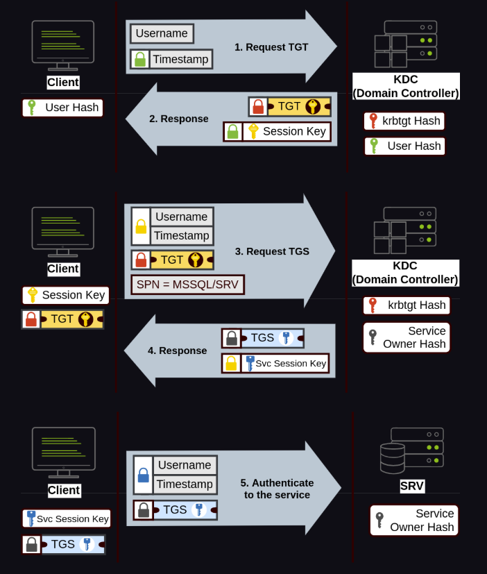
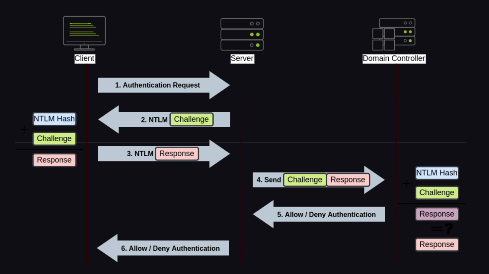
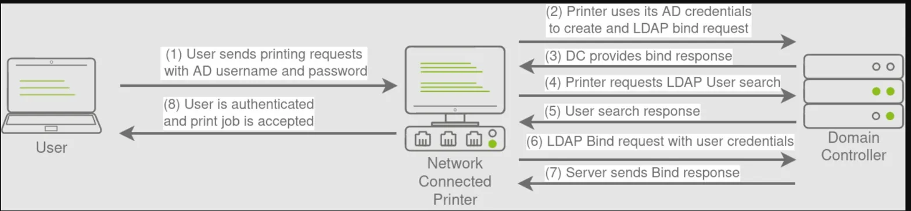
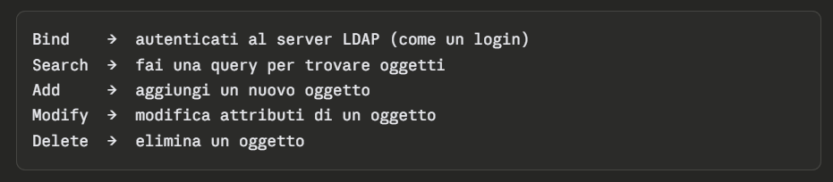

- [AD Basi](#ad-basi)
  - [Account Computer vs Account Utente](#account-computer-vs-account-utente)
  - [Local Account vs Domain Account](#local-account-vs-domain-account)
    - [Verifica LAPS](#verifica-laps)
  - [Local Account non Admin](#local-account-non-admin)
  - [Computer](#computer)
    - [Workgroup](#workgroup)
- [Kerberos](#kerberos)
  - [Fase 1 — AS-REQ / AS-REP (client → KDC)](#fase-1--as-req--as-rep-client--kdc)
  - [Fase 2 — TGS-REQ / TGS-REP (client → KDC, rimanda il TGT)](#fase-2--tgs-req--tgs-rep-client--kdc-rimanda-il-tgt)
    - [Il TGS è firmato con la chiave del Service Owner - Chi è il service owner](#il-tgs-è-firmato-con-la-chiave-del-service-owner---chi-è-il-service-owner)
      - [Perché il Client (Mario) rimanda il TGT e non la password?](#perché-il-client-mario-rimanda-il-tgt-e-non-la-password)
      - [Quando il DC riceve il TGT nella fase 2, "verificare che sia valido" significa fare questi controlli:](#quando-il-dc-riceve-il-tgt-nella-fase-2-verificare-che-sia-valido-significa-fare-questi-controlli)
  - [Fase 3 — AP-REQ (client → servizio)](#fase-3--ap-req-client--servizio)
    - [Cosa trova dentro il TGS decifrato](#cosa-trova-dentro-il-tgs-decifrato)
    - [I controlli che fa il servizio](#i-controlli-che-fa-il-servizio)
      - [Il punto critico](#il-punto-critico)
  - [Il DC non memorizza chiavi di sessioni!](#il-dc-non-memorizza-chiavi-di-sessioni)
    - [Il DC è stateless](#il-dc-è-stateless)
- [NetNTML](#netntml)
  - [Come funzionano gli Account in Windows \& SAM](#come-funzionano-gli-account-in-windows--sam)
    - [Cosa succede quando crei o cambi una password](#cosa-succede-quando-crei-o-cambi-una-password)
    - [Perché MD4 e non qualcosa di più sicuro](#perché-md4-e-non-qualcosa-di-più-sicuro)
    - [Cosa c'è nel SAM esattamente](#cosa-cè-nel-sam-esattamente)
    - [Come è protetto il SAM](#come-è-protetto-il-sam)
  - [Il flusso NTLM con account di dominio](#il-flusso-ntlm-con-account-di-dominio)
  - [NetNTLM con account locali!](#netntlm-con-account-locali)
    - [Il flusso NTLM con account locale:](#il-flusso-ntlm-con-account-locale)
    - [Come fa il server ad avere gli NTLM degli utenti?](#come-fa-il-server-ad-avere-gli-ntlm-degli-utenti)
    - [La differenza con account di dominio](#la-differenza-con-account-di-dominio)
  - [NetNTLM non è vulnerabile a attachi replay "classici"](#netntlm-non-è-vulnerabile-a-attachi-replay-classici)
    - [NetNTLM è vulnerabile al NTLM Relay!](#netntlm-è-vulnerabile-al-ntlm-relay)
      - [Perché funziona](#perché-funziona)
- [LAPS](#laps)
  - [Qual è il problema?](#qual-è-il-problema)
- [LDAP](#ldap)
  - [Le operazioni base](#le-operazioni-base)
  - [Come lo usi in pratica](#come-lo-usi-in-pratica)
  - [Relazione con Kerberos](#relazione-con-kerberos)
- [lsass](#lsass)


# AD Basi

Link Usati:
- https://0xd4y.com/2023/02/28/Active-Directory-Pentesting-Notes/


## Account Computer vs Account Utente
- Gli account computer hanno password randomiche di 120 caratteri che ruotano automaticamente ogni 30 giorni — praticamente impossibili da craccare. 
- Gli account utente usati come service account invece spesso hanno password semplici e che non cambiano mai, tipo Summer2023! — e questo li rende il target perfetto del Kerberoasting.

## Local Account vs Domain Account
- Un **local account** esiste solo sulla macchina locale — è salvato nel SAM database di quel PC. Non ha nessuna visibilità nel dominio, funziona solo per autenticarsi localmente. Esempi tipici sono Administrator, Guest, o account creati manualmente sulla macchina.

- Un **domain account** è salvato nel database di Active Directory sul Domain Controller. Funziona su qualsiasi macchina joinata al dominio, e le sue credenziali vengono validate dal DC tramite Kerberos (o NTLM come fallback).

> Un caso importante da tenere a mente è l'account **Administrator** locale: se nell'ambiente non è stato deployato **LAPS**, spesso tutte le macchine hanno la stessa password di Administrator locale — il che significa che compromettere una macchina ti dà accesso a tutte le altre tramite Pass-the-Hash.
> In molti ambienti aziendali, quando il reparto IT fa il deploy delle macchine Windows, le configurano tutte con la stessa password per l'account Administrator locale, perché è più comodo da gestire. Quindi se hai l'**hash NTLM dell'Administrator locale** di PC-01, puoi provare a fare Pass-the-Hash verso PC-02, PC-03, ecc. — e se la password è la stessa (cosa frequente), entri su tutte senza conoscere la password in chiaro. Questo è esattamente il problema che LAPS (Local Administrator Password Solution) risolve: genera una password diversa e randomica per ogni macchina, salvandola in AD. Se LAPS è deployato, l'hash che hai dumpa su PC-01 non funziona da nessun'altra parte.

### Verifica LAPS
Se restituisce risultati, LAPS è deployato

```
Get-DomainComputer | select name, ms-mcs-admpwd, ms-mcs-admpwdexpirationtime
```

> Puoi leggere la password solo se hai i permessi giusti:
>
> ms-mcs-admpwd vuoto = non hai accesso, non che LAPS non c'è


## Local Account non Admin
Un local account non-admin non ti dà accesso remoto ad altre macchine per due motivi:
- Il primo è che è un account locale — esiste solo su quella macchina, quindi anche se la password fosse identica su un'altra macchina, Windows le tratta come account separati senza relazione tra loro.
- Il secondo è che anche volendo connetterti remotamente (via SMB, WinRM, ecc.), hai bisogno di privilegi amministrativi sulla macchina target. Un utente standard viene bloccato da UAC per le connessioni remote, anche se conosce la password.

> L'unica eccezione teorica sarebbe se quell'utente locale non-admin ha accesso a qualche share specifica sulla macchina target — ma è uno scenario molto raro e comunque limitato a quella risorsa, non ti dà una shell.


## Computer
I computer (workstation) possono essere anche non joinati al dominio.

Il comando `net user`:

- Su una macchina joinata al dominio → mostra gli utenti locali e puoi specificare /domain per vedere quelli del dominio.
- Su una macchina non joinata → mostra solo gli utenti locali, e se provi a fare net user /domain ottieni un errore perché non c'è nessun DC a cui parlare. Il "dominio" che vede è semplicemente il nome del workgroup (di default WORKGROUP). Se sei su una macchina non joinata al dominio, net non ti darà informazioni AD — devi prima essere su una macchina dentro il dominio per enumerarlo.

### Workgroup
- Il workgroup è il predecessore del dominio Active Directory — un modo più semplice e primitivo di raggruppare computer in una rete locale.
- In un workgroup ogni macchina è completamente autonoma: gestisce i propri account, le proprie password, i propri permessi. Non c'è nessun server centrale (nessun DC), nessuna autenticazione centralizzata, nessuna policy di gruppo. Se vuoi accedere a una risorsa su un'altra macchina del workgroup, quella macchina deve avere un account locale con le tue stesse credenziali.
- È quello che trovi tipicamente in ambienti casalinghi o piccoli uffici con 2-3 PC. Appena l'azienda cresce e ha bisogno di gestire decine o centinaia di macchine in modo centralizzato, passa ad Active Directory.
- Quando installi Windows su una macchina nuova e non la joini a nessun dominio, Windows la mette automaticamente in un workgroup chiamato WORKGROUP — è solo un nome di default, non significa nulla di speciale. Ecco perché il comando net lo mostra quando non sei in un dominio.

Per verificare se il pc è nel workgroup o joinata ad un dominio:
```
systeminfo | findstr /i "domain"
```

- Se vedi Domain: WORKGROUP — sei in un workgroup
- Se vedi un nome tipo Domain: corp.local — sei joinato a un dominio AD.


# Kerberos



## Fase 1 — AS-REQ / AS-REP (client → KDC)
Mario manda la richiesta con il timestamp cifrato. Il KDC verifica chi è Mario e gli rilascia il TGT. Questo TGT è la prova che Mario si è autenticato correttamente — è cifrato con la chiave di krbtgt, quindi Mario non può leggerlo né modificarlo, può solo trasportarlo.

## Fase 2 — TGS-REQ / TGS-REP (client → KDC, rimanda il TGT)
Mario vuole accedere al file server. Rimanda il TGT al DC dicendo "ho già provato di essere Mario, ora ho bisogno di un ticket specifico per cifs/fileserver". Il DC decifra il TGT con la chiave di krbtgt, verifica che sia valido, e rilascia un TGS (Ticket Granting Service) — un ticket specifico per quel servizio, cifrato con la chiave del file server.

### Il TGS è firmato con la chiave del Service Owner - Chi è il service owner
- Quando un servizio viene avviato su una macchina Windows, gira nel contesto di sicurezza di un account specifico. Quell'account è il service owner.

> Esempi concreti:
> - il file server gira tipicamente come NT AUTHORITY\SYSTEM — che in AD corrisponde all'account computer della macchina, tipo FILESERVER\$. Quindi il TGS per cifs/fileserver è cifrato con l'hash di FILESERVER\$.
> - un servizio SQL custom invece può girare come un utente di dominio dedicato, tipo svc-sql@corp.local. Il TGS per MSSQLSvc/sqlserver è cifrato con l'hash di svc-sql.
> - un servizio IIS può girare come svc-web@corp.local. Il TGS per http/webserver è cifrato con l'hash di svc-web.


Quando chiedi un TGS per un servizio, il DC te lo rilascia senza verificare se hai effettivamente accesso a quel servizio — ti dà semplicemente il ticket cifrato. Quel ticket è cifrato con l'hash del service owner.
- Se il service owner è un account utente di dominio (non un account computer), il suo hash è derivato da una password scelta da un umano — quindi potenzialmente debole e craccabile offline.

#### Perché il Client (Mario) rimanda il TGT e non la password?
- Il punto chiave è che Mario rimanda il TGT invece della password perché il TGT è una prova di identità già validata — il DC non deve riautenticare Mario da zero ogni volta. È come avere un badge giornaliero: lo mostri all'ingresso una volta sola al mattino, poi lo usi per aprire tutte le porte interne senza tornare ogni volta alla reception.
- La password non viaggia mai sulla rete dopo la prima fase — questo è uno dei vantaggi fondamentali di Kerberos rispetto a NTLM.

#### Quando il DC riceve il TGT nella fase 2, "verificare che sia valido" significa fare questi controlli:
- Prima cosa: lo decifra con l'hash di krbtgt. Se la decifratura produce dati sensati, significa che il TGT è stato creato da lui stesso — nessun altro conosce quella chiave, quindi non può essere stato falsificato.
- Dentro il TGT decifrato trova:
    - l'identità dell'utente (Mario)
    - il timestamp di quando è stato emesso
    - la scadenza (di default 10 ore)
    - i SID dell'utente e dei suoi gruppi
- Poi controlla:
    - che non sia scaduto
    - che non sia stato emesso nel futuro (clock skew)
    - che l'utente non sia stato disabilitato o bloccato nel frattempo

> L'ultimo punto è interessante — ed è anche una debolezza di Kerberos. Il DC non consulta un database di "TGT revocati". Se Mario viene licenziato e il suo account viene disabilitato, i TGT già emessi rimangono validi fino alla loro scadenza naturale. Per questo il Golden Ticket è così persistente — anche se cambi la password dell'utente, il ticket forgiato continua a funzionare finché non cambi krbtgt.

## Fase 3 — AP-REQ (client → servizio)
Mario presenta il TGS direttamente al file server. Il file server lo decifra con la propria chiave, verifica che sia valido, e concede l'accesso. Il DC non è più coinvolto.

Il servizio decifra il TGS con la propria chiave, se la decifratura produce dati sensati, il ticket è autentico. Nessuna chiamata al DC, nessuna verifica centrale.

### Cosa trova dentro il TGS decifrato
Il DC quando ha creato il TGS ci ha messo dentro:
- l'identità dell'utente (Mario)
- i SID di Mario e dei suoi gruppi
- la chiave di sessione
- il timestamp di emissione
- la scadenza del ticket
- il nome del servizio per cui è valido


### I controlli che fa il servizio
- Primo: decifra il TGS con la propria chiave. Se riesce, sa che il ticket è stato creato dal DC — solo il DC conosce la sua chiave.
- Secondo: verifica che il ticket non sia scaduto e che il timestamp non sia troppo vecchio (stesso controllo anti-replay che fa il DC).
- Terzo: verifica che il ticket sia destinato a lui. Dentro il TGS c'è il nome del servizio — se Mario presenta un ticket per cifs/fileserver al server SQL, il server SQL lo rifiuta perché il nome non corrisponde.
- Quarto: il client insieme al TGS manda anche un authenticator — un piccolo messaggio cifrato con la chiave di sessione che contiene il timestamp attuale. Il servizio lo decifra con la chiave di sessione trovata nel TGS e verifica che sia fresco. Questo è l'ultimo controllo anti-replay.

#### Il punto critico
- Il servizio decide l'accesso basandosi sui SID dentro il ticket — non chiama il DC per verificare i permessi in tempo reale. Questo è di nuovo la stessa debolezza di prima: se l'account di Mario viene disabilitato dopo che il TGS è stato emesso, il servizio non lo sa e continua ad accettare il ticket fino alla scadenza.
- Ed è anche il motivo per cui il Silver Ticket funziona — se conosci la chiave del servizio puoi forgiare un TGS falso con i SID che vuoi, e il servizio lo accetta perché non ha modo di distinguerlo da uno legittimo emesso dal DC.


## Il DC non memorizza chiavi di sessioni!
Quando il DC emette un TGT, genera una chiave di sessione casuale e la mette in due posti:

- dentro il TGT stesso (cifrato con krbtgt, quindi solo il DC può leggerlo)
- nella risposta AS-REP al client (cifrata con la chiave dell'utente)

Quando Mario rimanda il TGT nella fase 2, il DC lo decifra con krbtgt e ritrova la chiave di sessione che aveva messo lì dentro — senza doverla cercare da nessuna parte. Il TGT è essenzialmente un "promemoria cifrato" che il DC manda a se stesso tramite il client.

Lo stesso principio vale per il TGS — il DC genera una nuova chiave di sessione, la mette dentro il TGS cifrato con la chiave del service owner, e la manda anche al client. Quando il client presenta il TGS al file server, il file server decifra il TGS con la propria chiave e trova la chiave di sessione — senza mai parlare con il DC.

### Il DC è stateless
- Il DC è stateless, non deve tenere traccia di nessuna sessione attiva. Non importa quanti utenti siano autenticati in contemporanea, non c'è nessun database di sessioni da gestire o sincronizzare tra DC diversi.
- Tutto lo stato necessario viaggia dentro i ticket stessi, cifrato in modo che solo il destinatario corretto possa leggerlo.

# NetNTML

## Come funzionano gli Account in Windows & SAM

### Cosa succede quando crei o cambi una password
Quando Mario imposta la password Password123! su una macchina locale, Windows non salva la stringa Password123! da nessuna parte. La converte immediatamente in hash NTLM con la funzione MD4:

```
MD4("Password123!") → aad3b435b51404eeaad3b435b51404ee:8846f7eaee8fb117ad06bdd830b7586c
```

E salva solo quell'hash nel SAM. La password originale viene scartata — Windows non ne ha più bisogno perché per verificare l'autenticità usa sempre e solo l'hash.

### Perché MD4 e non qualcosa di più sicuro
È una scelta legacy degli anni '90 — MD4 è veloce, deterministico, e all'epoca sembrava sufficiente. Il problema è che oggi è considerato crittograficamente rotto, non ha salt (quindi due utenti con la stessa password hanno lo stesso hash), ed è così veloce che hashcat su una GPU moderna prova miliardi di combinazioni al secondo.


### Cosa c'è nel SAM esattamente
Il SAM contiene una riga per ogni utente locale con:

- username
- RID (identificatore numerico dell'utente)
- LM hash (legacy, quasi sempre disabilitato oggi)
- NTLM hash

```
Administrator:500:aad3b435b51404eeaad3b435b51404ee:8846f7eaee8fb117ad06bdd830b7586c
Mario:1001:aad3b435b51404eeaad3b435b51404ee:8846f7eaee8fb117ad06bdd830b7586c
```
La prima parte `aad3b435...` è l'LM hash vuoto — significa che LM è disabilitato. La seconda parte è l'NTLM hash reale.

### Come è protetto il SAM
Il SAM è cifrato con una chiave chiamata syskey (o bootkey), derivata dalla registry di sistema. Per questo non puoi semplicemente copiare il file SAM da una macchina accesa — è locked da Windows e cifrato. Mimikatz riesce a leggerlo perché gira come SYSTEM e usa le API di Windows per accedere alla memoria di lsass, dove gli hash sono già decifrati e pronti all'uso.


## Il flusso NTLM con account di dominio




## NetNTLM con account locali!
Per gli account locali il flusso NTLM è lo stesso, ma invece di contattare il DC per verificare la password, il server verifica tutto da solo usando il SAM locale.

### Il flusso NTLM con account locale:
- Step 1 - Negotiation: Il client dice al server "voglio autenticarmi, supporto questi metodi".
- Step 2 - Challenge: Il server genera un numero casuale (challenge) e lo manda al client.
- Step 3 - Response: Il client prende la password dell'utente, la converte in hash NTLM, e cifra il challenge con quell'hash. Manda il risultato al server.
- Step 4 - Verifica locale: Il server apre il SAM, recupera l'hash NTLM dell'utente locale, cifra lo stesso challenge con quell'hash, e confronta i due risultati. Se coincidono → accesso concesso. Nessun DC coinvolto.

### Come fa il server ad avere gli NTLM degli utenti?
Con un account locale non stai usando le credenziali di Mario come persona — stai usando un account che esiste indipendentemente su ogni macchina. È come se ogni macchina avesse il suo Administrator separato, che non ha nulla a che fare con l'Administrator di un'altra macchina.

```
PC-Mario          SERVER-01         SERVER-02
---------         ---------         ---------
Administrator     Administrator     Administrator
hash: AAA         hash: BBB         hash: BBB
Mario-local       (non esiste)      (non esiste)
hash: CCC
```

In questo esempio Mario non può autenticarsi a SERVER-01 con il suo account locale perché quell'account non esiste lì. Può autenticarsi a SERVER-02 solo se conosce la password dell'Administrator di SERVER-02 — che è un account completamente separato dal suo.

> Il motivo per cui il Pass-the-Hash funziona tra più macchine è proprio perché in molti ambienti l'IT ha creato l'account Administrator locale con la stessa password su tutte le macchine — quindi tutti i SAM hanno lo stesso hash, anche se sono fisicamente separati.

### La differenza con account di dominio
Con un account di dominio il server non ha l'hash — ce l'ha solo il DC. Quindi al step 4 invece di verificare localmente, il server contatta il DC e gli manda il challenge e la response. Il DC fa la verifica e risponde "valido" o "non valido".

```
Account locale:    client → server → SAM locale → ok
Account dominio:   client → server → DC → ok
```

## NetNTLM non è vulnerabile a attachi replay "classici"
Il challenge è un numero casuale generato dal server ad ogni sessione. Se un attaccante cattura la response di Mario e prova a rimandarla identica in un secondo momento, il server genera un challenge diverso — e la response catturata non corrisponde più al nuovo challenge, quindi viene rifiutata.
```
Sessione 1:  challenge = ABC123  →  response = XYZ (valida)
Sessione 2:  challenge = QWE456  →  response = XYZ (non valida, challenge diverso)
```

### NetNTLM è vulnerabile al NTLM Relay!
Il vero attacco non è il replay diretto, ma il relay. L'attaccante si mette in mezzo tra il client e il server e usa la response di Mario in tempo reale verso un altro server.
```
Mario  ←→  [attaccante]  ←→  SERVER
```

Il flusso concreto:

- l'attaccante fa partire Responder sulla rete per intercettare autenticazioni
- Mario cerca di connettersi a \\attaccante\share (magari tramite un link in un documento, una email, o semplicemente NBT-NS poisoning)
- l'attaccante riceve il challenge/response di Mario
nello stesso momento lo usa per autenticarsi a SERVER come Mario
- SERVER non sa che sta parlando con un attaccante — la response è valida perché è stata generata da Mario

```
# Intercetta autenticazioni NTLM sulla rete
Responder.py -I eth0

# Relay verso un target specifico
ntlmrelayx.py -t smb://192.168.1.10 -smb2support
```

> Perché Kerberos non ha questo problema
In Kerberos il ticket contiene il nome del servizio destinatario — non puoi usare un ticket per cifs/server01 verso cifs/server02 perché il nome non corrisponde. In NetNTLM invece la response non contiene nessuna informazione sul server di destinazione, quindi può essere relayata ovunque. //TODO -> può veramente essere relayata ovunque? non fallisce il controllo della challenge poi???

#### Perché funziona
- Il server ha generato lui stesso il challenge ABC123, riceve una response valida per quel challenge, e la accetta. Dal suo punto di vista sta parlando con Mario — non sa che in mezzo c'è un attaccante che ha fatto da proxy.
- Il trucco è che l'attaccante usa lo stesso challenge del server verso Mario — così la response che Mario calcola è valida esattamente per quel server.

# LAPS


Il flusso step by step
- Step 1: Mario vuole stampare e inserisce le sue credenziali AD (corp\mario + password) nel pannello della stampante o nel driver.
- Step 2: La stampante non sa verificare credenziali AD da sola — non ha un SAM, non è joinata al dominio in modo completo. Quindi usa il suo stesso account AD (un account di servizio tipo svc-printer@corp.local) per fare un LDAP bind al DC — cioè si autentica al DC come se stessa per poter fare query LDAP.
- Step 3: Il DC accetta il bind della stampante e le dà accesso LDAP.
- Step 4: La stampante fa una LDAP search per trovare l'utente Mario — cerca nel dominio l'oggetto utente corrispondente all'username inserito.
- Step 5: Il DC risponde con i dati dell'utente Mario (DN, attributi, ecc.).
- Step 6: Ora la stampante prova a fare un LDAP bind con le credenziali di Mario — manda username e password di Mario al DC per verificare se sono corrette. Questo è il passaggio critico.
- Step 7: Il DC verifica le credenziali e risponde alla stampante: valide o non valide.
- Step 8: Se il DC ha risposto positivamente, la stampante autentica Mario e accetta il print job.

## Qual è il problema?
- Il problema sta nel step 6 — la stampante manda le credenziali di Mario in chiaro (o con binding semplice) al DC tramite LDAP. Se LDAP non è cifrato con TLS (LDAPS), quelle credenziali viaggiano in chiaro sulla rete e sono intercettabili con uno sniffer.
- Inoltre questo meccanismo bypassa completamente Kerberos — usa LDAP simple bind invece, che è molto meno sicuro. Molti dispositivi di rete legacy (stampanti, scanner, fotocopiatrici) usano ancora questo approccio perché è più semplice da implementare.
  
```
# Intercetti il traffico LDAP non cifrato sulla rete
# con Wireshark filtrando per porta 389 (LDAP) invece di 636 (LDAPS)
# e vedi le credenziali in chiaro nel bind request
```

# LDAP
- LDAP (Lightweight Directory Access Protocol) è il protocollo con cui si interroga e modifica un directory service — in pratica è il linguaggio che usi per parlare con Active Directory.
- LDAP gira sulla porta 389 in chiaro — tutto il traffico è leggibile da chiunque sulla rete. LDAPS (LDAP over TLS) gira sulla porta 636 ed è cifrato. In molti ambienti legacy LDAPS non è configurato, quindi le query LDAP viaggiano in chiaro — incluse le credenziali nei bind request, come abbiamo visto nella stampante.
- Pensa ad AD come a un enorme database di oggetti — utenti, computer, gruppi, GPO, ecc. LDAP è il protocollo che ti permette di fare query su quel database, tipo "dammi tutti gli utenti del gruppo Domain Admins" o "dammi tutti i computer con Windows Server 2019".
- Se AD è un rubrica telefonica gigante dell'azienda, LDAP è il modo in cui fai le ricerche su quella rubrica — "cerca tutti i dipendenti del reparto IT", "trova il numero di Mario Rossi", "aggiungi un nuovo contatto".

## Le operazioni base


## Come lo usi in pratica
PowerView sotto il cofano usa LDAP per tutte le sue query. Quando fai Get-DomainUser, PowerView sta facendo una query LDAP al DC chiedendo tutti gli oggetti di tipo user. Potresti fare la stessa cosa manualmente:
```
# Query LDAP diretta senza PowerView
$searcher = New-Object DirectoryServices.DirectorySearcher
$searcher.Filter = "(objectClass=user)"
$searcher.FindAll()

# Oppure con ldapsearch su Linux
ldapsearch -H ldap://dc.corp.local -b "DC=corp,DC=local" "(objectClass=user)"
```

## Relazione con Kerberos
Kerberos e LDAP sono due cose separate che lavorano insieme in AD. **Kerberos** gestisce l'**autenticazione** — chi sei. **LDAP** gestisce l'**accesso alle informazioni** — cosa puoi leggere o modificare in AD. Quando fai Get-DomainUser da una macchina joinata, Windows usa Kerberos per autenticarti al DC, poi usa LDAP per fare la query effettiva.

# lsass
- lsass.exe (Local Security Authority Subsystem Service) è il processo Windows responsabile di gestire tutte le autenticazioni. Ogni volta che un utente si autentica su quella macchina, lsass riceve le credenziali, le verifica, e poi le tiene in memoria per tutta la durata della sessione — inclusi TGT e chiavi di sessione.
- Quindi lsass è fondamentalmente un deposito di credenziali attive in memoria.