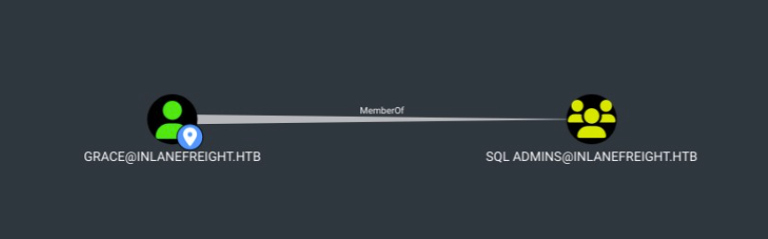
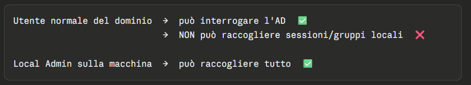
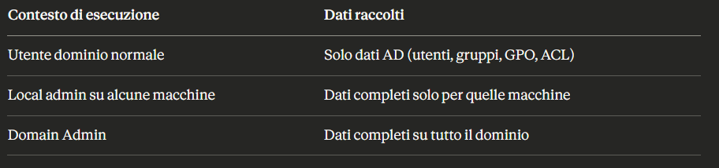
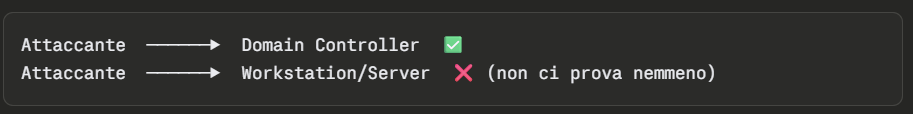
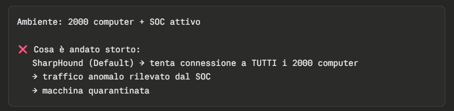
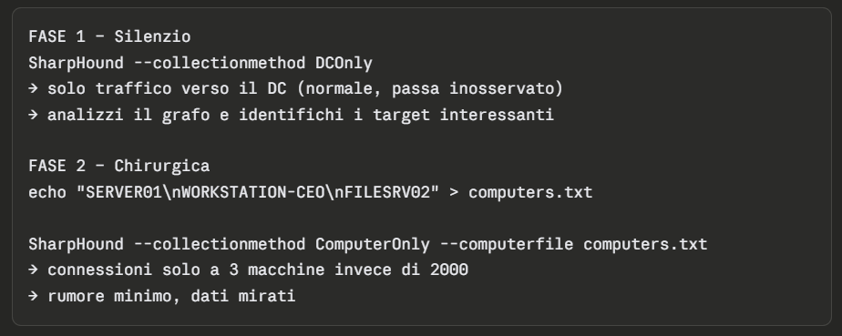

# BloodHound
BllodHound usa Graph Theory.


Grace è membro di SQL Admins.

## Installation
TODO Prima o poi lo scriverò...


# SharpHound - Data Collection da Windows
Se non si usano opzioni, SharpHound, di default, identifica il dominio in cui l'utente appartiene ed esegue il "default collection".
- Collection method usati di default: Resolved Collection Methods: Group, LocalAdmin, Session, Trusts, ACL, Container, RDP, ObjectProps, DCOM, SPNTargets, PSRemote:
    - Users and Computers.
    - Active Directory security group membership.
    - Domain trusts.
    - Abusable permissions on AD objects.
    - OU tree structure.
    - Group Policy links.
    - The most relevant AD object properties.
    - Local groups from domain-joined Windows systems and local - privileges such as RDP, DCOM, and PSRemote.
    - User sessions.
    - All SPN (Service Principal Names).


SharpHound (il collector di BloodHound) lavora in due fasi:
- Fase 1 – Raccolta da Active Directory (AD): Interroga il Domain Controller per ottenere la lista di tutti i computer del dominio. Questo è possibile per qualsiasi utente autenticato nel dominio, senza privilegi speciali.
- Fase 2 – Connessione diretta ai singoli computer: Per ogni macchina trovata, SharpHound cerca di connettersi direttamente per raccogliere informazioni più dettagliate. Ed è qui che entrano in gioco i privilegi.

Cosa raccoglie dalla singola macchina?

**Membri dei gruppi locali**

Interroga i gruppi locali di ogni computer:
- Local Administrators → chi può fare da admin sulla macchina
- Remote Desktop Users → chi può fare RDP
- Distributed COM Users → chi può usare DCOM
- Remote Management Users → chi può usare WinRM/PowerShell remoto

> Questi dati sono fondamentali per BloodHound perché mostrano i path di movimento laterale (es: "l'utente X è local admin su 15 macchine").

**Sessioni attive**

Chi è loggato interattivamente in quel momento su quella macchina. Questo permette a BloodHound di costruire relazioni del tipo:

>"L'utente Domain Admin è loggato sulla macchina WORKSTATION-42" → potenziale target per credential dumping.


> Senza privilegi di Local Administrator sulla macchina target, le chiamate API remote (come NetLocalGroupGetMembers e NetSessionEnum) vengono rifiutate o ritornano dati vuoti.



Una volta eseguito, ShapHound crea dei file zip che possono essere messi su BloodHound.


## Metodi di Collection

- **All**: Fa tutto, tranne GPOLocalGroup. Massima raccolta, massimo rumore. Da usare solo in ambienti dove non c'è monitoring o in lab.
- **DCOnly**: Parla solo con il Domain Controller:

Raccoglie: utenti, computer, gruppi, trust, ACL, OU, GPO. Tenta anche di correlare le GPO ai computer che ne sono affetti, per inferire i local group senza connettersi alle macchine.
- **ComputerOnly**: L'opposto: parla solo con le singole macchine, non interroga l'AD. Raccoglie: sessioni attive + membri dei gruppi locali.

### Cosa usare?
Se si considera un ambiente:


Alcune strategie per non farsi sgamare:


### Riassunto Metodi di Collection


> Il traffico verso il Domain Controller è fisiologico in un dominio Windows — centinaia di macchine lo contattano continuamente. Il traffico da una singola macchina verso tutte le altre è invece anomalo e facilmente rilevabile.

## Flag comuni di SharpHound

### --ldapusername / --ldappassword

Servono quando hai credenziali diverse dall'utente con cui sei loggato.

Scenari tipici:

- Hai fatto phishing e ottenuto credenziali di un utente di dominio, ma sei su una macchina non joinata al dominio, o loggato come un altro utente
    ```
    SharpHound.exe --ldapusername mario.rossi --ldappassword Password123!
    ```

- Hai dumpato credenziali con Mimikatz e vuoi usare un account più privilegiato
    ```
    SharpHound.exe --ldapusername svc-backup --ldappassword Backup2024!
    ```

> Utile anche in combinazione con runas o quando esegui SharpHound da un contesto di processo diverso dall'utente che vuoi usare per l'enumerazione.

### -d / --domain

In ambienti multi-dominio SharpHound potrebbe non capire quale dominio enumerare, oppure potresti voler enumerare un dominio specifico.

Scenario:

Ambiente con più domini:
- company.local (principale)
- emea.company.local (subsidiaria Europa)
- legacy.corp (dominio vecchio, magari meno monitorato)

```
SharpHound.exe -d legacy.corp
```

> Di default SharpHound prende il dominio del contesto corrente, quindi in ambienti semplici non serve specificarlo.

### --domaincontroller
Permette di puntare a un DC specifico invece di lasciare che SharpHound lo scelga automaticamente.

**Caso 1 – DC secondario meno monitorato**
- Il DC primario (DC01) ha EDR e logging avanzato
- Il DC secondario (DC02) è più vecchio e meno presidiato

```
SharpHound.exe --domaincontroller DC02.company.local

oppure

SharpHound.exe --domaincontroller 192.168.1.50
```

**Caso 2 – Port forwarding**
- Sei dentro una rete e hai impostato un tunnel/port forward
- Il DC è raggiungibile solo tramite localhost:3389 rediretto

```
SharpHound.exe --domaincontroller 127.0.0.1 --ldapport 3890
```

### --ldapport
Di default LDAP usa la porta 389 (o 636 per LDAPS). Con questo flag puoi cambiare porta:
Scenari d'uso:
- Port forwarding con porta non standard
- LDAP su porta custom
- Tunnel SSH con port mapping

```
SharpHound.exe --domaincontroller 127.0.0.1 --ldapport 3389
```

### Combinazione pratica in uno scenario reale
Scenario:
- Hai credenziali di un service account trovate in un config file
- Sei in un ambiente con domini multipli
- Vuoi colpire il dominio legacy meno monitorato
- Hai un tunnel verso quel DC su porta non standard

```
SharpHound.exe \
  --ldapusername svc-deploy \
  --ldappassword D3pl0y2023! \
  --domain legacy.corp \
  --domaincontroller 127.0.0.1 \
  --ldapport 3890 \
  --collectionmethod DCOnly    # silenzioso, solo traffico verso DC
  ```

