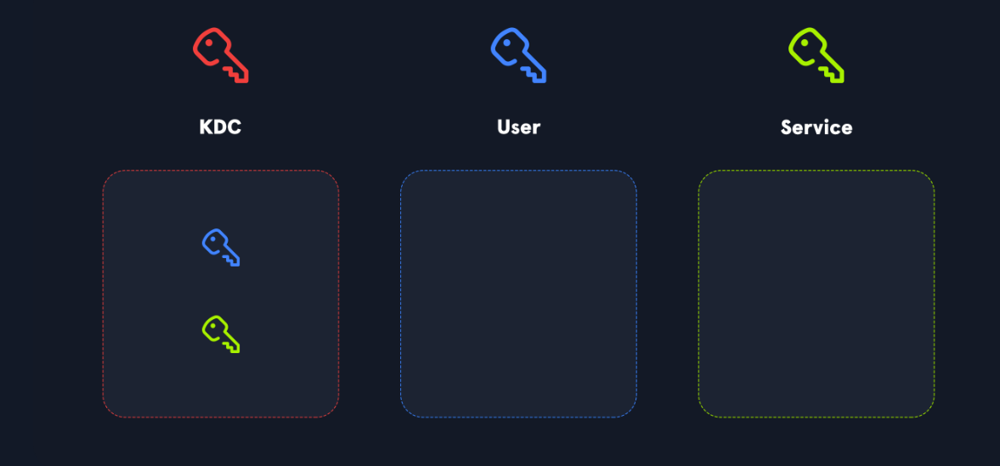
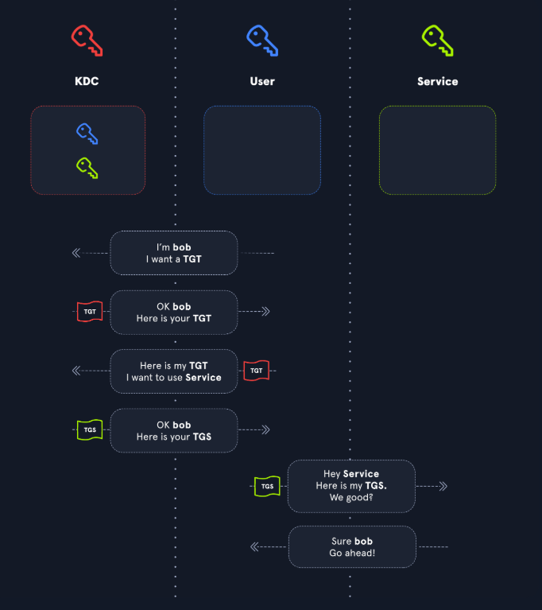
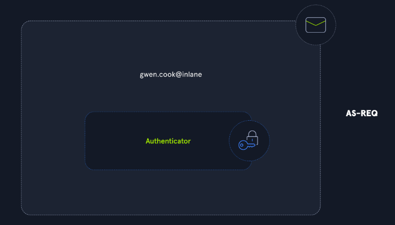
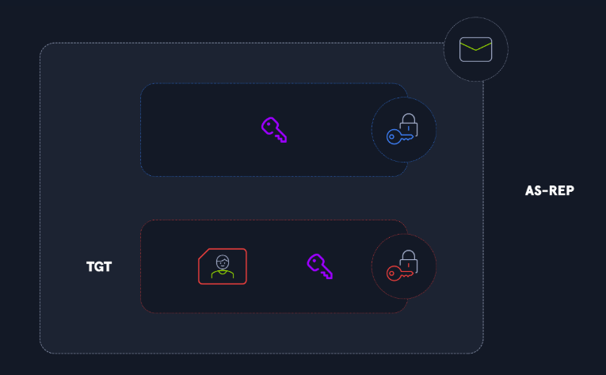
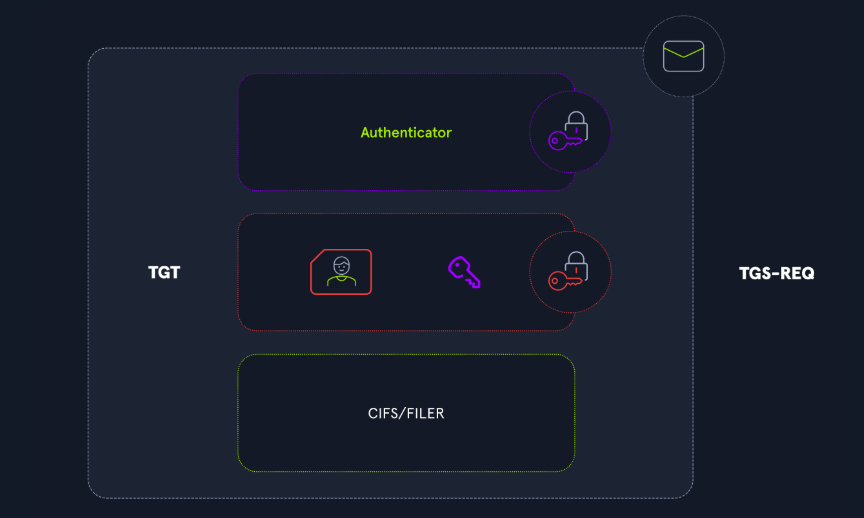
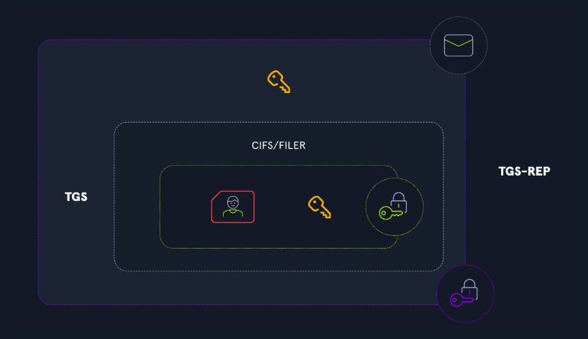
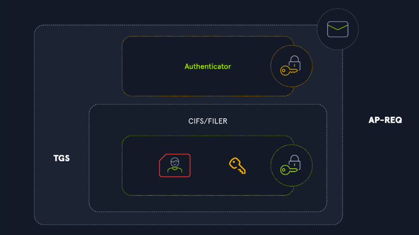

- [Kerberos](#kerberos)

# Kerberos
È un protocollo di autenticazione centralizzato che usa dei "ticket" invece delle password. Funziona sulla porta 88 ed è il sistema predefinito per i domini Windows dal 2000. Il vantaggio principale è che la password dell'utente non viaggia mai sulla rete.
Come funziona (semplificato)

- L'utente chiede un "documento d'identità" a un server centrale (il KDC)
- Dopo aver provato la propria identità, riceve un TGT (Ticket Granting Ticket), cioè appunto il suo "documento"
- Ogni volta che vuole accedere a un servizio, presenta questo TGT
- Il server centrale gli rilascia allora un ticket temporaneo specifico per quel servizio
- Il servizio riceve il ticket e decide se concedere o meno l'accesso

> Il servizio di concessione dei ticket (TGS) di Kerberos si basa su un ticket di concessione dei ticket (TGT) valido. Parte dal presupposto che, se un utente possiede un TGT valido, deve aver dimostrato la propria identità.

## Vantaggi rispetto a NTLM (il vecchio sistema)
Prima di Kerberos si usava NTLM, dove l'hash della password rimaneva in memoria. Se un hacker comprometteva una macchina, poteva usare quell'hash per accedere a tutto (attacco Pass-The-Hash). Con Kerberos i ticket sono limitati a specifiche macchine e hanno una scadenza, il che riduce significativamente il danno potenziale.

## Lato sicurezza
Nonostante sia più sicuro di NTLM, esistono comunque attacchi come il Pass-The-Ticket o il famoso Golden Ticket attack, ma con limitazioni maggiori rispetto agli attacchi sul vecchio sistema.

## Autenticazione Kerberos

### Le 3 entità coinvolte
- Utente – chi vuole accedere a un servizio
- KDC (Key Distribution Center) – il server centrale che conosce le credenziali di tutti
- Servizio – la risorsa a cui l'utente vuole accedere

### Perché usarlo?
Due motivi principali:

- Centralizzazione – solo il KDC deve conoscere le credenziali di tutti gli utenti, non ogni singolo servizio
- Sicurezza – le password non viaggiano mai in chiaro sulla rete, proteggendo dagli attacchi man-in-the-middle
- Kerberos usa chiavi segrete e un meccanismo a ticket. In un ambiente Active Directory, le chiavi segrete sono le password degli account (o un loro hash).

### Come funziona? (3 fasi)

#### Le 3 fasi — panoramica ad alto livello
1. **L'utente richiede il TGT al KDC**: Il TGT (Ticket Granting Ticket) è la "carta d'identità" dell'utente. Contiene: nome, data di creazione dell'account, informazioni di sicurezza, gruppi di appartenenza, ecc. Ha una validità di poche ore. Viene presentato per tutte le richieste successive al KDC.
2. **L'utente presenta il TGT al KDC per ottenere un TGS**: Il KDC verifica che il TGT sia valido e non contraffatto, poi restituisce un TGS ticket (Ticket Granting Service) o ST (Service Ticket). Il TGS contiene una copia delle informazioni dell'utente presenti nel TGT.
3. **L'utente presenta il TGS al servizio**: Il servizio verifica la validità del ticket, legge le informazioni dell'utente e decide autonomamente se concedere o negare l'accesso. È quindi il servizio stesso a controllare i diritti di accesso.

##### Protezione dei Ticket
Le informazioni nel TGT e TGS non devono poter essere falsificate dall'utente. Ecco come vengono protette:

- Il TGT è cifrato con la chiave segreta del KDC → l'utente non può né leggerlo né modificarlo
- Il TGS ticket è cifrato con la chiave segreta del servizio → l'utente non può modificarlo, ma il servizio può decifrarlo e leggere le informazioni dell'utente

### Dettagli tecnici sulle 3 fasi
L'intero processo si basa su chiavi condivise ed è un lavoro a tre entità. Protegge da attacchi di ticket stealing e replay, perché un attaccante senza le chiavi non può generare authenticator validi. Tuttavia il documento avverte che esistono debolezze e configurazioni errate che possono essere sfruttate — argomento trattato nelle sezioni successive.
- https://attl4s.github.io/assets/pdf/You_do_(not)_Understand_Kerberos.pdf

#### Fase 1 — Authentication Service (AS)

**Richiesta AS-REQ:**

- L'utente invia al KDC il proprio username in chiaro + un authenticator (il timestamp corrente cifrato con la propria chiave)
- Il KDC cerca la chiave associata all'username e tenta di decifrare l'authenticator
- Se riesce → utente autenticato; se fallisce → autenticazione negata

Questo step si chiama **pre-autenticazione** ed è obbligatorio per default. Tuttavia un amministratore può disabilitarla: in quel caso il KDC invia il TGT senza verificare nulla (vulnerabilità).

**Risposta AS-REP:** 

Il KDC genera una session key temporanea (Kerberos è stateless, quindi non la salva da nessuna parte) e risponde con due elementi:
- Il TGT — contiene le informazioni dell'utente + una copia della session key, il tutto cifrato con la chiave del KDC
La session key — cifrata con la chiave dell'utente

Quindi la session key è duplicata nella risposta: una copia dentro il TGT (protetta dalla chiave del KDC) e una copia separata (protetta dalla chiave dell'utente).

#### Fase 2 — Ticket-Granting Service (TGS)
Il TGS è una componente del KDC, tipicamente ospitata su un domain controller in Active Directory, responsabile dell'emissione dei service ticket.

**Richiesta TGS-REQ:** 

L'utente invia al KDC tre cose:
- Il nome del servizio a cui vuole accedere (nella forma SERVICE/HOST, chiamato SPN — Service Principal Name)
- Il TGT ricevuto in precedenza
- Un nuovo authenticator, questa volta cifrato con la session key

**Risposta TGS-REP:** 

Poiché Kerberos è stateless, il KDC non ricorda gli scambi precedenti. Per verificare l'authenticator, decifra il TGT, estrae la session key contenuta al suo interno e la usa per validare l'authenticator.
Se tutto è corretto, il KDC genera una nuova session key per gli scambi futuri tra utente e servizio e risponde con:

Un TGS ticket contenente:
- Il nome del servizio (SPN)
- Una copia delle informazioni dell'utente (dal TGT)
- Una copia della nuova session key utente/servizio

Tutto cifrato con la session key utente/KDC. Le informazioni dell'utente e la copia della session key utente/servizio sono ulteriormente cifrate con la chiave del servizio (doppio livello di cifratura).

#### Fase 3 — Application Request (AP)
**Richiesta AP-REQ:** 

L'utente decifra la risposta del KDC, estrae la session key utente/servizio e il TGS ticket (che però rimane cifrato con la chiave del servizio, quindi non può modificarlo). Invia al servizio:

- Il TGS ticket
- Un authenticator cifrato con la session key utente/servizio

**Risposta AP-REP:** Il servizio riceve il TGS ticket e lo decifra con la propria chiave. Estrae la session key utente/servizio e verifica l'authenticator. Se tutto è valido:

- Legge le informazioni dell'utente (inclusi i gruppi di appartenenza)
- Secondo le proprie regole di accesso, concede o nega l'accesso
- Risponde al client con un AP-REP, cifrando il timestamp con la session key estratta, così il client può verificare che il messaggio provenga davvero dal servizio

## Panoramica degli Attacchi a Kerberos
Categorie:
- Attacchi legati alle richieste di ticket
- Attacchi di forging (falsificazione) dei ticket
- Attacchi legati alla delegation
- Ricognizione utenti e password spraying

### Attacchi sulle Richieste di Ticket
Ci sono due modi per richiedere un ticket:
- TGT request (AS-REQ → AS-REP)
- TGS request (TGS-REQ → TGS-REP)

#### AS-REQ Roasting
Come visto in precedenza, di default un utente deve autenticarsi tramite un authenticator cifrato con la propria chiave. Tuttavia, se un utente ha la pre-autenticazione disabilitata, è possibile richiedere i dati di autenticazione per quell'utente e il KDC risponderà comunque con un AS-REP. Poiché parte di quel messaggio (la session key temporanea condivisa) è cifrata con la password dell'utente, è possibile eseguire un attacco brute-force offline per cercare di recuperare la password.

#### Kerberoasting
In modo simile, quando un utente ha un TGT, può richiedere un Service Ticket per qualsiasi servizio esistente. La risposta del KDC (TGS-REP) contiene informazioni cifrate con il segreto del service account. Se il service account ha una password debole, è possibile eseguire lo stesso tipo di attacco brute-force offline per recuperare la password di quell'account.

### Attacchi sulla Kerberos Delegation
(Vedi Delegation.md per più informazioni)
- La Kerberos Delegation permette a un servizio di impersonare un utente per accedere a un'altra risorsa. L'autenticazione viene delegata e la risorsa finale risponde al servizio come se avesse i diritti del primo utente.
- Esistono diversi tipi di delegation, ognuno con proprie debolezze che possono permettere a un attaccante di impersonare utenti (a volte arbitrari) per sfruttare altri servizi. Gli attacchi trattati sono:
- Unconstrained Delegation
- Constrained Delegation
- Resource-Based Constrained Delegation (RBCD)

### Attacchi di Ticket Forging
I ticket sono protetti da chiavi segrete per impedirne la falsificazione (il TGT è protetto dalla chiave del KDC, il TGS ticket dalla chiave del service account). Se un attaccante riesce a ottenere una di queste chiavi, può forgiare ticket arbitrari per accedere ai servizi con diritti arbitrari. Gli attacchi descritti sono:
- Silver Ticket — falsificazione del TGS ticket (usando la chiave del service account)
- Golden Ticket — falsificazione del TGT (usando la chiave del KDC)

### Ricognizione e Password Spraying
È possibile enumerare utenti e testare password usando il protocollo Kerberos:
- Richiedendo un TGT per un utente specifico, il server risponde in modo diverso a seconda che l'utente esista o meno nel database → utile per enumerare utenti validi
- Cifrando l'authenticator con password diverse, è possibile verificare se una password è valida per un determinato utente → password spraying

